# Domain Model — Eduscope UMS Rewrite ("Unistream")

> Phase-1 artifact (revamp-guide prompt 04), successor to [PRD.md](../PRD.md).
> Every entity below traces to a PRD requirement (LP-/AD-/QZ-/PF-xx), a decided
> architecture item (A-xx), a PM interview answer (INT-xx), and — where it
> replaces legacy behavior — to behavioral-inventory items
> ([behavioral-inventory.md](../discovery/behavioral-inventory.md), B-xx).
> Fields whose *shape* depends on an unclosed decision carry `[D-xx]`.
> Legacy models under `/legacy-Codebase/LC/models/` were read as **evidence of
> the old data shapes only** — nothing is ported.
>
> **Scope guard:** this document defines entities, fields, relationships,
> invariants and ownership. It deliberately contains **no endpoints, no SQL, no
> migrations, no state-transition tables** — those are prompt 05 (state
> machines), the API contract (`contracts/`), and Phase 3 (data layer, [D-03]).

---

## 1. How to read this document

**Type vocabulary** (logical, not engine types — physical mapping is Phase 3 under [D-03]):

| Notation | Meaning |
|---|---|
| `ulid` | 26-char lexicographically sortable opaque id (see INV-G-2) |
| `string(n)` / `text` | short bounded string / unbounded text |
| `int`, `bigint`, `decimal` | integers, byte counts, ratios |
| `bool` | boolean |
| `ts` | instant, stored UTC, ISO-8601 with offset (see INV-G-3) |
| `enum{a\|b}` | closed value set; adding a value is a contract change |
| `json<Shape>` | structured blob with a named zod schema in `contracts/` |
| `→Entity.field` | foreign key reference |
| `[secret]` | never returned by any read API; stored via the secret store (PF-17) |
| `[derived]` | computed, not stored — listed for completeness |

**Ownership** — every entity names exactly **one owning service (single writer)**.
Other services read via the contract or via an explicitly-modelled projection.
Where the "obvious" entity had two natural writers, it is **split** rather than
shared (see DM-17).

| Owner | Meaning |
|---|---|
| `deploy` | Deploy-layer config store, written at provisioning time, read-only to everything else [D-20] |
| `core-api` | Node/TS device backend — owns the on-device database [D-03] |
| `pipeline-manager` | Python/FastAPI (A-13) — owns **runtime process state only**, never writes the DB |
| `ai-services` | STT / slide / question services — own **nothing persisted** (target-architecture §2.3) |
| `quiz-service` | Campus-hosted Next.js quiz app + its own database (A-16) — a different machine, a different network zone |

**Invariant ids** (`INV-<ENTITY>-n`) are stable handles so the state-machine doc,
the API contract and the test matrix can cite them.

---

## 2. Bounded contexts and the service map

```
deploy ──writes──▶ DeviceProvisioning ──read──▶ core-api
core-api ── owns everything persisted on the device ──▶ panel app (read via contract)
pipeline-manager ──telemetry──▶ core-api (DeviceHealth, PipelineProcess snapshots)
ai-services ──payloads──▶ core-api (TranscriptSegment, SlideCapture, QuestionSet)
core-api ──publish──▶ quiz-service (QuestionPublication)   [cross-zone, unreliable]
quiz-service ──answer stream──▶ core-api (AnswerProjection) [cross-zone, unreliable]
```

Five contexts, in dependency order:

| # | Context | Entities | Owner(s) |
|---|---|---|---|
| A | Device, provisioning & capture configuration | DeviceProvisioning, DeviceHealth, StorageVolume, NetworkConfig, PhysicalInput, SourceRole, SourceBinding, AudioControl, EncodingProfile, LayoutPreset, ChannelConfig, StreamTarget, FirmwareUpdate | `deploy`, `core-api` |
| B | Identity & access | User, AuthSession, UserImportBatch | `core-api` |
| C | Lecture capture & artifacts | LectureSession, Recording, RecordingSegment, RecordingFile, ExportJob | `core-api` |
| D | Distribution & retention | UploadJob, UploadFilePart, RetentionPolicy | `core-api` |
| E | AI & quiz | TranscriptSegment, SlideCapture, QuestionSet, Question, QuestionOption, QuestionPublication, QuizSession, QuizParticipant, StudentIdentity, Answer, AnswerProjection, LeaderboardEntry | `core-api`, `quiz-service` |
| F | Observability | LogEntry, SystemAlert, AuditLogEntry | `core-api` |

---

## 3. Global invariants

| Id | Invariant | Why / source |
|---|---|---|
| INV-G-1 | Every persisted entity has an opaque primary key. **No logic may depend on key adjacency, ordering, or arithmetic.** | B-25 marked the twin file `done` by updating `id + 1`; B-10's `ORDER BY id DESC LIMIT 1` touched the wrong row |
| INV-G-2 | Ids are ULIDs generated by the owning service. Ids referenced across the device↔quiz boundary must be generatable offline on both sides. | A-16 cross-zone sync; no shared sequence exists |
| INV-G-3 | All instants are stored UTC with an explicit offset; display-time conversion uses the provisioned timezone `[D-17]`. Correct time is load-bearing for titles (A-07), retention (A-20) and logs (PF-15). | PF-19; B-22 assumed `Asia/Colombo` implicitly |
| INV-G-4 | **No entity carries meaning in a filename or a status string.** Metadata lives in columns; state lives in enums. | B-02 (metadata parsed positionally from filenames in 5 places), B-33 (`deleted(<uid>)` smuggling the actor into a status string), B-62 |
| INV-G-5 | **No generic key/value settings table.** Every configuration concern is a typed entity with defaults, validation and a seed. | B-45: unknown keys silently no-op'd; B-22 depended on *row order* |
| INV-G-6 | Every mutating write records an actor (`→User.id` or the literal system actor) and an instant. | B-33, B-42, G-7 |
| INV-G-7 | A field that no code reads must not exist. Any stored value not consumed by a pipeline, a job, or a screen is deleted from the model. | B-55/B-56 placebo controls; G-5 "zero placebo controls" |
| INV-G-8 | Cross-service reads are **projections**, never shared tables: a projection is read-only in the consumer, carries `syncedAt`, and has a defined staleness surface. | QZ-7, LP-18 |

---

## 4. Context A — Device, provisioning & capture configuration

### 4.1 DeviceProvisioning

**Purpose.** The identity a field technician gives the appliance at install time:
who owns it, which hall it is in, where recordings live, what it is allowed to
do. It is the source of the generated session title (A-07) and of the per-room
feature flags (PF-20).

- **Owner:** `deploy` (config store written by the provisioning flow, J-5). `core-api` **reads only** and renders it read-only in Admin (AD-10). [D-20]
- **Replaces:** `settings` submenu `dev` (SD path, upload domain — B-47), the `dl` row of submenu `sys` (B-55), and the identity half of `hdd_id` (B-51).
- **Constrained by:** A-07, A-21, AD-10, PF-19, PF-20, INT-9, INT-10, B-26 (boot-frozen `isSliit` must not recur), B-46/B-47 (`.env` sed-ing dies).
- **Cardinality:** exactly one per device (singleton row).

| Field | Type | Null | Notes |
|---|---|---|---|
| `deviceId` | `ulid` | no | Stable across firmware updates and disk swaps |
| `serialNumber` | `string(64)` | yes | Hardware serial if readable |
| `instituteProfileId` | `string(64)` | no | Replaces domain string-sniffing (B-26). Named profile, resolved at **runtime**, never frozen at module load `[D-02b]` |
| `hallCode` | `string(32)` | no | e.g. `SLIIT-001` / `LAC001` — the contradiction is open fact-check **P-1** `[D-20]` |
| `hallDisplayName` | `string(128)` | no | What the lecturer sees; feeds the generated title (A-07) |
| `titlePattern` | `string(128)` | no | Default `{hall} – {date} {time}`; pattern is data, not code **P-1** |
| `timezone` | `string(64)` | no | IANA zone, provisioned `[D-17]` |
| `ntpServers` | `json<string[]>` | no | `[D-17]` |
| `expectedStorageVolumeUuid` | `string(64)` | yes | Storage identity recorded at install; the *current* volume is `StorageVolume` `[D-20]` |
| `featureFlags` | `json<FeatureFlags>` | no | `{ recordingEnabled, aiQuizEnabled, streamingEnabled }` — INT-10, PF-20. Ownership (deploy vs admin toggle) is **DM-P3** |
| `quizServerBaseUrl` | `string(256)` | yes | Public quiz-app origin (A-16); null ⇒ quiz features unavailable (LP-18) |
| `llmEndpoint` | `string(256)` | yes | LAN llama.cpp base URL (A-02); null ⇒ AI studio unavailable (LP-18) |
| `uploadTargetProfile` | `json<UploadTarget>` | yes | Base URL + credential reference `[secret]` `[D-02b]` |
| `provisionedAt` / `provisionedBy` | `ts` / `string(128)` | no / yes | Operator identity from the deploy flow |

**Relationships.** Referenced by `LectureSession` (hall snapshot), `DeviceHealth`, `StorageVolume`.

**Invariants.**
- **INV-DP-1** `core-api` never writes this entity. A change requires the deploy flow (J-5) [D-20].
- **INV-DP-2** `hallCode`, `hallDisplayName` and `titlePattern` MUST be non-empty before any recording can start — an unprovisioned device cannot produce a titled session (A-07).
- **INV-DP-3** `instituteProfileId` is resolved on every use, never cached at process start (B-26).
- **INV-DP-4** Flipping `aiQuizEnabled` off MUST NOT affect recording capability (LP-18, INT-10).

---

### 4.2 DeviceHealth

**Purpose.** The current, continuously-refreshed operational condition of the
appliance: storage pressure, capture-card state, publisher state, clock sync.
Feeds the dashboard storage warning (LP-12), the Local Storage page (AD-4) and
start-preconditions (`[D-15]`).

- **Owner:** `core-api` (aggregates probes plus `pipeline-manager` telemetry).
- **Replaces:** nothing — legacy had an ad-hoc `df` endpoint returning raw text (B-53) and a one-shot boot watchdog (B-39).
- **Constrained by:** LP-12, AD-4, PF-2, PF-13, PF-19, B-20 (usage threshold), B-39, B-53.
- **Cardinality:** one row per device (last-known snapshot), superseded in place.

| Field | Type | Null | Notes |
|---|---|---|---|
| `deviceId` | `→DeviceProvisioning.deviceId` | no | |
| `observedAt` | `ts` | no | Snapshot instant |
| `storageTotalBytes` / `storageFreeBytes` | `bigint` | no | From the registered `StorageVolume` |
| `storagePressure` | `enum{ok\|warning\|critical}` | no | Thresholds from `RetentionPolicy` `[D-15]` |
| `diskHealth` | `enum{good\|warning\|failing\|unknown}` | no | SMART (AD-4); `unknown` is a legitimate value — never hardcode "Good" |
| `captureCardState` | `enum{present\|absent\|recovering\|failed}` | no | PF-13; `recovering` = hub power-cycle in flight (B-39 successor) |
| `publisherStates` | `json<Record<SourceRoleId, PublisherState>>` | no | Mirror of `pipeline-manager` truth; `PublisherState = {status, lastErrorCode, since}` |
| `ntpSynced` | `bool` | no | AD-10, PF-19 |
| `clockOffsetMs` | `int` | yes | Null when unmeasurable |
| `lastBootAt` | `ts` | no | Feeds crash-recovery decisions (INT-7) |
| `cpuLoad1m` / `tempC` | `decimal` | yes | Optional, present only if consumed by a screen (INV-G-7) |

**Invariants.**
- **INV-DH-1** This entity is a **snapshot, not a history**; trend/history questions are answered from `LogEntry` (PF-15).
- **INV-DH-2** `publisherStates` is a *projection* of pipeline-manager state (INV-G-8): a value older than the staleness window is reported as `unknown`, never as healthy (B-12 lesson).
- **INV-DH-3** `storagePressure = critical` MUST refuse new recording starts `[D-15]` (LP-12, PF-7).

---

### 4.3 StorageVolume

**Purpose.** The recording disk the device currently uses: identity, mount, and
health. Registered by an admin after a disk swap or format (AD-4).

- **Owner:** `core-api` (Admin UI operation — D-20 default explicitly keeps disk swap/format in the Admin UI).
- **Replaces:** `hdd_id` (single row, `id=1`, value = mount path whose last segment is the UUID — B-51).
- **Constrained by:** AD-4, PF-7, B-51 (no nginx-conf surgery, no service restart to reload), B-52 (format + register is one guarded operation, no fstab accumulation).

| Field | Type | Null | Notes |
|---|---|---|---|
| `id` | `ulid` | no | |
| `uuid` | `string(64)` | no | Filesystem UUID |
| `devicePath` | `string(128)` | no | e.g. `/dev/sda1` — informational; never the join key (B-38's device/mount mix-up) |
| `mountPath` | `string(256)` | no | Resolved at **runtime**; no module-load caching (B-51) |
| `label` | `string(64)` | yes | |
| `filesystem` | `string(32)` | no | Choice is a Phase-3 platform decision; NTFS-on-Linux (B-52) is not carried by default |
| `capacityBytes` / `freeBytes` | `bigint` | no | Refreshed with `DeviceHealth` |
| `smartStatus` | `enum{good\|warning\|failing\|unknown}` | no | AD-4 |
| `role` | `enum{recordings\|system}` | no | Only one `recordings` volume is active |
| `state` | `enum{registered\|mounted\|missing\|formatting\|failed}` | no | `missing` = registered but not present at boot |
| `registeredAt` / `registeredBy` | `ts` / `→User.id` | no | INV-G-6 |

**Invariants.**
- **INV-SV-1** Exactly one volume with `role = recordings` and `state = mounted` may be active; all recording paths resolve through it at use time (B-51).
- **INV-SV-2** Registering a new volume MUST NOT require a service restart or a web-server config rewrite (B-51).
- **INV-SV-3** A format is refused while any `LectureSession` is non-terminal, and a failed format leaves the previous registration intact (AD-4 failure path, J-5).

---

### 4.4 NetworkConfig

**Purpose.** Wired LAN and vLAN configuration for the appliance (AD-2).

- **Owner:** `core-api` (admin-editable), applied to the OS through the allowlisted root helper (target-architecture §3.7).
- **Replaces:** `settings` submenu `dis` LAN rows (B-46). `ssid_list` is **retired** `[D-16]` (B-54).
- **Constrained by:** AD-2, PF-18, B-46 (applying an IP MUST NOT rebuild the SPA), B-61.

| Field | Type | Null | Notes |
|---|---|---|---|
| `id` | `ulid` | no | One row per interface |
| `interfaceName` | `string(32)` | no | e.g. `eth0` |
| `kind` | `enum{lan\|vlan}` | no | vLAN is NEW (parity matrix §4) |
| `vlanId` | `int` | yes | Required iff `kind = vlan` |
| `addressMode` | `enum{dhcp\|static}` | no | |
| `ipv4Address` / `prefixLength` / `gateway` | `string(64)` / `int` / `string(64)` | yes | Required iff `addressMode = static` |
| `dnsServers` | `json<string[]>` | no | May be empty |
| `appliedAt` / `appliedBy` | `ts` / `→User.id` | yes | Null until first successful apply |
| `lastApplyError` | `text` | yes | Surfaced in Admin, not swallowed |

**Invariants.**
- **INV-NC-1** No Wi-Fi/SSID fields exist `[D-16]` (B-54: no wireless code ever existed).
- **INV-NC-2** Applying network config never triggers a frontend build and never changes an API base URL baked into an artifact — the SPA is served single-origin with runtime config (B-46, B-61, PF-18).
- **INV-NC-3** Camera addresses are **not** stored here (see INV-PI-2).

---

### 4.5 SourceRole *(seeded reference entity)*

**Purpose.** The fixed semantic vocabulary of what a capture input *means*,
independent of which cable it arrives on. The panel, the layouts, the pipelines
and the contract all speak this vocabulary.

- **Owner:** `core-api` (seeded, immutable at runtime — a new role is a contract change).
- **Replaces:** the legacy free-permutation source strings `hdmisource` / `sdisource` / `rtsp` / `rtsp2` / "anything else = external USB cam" that were matched inside the 124-branch pipeline matrix (B-01, B-57).
- **Constrained by:** A-08 (amended), LP-8, PF-1, B-01, B-18, B-57.

| Field | Type | Null | Notes |
|---|---|---|---|
| `id` | `enum{presentation\|lecturer-cam\|students-cam\|mic-lecturer\|mic-room}` | no | Canonical ids — see the vocabulary table below |
| `medium` | `enum{video\|audio}` | no | |
| `displayLabel` | `string(32)` | no | `PC`, `CAM 1`, `CAM 2`, `Lecturer Mic` |
| `requiredForStart` | `bool` | no | False for all in V1 — camera-only recording must work with no laptop (A-08, hardware-topology §3) |
| `provisionable` | `bool` | no | **`mic-room` = false** (A-08 amended: the room mic was removed from the hardware) |

**Vocabulary reconciliation (important).** Three names exist today for the same
four things. This model makes column 1 canonical; the others are transport
aliases owned by the adapters that need them.

| Canonical `SourceRole.id` | Panel/prototype label | pipeline-manager publisher (A-05) | Legacy source string (B-01) |
|---|---|---|---|
| `presentation` | `pc` | `usb` (`/tmp/usb.sock`) | `hdmisource` |
| `lecturer-cam` | `cam1` | `rtsp` (`/tmp/rtsp.sock`) | `rtsp` |
| `students-cam` | `cam2` | `rtsp2` (`/tmp/rtsp2.sock`) | `rtsp2` |
| `mic-lecturer` | `mic-lecture` | `audio` (`/tmp/audio.sock`) | `hw:externAud,0` / `hw:channel1,0` |
| `mic-room` | — | — | (removed, A-08 amended) |

**Invariants.**
- **INV-SR-1** The set is closed: adding a source role is a contract-version bump, not configuration (PF-1 rejects unsupported combinations explicitly).
- **INV-SR-2** `mic-room` MUST have no `SourceBinding` in V1 (A-08 amended). It is retained in the enum only so a future room-mic build is an additive change. **DM-11**

---

### 4.6 PhysicalInput

**Purpose.** A concrete, addressable capture endpoint on this device — a V4L2
node, an RTSP URL, an ALSA device. Reality; `SourceRole` is meaning.

- **Owner:** `core-api` (admin-editable addresses; AD-2 edits camera IPs here). `pipeline-manager` reads it to start publishers.
- **Replaces:** `settings.dis` rows `rtsplink`/`rtsplink2` (B-46), the udev aliases `/dev/presentation`, `/dev/presenter`, `/dev/exCAM` and the hardcoded ALSA names in the pipeline strings (B-01), plus the two hardcoded 64-hex browser device-ids used to pick audio (B-57).
- **Constrained by:** A-05, A-08, A-18, AD-2, PF-1, PF-13, B-01, B-39, B-57.

| Field | Type | Null | Notes |
|---|---|---|---|
| `id` | `ulid` | no | |
| `kind` | `enum{v4l2\|rtsp\|alsa}` | no | |
| `address` | `string(512)` | no | Device path, RTSP URL, or ALSA name. Camera IP edits (AD-2) write **this** field |
| `credentialRef` | `string(128)` `[secret]` | yes | RTSP credentials resolve through the secret store, never inline in the URL (PF-17) |
| `transport` | `enum{tcp\|udp}` | yes | RTSP only; `tcp` default (pipeline-audit §4.1) |
| `expectedCodec` | `enum{h264\|raw-nv12\|s16le}` | yes | Enables the passthrough decision (see LayoutPreset) |
| `stableIdentifier` | `string(256)` | yes | udev/by-id path — survives enumeration order changes (B-39's string match was fragile) |
| `hubPort` | `string(32)` | yes | For the capture-card watchdog power-cycle (PF-13); per-unit fact-check on `2-1 p2` (B-39) |
| `presenceState` | `enum{present\|absent\|error\|unknown}` | no | Projection from `pipeline-manager` (INV-G-8) |
| `lastSeenAt` | `ts` | yes | |
| `updatedAt` / `updatedBy` | `ts` / `→User.id` | no / yes | INV-G-6 |

**Invariants.**
- **INV-PI-1** No pipeline may be constructed from an address that is not a `PhysicalInput` row — no literal device strings in pipeline code (B-01).
- **INV-PI-2** A camera address exists exactly once (here). The Network settings screen edits this row; it does not keep a second copy (legacy stored `rtsplink` in `dis` *and* source selections in `capturesetup`).
- **INV-PI-3** `presenceState` is authored by telemetry only; an operator cannot mark an input healthy.

---

### 4.7 SourceBinding

**Purpose.** The admin-managed mapping *SourceRole → PhysicalInput*. Changing
which camera is "lecturer cam" is a provisioning act, never a per-session choice.

- **Owner:** `core-api`.
- **Replaces:** the per-page source dropdowns whose values fed the pipeline matrix (`capturesetup` / `lmc` / `ls` source columns, B-01, B-18, B-60).
- **Constrained by:** A-05, A-08, LP-8, PF-1, B-01, B-18, B-60 (hardcoded `hdmisource`/`rtsp`/`rtsp2` preset assumptions become room profile data).

| Field | Type | Null | Notes |
|---|---|---|---|
| `roleId` | `→SourceRole.id` | no | Primary key |
| `physicalInputId` | `→PhysicalInput.id` | yes | Null = role deliberately unbound (e.g. a room with one camera) |
| `enabled` | `bool` | no | Unbinding vs disabling are different acts |
| `updatedAt` / `updatedBy` | `ts` / `→User.id` | no / yes | |

**Invariants.**
- **INV-SB-1** At most one binding per `roleId` and at most one binding per `physicalInputId` — a physical input cannot serve two roles (B-01's overlapping source strings).
- **INV-SB-2** There is **no per-session source selection** (A-08, target-architecture §3.2). A session records whatever the bindings say at start time and snapshots that decision (see `LectureSession.sourceSnapshot`).
- **INV-SB-3** A `ChannelConfig` whose preset needs an unbound role MUST be rejected at save time with a named reason, not silently no-op (B-01's empty matrix branches).

---

### 4.8 AudioControl

**Purpose.** The persisted, **verifiably effective** microphone control state:
gain and mute for the single lecturer mic (LP-9). This entity exists to kill the
placebo (B-55).

- **Owner:** `core-api` (persists intent) → applied by `pipeline-manager` to the real audio path.
- **Replaces:** `capturesetup.audio1_gain` / `audio2_gain`, which were read into `ampval_mic` / `ampval_hdmi` and **never consumed by any pipeline** (B-55).
- **Constrained by:** LP-9, LP-14, G-5, A-08 (amended), B-55.

| Field | Type | Null | Notes |
|---|---|---|---|
| `roleId` | `→SourceRole.id` | no | `mic-lecturer` only in V1 |
| `gain` | `int` | no | 0–100, mapped to a real mixer range; the mapping is data, validated against the ALSA control (fact-check H-2) |
| `muted` | `bool` | no | Room Controls master mute writes this same field — one control, one truth (LP-14, `[D-10]`) |
| `appliedState` | `enum{applied\|pending\|failed}` | no | The UI shows *actual* applied state, never assumed success (B-12 lesson) |
| `lastAppliedAt` / `lastError` | `ts` / `text` | yes | |
| `updatedBy` | `→User.id` | yes | |

**Invariants.**
- **INV-AC-1** A control that cannot be applied to real hardware MUST NOT be rendered (G-5). If `appliedState = failed`, the panel shows the failure, not the requested value.
- **INV-AC-2** Live level meters are **telemetry, not state** — they are WS events, never persisted (INV-G-7).

---

### 4.9 EncodingProfile

**Purpose.** Encoder parameters for produced streams, restricted to values the
RK3588 encoder actually supports (AD-3).

- **Owner:** `core-api`; consumed by `pipeline-manager` at spawn.
- **Replaces:** `settings` submenu `es` (B-56) — with the dead knobs removed: `resolution` was read and never used, `vcs`/`profile`/`fformat` were disabled in UI and hardcoded in pipelines.
- **Constrained by:** AD-3, A-06, PF-1, §6 budgets, B-56.

| Field | Type | Null | Notes |
|---|---|---|---|
| `id` | `ulid` | no | |
| `scope` | `enum{device-default\|channel}` | no | Per-channel override is **DM-P4** (open) |
| `channelId` | `→ChannelConfig.channelId` | yes | Required iff `scope = channel` |
| `videoBitrateKbps` | `int` | no | 2000–8000 (AD-3) |
| `framerate` | `int` | no | Per-source framerates existed in legacy (`frpresentation`, `frpresenter`) and were honored — keep only if still consumed (INV-G-7) |
| `gop` | `int` | no | 30/60 (pipeline-audit §4.3) |
| `rateControl` | `enum{cbr\|vbr}` | no | |
| `codec` | `enum{h264}` | no | Closed to what `mpph264enc` supports; a value is present only if capability-probed (AD-3) |
| `container` | `enum{mpegts\|mp4\|flv}` | no | `mpegts` capture (crash-safe), `mp4` deliverable, `flv` live |
| `audioCodec` / `audioBitrateKbps` | `enum{aac}` / `int` | no | `voaacenc 128k` baseline |
| `capabilityVerifiedAt` | `ts` | yes | Null ⇒ values not yet probed on this hardware |

**Invariants.**
- **INV-EP-1** An unsupported value is **absent from the model and the UI**, not present-and-inert (B-56, G-5).
- **INV-EP-2** Single-source layouts bypass encoding entirely (passthrough remux) — the profile does not apply to them (pipeline-audit §4.3).

---

### 4.10 LayoutPreset *(seeded reference data — geometry as data)*

**Purpose.** Compositor geometry expressed as data, so a layout is a row of
numbers instead of a hand-written GStreamer string. This is the entity that
eliminates B-01's 124-branch matrix.

- **Owner:** `core-api` seed, sourced from `packages/shared` (single definition shared by panel, contract and pipeline-manager). Not user-editable in V1. **DM-6**
- **Replaces:** the `rec_method` × `lmc.layout` × `ls.layout` × source combination matrix inlined in `admin_ctrl.js` and `pipelines/pipelines.js` (B-01), plus the quick-preset tiles (B-60).
- **Constrained by:** A-09 (amended), LP-7, PF-1, pipeline-audit §4.2 (`ratio_layout A B`), B-01, B-60.

| Field | Type | Null | Notes |
|---|---|---|---|
| `id` | `enum{fifty-fifty\|cams-fifty-fifty\|side-by-side\|cam-1\|cam-2\|pc-only\|separate-files}` | no | The prototype's `LayoutPresetId` is the vocabulary (A-09) |
| `displayName` / `description` | `string(48)` / `string(160)` | no | |
| `allowedChannels` | `json<ChannelId[]>` | no | LP-7: local `{fifty-fifty, side-by-side, cam-1, cam-2, separate-files}`, meeting `{cams-fifty-fifty, cam-1, cam-2}`, streaming `{fifty-fifty, side-by-side, cam-1, cam-2, pc-only}` |
| `kind` | `enum{single\|composite\|multi-file}` | no | `separate-files` is the only `multi-file` |
| `canvas` | `json<{width,height}>` | no | 1920×1080 baseline |
| `tiles` | `json<Tile[]>` | no | `Tile = { roleId, x, y, w, h, z }` — even dimensions, 16:9 (pipeline-audit §4.2) |
| `parametric` | `bool` | no | True when tile geometry derives from `ratioA/ratioB` rather than fixed numbers |
| `outputs` | `json<OutputSpec[]>` | no | For `multi-file`: one spec per produced file (`{streamKey, roleIds, includeAudio}`) — the successor of legacy `~1`/`~2` |
| `passthroughEligible` | `bool` | no | True for `single` layouts whose bound input already delivers H.264 — remux, no encoder session (pipeline-audit §4.3) |
| `requiredRoles` | `json<SourceRoleId[]>` | no | Validated against `SourceBinding` (INV-SB-3) |

**Invariants.**
- **INV-LP-1** A preset is valid for a channel only if `channelId ∈ allowedChannels` — the panel never renders the full preset list for a channel (A-09, prototype `CHANNEL_LAYOUTS`).
- **INV-LP-2** Geometry is **never** expressed as a pipeline string anywhere in the system (B-01).
- **INV-LP-3** `separate-files` produces exactly the file set in `outputs` per segment, and those files still belong to **one** lecture (see INV-UJ-1 / B-25).

---

### 4.11 ChannelConfig

**Purpose.** The persisted per-channel output configuration: is this channel on
by default, which preset does it use, at what split ratio. Channels map 1:1 to
pipeline consumers (A-09/A-12).

- **Owner:** `core-api`.
- **Replaces:** the three parallel legacy tables `capturesetup`, `lmc`, `ls` (B-01, B-60), each of which was a key/value bag with its own layout column.
- **Constrained by:** LP-7, LP-15, AD-1, AD-8, PF-1, A-09, A-12, B-01, B-14 (channel teardown is explicit, never a page-render side effect), B-60.

| Field | Type | Null | Notes |
|---|---|---|---|
| `channelId` | `enum{local\|meeting\|streaming}` | no | Primary key — exactly three rows |
| `alwaysOn` | `bool` | no | True for `local` only (prototype `OutputChannel.alwaysOn`) |
| `enabledByDefault` | `bool` | no | Starting state for a new session; `local` is forced true |
| `presetId` | `→LayoutPreset.id` | no | Must satisfy INV-LP-1 |
| `ratioA` / `ratioB` | `int` | yes | Split parameters for parametric presets (pipeline-audit §4.5 runtime settings) |
| `streamTargetIds` | `json<ulid[]>` | yes | `streaming` only; ordered set of enabled targets |
| `updatedAt` / `updatedBy` | `ts` / `→User.id` | no / yes | |

**Invariants.**
- **INV-CC-1** `local.alwaysOn = true` and cannot be disabled (A-09, prototype).
- **INV-CC-2** Enabling/disabling `meeting` or `streaming` starts/stops **only** that consumer; publishers and the recording consumer are untouched (A-05, PF-1 — kills B-06's global `killall` and B-14's render-time teardown).
- **INV-CC-3** A save that violates INV-LP-1 or INV-SB-3 is rejected with a named reason (PF-1).

---

### 4.12 StreamTarget

**Purpose.** A live-streaming destination: platform, ingest URL, stream key.

- **Owner:** `core-api`; the relay is reconfigured from these rows (PF-9).
- **Replaces:** the `ls` table's per-platform rows `fb/fb_rtmp/yt/yt_rtmp/twt/twt_rtmp/lkd/lkd_rtmp` (B-59).
- **Constrained by:** AD-8, PF-9, PF-17, A-10, `[D-19]`, B-58 (no `nginx.conf` surgery, no full restart mid-stream), B-59.

| Field | Type | Null | Notes |
|---|---|---|---|
| `id` | `ulid` | no | |
| `platform` | `enum{youtube\|facebook\|custom-rtmp}` | no | `[D-19]` — Twitch/LinkedIn reachable via `custom-rtmp`; no per-platform tiles |
| `displayName` | `string(64)` | no | |
| `ingestUrl` | `string(512)` | no | |
| `streamKeyRef` | `string(128)` `[secret]` | no | Reference into the secret store; the key itself is never read back by any API (PF-17, matrix §2e) |
| `requiresTlsBridge` | `bool` | no | True for RTMPS destinations (Facebook via stunnel4 — B-58) |
| `enabled` | `bool` | no | |
| `lastPreflightAt` / `lastPreflightResult` | `ts` / `enum{ok\|failed}` | yes | `check_live.sh` preflight before flipping the channel ON (A-10) |

**Invariants.**
- **INV-ST-1** Stream keys never appear in a response body, a log line, or a `LogEntry` context blob (PF-17, B-59).
- **INV-ST-2** Push targets are made active **before** the pipeline connects (B-16/B-58 ordering is load-bearing).
- **INV-ST-3** Editing a target while `streaming` is live MUST NOT interrupt `local` recording (B-58's full nginx restart also broke media serving).

---

### 4.13 FirmwareUpdate

**Purpose.** Record of the installed release and of update attempts, with
rollback target (AD-5).

- **Owner:** `core-api` (orchestrates the deploy-layer updater).
- **Replaces:** the `git reset --hard origin/main` + npm rebuild flow with no rollback (B-49).
- **Constrained by:** AD-5, PF-18, B-49.

| Field | Type | Null | Notes |
|---|---|---|---|
| `id` | `ulid` | no | |
| `currentVersion` | `string(32)` | no | |
| `availableVersion` | `string(32)` | yes | From the release channel |
| `state` | `enum{idle\|checking\|downloading\|verifying\|applying\|rolled-back\|failed\|done}` | no | |
| `artifactDigest` | `string(128)` | yes | |
| `signatureVerified` | `bool` | no | AD-5: signed artifacts only |
| `rollbackVersion` | `string(32)` | yes | The slot to return to |
| `startedAt` / `finishedAt` / `lastError` | `ts` / `ts` / `text` | yes | |
| `startedBy` | `→User.id` | yes | |

**Invariants.**
- **INV-FU-1** An unverified artifact is never applied (AD-5).
- **INV-FU-2** A failed update leaves the device functional on `rollbackVersion` (AD-5, B-49 had no revert path).
- **INV-FU-3** Updating never rebuilds or re-bakes frontend configuration (PF-18, B-46/B-49/B-61).

---

## 5. Context B — Identity & access

### 5.1 User

**Purpose.** One directory of people who can operate the device: lecturers and
admins, sourced locally or from the institute roster.

- **Owner:** `core-api`.
- **Replaces:** **three** legacy tables collapsed into one — `users` (lecturers, `flogin` column), `admins` (with the `root` → dev-admin magic username), and `instituteusers` (LMS-synced, `bcrypt(md5(pw))`) — B-40, B-41, B-44, B-21.
- **Constrained by:** LP-1, LP-2, LP-6, LP-10, AD-6, PF-8, PF-17, A-21, `[D-02b]`, B-21, B-40, B-41, B-42, B-43, B-44.

| Field | Type | Null | Notes |
|---|---|---|---|
| `id` | `ulid` | no | |
| `username` | `string(128)` | no | Unique across all sources (INV-U-2) |
| `displayName` | `string(128)` | no | Never defaulted to the username (B-21 set `name = username`) |
| `role` | `enum{lecturer\|admin}` | no | **A real column.** No magic username (B-41). **dev-admin does not exist** — A-21/PRD §3.2 collapsed it; its powers moved to the deploy layer `[D-20]`. **DM-2** |
| `source` | `enum{local\|institute}` | no | LP-1 dual source |
| `externalId` | `string(128)` | yes | Institute-side id; the join key for roster sync `[D-02b]` |
| `passwordHash` | `string(256)` `[secret]` | yes | Null for `institute` users when the institute is authoritative `[D-02b]`. **Never** a hash of a hash (B-21/B-40's md5 layer dies) |
| `mustResetPassword` | `bool` | no | Successor of `flogin` (B-42); true for every imported/created user (AD-6) |
| `disabled` | `bool` | no | Soft disable; deletion is separate (AD-6) |
| `lastLoginAt` | `ts` | yes | |
| `createdAt` / `createdBy` | `ts` / `→User.id` | no / yes | Null `createdBy` = system seed or import |
| `importBatchId` | `→UserImportBatch.id` | yes | Provenance for bulk-imported rows |

**Invariants.**
- **INV-U-1** `passwordHash` never leaves the data layer — it is not attached to a request context, a token, or a response (B-40 put the full row including the hash on `req.user`).
- **INV-U-2** `username` is unique across `source` values; a local and an institute account cannot collide (legacy split them by an `@sliit.lk` suffix test — B-40).
- **INV-U-3** `mustResetPassword = true` blocks every authenticated surface except the reset flow itself, and the reset is authenticated end-to-end (LP-2; B-42's reset endpoint was unauthenticated).
- **INV-U-4** Authorization is decided from `role` server-side on every request; the UI's visibility rules are a convenience only (B-43, LP-10, PF-17).
- **INV-U-5** Deleting a user MUST NOT delete or orphan their recordings (`Recording.ownerUserId` keeps a tombstone reference; ownership filtering degrades to "unknown owner", never to "visible to everyone").

---

### 5.2 AuthSession

**Purpose.** A short-lived authenticated session on a **shared kiosk panel**.
Modelled explicitly because logout, takeover (LP-6) and audit all need to name
a session, and because the legacy 7-day JWT is a security defect to close.

- **Owner:** `core-api`.
- **Replaces:** nothing persisted — legacy issued a stateless 7-day JWT with no revocation (B-40).
- **Constrained by:** LP-1, LP-6, PF-17, B-40.

| Field | Type | Null | Notes |
|---|---|---|---|
| `id` | `ulid` | no | |
| `userId` | `→User.id` | no | |
| `client` | `enum{panel\|admin\|api}` | no | |
| `issuedAt` / `expiresAt` | `ts` | no | Short-lived (PF-17); exact TTL is a Phase-3 security parameter |
| `lastActivityAt` | `ts` | no | Kiosk idle handling |
| `revokedAt` / `revokedReason` | `ts` / `enum{logout\|takeover\|admin\|expiry}` | yes | LP-6 takeover produces an auditable revocation |

**Invariants.**
- **INV-AS-1** A session token carries no user attributes beyond `id` and `role`; never a password hash (B-40).
- **INV-AS-2** Revocation is effective immediately for all subsequent requests (stateless 7-day tokens could not be revoked — B-40).

---

### 5.3 UserImportBatch

**Purpose.** The record of one Excel bulk import: who ran it, what was accepted,
and the row-level reasons for rejection (AD-6, J-5 failure path).

- **Owner:** `core-api`.
- **Replaces:** nothing — legacy parsed the spreadsheet, validated, and bulk-inserted with no record of the operation (B-44).
- **Constrained by:** AD-6, A-21, B-44 (reject null cells and in-file duplicate usernames).

| Field | Type | Null | Notes |
|---|---|---|---|
| `id` | `ulid` | no | |
| `filename` | `string(256)` | no | |
| `uploadedBy` / `uploadedAt` | `→User.id` / `ts` | no | |
| `state` | `enum{validating\|rejected\|applied}` | no | No partial state exists (INV-UI-1) |
| `rowCount` / `acceptedCount` | `int` | no | |
| `rejections` | `json<{row:int, column:string, reason:enum}[]>` | no | Empty when applied |

**Invariants.**
- **INV-UI-1** An import is **all-or-nothing**: a batch containing any invalid row writes no users at all (J-5 failure path, B-44's validation contract).
- **INV-UI-2** Every user created by an import has `mustResetPassword = true` (LP-2, AD-6).
- **INV-UI-3** The uploaded spreadsheet is not retained after validation (it contains plaintext passwords — B-44 wrote it to `/root/src/uploads/`).

---

## 6. Context C — Lecture capture & artifacts

### 6.1 LectureSession

**Purpose.** The umbrella for one lecture: the thing that starts when the
lecturer taps Start and ends when they tap Stop. Everything produced during the
lecture — recordings, transcript, slides, questions, the quiz — hangs off it.

- **Owner:** `core-api` (**the single writer of recording state**, target-architecture §3.1).
- **Replaces:** `record_status` — a **single row** (`record = 1`) upserted with `status`, `userid`, `module`, `lecture_hall`, `topic`, `duration`, `time`, `pauseval` (B-03, B-07, B-10, B-15). One row meant no history and no identity.
- **Constrained by:** LP-3, LP-4, LP-5, LP-6, LP-18, PF-2, PF-3, PF-4, PF-20, A-07, A-12, INT-6, INT-7, INT-8, `[D-18]`, B-03, B-07, B-08, B-12, B-15, B-16.

| Field | Type | Null | Notes |
|---|---|---|---|
| `id` | `ulid` | no | The correlation id across device, AI and quiz service |
| `title` | `string(256)` | no | **Generated at start** from `DeviceProvisioning.titlePattern` (A-07). Never lecturer-entered — no module, no topic (PRD §3.2) **P-1** |
| `hallCode` / `hallDisplayName` | `string(32)` / `string(128)` | no | **Snapshot** at start, not a live join — a later reprovision must not rewrite history |
| `deviceId` | `→DeviceProvisioning.deviceId` | no | |
| `ownerUserId` | `→User.id` | no | Who tapped Start; drives the single-recorder lock (LP-6) |
| `startedByActor` | `enum{user}` | no | Enum has exactly one value: a human tap. A scheduler value would be added only if `[D-18]` reopens |
| `state` | `enum{starting\|recording\|paused\|stopping\|finalizing\|completed\|error}` | no | LP-4 vocabulary + persistence-only states. `idle` is *the absence of a non-terminal session*, not a row value. Transitions are prompt-05's contract |
| `startedAt` | `ts` | no | Authoritative for duration (B-08 computed duration from in-memory state ⇒ `NaN` after restart) |
| `endedAt` | `ts` | yes | Null while non-terminal |
| `wallDurationMs` | `bigint` | yes | `endedAt − startedAt`, computed from persisted values only |
| `recordedDurationMs` | `bigint` | yes | Sum of segment durations, excluding pause gaps — the honest figure |
| `pauseCount` | `int` | no | Derived from segments; stored for cheap display |
| `channelActivations` | `json<ChannelActivation[]>` | no | `{channelId, presetId, ratioA, ratioB, enabledAt, disabledAt}` — a snapshot of what was actually on, per LP-7 |
| `sourceSnapshot` | `json<Record<SourceRoleId, {inputId, address}>>` | no | Bindings as of start (INV-SB-2) |
| `errorCode` / `errorMessage` | `string(64)` / `text` | yes | Populated iff `state = error`; a start that fails is `error`, never `recording` (B-12, LP-4) |
| `recoveredAt` | `ts` | yes | Set when a crash-recovery pass touched this session (INT-7) |
| `recoveryOutcome` | `enum{auto-resumed\|finalized}` | yes | INT-7: within the window ⇒ `auto-resumed`; outside ⇒ `finalized` |
| `aiEnabledAtStart` | `bool` | no | Snapshot of `featureFlags.aiQuizEnabled` (INT-10, LP-18) |
| `takeoverBy` / `takeoverAt` | `→User.id` / `ts` | yes | Admin override of the recorder lock (LP-6, B-15) |

**Relationships.** `1—1 Recording` (V1), `1—* TranscriptSegment`, `1—* SlideCapture`, `1—* QuestionSet`, `1—0..1 QuizSession`, `1—* AuditLogEntry`.

**Invariants.**
- **INV-LS-1 (single-recorder lock)** At most one `LectureSession` per device may be in a non-terminal state (`starting|recording|paused|stopping|finalizing`). Enforced **server-side**, not by the UI (B-15 was UI-only; LP-6).
- **INV-LS-2** Only `ownerUserId` or a `role = admin` user may pause, stop, or take over (LP-6, B-15).
- **INV-LS-3** A session reaches `recording` only after the pipeline is confirmed running; a failed launch transitions to `error` and surfaces within 5 s (B-12, PF-2, G-1).
- **INV-LS-4** All identity and timing survive a service restart or power cut — duration is computed from persisted values only (PF-3, B-03/B-07/B-08).
- **INV-LS-5** `title` is immutable after creation (it is the upload key `[D-02b]`).
- **INV-LS-6** A session may not start when `DeviceHealth.storagePressure = critical` `[D-15]` (LP-12) or when required provisioning is missing (INV-DP-2).
- **INV-LS-7** Terminal sessions are never deleted by retention while their `Recording` still exists; retention deletes media, and the session row remains as the lecture's record (PF-7).

---

### 6.2 Recording

**Purpose.** The lecture's captured artifact set — the unit that is merged,
uploaded, played back, exported and retained. **One lecture = one Recording**,
regardless of how many pauses or output files it contains.

- **Owner:** `core-api`.
- **Replaces:** the lecture-level meaning that legacy never modelled: it existed only as *rows in `video_queue`* plus a filename convention (B-02, B-09, B-25, B-34).
- **Constrained by:** LP-5, LP-10, PF-4, PF-5, PF-6, PF-7, A-12, A-20, INT-5, INT-6, `[D-15]`, B-09, B-20, B-23, B-25, B-31, B-33, B-34, B-37.

| Field | Type | Null | Notes |
|---|---|---|---|
| `id` | `ulid` | no | |
| `sessionId` | `→LectureSession.id` | no | Unique — one recording per session in V1 |
| `ownerUserId` | `→User.id` | no | Copied from the session; drives library visibility (LP-10) |
| `state` | `enum{capturing\|finalizing\|merging\|ready\|failed\|deleted}` | no | `ready` = playable, mergeable artifacts complete (INT-5: ≤ 10 s to a finalized playable file, merge continues async) |
| `layoutPresetId` | `→LayoutPreset.id` | no | The `local` channel preset in force |
| `durationMs` | `bigint` | yes | From probing the finalized artifact; the DB value is authoritative for the UI (B-08) |
| `totalBytes` | `bigint` | yes | |
| `segmentCount` | `int` | no | ≥ 1 (A-12) |
| `mergeState` | `enum{not-needed\|pending\|running\|done\|failed}` | no | `not-needed` when `segmentCount = 1` |
| `uploadState` | `[derived]` from `UploadJob` | — | Badge in the library (LP-10) — derived, never a second copy of truth |
| `retentionDeleteAfter` | `ts` | no | `endedAt + 14 days` (A-20); early deletion is governed by `RetentionPolicy` `[D-15]` |
| `deletedAt` / `deletedBy` / `deleteReason` | `ts` / `→User.id` / `enum{admin\|retention\|disk-pressure}` | yes | Real columns — replaces `deleted(sys)` / `deleted(<uid>)` status strings (B-33, B-20, INV-G-4) |
| `playbackAuthRequired` | `bool` | no | Constant `true`; modelled to make the contract explicit (B-37 served all recordings unauthenticated) |

**Invariants.**
- **INV-RC-1** Exactly one `Recording` per `LectureSession` (the one-lecture invariant, B-25).
- **INV-RC-2** A `Recording` is uploadable only in state `ready` with `mergeState ∈ {not-needed, done}` — unmerged segments must never be uploaded (B-34's race: the upload window shipped unmerged segments if nobody opened the File Manager).
- **INV-RC-3** Deletion is admin-only and audited with a real actor (A-20, LP-10, B-33).
- **INV-RC-4** Retention never auto-deletes a `Recording` that has no successful `UploadJob` `[D-15]` (B-20 deleted never-uploaded files).
- **INV-RC-5** Ownership filtering for the library is applied **server-side** (B-31 filtered client-side on a filename token).
- **INV-RC-6** Playback and download URLs are authenticated and authorization-checked per request (B-37, PF-17).

---

### 6.3 RecordingSegment

**Purpose.** One continuous capture run. Pause stops the consumer and resume
starts a new one, so a paused lecture has N segments (A-12). Also the unit that
a crash recovery appends to (INT-7).

- **Owner:** `core-api`.
- **Replaces:** `video_queue.groupid` / `pauseval` bookkeeping driven from the browser (B-09, B-10) — where group ids were regenerated client-side and `updateVidQGroupId` rewrote only the last row.
- **Constrained by:** LP-5, PF-4, PF-5, A-12, INT-6, INT-7, B-09, B-10, B-34.

| Field | Type | Null | Notes |
|---|---|---|---|
| `id` | `ulid` | no | |
| `recordingId` | `→Recording.id` | no | |
| `index` | `int` | no | 0-based ordinal — **ordering metadata, not an id** (INV-G-1) |
| `startedAt` / `endedAt` | `ts` | no / yes | |
| `durationMs` | `bigint` | yes | Probed from the finalized file, not computed from clocks |
| `endReason` | `enum{pause\|stop\|crash\|error\|takeover}` | no | `crash` marks a segment truncated by power loss (INT-6) |
| `state` | `enum{capturing\|finalizing\|finalized\|truncated\|failed}` | no | `truncated` = recovered but incomplete tail (≤ 5 s lost, INT-6) |

**Invariants.**
- **INV-RS-1** Segment ordering is by `index`, never by id arithmetic or insertion order (B-25's `id + 1`, B-10's `ORDER BY id DESC LIMIT 1`).
- **INV-RS-2** Segments are merged **automatically** by the system after stop — never by a user action, never at page-open time (A-12, PF-5, B-34).
- **INV-RS-3** A `crash`-ended segment is still a first-class member of the recording and participates in the merge (INT-7, J-4).

---

### 6.4 RecordingFile

**Purpose.** One file on disk. A segment produces one file per output stream
(`separate-files` produces two); the merge produces one merged file per stream;
conversion produces the deliverable container.

- **Owner:** `core-api` (rows), `pipeline-manager` (writes the bytes).
- **Replaces:** the filename contract itself — `module~topic~hall~userid~YYYY~MM~DD~h~mm~ss~a` with `~1`/`~2`/`~cmb` suffixes, parsed positionally in at least five places (B-02), plus the `record/` (mp4) + `record-ts/` (ts) dual-directory convention (B-23).
- **Constrained by:** LP-5, LP-10, LP-11, PF-4, PF-5, PF-6, A-12, INT-5, B-02, B-23, B-25, B-28, B-31, B-32, B-37.

| Field | Type | Null | Notes |
|---|---|---|---|
| `id` | `ulid` | no | |
| `recordingId` | `→Recording.id` | no | |
| `segmentId` | `→RecordingSegment.id` | yes | Null for merged/derived files |
| `kind` | `enum{segment\|merged\|derived}` | no | `derived` = transcoded deliverable (mp4) |
| `streamKey` | `string(32)` | no | From `LayoutPreset.outputs` — e.g. `composite`, `pc`, `cam1`. Replaces the `~1`/`~2` suffix (B-02) |
| `path` | `string(512)` | no | Resolved under the active `StorageVolume` at use time (B-51) |
| `container` | `enum{mpegts\|mp4}` | no | Capture in `mpegts` (crash-safe), deliver `mp4` |
| `sizeBytes` | `bigint` | yes | Null until finalized |
| `durationMs` | `bigint` | yes | Probed |
| `checksum` | `string(128)` | yes | Enables resumable upload verification |
| `state` | `enum{writing\|finalized\|missing\|deleted}` | no | `missing` is the dead-letter trigger (B-28's `nofile`) |
| `hasAudio` | `bool` | no | The `separate-files` twin was video-only (B-02) — model it, don't infer it |
| `isUploadable` | `bool` | no | Exactly the files the upload adapter sends (INV-UJ-1) |

**Invariants.**
- **INV-RF-1** No consumer of this entity parses the filename for metadata. `path` is an opaque location (B-02, INV-G-4).
- **INV-RF-2** A file reaches `finalized` only after graceful EOS; a killed process yields `writing`→recovery, never a silently truncated "done" (B-06, PF-4, INT-5).
- **INV-RF-3** `state = missing` marks the parent `UploadJob` dead-letter and surfaces it in AD-9 (B-28: legacy `nofile` was silently excluded from every scan thereafter).
- **INV-RF-4** Foreign files under the recordings directory are ignored everywhere, never crash a scan (B-20 aborted cleanup every minute on a stray file).

---

### 6.5 ExportJob

**Purpose.** A copy-to-USB operation with real, observable progress (LP-10/LP-11).

- **Owner:** `core-api`.
- **Replaces:** the fire-and-forget `rsync` whose "progress" was the UI polling USB free space and whose completion was an HTTP timeout plus a broadcast socket event (B-32, B-38).
- **Constrained by:** LP-10, LP-11, INT-1, B-32, B-38.

| Field | Type | Null | Notes |
|---|---|---|---|
| `id` | `ulid` | no | |
| `requestedBy` / `requestedAt` | `→User.id` / `ts` | no | |
| `authSessionId` | `→AuthSession.id` | no | USB events are scoped to the requesting session, not broadcast to all clients (B-38's `io.emit`) |
| `targetVolume` | `json<{devicePath, mountPath, label, capacityBytes}>` | no | Chosen by the user when several drives are present (B-38 took the first) |
| `recordingIds` | `json<ulid[]>` | no | Multi-select (LP-10) |
| `fileIds` | `json<ulid[]>` | no | Expanded from recordings — includes every stream/segment twin |
| `bytesTotal` / `bytesCopied` | `bigint` | no | Real transfer progress, not a free-space estimate (B-32) |
| `state` | `enum{queued\|copying\|completed\|failed\|cancelled}` | no | |
| `error` | `text` | yes | |

**Invariants.**
- **INV-EX-1** Progress is reported by the transfer itself; free-space arithmetic is never used as a progress proxy (B-32).
- **INV-EX-2** The system disk and the recordings volume are never valid export targets (B-38's SD/HDD exclusion, generalized).
- **INV-EX-3** An export never mutates or moves the source files.

---

## 7. Context D — Distribution & retention

### 7.1 UploadJob

**Purpose.** The unit of delivery to the institute: **one job per Recording**,
i.e. one lecture, carrying one or more file parts. Resumable, retried, with a
visible dead-letter state (AD-9).

> **DM-3 — deviation from the brief.** The brief specifies "UploadJob (per-file
> state machine)". Modelled per-file, the one-lecture-per-recording invariant
> (B-25) has to be re-derived at upload time — exactly what legacy did with a
> filename-suffix skip rule (`substr(-4) != "2.ts"`) and an `id + 1` twin
> update, which is what produced the `~2~cmb` duplicate-lecture bug. Here the
> **job is per-Recording** and the **per-file state machine lives on
> `UploadFilePart`**, so the invariant is structural.

- **Owner:** `core-api`.
- **Replaces:** `video_queue` (filename, status, duration, groupid, pauseval, converted, videoid) — B-09, B-22 … B-28.
- **Constrained by:** G-3, AD-9, PF-6, A-19, `[D-02b]`, `[D-13]`, `[D-14]`, B-09, B-22, B-24, B-25, B-27, B-28, B-30, B-35.

| Field | Type | Null | Notes |
|---|---|---|---|
| `id` | `ulid` | no | |
| `recordingId` | `→Recording.id` | no | Unique — one job per lecture (INV-UJ-1) |
| `adapterId` | `string(64)` | no | Which upload adapter/profile handles it (A-19); `placeholder` until `[D-02b]` lands |
| `state` | `enum{queued\|uploading\|completing\|done\|failed\|dead-letter\|cancelled}` | no | `completing` = the add→upload→**complete** third call (B-24 protocol shape) `[D-02b]` |
| `attempt` | `int` | no | |
| `nextAttemptAt` | `ts` | yes | Exponential backoff; a real retry, not a permanent `failed` (B-27's `WHERE id = undefined` never re-queued anything) |
| `lastError` / `lastErrorAt` | `text` / `ts` | yes | Surfaced in AD-9 |
| `remoteLectureId` | `string(128)` | yes | The `video_id` equivalent `[D-02b]` |
| `metadata` | `json<UploadMetadata>` | no | Title (A-07), hallCode, start/end, duration, segment/stream manifest. **Exact shape `[D-02b]`** |
| `enqueuedAt` / `startedAt` / `completedAt` | `ts` | no / yes / yes | Immediate enqueue on recording ready `[D-13]` — no windows, no instant/scheduled toggle (B-22, B-30) |
| `requeuedBy` / `requeuedAt` | `→User.id` / `ts` | yes | Manual re-enqueue from AD-9 `[D-13]` (replaces B-35's hardcoded manual endpoint) |
| `remoteCleanupState` | `enum{not-needed\|pending\|done\|failed}` | no | Failed uploads delete the partial remote object before retry (B-24/B-27 intent, minus the bug) |

**Invariants.**
- **INV-UJ-1 (one lecture per recording)** A `Recording` has at most one `UploadJob`; every uploadable file of that recording is a part of that one job — regardless of segments, streams, or merges (B-25, including the `~2~cmb` gap that shipped a paused dual recording's second stream as its own lecture).
- **INV-UJ-2 (exactly once)** Every finished recording enters the queue exactly once, automatically (B-09, PF-6). No user action creates or triggers an upload except re-enqueue.
- **INV-UJ-3** A job is created only for a `Recording` in state `ready` with merge complete (INV-RC-2, B-34).
- **INV-UJ-4** `failed` is retryable; `dead-letter` is terminal-until-operator and always visible in AD-9 with its reason (B-27, B-28).
- **INV-UJ-5** No credential, key or TLS-verification switch is part of this entity's data; adapters resolve credentials from the secret store with verification on (B-21/B-24 used a hardcoded key and `rejectUnauthorized: false`).
- **INV-UJ-6** A successful job records `remoteLectureId`; a retry after partial success must not create a second remote lecture (B-24/B-27 delete-then-retry semantics) `[D-02b]`.

---

### 7.2 UploadFilePart

**Purpose.** Per-file transfer state within a job: the resumable unit.

- **Owner:** `core-api`.
- **Replaces:** the per-file `video_queue` row and its `converted` / `videoid` columns (B-23, B-24, B-25).
- **Constrained by:** PF-6, AD-9, A-19, `[D-02b]`, B-23, B-24, B-25, B-28.

| Field | Type | Null | Notes |
|---|---|---|---|
| `id` | `ulid` | no | |
| `uploadJobId` | `→UploadJob.id` | no | |
| `recordingFileId` | `→RecordingFile.id` | no | |
| `streamKey` | `string(32)` | no | Denormalized for the adapter payload |
| `state` | `enum{pending\|uploading\|uploaded\|missing\|failed}` | no | `missing` ⇒ job goes dead-letter (B-28) |
| `bytesTotal` / `bytesSent` | `bigint` | no | Resumability (A-19) |
| `resumeToken` | `string(256)` | yes | Adapter-specific `[D-02b]` |
| `remoteFileId` | `string(128)` | yes | `[D-02b]` |
| `checksum` | `string(128)` | yes | Verified after transfer |
| `attempt` / `lastError` | `int` / `text` | no / yes | |

**Invariants.**
- **INV-UP-1** Parts are addressed by `recordingFileId`, never by position or adjacency (B-25).
- **INV-UP-2** A job completes only when every part is `uploaded` (or explicitly excluded by the adapter contract) `[D-02b]`.

---

### 7.3 RetentionPolicy

**Purpose.** The single place that decides what gets deleted when — and the
place whose values the lecturer-facing warning text must quote (LP-12).

- **Owner:** `core-api` (values are configuration; changing them is an admin act).
- **Replaces:** hardcoded `80 %` / `7 days` inside the cleanup cron, plus the **inert** `duf` ("delete uploaded files") and `fdd` ("file deletion delay") settings rows the UI displayed but no code read (B-20, B-53).
- **Constrained by:** LP-12, PF-7, A-20, `[D-15]`, B-20, B-53.

| Field | Type | Null | Notes |
|---|---|---|---|
| `id` | `ulid` | no | Singleton |
| `maxAgeDays` | `int` | no | 14 (A-20) |
| `warningThresholdPct` | `int` | no | Drives `DeviceHealth.storagePressure = warning` and LP-12 |
| `criticalThresholdPct` | `int` | no | Drives `critical` and the refused start `[D-15]` |
| `earlyDeleteOrder` | `enum{uploaded-oldest-first}` | no | `[D-15]` default; a second value only if the decision changes |
| `neverDeleteUnuploaded` | `bool` | no | `true` `[D-15]` — the explicit reversal of B-20 |
| `refuseStartWhenCritical` | `bool` | no | `true` `[D-15]` (LP-4 gains a refused-start transition) |
| `updatedAt` / `updatedBy` | `ts` / `→User.id` | no / yes | |

**Invariants.**
- **INV-RP-1** The warning text shown to the lecturer is generated from these values — the UI may not hardcode a threshold (B-53 warned at 70 % about an 80 % policy that deleted 7-day-old files including un-uploaded ones).
- **INV-RP-2** Retention decisions read `Recording` state and `UploadJob` outcome from the database, never from filenames or directory listings (B-20 parsed the recording date out of the filename).

---

## 8. Context E — AI & quiz

> **Trust boundary.** Everything from §8.5 onward lives on the **campus quiz
> server**, in a different network zone, reachable by students who may be on
> mobile data and never touch the campus LAN (hardware-topology §4). Device-side
> copies of quiz data are **projections** (INV-G-8).

### 8.1 TranscriptSegment

**Purpose.** A time-coded chunk of recognized lecture speech — the primary input
to question generation (A-02, PF-10).

- **Owner:** `core-api` (persists). Produced by `ai-services`/stt, which own no storage (target-architecture §2.3).
- **Replaces:** nothing — net-new (parity matrix §5.2 item 1).
- **Constrained by:** LP-16, PF-10, A-02, A-14.

| Field | Type | Null | Notes |
|---|---|---|---|
| `id` | `ulid` | no | |
| `sessionId` | `→LectureSession.id` | no | |
| `startOffsetMs` / `endOffsetMs` | `bigint` | no | Relative to `LectureSession.startedAt` (clock-drift safe) |
| `text` | `text` | no | |
| `confidence` | `decimal` | yes | 0–1 where the engine provides it |
| `engine` / `modelVersion` | `string(64)` | no | Provenance for question audit |
| `createdAt` | `ts` | no | |

**Invariants.**
- **INV-TS-1** Transcript capture failure never affects recording (LP-18, §6 offline behavior).
- **INV-TS-2** Segments are append-only and never edited; corrections are new segments.
- **INV-TS-3** Retention of transcript text is tied to the parent session's recording retention **DM-16 / DM-P1** — this is a *proposed* rule, not a decided one: A-20 covers media only.

---

### 8.2 SlideCapture

**Purpose.** A periodic still of the presentation feed plus its OCR text — the
second generation input, and the deduplication signal for "the slide changed"
(A-02, `snap_slides`).

- **Owner:** `core-api` (persists); produced by `ai-services`/slide-service.
- **Replaces:** nothing — net-new. (Legacy's `p1.jpg`/`presentation.jpg` snapshots were UI previews, not AI inputs — B-17, B-18.)
- **Constrained by:** LP-16, PF-10, A-02, pipeline-audit §4.1 (`snap_slides`).

| Field | Type | Null | Notes |
|---|---|---|---|
| `id` | `ulid` | no | |
| `sessionId` | `→LectureSession.id` | no | |
| `capturedAt` | `ts` | no | |
| `offsetMs` | `bigint` | no | Relative to session start |
| `imagePath` | `string(512)` | yes | Under the recordings volume; nullable if only text is kept |
| `ocrText` | `text` | yes | Tesseract output |
| `dedupeHash` | `string(64)` | no | Perceptual hash — consecutive identical slides are not stored twice |
| `isSlideChange` | `bool` | no | True when it differs from the previous capture |

**Invariants.**
- **INV-SC-1** Slide capture never writes into the recording pipeline's file set — it is a separate consumer (A-05).
- **INV-SC-2** Same retention question as INV-TS-3 (**DM-P1**): slide images may contain exam material.

---

### 8.3 QuestionSet

**Purpose.** One generation batch: what was requested, what came back, and how
the lecturer dispositioned it (LP-16).

- **Owner:** `core-api` (owns the countdown, the persistence and the audit — target-architecture §2.3).
- **Replaces:** nothing — net-new (parity matrix §4 AI row). The prototype's `currentBatch` is a spec, not logic (frontend-conventions §2).
- **Constrained by:** LP-16, PF-10, A-02, A-14, INT-11 (countdown default **20**, not the prototype's 15).

| Field | Type | Null | Notes |
|---|---|---|---|
| `id` | `ulid` | no | |
| `sessionId` | `→LectureSession.id` | no | |
| `trigger` | `enum{countdown\|manual}` | no | `manual` = `generateNow()`, which **also resets the countdown** (LP-16) |
| `state` | `enum{requested\|generating\|ready\|failed\|reviewed\|discarded}` | no | `failed` is a visible state with retry (J-2 failure path) |
| `requestedAt` / `completedAt` | `ts` | no / yes | |
| `intervalMinutesAtRequest` | `enum{10\|15\|20\|30}` | no | A-14; default 20 (INT-11) |
| `inputWindow` | `json<{fromOffsetMs, toOffsetMs}>` | no | Which transcript span fed it |
| `slideCaptureIds` | `json<ulid[]>` | no | Which slides fed it |
| `modelId` / `promptVersion` | `string(64)` | no | Provenance (A-02) |
| `requestedCount` / `returnedCount` | `int` | no / yes | 3–5 (A-14) |
| `error` | `text` | yes | LLM unreachable ⇒ visible failure, countdown pauses (LP-18, J-2) |

**Invariants.**
- **INV-QS-1** Generation failure never affects recording or any other panel function (LP-18, J-2).
- **INV-QS-2** A new batch does not destroy lecturer-authored questions (LP-16, prototype: filter on `custom`) — see INV-Q-3.
- **INV-QS-3** The countdown runs only while the session is `recording`, and a fresh recording resets AI state (LP-16, prototype `prevStatus` rule).

---

### 8.4 Question and QuestionOption

**Purpose.** A single question the lecturer may send to the projector, with
explicit provenance (generated vs lecturer-authored) and identified options.

- **Owner:** `core-api`; replicated read-only to `quiz-service` at publication.
- **Replaces:** nothing — net-new.
- **Constrained by:** LP-16, LP-17, QZ-4, QZ-5, A-14, A-22, INT-3.

**Question**

| Field | Type | Null | Notes |
|---|---|---|---|
| `id` | `ulid` | no | |
| `sessionId` | `→LectureSession.id` | no | |
| `questionSetId` | `→QuestionSet.id` | yes | **Null for lecturer-authored questions** — they outlive batches (LP-16) |
| `kind` | `enum{mcq\|short}` | no | V1 invariant: `mcq` only (A-14). `short` is reserved for a later contract version **DM-12** |
| `prompt` | `text` | no | |
| `correctOptionId` | `→QuestionOption.id` | yes | Required for `mcq` |
| `provenance` | `enum{generated\|lecturer-authored}` | no | Prototype's `custom` flag, named honestly |
| `edited` | `bool` | no | True once a lecturer changes any field of a generated question |
| `state` | `enum{draft\|sent\|closed\|discarded}` | no | `sent`/`closed` mirror the publication (INV-Q-4) |
| `createdAt` / `createdBy` | `ts` / `→User.id` | no / yes | `createdBy` null for generated |
| `orderHint` | `int` | yes | Review-list ordering only |

**QuestionOption**

| Field | Type | Null | Notes |
|---|---|---|---|
| `id` | `ulid` | no | **Identified, not positional** — answers reference this id **DM-7** |
| `questionId` | `→Question.id` | no | |
| `label` | `enum{A\|B\|C\|D}` | no | Display letter |
| `text` | `string(512)` | no | |
| `position` | `int` | no | 0-based display order; editable without invalidating answers |

**Invariants.**
- **INV-Q-1** An `mcq` has 2–4 options (prototype `AddQuestionDialog`) and exactly one `correctOptionId` belonging to it.
- **INV-Q-2** `correctOptionId` is an id, never an index. Legacy-style positional correctness (prototype `correctIndex`) breaks when the lecturer reorders or edits options after answers exist **DM-7**.
- **INV-Q-3** Lecturer-authored questions (`questionSetId = null`) survive new batches **and** session resets (LP-16).
- **INV-Q-4** A question in state `sent` or `closed` is **immutable** — editing a live or answered question would silently invalidate `Answer` rows (INT-3).
- **INV-Q-5** Every lecturer edit, discard, regenerate and add produces an `AuditLogEntry` (LP-16, brief requirement).

---

### 8.5 QuizSession

**Purpose.** The student-facing session that corresponds to one `LectureSession`:
the thing a QR code joins.

- **Owner:** `quiz-service` (it mints the join code and owns its own URL namespace and uniqueness across concurrent rooms). `core-api` holds a projection with the join URL for the projector overlay. **DM-15**
- **Replaces:** nothing — net-new (A-16, A-22).
- **Constrained by:** QZ-1, QZ-2, QZ-4, QZ-7, PF-11, A-16, A-22, `[D-21]`.

| Field | Type | Null | Notes |
|---|---|---|---|
| `id` | `ulid` | no | Quiz-service id |
| `lectureSessionId` | `→LectureSession.id` | no | Correlation across the boundary (INV-G-2) |
| `deviceId` / `hallDisplayName` | `string` | no | For student-facing context |
| `joinCode` | `string(8)` | no | Short, human-typable fallback for the QR |
| `joinUrl` | `string(256)` | no | Public URL encoded in the projector QR (QZ-2) |
| `state` | `enum{open\|closed}` | no | Closes when the lecture session ends (INT-3) |
| `openedAt` / `closedAt` | `ts` | no / yes | |
| `joinedCount` | `[derived]` from `QuizParticipant` | — | Shown on the panel |

**Invariants.**
- **INV-QZ-1** At most one `open` QuizSession per `lectureSessionId`.
- **INV-QZ-2** Closing the lecture session closes the quiz session and closes any open publication (INT-3, QZ-4).
- **INV-QZ-3** The leaderboard is never rendered to the projector — the projector consumer has no access to leaderboard data (A-16, PF-11).

---

### 8.6 StudentIdentity

**Purpose.** A student account on the quiz app: real name plus a valid-format
student ID, created by self-registration at first join (QZ-3).

- **Owner:** `quiz-service`. The device receives only the identities of
  participants in **its own** session, as a projection. **DM-14**
- **Replaces:** nothing — net-new. (Legacy `instituteusers` is a *staff* roster, not students — B-21.)
- **Constrained by:** QZ-3, QZ-6, LP-17, A-16, INT-4, `[D-21]`.

| Field | Type | Null | Notes |
|---|---|---|---|
| `id` | `ulid` | no | |
| `studentIdNumber` | `string(32)` | no | **The leaderboard key** (QZ-3). Format validated, not verified against a roster in V1 `[D-21]` |
| `fullName` | `string(128)` | no | Real name required (INT-4) |
| `authMethod` | `enum{self-registered\|sso}` | no | `sso` reserved for the later upgrade on the same ids (A-16) `[D-21]` |
| `ssoSubject` | `string(128)` | yes | Null in V1 `[D-21]` |
| `credentialRef` | `string(128)` `[secret]` | yes | Basic login now (A-16); never a plaintext or double-hashed password (B-21 lesson) |
| `createdAt` / `lastSeenAt` | `ts` | no | |

**Invariants.**
- **INV-SI-1** `studentIdNumber` is unique; two registrations with the same id are the same student (QZ-3 leaderboard keying).
- **INV-SI-2** A student never sees another student's identity or results — only own result and own rank (INT-4, QZ-6).
- **INV-SI-3** The device stores student PII only for participants of its own sessions, and that copy follows the session's retention **DM-P2** (open).

---

### 8.7 QuizParticipant

**Purpose.** The join record: this student is in this quiz session. Source of
"joined count" and of the denominator for response-rate metrics (G-4).

- **Owner:** `quiz-service`; projected to `core-api`.
- **Constrained by:** QZ-2, QZ-6, LP-17, G-4.

| Field | Type | Null | Notes |
|---|---|---|---|
| `id` | `ulid` | no | |
| `quizSessionId` | `→QuizSession.id` | no | |
| `studentId` | `→StudentIdentity.id` | no | |
| `joinedAt` / `lastSeenAt` | `ts` | no | |
| `connectionState` | `enum{online\|offline}` | no | Reconnect handling (J-3 failure path) |

**Invariants.**
- **INV-QP-1** Unique `(quizSessionId, studentId)` — rejoining does not create a second participant.
- **INV-QP-2** A missed question counts as unanswered, never as incorrect (J-3, LP-17 accuracy = correct/answered).

---

### 8.8 QuestionPublication

**Purpose.** The act of putting one question in front of students and on the
projector, and the window during which answers are accepted. This is the entity
that enforces "one question showing" and "one locked attempt" (INT-3).

- **Owner:** `core-api` (the lecturer's Send action is the authority); **replicated** to `quiz-service`, which enforces the acceptance window locally.
- **Replaces:** nothing — net-new (prototype `SentQuestion`).
- **Constrained by:** LP-16, LP-17, QZ-4, PF-11, A-22, INT-3.

| Field | Type | Null | Notes |
|---|---|---|---|
| `id` | `ulid` | no | |
| `questionId` | `→Question.id` | no | |
| `quizSessionId` | `→QuizSession.id` | no | |
| `state` | `enum{publishing\|open\|closed\|failed}` | no | `publishing` = accepted by neither side yet |
| `publishedAt` | `ts` | yes | The response-time zero point (INT-2 insight metric) |
| `closedAt` | `ts` | yes | |
| `closeReason` | `enum{next-question\|session-ended\|lecturer-closed}` | yes | INT-3 |
| `isShowing` | `bool` | no | Exactly one true per quiz session (LP-16) |
| `projectorState` | `enum{not-shown\|showing\|withdrawn}` | no | The projector overlay is a consequence of publication, not a parallel truth (A-22, PF-11) |
| `syncState` | `enum{synced\|stale\|failed}` | no | QZ-7: panel marks responses stale without affecting recording |

**Invariants.**
- **INV-QPUB-1** At most one publication per quiz session has `isShowing = true` (LP-16, A-22).
- **INV-QPUB-2** Sending a new question closes the previous publication (`closeReason = next-question`); ending the session closes any open one (INT-3, QZ-4).
- **INV-QPUB-3 (publish-before-project) DM-9** The projector switches to a question only after `quiz-service` has accepted the publication. If publication fails, the projector stays on slides passthrough and the panel surfaces the failure — students are never shown a question they cannot answer.
- **INV-QPUB-4** `closedAt` is authoritative for answer acceptance on **both** sides; a late answer is rejected by the quiz service even if the close instruction arrived late (QZ-4, J-3 failure path).
- **INV-QPUB-5** A publication is never rendered to the projector together with any leaderboard data (A-16).

---

### 8.9 Answer

**Purpose.** One student's single, locked attempt at one published question.

- **Owner:** `quiz-service` (students hit it directly; the device may be
  unreachable — enforcement must live where the write happens).
- **Constrained by:** QZ-4, QZ-5, QZ-6, LP-17, INT-2, INT-3, INT-4.

| Field | Type | Null | Notes |
|---|---|---|---|
| `id` | `ulid` | no | |
| `publicationId` | `→QuestionPublication.id` | no | |
| `studentId` | `→StudentIdentity.id` | no | |
| `selectedOptionId` | `→QuestionOption.id` | no | Id, not index (**DM-7**) |
| `isCorrect` | `bool` | no | Evaluated and **stored at submit time** — a later edit of the question cannot retroactively change a student's result (INV-Q-4) |
| `responseTimeMs` | `int` | no | `submittedAt − publication.publishedAt`; **insight only, never affects score** (INT-2) |
| `submittedAt` | `ts` | no | |
| `pointsAwarded` | `int` | no | 10 for correct, 0 otherwise (INT-2, QZ-5) — stored so historical scores survive a formula change |

**Invariants.**
- **INV-AN-1 (one locked attempt)** Unique `(publicationId, studentId)`. The first tap is final; a second submission is rejected, not overwritten (QZ-4, INT-3).
- **INV-AN-2** An answer submitted after `publication.closedAt` is rejected with an explicit "question closed" outcome (QZ-4).
- **INV-AN-3** `pointsAwarded` uses the shared scoring formula (10 × correct); response time never contributes (INT-2 resolved the 1-pt-vs-×10 contradiction).

---

### 8.10 AnswerProjection *(device-side read model)*

**Purpose.** The device's replicated, read-only copy of answers for the current
session, feeding the Insights panel (LP-17) without giving the device write
authority over student data.

- **Owner:** `core-api` (writes the projection), authored by `quiz-service` data.
- **Constrained by:** LP-17, QZ-7, INT-4, INV-G-8.

| Field | Type | Null | Notes |
|---|---|---|---|
| `id` | `ulid` | no | |
| `publicationId` | `→QuestionPublication.id` | no | |
| `studentIdNumber` / `studentDisplayName` | `string` | no | Minimal PII for the panel drill-down (LP-17) **DM-14** |
| `selectedOptionId` | `→QuestionOption.id` | no | |
| `isCorrect` | `bool` | no | |
| `responseTimeMs` | `int` | no | |
| `submittedAt` | `ts` | no | |
| `syncedAt` | `ts` | no | Staleness surface (QZ-7) |

**Invariants.**
- **INV-AP-1** The device never mutates answers; a projection row is replaced, never edited.
- **INV-AP-2** When `syncedAt` exceeds the staleness window, the panel marks responses stale rather than displaying them as current (QZ-7, J-2 failure path).

---

### 8.11 LeaderboardEntry *(derived — never stored)*

**Purpose.** The ranked view of a quiz session. Rendered on the panel only
(A-16); the student app renders **only that student's own rank** (INT-4).

- **Owner:** derived on both sides from a **single shared formula** in
  `packages/shared` / `contracts/`. **DM-10**
- **Constrained by:** LP-17, QZ-5, QZ-6, INT-2, INT-4, `[D-21]`.

| Field | Type | Notes |
|---|---|---|
| `studentIdNumber` | `string` | The key (QZ-3) |
| `displayName` | `string` | Panel only |
| `answered` / `correct` | `int` | Panel shows `{correct}/{answered}` |
| `points` | `int` | `10 × correct` (INT-2) |
| `accuracy` | `decimal` | `correct / answered`, 0 when `answered = 0` |
| `avgResponseMs` | `int` | Insight only (INT-2) |
| `rank` | `int` | Dense ranking; ties share a rank |

**Invariants.**
- **INV-LB-1** Not persisted. Any stored leaderboard would drift from `Answer` (the prototype's derived-from-responses model is correct).
- **INV-LB-2** The panel and the student app compute rank with the same formula and tie-break rule; a student's "own rank" must match the panel's row for that student (INT-4).
- **INV-LB-3** Leaderboard data never reaches the projector consumer (A-16, INV-QZ-3).

---

## 9. Context F — Observability

### 9.1 LogEntry

**Purpose.** The queryable operational log behind AD-7 — the product surface,
not a console.

- **Owner:** `core-api` (every service emits into it; only core-api writes the store).
- **Replaces:** nothing — legacy logging was `console.log` (parity matrix §4 SystemLogs row).
- **Constrained by:** AD-7, PF-15, PF-2, PF-13, INT-1.

| Field | Type | Null | Notes |
|---|---|---|---|
| `id` | `ulid` | no | |
| `at` | `ts` | no | Trustworthy only if NTP is synced (PF-19, `[D-17]`) |
| `level` | `enum{INFO\|WARN\|ERROR}` | no | AD-7 filter |
| `category` | `enum{Auth\|System\|Hardware\|Session}` | no | AD-7 filter — the taxonomy is a **contract** every service honors |
| `service` | `enum{core-api\|pipeline-manager\|ai\|deploy\|quiz-sync}` | no | |
| `message` | `text` | no | Human-readable, not a stack dump |
| `context` | `json` | yes | Structured detail; never contains secrets (INV-ST-1) |
| `sessionId` / `userId` | `→LectureSession.id` / `→User.id` | yes | Correlation |

**Invariants.**
- **INV-LE-1** Append-only; entries are never edited, and retention/rotation is a policy, not a delete-on-demand feature.
- **INV-LE-2** Every state-machine failure that a user can observe has a corresponding entry (G-1: zero silent failures).

---

### 9.2 SystemAlert

**Purpose.** A *current condition* that needs attention — distinct from the log,
which is history. Drives the panel's alert surfaces (LP-4, LP-12, PF-13).

- **Owner:** `core-api`.
- **Replaces:** nothing. Legacy's only equivalent was `GET /api/admin/isError`, which could never return true because nothing ever set the flag (B-12).
- **Constrained by:** LP-4, LP-12, PF-2, PF-13, G-1, B-12.

| Field | Type | Null | Notes |
|---|---|---|---|
| `id` | `ulid` | no | |
| `code` | `string(64)` | no | Stable machine code (e.g. `storage.critical`, `capture-card.absent`, `upload.dead-letter`) |
| `severity` | `enum{info\|warning\|error\|critical}` | no | |
| `category` | `enum{Auth\|System\|Hardware\|Session}` | no | Same taxonomy as `LogEntry` |
| `title` / `detail` | `string(128)` / `text` | no / yes | Plain language for a non-technical lecturer (persona §4) |
| `raisedAt` | `ts` | no | |
| `clearedAt` / `clearedReason` | `ts` / `enum{resolved\|acknowledged\|superseded}` | yes | |
| `acknowledgedBy` | `→User.id` | yes | |
| `context` | `json` | yes | |
| `relatedEntity` | `json<{type, id}>` | yes | e.g. the dead-letter `UploadJob` |

**Invariants.**
- **INV-SA-1** An alert with a real underlying condition cannot be cleared by acknowledging it — `clearedAt` on a still-true condition re-raises (B-12's dead flag).
- **INV-SA-2** Every alert raised is also logged; the alert is the current state, the log is the history.
- **INV-SA-3** Alerts affecting recording reach the panel within 5 s (G-1, PF-2).

---

### 9.3 AuditLogEntry

**Purpose.** Who changed what, for the changes that matter: lecturer question
edits (brief requirement), admin deletes, takeovers, user management, config
changes.

- **Owner:** `core-api`.
- **Replaces:** the `deleted(<userid>)` status string that smuggled the actor into `video_queue.status` (B-33) — the only audit legacy had.
- **Constrained by:** LP-10, LP-16, AD-6, PF-17, §6 security baseline, B-33, B-42, INV-G-6.

| Field | Type | Null | Notes |
|---|---|---|---|
| `id` | `ulid` | no | |
| `at` | `ts` | no | |
| `actorUserId` | `→User.id` | yes | Null only for the system actor, which is then named in `actorKind` |
| `actorKind` | `enum{user\|system\|deploy}` | no | |
| `entityType` | `string(48)` | no | e.g. `Question`, `Recording`, `User`, `StreamTarget` |
| `entityId` | `ulid` | no | |
| `action` | `enum{create\|edit\|discard\|regenerate\|send\|close\|delete\|import\|takeover\|config-change}` | no | Covers the lecturer AI actions (LP-16) and admin actions |
| `sessionId` | `→LectureSession.id` | yes | Correlates AI edits to the lecture |
| `before` / `after` | `json` | yes | Field-level diff; secrets are redacted, never stored |
| `reason` | `string(256)` | yes | |

**Invariants.**
- **INV-AU-1** Append-only and never deleted by retention while the referenced entity exists.
- **INV-AU-2** Every `Question` mutation, every `Recording` delete, and every takeover writes exactly one entry (INV-Q-5, INV-RC-3, LP-6).
- **INV-AU-3** `before`/`after` never contain secret-grade values (INV-ST-1).

---

## 10. What is deliberately NOT an entity

| Not modelled | Why |
|---|---|
| `Room` | One device per hall; the hall *is* `DeviceProvisioning.hallCode/hallDisplayName`. There is no fleet server in V1 — each device owns its own database [D-03], and INT-9's staged rollout is per-room deployment, not central management. A `Room` entity would be an empty join with a device it can never have more than one of. **DM-1**. *If a fleet-management server ever lands, `Room` becomes the aggregate that owns devices and the hall snapshot on `LectureSession` becomes its foreign key — the snapshot fields make that additive.* |
| `RecorderLock` | A lock table can disagree with the session table. The lock **is** INV-LS-1 over `LectureSession.state` + `ownerUserId`. **DM-8** |
| `PipelineProcess` (persisted) | Runtime state owned by `pipeline-manager` (PID, process group, last error, uptime). It is exposed via its `/status` API and mirrored into `DeviceHealth.publisherStates`, never written to the device DB — persisting it would create a second truth that survives a crash and lies. |
| `UsbVolume` | Transient hardware presence; lives in the `ExportJob.targetVolume` snapshot and in WS events (B-38's persisted-nothing behavior was right even though its implementation was not). |
| Mic level meters, WebRTC previews, countdown ticks | Telemetry/derived — WS events, never rows (INV-G-7). |
| Record LED state | A pure function of `LectureSession.state`, driven by `pipeline-manager`/GPIO (PF-14, B-05). A `led_status` table existed in legacy and was imported by nothing (dead code). |
| `Setting` (generic key/value) | INV-G-5. Replaced by the typed entities in Context A. |
| Room-control devices (lights/AC/projector power) | `[D-10]` — UI placeholder only this release; no backend, therefore no entities (LP-14). |
| Physical record button / 4-way camera switch state | `[D-12]` default is retire (B-13, B-62 `indicators`). If reopened, this adds a hardware-actor value to `LectureSession.startedByActor` and a GPIO event source — the model is written so that is additive. |
| Scheduled recording | `[D-18]` default is retire. If reopened, `startedByActor` gains `scheduler` and a `RecordingSchedule` entity appears — this is the widest-blast open item. |
| Wi-Fi / SSID | `[D-16]` — `ssid_list` retired (B-54). |
| Upload windows / schedule | `[D-13]` default is immediate auto-upload; no window entity (B-22's positional settings rows die with it). |

---

## 11. Mermaid ER diagram

```mermaid
erDiagram
  %% ---------- Context A: device, provisioning, capture config (owner: deploy / core-api)
  DeviceProvisioning ||--|| DeviceHealth : "current snapshot"
  DeviceProvisioning ||--o{ StorageVolume : registers
  DeviceProvisioning ||--o{ NetworkConfig : configures
  SourceRole ||--o| SourceBinding : "bound by"
  PhysicalInput ||--o| SourceBinding : "bound to"
  SourceRole ||--o| AudioControl : "audio roles only"
  LayoutPreset ||--o{ ChannelConfig : "selected by"
  ChannelConfig ||--o{ StreamTarget : "streaming only"
  ChannelConfig ||--o| EncodingProfile : "optional override"

  %% ---------- Context B: identity
  User ||--o{ AuthSession : holds
  UserImportBatch ||--o{ User : created
  User ||--o{ AuditLogEntry : performs

  %% ---------- Context C: lecture capture
  DeviceProvisioning ||--o{ LectureSession : hosts
  User ||--o{ LectureSession : owns
  LectureSession ||--|| Recording : produces
  Recording ||--|{ RecordingSegment : "split by pause"
  RecordingSegment ||--|{ RecordingFile : writes
  Recording ||--o{ RecordingFile : "merged + derived"
  StorageVolume ||--o{ RecordingFile : stores
  Recording }o--o{ ExportJob : "copied to USB"

  %% ---------- Context D: distribution
  Recording ||--o| UploadJob : "exactly one (INV-UJ-1)"
  UploadJob ||--|{ UploadFilePart : parts
  RecordingFile ||--o| UploadFilePart : sent_as
  RetentionPolicy ||--o{ Recording : governs

  %% ---------- Context E: AI (device side)
  LectureSession ||--o{ TranscriptSegment : transcribes
  LectureSession ||--o{ SlideCapture : captures
  LectureSession ||--o{ QuestionSet : generates
  QuestionSet ||--o{ Question : contains
  LectureSession ||--o{ Question : "lecturer-authored (no set)"
  Question ||--|{ QuestionOption : has
  Question ||--o| QuestionPublication : "sent once"

  %% ---------- Context E: quiz (campus server, replicated)
  LectureSession ||--o| QuizSession : "correlates (replicated)"
  QuizSession ||--o{ QuizParticipant : joined_by
  StudentIdentity ||--o{ QuizParticipant : registers
  QuizSession ||--o{ QuestionPublication : "hosts (replicated)"
  QuestionPublication ||--o{ Answer : "collects (quiz-service)"
  StudentIdentity ||--o{ Answer : submits
  QuestionOption ||--o{ Answer : chosen
  QuestionPublication ||--o{ AnswerProjection : "replicated to device"

  %% ---------- Context F: observability
  LectureSession ||--o{ LogEntry : correlates
  LectureSession ||--o{ AuditLogEntry : correlates
  SystemAlert ||--o{ LogEntry : "also logged"

  DeviceProvisioning {
    ulid deviceId PK
    string hallCode "P-1"
    string titlePattern "A-07"
    json featureFlags "INT-10"
    string timezone "D-17"
  }
  DeviceHealth {
    ts observedAt
    enum storagePressure "D-15"
    enum captureCardState "PF-13"
    json publisherStates "projection"
  }
  StorageVolume {
    ulid id PK
    string uuid
    string mountPath
    enum smartStatus "AD-4"
    enum state
  }
  NetworkConfig {
    ulid id PK
    enum kind "lan / vlan"
    enum addressMode
    string ipv4Address
  }
  SourceRole {
    enum id PK "presentation / lecturer-cam / students-cam / mic-lecturer / mic-room"
    enum medium
    bool provisionable "mic-room=false"
  }
  PhysicalInput {
    ulid id PK
    enum kind "v4l2 / rtsp / alsa"
    string address "AD-2 edits here"
    enum presenceState
  }
  SourceBinding {
    enum roleId PK
    ulid physicalInputId FK
    bool enabled
  }
  AudioControl {
    enum roleId PK
    int gain "LP-9 real"
    bool muted
    enum appliedState
  }
  LayoutPreset {
    enum id PK
    enum kind "single / composite / multi-file"
    json tiles "geometry as data"
    bool passthroughEligible
  }
  ChannelConfig {
    enum channelId PK "local / meeting / streaming"
    enum presetId FK
    bool alwaysOn
    int ratioA
  }
  EncodingProfile {
    ulid id PK
    int videoBitrateKbps "2000-8000"
    enum codec "capability-verified"
  }
  StreamTarget {
    ulid id PK
    enum platform "D-19"
    string streamKeyRef "secret"
    bool requiresTlsBridge
  }
  User {
    ulid id PK
    string username UK
    enum role "lecturer / admin"
    enum source "local / institute"
    bool mustResetPassword
  }
  AuthSession {
    ulid id PK
    ts expiresAt "short-lived"
    ts revokedAt
  }
  UserImportBatch {
    ulid id PK
    enum state "all-or-nothing"
    json rejections
  }
  LectureSession {
    ulid id PK
    string title "generated A-07"
    enum state "LP-4"
    ts startedAt
    ulid ownerUserId FK "INV-LS-1 lock"
    enum recoveryOutcome "INT-7"
  }
  Recording {
    ulid id PK
    enum state
    enum mergeState "A-12"
    ts retentionDeleteAfter "A-20"
    ts deletedAt
  }
  RecordingSegment {
    ulid id PK
    int index
    enum endReason "pause / stop / crash"
    bigint durationMs
  }
  RecordingFile {
    ulid id PK
    enum kind "segment / merged / derived"
    string streamKey
    enum state "missing=dead-letter"
  }
  ExportJob {
    ulid id PK
    bigint bytesCopied "real progress"
    enum state
  }
  UploadJob {
    ulid id PK
    enum state
    int attempt
    json metadata "D-02b"
    string remoteLectureId "D-02b"
  }
  UploadFilePart {
    ulid id PK
    bigint bytesSent "resumable"
    string resumeToken "D-02b"
    enum state
  }
  RetentionPolicy {
    int maxAgeDays "14 A-20"
    int criticalThresholdPct "D-15"
    bool neverDeleteUnuploaded "D-15"
  }
  TranscriptSegment {
    ulid id PK
    bigint startOffsetMs
    text text
  }
  SlideCapture {
    ulid id PK
    text ocrText
    string dedupeHash
  }
  QuestionSet {
    ulid id PK
    enum trigger "countdown / manual"
    enum state
    enum intervalMinutesAtRequest "default 20 INT-11"
  }
  Question {
    ulid id PK
    enum kind "mcq only in V1"
    enum provenance "generated / lecturer-authored"
    ulid correctOptionId FK
    enum state
  }
  QuestionOption {
    ulid id PK
    enum label
    int position
  }
  QuestionPublication {
    ulid id PK
    bool isShowing "exactly one"
    ts closedAt "INT-3"
    enum syncState "QZ-7"
  }
  QuizSession {
    ulid id PK
    string joinCode "quiz-service mints"
    string joinUrl "QR QZ-2"
    enum state
  }
  QuizParticipant {
    ulid id PK
    ts joinedAt
    enum connectionState
  }
  StudentIdentity {
    ulid id PK
    string studentIdNumber UK "leaderboard key"
    string fullName "INT-4"
    enum authMethod "sso later D-21"
  }
  Answer {
    ulid id PK
    ulid selectedOptionId FK
    bool isCorrect
    int pointsAwarded "10 INT-2"
    int responseTimeMs "insight only"
  }
  AnswerProjection {
    ulid id PK
    ts syncedAt "staleness QZ-7"
    bool isCorrect
  }
  LogEntry {
    ulid id PK
    enum level
    enum category "Auth / System / Hardware / Session"
  }
  SystemAlert {
    ulid id PK
    string code
    enum severity
    ts clearedAt
  }
  AuditLogEntry {
    ulid id PK
    enum action
    string entityType
    json before
  }
```



*Note:* `LeaderboardEntry` is intentionally absent from the diagram — it is
derived, never stored (INV-LB-1).

---

## 12. Legacy table → new entity map

| Legacy table (evidence) | Legacy shape | New entity / entities | Notes |
|---|---|---|---|
| `record_status` (B-03, B-07, B-10, B-15) | single row `record=1`: status, userid, module, lecture_hall, topic, duration, time, pauseval | **LectureSession** | One row → many rows with identity and history; module/topic gone (A-07); pauseval → `RecordingSegment` |
| `video_queue` (B-09, B-22–B-28, B-31) | filename, status, duration, groupid, pauseval, converted, videoid | **Recording**, **RecordingSegment**, **RecordingFile**, **UploadJob**, **UploadFilePart** | One overloaded table split into artifact vs delivery; groupid/pauseval → real relations |
| `settings` submenu `es` (B-56) | bitrate, framerates, resolution*, vcs*, profile*, fformat* | **EncodingProfile** | `*` = stored but never used → removed (INV-G-7) |
| `settings` submenu `dis` (B-46) | LAN fields + `rtsplink`, `rtsplink2` | **NetworkConfig** + **PhysicalInput** | Camera addresses move to PhysicalInput (INV-PI-2) |
| `settings` submenu `lss` (B-20, B-53) | duf, fdd (inert), storage display | **RetentionPolicy**, **DeviceHealth** | Inert values become effective ones |
| `settings` submenu `fus` (B-22, B-48) | instant/scheduled + window rows read *by array position* | *(retired)* `[D-13]` | Immediate auto-upload; no window entity |
| `settings` submenu `dev` (B-47) | SD path, upload domain (sed into `.env`) | **DeviceProvisioning** | `[D-20]` deploy-layer config store |
| `settings` submenu `sys` (B-55) | timezone/date/time pickers (console.log only), `dl` | **DeviceProvisioning** (`timezone`, `ntpServers`) | `[D-17]` read-only in Admin |
| `settings` submenus `ss`, `ess` (B-55) | CRUD with no consumer | *(retired)* | `[D-18]` scheduled recordings retired |
| `capturesetup` (B-01, B-55, B-60) | rec_method, sources, audio gains | **ChannelConfig** (`local`), **SourceBinding**, **AudioControl** | Gains were placebo; now real (LP-9) |
| `lmc` (B-01) | layout + sources for Live Meeting | **ChannelConfig** (`meeting`) | Camera-only presets (A-09 amended) |
| `ls` (B-01, B-59) | layout + per-platform flags/URLs | **ChannelConfig** (`streaming`) + **StreamTarget** | `[D-19]` platform set |
| `hdd_id` (B-51) | `id=1`, name, value (mount path) | **StorageVolume** + `DeviceProvisioning.expectedStorageVolumeUuid` | Runtime resolution; no nginx rewrite, no restart |
| `users` (B-40, B-44) | name, username, password, flogin | **User** (`source=local`) | `flogin` → `mustResetPassword` |
| `admins` (B-41) | name, username, password; `root` ⇒ dev-admin | **User** (`role=admin`) | Magic username dies; dev-admin retired (A-21) |
| `instituteusers` (B-21, B-40) | LMS-synced, `bcrypt(md5(pw))` | **User** (`source=institute`) | md5 layer dies; roster source is `[D-02b]` |
| `ssid_list` (B-54) | SSID rows, dead UI, no wireless code | *(retired)* | `[D-16]` |
| `led_status` (B-62) | referenced by a model imported nowhere | *(retired)* | LED is derived from session state (PF-14) |
| `indicators` (B-62) | `('cambtn','H')` rows written by a GPIO script, no reader | *(retired)* | `[D-12]` |
| *(none)* | — | **DeviceHealth, SourceRole, LayoutPreset, ExportJob, UserImportBatch, AuthSession, FirmwareUpdate, LogEntry, SystemAlert, AuditLogEntry, and all of Context E** | Net-new (parity matrix §4 and §5.2) |

---

## 13. Open-decision impact index

Every `[D-xx]`-tagged field, in one place — this is the rework surface if a
decision closes differently from its register default.

| Decision | Entities / fields affected | If the default changes |
|---|---|---|
| **[D-02b]** Upload API spec | `UploadJob.metadata`, `.remoteLectureId`, `.adapterId`, `.remoteCleanupState`; `UploadFilePart.resumeToken`, `.remoteFileId`; `DeviceProvisioning.uploadTargetProfile`, `.instituteProfileId`; `User.externalId`, `.passwordHash` (institute auth) | Adapter-local by design (A-19). Metadata *shape* may add columns to `UploadJob`; nothing else moves |
| **[D-03]** Database engine | Physical types for every entity; nothing logical | Type mapping only (Phase 3) |
| **[D-10]** Room controls hardware | No entities exist yet; `AudioControl` already carries the only live control | Adds a `RoomControlDevice` entity + commands — additive |
| **[D-12]** Record button / camera switch | `LectureSession.startedByActor` (single-valued today) | Adds a hardware actor value + a GPIO event source |
| **[D-13]** Upload timing | `UploadJob.enqueuedAt` semantics, `.requeuedBy`; absence of any window entity | Adds an upload-window config entity + scheduler state |
| **[D-14]** Auto-shutdown after uploads | None (queue-drained hook only) | A config flag on `RetentionPolicy`/device config |
| **[D-15]** Disk-pressure retention | `RetentionPolicy.*`, `Recording.retentionDeleteAfter`, `.deleteReason`, `DeviceHealth.storagePressure`, INV-LS-6 | Reversing "never delete un-uploaded" is a job change; removing the refused start touches the state machine + UI |
| **[D-16]** Wi-Fi | `NetworkConfig` (no wireless fields) | Adds wireless fields/entity |
| **[D-17]** Time ownership | `DeviceProvisioning.timezone`, `.ntpServers`; `DeviceHealth.ntpSynced`; `LogEntry.at` trust | Moving time into Admin makes those fields core-api-owned — an ownership flip, not a shape change |
| **[D-18]** Scheduled recordings | `LectureSession.startedByActor`; absence of `RecordingSchedule` | **Widest blast:** new entity, new actor, new mutual-exclusion variant (INV-LS-1/2) |
| **[D-19]** Streaming platforms | `StreamTarget.platform` enum, `.requiresTlsBridge` | Enum values only |
| **[D-20]** Provisioning home | Ownership of `DeviceProvisioning` (deploy vs core-api); `hallCode`, `featureFlags`, `expectedStorageVolumeUuid` vs `StorageVolume` ownership | Moving provisioning into the Admin UI flips the writer — the fields do not change |
| **[D-21]** Roster provenance | `StudentIdentity.authMethod`, `.ssoSubject`, `.credentialRef`; `AnswerProjection` PII scope; leaderboard keying | Roster import adds a `StudentEnrollment` entity; SSO fills `ssoSubject` on the same ids |
| **P-1** (fact-check) | `DeviceProvisioning.hallCode`, `.titlePattern`; `LectureSession.title` | Text/format only — the pattern is already data |

---

## 14. Design decisions taken in this model (accept or reject at review)

These are judgement calls made while writing the model. Each is a one-line
decision for the reviewer; rejecting one is cheap now and expensive after the
contract freezes.

| # | Decision | Rationale |
|---|---|---|
| **DM-1** | `Room` is **not** an entity; the hall is provisioning data on the device | One device per hall, no fleet server in V1; hall fields are snapshotted on `LectureSession` so a future `Room` is additive |
| **DM-2** | **`dev-admin` is not a role** — roles are `lecturer \| admin` only | A-21 + PRD §3.2 retired it; the brief's expected list still named it. Provisioning powers went to the deploy layer `[D-20]` |
| **DM-3** | `UploadJob` is **per-Recording**, with per-file state on `UploadFilePart` | Makes B-25's one-lecture invariant structural instead of re-derived at upload time. Deviates from the brief's "per-file state machine" wording |
| **DM-4** | Retention fields live on `Recording` + `RetentionPolicy`, not on `UploadJob` | Retention governs media lifetime; upload governs delivery. B-20 conflated them and deleted un-uploaded files |
| **DM-5** | No generic `Setting` entity; typed config entities only | B-45: unknown keys silently no-op'd, and B-22 depended on row *order* |
| **DM-6** | `LayoutPreset` is seeded reference data defined once in `packages/shared`; per-channel `ratioA/ratioB` live on `ChannelConfig` | Panel, contract and pipeline-manager must not hold three copies of the geometry vocabulary |
| **DM-7** | Question correctness and answers reference **option ids**, not indices | The prototype's `correctIndex` breaks if options are edited or reordered after answers exist |
| **DM-8** | No lock entity; the single-recorder lock is INV-LS-1 over `LectureSession` | A separate lock row can disagree with session state (legacy's UI-only lock already did) |
| **DM-9** | **Publish-before-project**: the projector switches to a question only after the quiz service accepts it | Students are never shown a question they cannot answer; strengthens QZ-4/J-2 |
| **DM-10** | `LeaderboardEntry` is derived on both sides from one shared formula | INT-4 requires the student's own rank to match the panel's row |
| **DM-11** | `mic-room` stays in the `SourceRole` enum but must be unbound in V1 | A-08 was *amended* to remove the room mic; keeping the reserved value makes a future build additive |
| **DM-12** | `Question.kind` includes `short` but V1 rejects anything but `mcq` | A-14 says MCQ only; the brief listed mcq/short |
| **DM-13** | ULID ids everywhere; no logic may use id adjacency | B-25 (`id + 1`) and B-10 (`ORDER BY id DESC LIMIT 1`) both corrupted data this way |
| **DM-14** | Student PII on the device is a minimal projection (name + student id) limited to that device's own sessions | A-16 keeps identity on the campus server; the device only needs the panel drill-down |
| **DM-15** | `quiz-service` mints the join code and join URL; `core-api` renders the QR from the returned URL | The quiz server owns its URL namespace and code uniqueness across concurrent rooms |
| **DM-16** | Transcript and slide text follow the parent recording's retention | Consistent lifetime; but see DM-P1 — this needs a PM ruling, not an architect's assumption |
| **DM-17** | `Device` is split into `DeviceProvisioning` (deploy-owned) + `DeviceHealth` (core-api-owned) | Preserves single-writer; one `Device` entity would have had two writers |

### Proposed additions to the decision register

Not minted as `D-xx` here — the register has an owner. Each is a real gap this
model hit.

| Proposed | Question | Recommended default | Owner | Latest phase |
|---|---|---|---|---|
| **DM-P1** | Retention and export rules for **transcripts and slide captures**. A-20 covers media only; transcript text and slide images can contain exam material and are arguably more sensitive than the video | Delete with the parent recording; no export surface in V1 | PM + institute (data protection) | Phase 3 |
| **DM-P2** | Does the **device** retain student names/IDs after a session ends, or only during it? | Purge the `AnswerProjection`/participant PII when the session's recording is deleted; keep aggregate counts | PM + institute | Phase 3 (couples to `[D-21]`) |
| **DM-P3** | Who owns the **per-room feature flags** (INT-10) — deploy-layer config or an admin toggle? | Deploy-layer, displayed read-only in Admin (consistent with `[D-20]`) | PM + tech lead | Phase 3 |
| **DM-P4** | Is `EncodingProfile` per-device or **per-channel**? Streaming and local recording plausibly want different bitrates | Device default + optional per-channel override (modelled as `scope`) | Tech lead | Phase 3 |
| **DM-P5** | The device↔quiz **sync contract** (correlation ids, publication ack, answer stream transport, replay after a network gap) is assumed by QZ-7 but not specified anywhere | Specify in `contracts/` alongside the WS catalog in Phase 1/3 | Tech lead | Phase 3 |

---

## 15. Traceability summary

- **Every PRD requirement with persisted state has an entity:** LP-1…LP-18 → Context A/B/C/E; AD-1…AD-10 → Context A/B/D/F; QZ-1…QZ-7 → Context E; PF-1…PF-20 → Contexts A, C, D, F.
- **Every B-xx marked KEEP or CHANGE in the inventory has a home** — either an entity above or an explicit retirement in §10/§12.
- **Every B-xx marked DROP has no entity**, by design — B-04 (leaked polling), B-11 (empty shell exec), B-12 (dead error flag; its *successor* is `SystemAlert`), B-19 (leaked intervals), B-29 (`[D-14]`), B-35/B-36 (manual + OneDrive upload), B-63 (SQL injection → parameterized queries, Phase 3), B-64 (open CORS) — and the DROP-or-implement placebos (B-55) and dead tables (B-54 `ssid_list`, B-62 `led_status`/`indicators`) are retired explicitly in §10 and §12 rather than silently omitted.
- **Nothing in this document specifies an endpoint, a table DDL, or a state transition table.** Those are the API contract, Phase 3's data layer `[D-03]`, and prompt 05 respectively.

---

*STOP — Phase-1 gate: domain model awaiting architect/PM review. Review focus:
(1) the §14 DM-1…DM-17 judgement calls, especially **DM-2** (dev-admin removed),
**DM-3** (upload job granularity) and **DM-9** (publish-before-project);
(2) the five proposed register additions DM-P1…DM-P5. On approval, proceed to
state machines (prompt 05) and API contract v0.*
