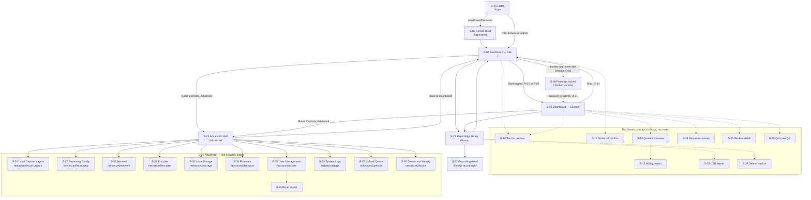
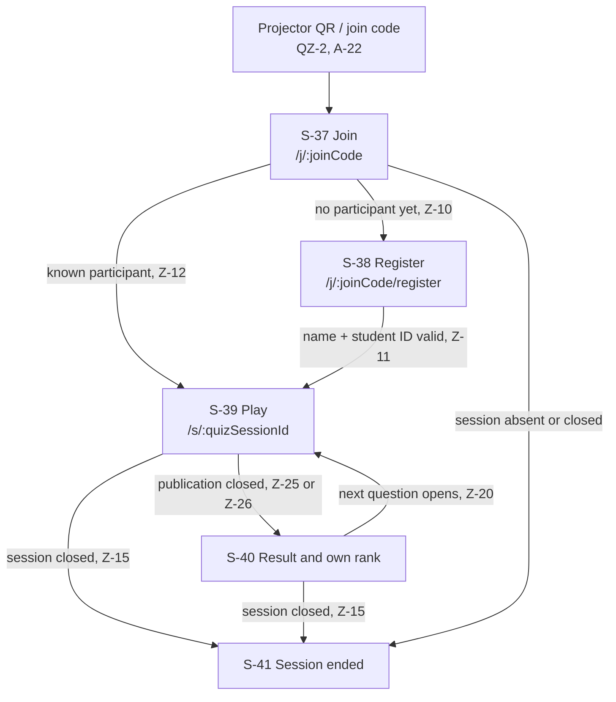
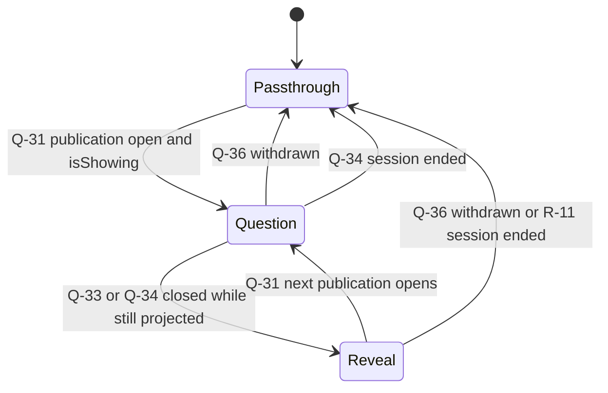

# Screen Inventory & UI Plan — Eduscope UMS Rewrite ("Unistream")

> Phase-1 artifact (revamp-guide prompt 07), successor to
> [state-machines.md](state-machines.md) and the contract freeze
> ([openapi.yaml](../../contracts/openapi.yaml) v0.1.0,
> [events.md](../../contracts/events.md) v0.1.0).
> This is the **work order for Phase 2**. Every screen traces to a PRD
> requirement (LP-/AD-/QZ-/PF-xx), a parity-matrix row, and the exact contract
> operations it consumes. Nothing here invents an endpoint: data the contract
> lacks is listed in [§10 Contract gaps](#10-contract-gaps), never worked around.
>
> Binding rules for building these screens: [frontend-conventions.md](frontend-conventions.md).
> That doc's §6 names *this* file as the source of truth for design tokens — see [§8](#8-design-token-sheet).

---

## 0. How to read this document

### 0.1 The three apps (plus one rendered surface)

| App | Package | Target | Auth | Screens |
|---|---|---|---|---|
| **Lecturer Panel** | `apps/panel` | 13″ in-room kiosk, fixed **1280×800** landscape, capacitive touch, no mouse | `Bearer` kiosk token, role `lecturer` \| `admin` | S-01…S-24 |
| **Admin UI** | `apps/panel` (same SPA, `/advanced/*`) | same kiosk; occasionally a bench keyboard during install | same token, most routes `x-required-role: admin` | S-25…S-36 |
| **Student Quiz** | `apps/quiz` | mobile web, portrait **360–430 px**, public campus domain, students on Wi-Fi *or* mobile data | quiz-service participant session (`[D-21]` self-registration) | S-37…S-41 |
| **Projector overlay** | `services/pipeline-manager` consumer (PF-11) | HDMI-out #1, 1920×1080, read at 10–20 m | none — it is an output, not an app | S-42 |

The Admin UI is **not** a separate deployment. It is the Advanced section of the
panel SPA (AD-1, prototype `admin/AdminPage.tsx`), reached from the Room Controls
bar and role-scoped at the route level.

### 0.2 Route model — a decision taken here

**SI-D-1.** The prototype is deliberately router-less (`AppShell` switches on
plain state, prototype CLAUDE.md §Architecture). The rewrite has **17 top-level
surfaces** instead of the prototype's three, so the panel gains a router.
Rationale: per-screen code-splitting on an RK3588-hosted kiosk browser, a real
back affordance inside Advanced, and screen-scoped test/scenario targeting.
*Cost to reverse: low* — it is one file. Deep-linking is explicitly **not** a
goal (a kiosk has no address bar).

**SI-D-2.** Overlays (modals, dialogs, lightboxes, confirms) are **UI-local
state, not URLs**. They appear in this inventory with `overlay on S-xx` in the
route slot because they carry their own states, data and build cost — but they
never change the location. This matches state-machines §8, which classifies the
open modal as UI-local, not a server state (SM-R-2).

### 0.3 Universal states — implemented once, inherited by every screen

Rather than repeat five rows forty-two times, these are defined here. Every
screen implements them; a screen's own **States** list adds to this baseline and
calls out any deviation explicitly.

| Id | State | Behavior | Source |
|---|---|---|---|
| **U-1** | *Loading (cold)* | Skeleton in the screen's own shape — never a full-screen spinner, never layout shift. REST snapshot mirrors exist for exactly this (`getRecordingState`, `getSourcesStatus`, …) so screens cold-render before the first WS frame | contract C-9 |
| **U-2** | *Reconnecting* | After `T-WS-STALE` (10 s) disconnected: live regions dim, a "reconnecting" marker appears in the shell (S-03). **The red/amber recording frame is kept** — the device is still recording and hiding it would be the more dangerous lie. Commands are rejected client-side with a clear message and are **never** queued for replay | state-machines §5.5 |
| **U-3** | *Resync* | A `seq` gap forces a full snapshot re-request, never a partial patch. Visually identical to U-1 but must not flash populated→skeleton→populated for unchanged data | events.md §1 |
| **U-4** | *Command pending* | Any 202 command shows a pending affordance on the control that issued it and resolves on the matching WS event. At `T-CMD-RESOLVE` (10 s) with no event → failure message. **No indefinite spinners anywhere** | SM-R-2, contract Conventions |
| **U-5** | *Command refused* | `application/problem+json` renders as the named reason in plain language next to the control that was pressed. Never a silent no-op, never a raw code | §0.4 Class A, R-04, INV-SB-3 |
| **U-6** | *Forbidden* | A lecturer reaching an admin route gets the role-scoped shell, not a 403 page — the nav never offers what the role cannot use (AD-1). A 403 arriving anyway is a bug surface, shown as an error card | INV-U-4 |
| **U-7** | *Password-reset lock* | While `mustResetPassword` is true every surface except S-02 and `getMe` answers `403 auth.password-reset-required` — the router redirects to S-02 rather than rendering the error | INV-U-3, LP-2 |

### 0.4 Universal touch/kiosk rules

Also implemented once; per-screen notes only record **deviations and specifics**.

- Minimum touch target **44×44 px** (prototype `.us-icon-btn`, `--tap-min`), 8 px
  minimum separation between adjacent destructive and non-destructive targets.
- **No hover-only affordance anywhere.** Hover styles may exist as a bench
  nicety; every one must have a non-hover equivalent (always-visible label,
  chevron, or explicit button). Tooltips are banned as the sole carrier of
  information.
- **No page scroll.** `.us-panel` is 1280×800; regions scroll internally
  (`.us-assistant__body`, `.us-adm__content`, list bodies). A screen that cannot
  fit is a design bug, not a scrollbar.
- Every text input on the panel opens the on-screen keyboard
  (`react-simple-keyboard`, frontend-conventions §3). Numeric fields open the
  numeric layout. Fields that will realistically be typed on a bench keyboard
  during install (stream keys, IPs) still get it.
- `aria-label` on every icon-only control; `:focus-visible` uses the 3 px
  `--accent` ring already in `index.css`.
- Touch feedback < 100 ms (INT-8) — press states are CSS, never awaited on the
  network.

### 0.5 Coverage vocabulary

| Value | Meaning |
|---|---|
| **full** | The prototype mock is the visual and behavioral spec; build reproduces it and adds the missing states |
| **partial** | The prototype has the frame but is missing states, actions or data the contract now provides |
| **none** | No prototype design exists → **wireframe approval required before build** ([§9](#9-screens-needing-wireframe-approval)) |

---

## 1. Navigation maps

### 1.1 Lecturer Panel + Admin UI

**Role gate (AD-1).** `lecturer` reaches only **S-26** and **S-27** inside
Advanced; the sidebar header reads "Advanced / Outputs" instead of "System
Administration / Categories" (prototype `USER_CATEGORIES`). Everything from
S-28 down is `x-required-role: admin` at the contract level as well as the nav
level — the UI gate is convenience, the server gate is the security boundary
(PF-17, INV-U-4).

### 1.2 Student Quiz app

The student never sees a class list, another student's name, or the leaderboard
(INT-4, QZ-6, INV-SI-2, INV-LB-3). There is no student-side navigation beyond
this chain — no menu, no history, no settings.

### 1.3 Projector overlay

`Passthrough` = the presenter PC's slides, untouched (PF-11, A-11). **Leaderboard
and student identity are never rendered here** — the projector consumer is not
given the data at all (INV-QZ-3, INV-LB-3).

---

## 2. Lecturer Panel — shell, auth & session

### S-01 Login  (panel, `/login`)

- **Purpose & primary persona.** The single credential gate for both roles
  (LP-1). Legacy's separate `/admin-login` screen and the `root`→`dev-admin`
  magic username are retired (parity §1 admin-login row, B-41): role is an
  attribute of the account, not of the door. Persona: **lecturer** (walks up,
  types a username they use everywhere else) and **admin** on install day.
- **States.**
  - `empty` — both fields blank, submit disabled.
  - `filled / submitting` — submit shows pending (U-4); fields locked.
  - `rejected` — bad credentials: one plain-language message, field values kept,
    password cleared. **No enumeration** of which field was wrong.
  - `locked-out` / `disabled account` — `User.disabled` renders as "This account
    is not active — ask your administrator", not as a credential error.
  - `must-reset` — successful auth with `mustResetPassword` → redirect to S-02
    (U-7). This is the *normal* path for every imported user (AD-6, INV-UI-2).
  - `backend unreachable` — the device is up but core-api is not: "The recording
    panel is starting up" + auto-retry, not a credentials error.
  - `session expired` — arriving here after a token expiry or a takeover
    (`AuthSession.revokedReason=takeover`, R-21) shows why.
  - U-1, U-2 (login is the one screen where reconnect means "retry the POST"),
    U-4, U-5.
- **Data.**
  - REST: `login` (`POST /auth/login`, body `LoginRequest{username, password, client:"panel"}`) → `TokenPair`; `getMe` (`GET /auth/me`) for `role` + `mustResetPassword`; `refreshToken` (`POST /auth/refresh`) owned by the client layer, not this screen.
  - WS: **none** — the socket is opened by S-03 after a token exists.
  - Commands: none (auth is not a state machine).
- **Prototype coverage.** **partial** — `components/LoginPage.tsx` (`.us-login__card`, dark logo band, title "Welcome back", two `.us-input` fields, `.us-login__submit`). **The role picker is removed**: it exists only because the prototype has no auth. Role comes from `getMe`. Removing it leaves a hole in the layout that must be redesigned (see §9).
- **Touch/kiosk notes.** Two text fields → on-screen keyboard is mandatory and must not cover the submit button at 1280×800; reserve the lower 380 px for the keyboard and shift the card up when it opens. Submit ≥ 56 px tall. No "remember me" (kiosk, PF-17 short-lived tokens). No password-visibility toggle placed where a bystander in a lecture hall can trigger it accidentally — if included, it is an explicit ≥44 px button.
- **Build order.** **Wave 1**, first screen built. Depends on: scaffold (client boundary, token storage, router). Blocks: everything.

---

### S-02 Forced password reset / change password  (panel, `/login/reset`)

- **Purpose & primary persona.** LP-2. New and Excel-imported users must set a
  compliant password before reaching the dashboard, and the whole flow is
  authenticated end-to-end — this is the screen that closes B-42's
  unauthenticated `/resetpass` hole. Persona: **lecturer** on first login,
  **admin** changing their own password.
- **States.**
  - `forced` — entered via U-7 redirect; no escape hatch, no "skip", no back to
    dashboard. Explains *why* ("Your account was created by an administrator").
  - `voluntary` — same screen reached from the header menu; a Cancel affordance
    exists here and only here.
  - `validating` — live policy checklist (length, and whatever else the
    server enforces) rendered from the client-side mirror of the same rule.
  - `mismatch` — confirm field differs.
  - `rejected` — server rejects (current password wrong, or new password fails
    server-side policy): message next to the offending field.
  - `success` → forced path lands on S-04; voluntary path returns whence it came.
  - U-1, U-2, U-4, U-5.
- **Data.**
  - REST: `changePassword` (`POST /auth/change-password`), `getMe` (`GET /auth/me`) to read/refresh `mustResetPassword`.
  - WS: none.
  - Commands: none.
- **Prototype coverage.** **none** → wireframe required. Parity §5.1 item 3
  ("Forced first-login password reset / change-password flow"), INT-1.
- **Touch/kiosk notes.** Three password fields plus a rule checklist do not fit
  above an open on-screen keyboard at 800 px — the layout must either use a
  two-column card (rules beside fields) or collapse the checklist to a single
  live line. Password fields must not be `type=text` toggled by hover.
- **Build order.** **Wave 1**, immediately after S-01. Depends on: S-01, scaffold.
  Blocks: any realistic user-management demo (S-32/S-33 create users who land here).

---

### S-03 Panel shell, chrome & alert host  (panel, all routes)

- **Purpose & primary persona.** The always-mounted frame: header (logo, hall
  name, clock, user, logout), the **recording frame + notch**, the alert/banner
  host, and the WebSocket connection indicator. Not a "screen" a user names, but
  it owns more failure states than any real screen and must be built first.
  Persona: both.
- **States.**
  - `idle chrome` — no frame; header only (prototype `.us-header`, 62 px).
  - `recording chrome` — `.us-recframe` 4 px `--record` border + `.us-recnotch`
    "● RECORDING" (1a `recording`).
  - `paused chrome` — `.us-recframe--paused` amber + notch "PAUSED" (1a `paused`).
  - `saving chrome` — **new**: neutral slate frame + "SAVING…" covering 1a
    `stopping` **and** `finalizing`, distinguished by sub-caption. INT-5's ≤ 10 s
    window needs to be visible (state-machines §8).
  - `saved` — transient "Saved" confirmation toast (1a `completed`, J-1).
  - `error` — red error card with a plain-language cause (1a `error`, LP-4, G-1).
  - `panel offline` (U-2) — dimmed live regions + "reconnecting"; the recording
    frame is **retained**.
  - **Banner host** — the shell renders every `system.alert` as a banner; the
    designed variants are:
    | Alert code | Severity | Copy driver |
    |---|---|---|
    | `session.recovered` | info | blue "recording resumed after recovery" banner (INT-7, BR-2, J-4) |
    | `session.finalized-after-crash` | info | "your previous lecture was saved" (BR-3) |
    | `storage.warning` | warning | text **generated from `RetentionPolicy`**, never hardcoded (INV-RP-1 — B-53 warned at 70 % about an 80 % policy) |
    | `storage.critical` | error | includes the refused-start consequence (R-02, `[D-15]`) |
    | `recording.pipeline-lost` / `.unrecoverable` / `.truncated` / `.stop-timeout` | error | R-16/R-18/R-09/R-13 |
    | `recording.start-failed` / `.resume-failed` / `.empty` | error | R-06/R-07/R-15 |
    | `source.offline` / `.degraded` | warning, **critical for `mic-lecturer`** | HL-04/HL-06, §6.2 |
    | `capture-card.absent` / `.recovering` / `.failed` | warning/error | HL-20…HL-23 (PF-13) |
    | `ai.unavailable` | warning | Q-05, LP-18 — **must not look like a recording problem** |
    | `quiz.unavailable` / `.sync-stale` / `.publish-failed` | warning | Z-03/Z-32/Q-32 |
    | `streaming.preflight-failed` / `channel.restarting` | warning | CH-03/CH-09 — recording explicitly unaffected |
    | `upload.dead-letter` / `.offline` | warning | U-07/U-08, §4.4 |
    | `poweroff.refused` | info | R-22 |
    | `config.invalid` | error | R-04 — names *which* role/preset is wrong |
  - `still streaming while paused` — a **persistent, non-dismissible** indicator
    whenever `recording.state = paused` ∧ any `channel.state = on` (SM-Q-4). A
    lecturer who taps Pause may believe everything stopped; this is the privacy
    guard.
- **Data.**
  - REST (cold render): `getRecordingState`, `listAlerts`, `getProvisioning` (hall name in the header), `getMe`.
  - WS: `recording.state`, `system.alert`, `storage.status`, `channel.state` (for the paused/streaming indicator), plus the connection lifecycle itself.
  - Commands: `acknowledgeAlert` (`POST /alerts/{alertId}/acknowledge`) — note a still-true condition **re-raises** (INV-SA-1), so acknowledge is "hide for now", not "fix".
- **Prototype coverage.** **partial** — `App.tsx` (`.us-recframe`, `.us-recnotch`), `components/Header.tsx`, `.us-clock`. The entire alert/banner host, the saving/saved/error chrome and the offline marker are new.
- **Touch/kiosk notes.** Banners must not push the layout (the dashboard has no
  vertical slack at 800 px) — they overlay the header band or dock above the
  bottom bars with a fixed 56 px lane. Dismiss targets ≥44 px. The recording
  frame is `position: absolute` inside `.us-panel`, **never** `position: fixed`
  (prototype CLAUDE.md). Clock is read at arm's length: ≥ 19 px.
- **Requirements added by the S-01 / S-02 wireframe gate (2026-08-04).** Both
  are binding on this screen and are specified in
  [S-01-design.md §12](screens/S-01-design.md) and
  [S-02-design.md §12](screens/S-02-design.md):
  1. **No header on `/login` and `/login/reset`.** Both routes sit inside the
     `PanelShell` layout route, but neither can populate the header — before
     login nothing is readable at all (only `login` and `refreshToken` carry
     `security: []`), and during a forced reset `getProvisioning` answers
     `403 auth.password-reset-required`. A header with an empty hall slot is
     worse than no header.
  2. **The user name becomes a `▾` menu** with two ≥56 px rows — *Change
     password* → `/login/reset` carrying `state.from`, and *Sign out*. This is
     the entry point for S-02's `voluntary` mode (S02-D-8); without it LP-2's
     change-password half has no door.
- **Build order.** **Wave 1**, in parallel with S-01. Depends on: scaffold WS
  store + scenario overlay. Blocks: every dashboard screen.

---

### S-04 Dashboard — Idle  (panel, `/`)

- **Purpose & primary persona.** The screen a lecturer sees 95 % of the time
  they walk in: greeting, their name, and **one** dark Start pill. One-tap start
  with no metadata form — hall is device-provisioned, title auto-generated
  (LP-3, A-07). Persona: **lecturer**.
- **States.**
  - `idle / ready` — greeting + Start enabled (prototype `IdleHero`).
  - `starting` — Start shows pending; **the recording frame does not appear yet**
    (1a `starting`; a start that fails must never read as recording — B-12, LP-4).
  - `refused: storage critical` — Start is disabled with the real policy text and
    a link to S-30 (R-02, `[D-15]`, LP-12).
  - `refused: recorder busy` — → S-06 locked view (R-03).
  - `refused: not provisioned` / `no mounted volume` / `invalid channel config` —
    named reason naming the missing piece; admin gets a jump to the fixing screen
    (S-36 / S-30 / S-26) (R-04, INV-SB-3).
  - `start failed` — 1a `error`: red card with plain-language cause + Try Again
    (R-06, J-1 failure path). No phantom row is created in the library (SM-Q-1).
  - `recovery pending` — boot recovery is still deciding (BR-1…BR-9 run within
    `T-BOOT-RECOVERY` 20 s): Start is held with "checking the previous session".
  - `storage warning` — Start enabled, banner shown (HL-10).
  - U-1 (greeting renders instantly from `getMe`; Start stays disabled until
    `getRecordingState` resolves), U-2 (Start disabled while disconnected — a
    command cannot be sent, and must not appear sendable), U-4, U-5.
- **Data.**
  - REST: `getRecordingState`, `getStorageOverview` (policy text + pressure), `getMe`, `getProvisioning` (hall display name for the generated title preview).
  - WS: `recording.state`, `storage.status`, `system.alert`, `sources.status` (the bottom bar S-09 is mounted here too).
  - Commands: `cmd.recording.start` → `startRecording` (`POST /recording/start`), 202 + `CommandAccepted`; resolution arrives as `recording.state{starting}` then `{recording}`.
- **Prototype coverage.** **full** for the happy frame — `components/IdleHero.tsx` (`.us-hero`, `.us-hero__greeting` 22 px, `.us-hero__name` 46 px, `.us-hero__start` 38/54 px padding pill). Every refusal and failure state is new.
- **Touch/kiosk notes.** The Start pill is the single largest target in the
  product and should stay that way (~340×110 px) — it is pressed by someone who
  is already talking to a room. Refusal copy replaces the *subtitle*, never
  shrinks the pill. No hover reveal of the reason: a disabled Start always shows
  its reason inline.
- **Build order.** **Wave 2**, first. Depends on: S-01, S-03, scaffold.
  Blocks: S-05, S-06, S-07.

---

### S-05 Dashboard — Session (live)  (panel, `/`)

- **Purpose & primary persona.** The live-lecture layout: the dark **Eduscope AI
  Studio** card filling the main column, and a **430 px right column** holding
  S-07 (timer), S-08 (Live Meeting channel) and the insights card (S-16/S-17).
  There is deliberately **no** Live Streaming card and **no** Local Capture card
  here — those live in Advanced (prototype CLAUDE.md). Persona: **lecturer**.
- **States.** (This screen is a *composition*; the states below are the ones the
  composition itself owns — its children enumerate their own.)
  - `recording` — full layout, all children live.
  - `paused` — amber chrome from S-03; children reflect pause (timer frozen,
    countdown `held`, "still streaming" indicator if any channel is `on`).
  - `ai disabled` — `G-AI-ENABLED` false (room flag off, INT-10, or
    `llmEndpoint = null`): **the AI studio is hidden entirely** and the main
    column shows the source/output confidence view instead. Recording is
    untouched (LP-18). *This is the default layout for recording-first go-live
    rooms* (INT-10) and therefore must be designed, not treated as an edge case.
  - `ai degraded` — studio visible, in its unavailable state (S-13).
  - `insight column collapsed` — when the meeting layout accordion is open, the
    insights wrapper shrinks to just its tab header
    (`.us-insightswrap--collapsed`) so tabs stay tappable; only one of the two is
    fully open at a time (prototype `AppShell`).
  - `stopping / finalizing` — chrome from S-03; transport buttons disabled;
    countdown stopped (Q-09); publications closed (Q-34).
  - U-1 does not apply (this layout is only reached from a live session), U-2,
    U-3, U-4, U-5.
- **Data.** Composition only — no fetches of its own beyond what S-07/S-08/S-13/
  S-16/S-17 consume. Subscribes to `recording.state` for the paused/stopping
  chrome and `ai.countdown` (`state = unavailable`) to decide the `ai disabled`
  layout.
- **Prototype coverage.** **full** — `App.tsx` `.us-session` / `.us-sidebar` (430 px), prototype `examples/example-2.png`, `example-3.png`. The `ai disabled` layout is new (§9).
- **Touch/kiosk notes.** The vertical budget is the hard constraint: 800 px −
  62 px header − 14 px×2 main padding − the two bottom bars. The accordion/
  insights mutual-exclusion exists because of that budget and must survive any
  redesign. Nothing in this column may depend on hover.
- **Build order.** **Wave 2**, after S-04. Depends on: S-03, S-04, S-07.
  Blocks: S-08, S-13, S-16, S-17.

---

### S-06 Recorder lock & takeover  (panel, `/` — locked variant)

- **Purpose & primary persona.** What user B sees when the device is already
  recording for user A, and how an admin takes over. Mutual exclusion is
  **server-enforced** (LP-6, B-15 — the legacy UI enforced it, which is to say it
  didn't). Persona: **lecturer** walking into a room mid-session; **admin**
  resolving a stuck session.
- **States.**
  - `locked (lecturer)` — owner display name, session title, running duration,
    "recording in progress". Pause/Resume/Stop are **absent**, not disabled-with-
    tooltip. The only actions are Advanced, library, and log out.
  - `locked (admin)` — same, plus **Take over** and **Stop** (`G-AUTH-OWNER`
    admits admins).
  - `takeover confirm` — names the current owner and the session, states that the
    prior owner's panel authority ends. Destructive-styled.
  - `takeover pending` — U-4 on the confirm button.
  - `taken over (as the new owner)` — the layout becomes S-05; a banner records
    the takeover.
  - `taken over (as the displaced owner)` — the prior owner's panel shows why
    their authority ended (`AuthSession.revokedReason = takeover`); if their kiosk
    session was replaced they land on S-01 with the reason stated.
  - `owner's own session on another client` — the owner is not locked out of
    their own session; they get S-05.
  - U-1, U-2, U-4, U-5.
- **Data.**
  - REST: `getRecordingState` (carries `ownerUserId`, `ownerDisplayName`, `title`, `startedAt`, `takeoverBy`), `getMe`.
  - WS: `recording.state` (R-03 re-broadcasts the current state as the refusal), `system.alert`, `log.entry` is **not** consumed here.
  - Commands: `cmd.recording.takeover` → `takeoverRecording` (`POST /recording/takeover`, `x-required-role: admin`); `cmd.recording.stop` → `stopRecording`.
- **Prototype coverage.** **none** → wireframe required. Parity §1 home row
  ("single-recorder lock/takeover UX has no prototype design"), §5.1 item 5, INT-1.
- **Touch/kiosk notes.** This is a **read-mostly** screen with one dangerous
  button; the dangerous button must be visually distinct from Stop and must not
  sit adjacent to it (8 px is not enough here — use 24 px and different weights).
  Owner name and elapsed time are read from across a room: ≥ 21 px.
- **Build order.** **Wave 2**, after S-04. Depends on: S-04, S-03. Blocks: nothing.

---

### S-07 Session transport card (TimerCard)  (panel, region of S-05)

- **Purpose & primary persona.** The duration display and the Pause/Resume/Stop
  transport — the lecturer's confidence instrument (LP-4, LP-5). Persona:
  **lecturer**.
- **States.**
  - `recording` — digits tick **locally** from `startedAt` + `recordedDurationMs`;
    no per-second events (INV-G-7). Pause + Stop enabled.
  - `paused` — digits **frozen at `recordedDurationMs`** (pause gaps excluded —
    the honest figure, and the fix for B-08's `NaN` after restart) + "Recording
    paused"; Resume + Stop enabled.
  - `pause pending` / `resume pending` / `stop pending` — U-4 on the pressed
    button; `pausing` is deliberately **not** a state (SM-Q-2).
  - `starting (resume)` — after R-10, before R-05 confirms.
  - `stopping / finalizing` — all transport disabled, "Saving…" (INT-5 budget).
  - `not owner` — transport buttons hidden (`G-AUTH-OWNER`); see S-06.
  - `collapsed` — the prototype's chevron collapse (digits shrink 38→24 px) to
    free vertical space for the accordion.
  - `segment seam` — after R-16 (consumer died, new segment) the card shows a
    subtle continuity marker; the lecture is **not** ended by a dead pipeline.
  - U-2 (digits keep ticking from the last known `startedAt` but the card is
    marked stale; transport disabled — a stop tapped offline must never fire on
    reconnect), U-4, U-5.
- **Data.**
  - REST: `getRecordingState`.
  - WS: `recording.state`, `recording.segment` (pause/segment detail).
  - Commands: `cmd.recording.pause` → `pauseRecording`; `cmd.recording.resume` → `resumeRecording`; `cmd.recording.stop` → `stopRecording`. All 202-async.
- **Prototype coverage.** **full** — `components/TimerCard.tsx` (`.us-timercard__digits` 38 px mono, `.us-timercard__pause`, `.us-timercard__stop`). Pending, stopping, not-owner and seam states are new.
- **Touch/kiosk notes.** Stop is destructive-adjacent and sits next to Pause;
  keep the prototype's colour/weight distinction and **do not** add a confirm
  dialog to Stop (the lecture must stop in one tap — a second tap in front of a
  room is the failure mode). Digits are `--mono` at 38 px so they read from the
  lectern. Collapse chevron ≥44 px.
- **Build order.** **Wave 2**, with S-05. Depends on: S-03, S-05.

---

### S-08 Live Meeting channel card  (panel, region of S-05)

- **Purpose & primary persona.** The one output channel the lecturer touches
  live: HDMI-out #2 camera composite + embedded mic audio → capture dongle →
  their laptop's USB webcam (LP-15, A-15, PF-12). Toggle plus an **inline
  accordion** with the meeting's three camera-only presets — no drawer (the old
  `SetupDrawer`/`ChannelSection` are deleted). Persona: **lecturer** running a
  hybrid class.
- **States.**
  - `off` — switch off, accordion collapsed.
  - `preflight` / `starting` — switch shows a spinner; **channels have real
    states, so SM-R-2 does not apply** (CH-01/CH-02/CH-04).
  - `on` — switch on; accordion may be open or closed.
  - `failed` — red switch state with the named reason (CH-06); the switch must
    **never** read ON for a dead consumer (B-12 class).
  - `restarting` — CH-09 auto-restart with backoff, distinct from `starting`.
  - `stopping` — CH-07.
  - `accordion open` — "MEETING VIEW LAYOUT" with `cams-fifty-fifty` (default),
    `cam-1`, `cam-2`; active = grey bg + dark border. Opening it collapses the
    insights wrapper (S-05).
  - `preset change pending` — U-4 on the tapped preset.
  - `invalid preset` — a preset whose `requiredRoles` have no enabled binding is
    shown disabled with the reason (`G-CHANNEL-VALID`, INV-LP-1) — it is not
    silently absent and not silently accepted.
  - `still on while paused` — the S-03 indicator's local echo.
  - U-1, U-2 (switch disabled), U-4, U-5.
- **Data.**
  - REST: `listChannels` (`GET /channels`), `listLayoutPresets` (`GET /layouts` — the presets are filtered by `allowedChannels`, never the full list, INV-LP-1).
  - WS: `channel.state`.
  - Commands: `cmd.channel.enable` → `enableChannel` (`POST /channels/{channelId}/enable`); `cmd.channel.disable` → `disableChannel`; preset change → `updateChannelConfig` (`PUT /channels/{channelId}`). **Contract C-4**: enable/disable is only valid during an active session (`409 session.not-active` otherwise) — which is exactly when this card is visible, so the card never needs the idle branch.
- **Prototype coverage.** **full** — `components/ChannelCard.tsx` + `outputs/channelMeta.tsx`, `mock/session.ts` `CHANNEL_LAYOUTS`. The failed/restarting/invalid-preset states are new.
- **Touch/kiosk notes.** The `Toggle` primitive and each preset tile are ≥44 px;
  presets are tiles with icon + label, not a dropdown. Accordion expansion is
  animated `max-height` — reduced-motion must not break the layout (the
  prototype's `prefers-reduced-motion` block already handles it).
- **Build order.** **Wave 3**. Depends on: S-05, and the shared LayoutPresetPicker
  primitive shared with S-26/S-27.

---

### S-09 Sources & audio bar  (panel, bottom bar on `/`)

- **Purpose & primary persona.** The fixed semantic trio `pc / cam1 / cam2` with
  per-tile presence/health, and the **single lecturer mic** with a live level
  meter, −/+ gain steppers and mute (LP-8, LP-9, A-08 amended). This is where
  legacy's placebo gain sliders (B-55) become real controls. Persona:
  **lecturer** glancing for confidence; **admin** during install.
- **States.** Per source role (machine 5a):
  - `online` — live thumbnail, green dot, tappable → S-10 (HL-02).
  - `degraded` — amber ring + "reconnecting…"; preview may stutter (HL-04).
  - `offline` — grey tile, "No signal", **not tappable** (HL-03/HL-06).
  - `unknown` — grey tile, "checking…" — **never the last healthy value**
    (HL-08, INV-DH-2; this is B-12's dead-flag lesson applied to tiles).
  - `unbound` — tile not rendered at all; only Admin shows it as "not installed"
    (HL-01; `mic-room` is permanently here, INV-SR-2).
  - Bar collapsed: three `.us-panelbar__dots` coloured by the same states.
  - Audio: `live` (meter animating from `audio.levels`), `muted`, `gain pending`
    (U-4), **`apply failed`** — the panel shows the *actual* applied state and
    the failure, never the requested value (INV-AC-1 — the anti-placebo rule).
  - `mic offline` — `source.offline` for `mic-lecturer` is ranked **critical**
    (§6.2): a silent lecture is bad, so this is impossible to miss.
  - U-1 (tiles render as `unknown`, not as empty boxes), U-2, U-4, U-5.
- **Data.**
  - REST: `listSourceRoles` (`GET /sources/roles`), `getSourcesStatus` (`GET /sources/status`), `listAudioControls` (`GET /audio/controls`).
  - WS: `sources.status`, `audio.levels` (throttled ≤ 10 Hz, panel-only telemetry — **never** a row), `audio.control` (applied state), `system.alert`.
  - Commands: `updateAudioControl` (`PUT /audio/controls/{roleId}`) for gain and mute.
- **Prototype coverage.** **full** for the frame — `sources/SourcesPanel.tsx` (`.us-srctile` 152 px, `.us-srcmic__meter` 20 segments, `.us-stepper`). **The mock `useMicLevels` random walk must not be ported** (frontend-conventions §2) — bind to `audio.levels`. Degraded/offline/unknown/unbound tiles and the apply-failed state are new.
- **Touch/kiosk notes.** Steppers are ±5 %; each is ≥44 px with 8 px separation —
  a lecturer nudging gain mid-sentence must not hit the wrong one. Tiles are
  152 px wide and are the tap target themselves (no separate "expand" icon). The
  collapsed bar head is 54 px so it is reachable without precision.
- **Build order.** **Wave 2**. Depends on: S-03. Blocks: S-10.

---

### S-10 Source preview lightbox  (overlay on S-09)

- **Purpose & primary persona.** Full-motion WebRTC preview of one source,
  visible **< 1 s from tap** (LP-8, INT-8, A-17). Replaces legacy's
  JPEG-over-socket previews and their global `killall` on switch (B-18, B-06).
  Persona: **lecturer** ("is the camera pointing at me?"), **admin** at install.
- **States.**
  - `negotiating` — the panel has sent `offer`; a still frame or skeleton holds
    the frame shape. Budget: < 1 s to first frame.
  - `live` — media playing, LIVE chip.
  - `negotiation failed` — server `error` with `code ∈ {source-offline, source-unbound, busy, internal}`, each with its own copy. `busy` = another negotiation is active.
  - `source went offline mid-preview` — the server drops unilaterally; the
    lightbox shows why rather than freezing on the last frame.
  - `closed` — teardown sends `close`; **preview death never affects recording**
    (the thumbnails consumer is its own consumer).
  - U-2 (the preview socket is separate from the event socket; losing either
    closes the lightbox with a stated reason), U-5.
- **Data.**
  - REST: none.
  - WS: **separate socket** `GET /api/v1/ws/preview` — client `offer` / `ice` / `close`, server `answer` / `ice` / `error` (`PreviewClientMessage` / `PreviewServerMessage`). `negotiationId` is client-minted per lightbox open; **≤ 1 active negotiation per panel connection**.
  - Commands: none (signaling is not a state machine).
- **Prototype coverage.** **partial** — `SourcesPanel`'s `Modal` + `.us-lightbox` give the frame; the mock renders a silhouette/faux-slide. The real transport (A-17) and every failure state are new.
- **Touch/kiosk notes.** Close target ≥44 px in a predictable corner; tapping the
  scrim also closes. `Modal` portals into `.us-panel` (never `position: fixed`),
  so it renders light even when opened from the dark assistant scope. No
  pinch-zoom expectations — this is a fixed-size preview.
- **Build order.** **Wave 2** (mock transport) / **Wave 8** (real WebRTC).
  Depends on: S-09.

---

### S-11 Room Controls bar  (panel, bottom bar on `/`)

- **Purpose & primary persona.** Projector / Audio / Environment groups, plus the
  **Advanced** entry point. Everything here is an inert placeholder except the
  **master mic mute**, which is the same `AudioControl.muted` field as S-09 —
  one control, one truth (LP-14, LP-9, `[D-10]`). Persona: **lecturer**.
- **States.**
  - `collapsed` / `expanded` (prototype `.us-panelbar--open`).
  - Mic row: `live` / `muted` / `pending` / `apply failed` — mirrors S-09 exactly.
  - **Placeholder rows** (Projector, Projector Screen, Speaker Volume, Lights,
    A/C): local UI state only, no backend, modelled in no state machine on
    purpose (`[D-10]`). **G-5 (zero placebo controls) makes this a design
    obligation**: these rows must be visibly marked as not-yet-connected so the
    shipped product has no control that pretends to work. *How* they are marked
    is a wireframe decision (§9).
  - `power off` entry → S-12.
  - `advanced` entry → S-25, shown to **all roles** (prototype `showAdvanced`).
  - U-1, U-2 (mic row disabled; placeholders unaffected because they are local),
    U-4, U-5.
- **Data.**
  - REST: `listAudioControls`.
  - WS: `audio.control`, `audio.levels`.
  - Commands: `updateAudioControl` (`PUT /audio/controls/{roleId}`) for the master mute. **No other row issues any command** — there is no endpoint for lights/AC/projector and none will be invented (`[D-10]`, parity §4 Room Controls row).
- **Prototype coverage.** **full** — `room/RoomControlsPanel.tsx`. The placeholder marking and the power-off entry are new.
- **Touch/kiosk notes.** `Toggle` ≥44 px; steppers as in S-09. The Advanced button
  sits in the bar head next to Collapse — keep them ≥24 px apart, since one is a
  navigation and the other is a layout toggle.
- **Build order.** **Wave 2**. Depends on: S-03, S-09 (shares the audio binding).

---

### S-12 Power-off confirm  (overlay on S-11)

- **Purpose & primary persona.** A confirmed halt, **refused server-side while a
  session is non-terminal** (LP-13, R-22, B-50 — which had no such rule and lived
  on the retired Menu page). Persona: **lecturer** at end of day; **admin**.
- **States.**
  - `confirm` — names the device/hall; destructive styling; Cancel is the
    default-weight action.
  - `pending` — U-4.
  - `refused (recording)` — `409 poweroff.refused`: "This device is recording —
    stop the lecture first." Offers a jump to S-07, not a force option.
  - `accepted` — the panel shows a terminal "shutting down" state and stops
    pretending to be live; the WS drop that follows is **expected**, not U-2.
  - U-2 (the control is disabled while disconnected), U-5.
- **Data.**
  - REST: `getRecordingState` (to pre-disable, though the server is the authority).
  - WS: `system.alert{poweroff.refused}`, `recording.state`.
  - Commands: `cmd.device.poweroff` → `powerOffDevice` (`POST /device/power-off`).
- **Prototype coverage.** **none** → wireframe required. Parity §2g power-off row, §5.1 item 6, INT-1.
- **Touch/kiosk notes.** The confirm must not be reachable in two adjacent taps
  from anywhere (it is behind the Room Controls expansion). Destructive button on
  the **right**, matching the other danger-zone confirms (S-24, S-30).
- **Build order.** **Wave 2**, with S-11. Depends on: S-11, S-03.

---

## 3. Lecturer Panel — AI studio, insights & quiz

### S-13 AI Studio card ("Eduscope AI Studio")  (panel, main column of S-05)

- **Purpose & primary persona.** Generation control only: the countdown, the
  interval selector, **Generate Questions Now**, and the green "A new set is
  ready" banner. The questions themselves live in S-14 (LP-16, A-14). Persona:
  **lecturer**.
- **States.**
  - `unavailable` — `G-AI-ENABLED` false: the card is **hidden** (S-05's
    `ai disabled` layout), not shown greyed. INT-10's flag-off rooms are the
    common case at go-live.
  - `armed` — countdown mm:ss rendered **locally from `nextAt`** (never
    per-second events, INV-G-7); interval select 10/15/20/30, **default 20**
    (A-14, INT-11 — the prototype's 15 is drift to correct); Generate Now enabled.
  - `generating` — "Generating…" / "Regenerating…" on a disabled button
    (Q-02/Q-03/Q-11).
  - `held` — session paused: countdown frozen with a "paused" caption and
    Generate Now **disabled** (Q-07; a paused session has no new transcript).
  - `degraded` — LLM unreachable after retries: unavailable card + **Retry**;
    the countdown is held; recording and every other panel function untouched
    (Q-05, LP-18, J-2 failure path).
  - `set ready` — green `.us-readybanner` with the draft count + **Review
    Questions** (Q-12; `ai.set{state:ready}` **is** the batch-ready signal —
    `ai.batch_ready` is superseded).
  - `set failed` — Q-13's `timeout | unreachable | invalid-payload` with a retry.
  - `superseded` — a newer ready set replaces the banner; previously generated
    drafts are discarded but **lecturer-authored questions survive** (Q-16,
    INV-Q-3).
  - `interval change pending` — U-4 on the select (Q-10 resets `remainingMs`).
  - U-1, U-2, U-4, U-5.
- **Data.**
  - REST: `getAiCountdown` (`GET /ai/countdown`), `listQuestions` (`GET /ai/questions?sessionId=&state=draft`) for the banner count.
  - WS: `ai.countdown` (transition + `T-COUNTDOWN-RESYNC` 15 s), `ai.set`, `ai.question`, `system.alert{ai.unavailable}`.
  - Commands: `cmd.ai.set_interval` → `setAiInterval` (`PUT /ai/interval`); `cmd.ai.generate_now` → `generateNow` (`POST /ai/generate-now`) — **generates immediately *and* resets the countdown to the full interval**; this is the load-bearing LP-16 requirement and the modal's "Regenerate" uses the same path.
- **Prototype coverage.** **full** — `ai/QuestionAssistant.tsx` + `ai/CountdownToNext.tsx` (`GenerateControls`), `.us-readybanner`. **`COUNTDOWN_SPEED` must not be ported** (prototype-only accelerant). The degraded/unavailable/failed states are new. *Naming drift to settle:* the component renders "Eduscope AI Studio", PRD LP-16 and prototype CLAUDE.md say "Eduscope AI central" (§11).
- **Touch/kiosk notes.** The card owns the dark scope: `.us-assistant`
  re-declares `--surface`/`--text`/`--accent` so nested `us-*` children adapt for
  free (§8.6) — new children must use tokens, never literal darks. Interval is a
  `select` on a touch panel: it must be a native select (the OS picker is the
  most reliable large-target control) or a segmented control of ≥44 px chips.
- **Build order.** **Wave 4**, first AI screen. Depends on: S-05.
  Blocks: S-14, S-16, S-17, S-20.

---

### S-14 Questions review modal  (overlay on S-13)

- **Purpose & primary persona.** Where a batch of 3–5 MCQs is reviewed: inline
  edit, regenerate, discard, add-your-own, and **Send to Projector** (LP-16).
  Persona: **lecturer**, mid-lecture, with a room waiting.
- **States.**
  - `empty` — no drafts: `.us-empty` "No questions right now" (the set was
    reviewed/discarded, or none generated yet).
  - `loading` — opened while `generating`: shows the generating state, not an
    empty list.
  - `populated` — single-column accordion of `QuestionCard`s, **all collapsed by
    default** (prototype), each with prompt, 2–4 options, the correct option
    marked, and a "Yours" chip for `provenance = lecturer-authored`.
  - `editing` — inline edit of a `draft` (Q-20, `G-QUESTION-MUTABLE`); every edit
    writes one audit entry with field-level before/after.
  - `edit refused (immutable)` — a `sent`/`closed` question rejects edits with
    `409 question.immutable`; **the rejection is itself audited** (INV-Q-4). The
    UI must show why, not silently revert.
  - `discarding` / `discarded` (Q-21).
  - `regenerating` — same path as Generate Now, audited at set level (Q-03).
  - `sending` — U-4 on Send (2d `publishing`; the projector is **not** switched
    yet).
  - `sent` — the question moves to the sent list; exactly one "now showing"
    (INV-QPUB-1).
  - `send failed` — Q-32: "couldn't send to the projector" + retry. **The
    projector stayed on slides and the previous publication stayed open** —
    students are never shown a question they cannot answer (INV-QPUB-3).
  - `send refused (quiz unavailable)` — `G-QUIZ-AVAILABLE` false: Send is
    disabled with the reason (Z-03; a projected question nobody can answer is
    worse than none).
  - `superseded while open` — a newer set arrives while the modal is open
    (Q-16): the list updates; lecturer-authored questions stay.
  - U-2 (modal goes read-only), U-4, U-5.
- **Data.**
  - REST: `listQuestions` (`GET /ai/questions?sessionId=&state=`), `getQuestionSet` (`GET /ai/question-sets/{setId}`), `listQuestionSets`.
  - WS: `ai.set`, `ai.question`, `quiz.publication`, `quiz.session` (to gate Send).
  - Commands: `cmd.ai.edit_question` → `editQuestion` (`PATCH /ai/questions/{questionId}`); `cmd.ai.discard_question` → `discardQuestion` (`POST /ai/questions/{questionId}/discard`); `cmd.ai.send_to_projector` → `sendToProjector` (`POST /ai/questions/{questionId}/send-to-projector`); regenerate → `generateNow`.
- **Prototype coverage.** **full** — `ai/QuestionsModal.tsx` + `ai/QuestionCard.tsx` (`.us-qrow--active`, `.us-qcard__custom` "Yours" chip). Send-failed, send-refused, immutable-edit and superseded-while-open are new.
- **Touch/kiosk notes.** `.us-modal__panel` is 680 px wide inside a 1280 px
  panel — comfortable. Editing a prompt opens the on-screen keyboard, which will
  cover the modal foot: the Send/Cancel row must reflow above the keyboard, not
  be scrolled to. Correct-answer selection is **tap-a-letter**, not a radio
  column. Accordion headers ≥56 px.
- **Build order.** **Wave 4**. Depends on: S-13. Blocks: S-15.

---

### S-15 Add Question dialog  (overlay on S-14)

- **Purpose & primary persona.** The lecturer writes their own MCQ: prompt, 2–4
  choices, tap-a-letter correct answer. Saved questions get `provenance =
  lecturer-authored` (`questionSetId = null`), a "Yours" chip, and **survive
  auto-generation batches and session resets** (LP-16, INV-Q-3, Q-19). Persona:
  **lecturer**.
- **States.**
  - `empty` — prompt blank, two empty choices, no correct answer chosen.
  - `filling` — add/remove choice (2–4 bound), correct answer selectable only
    among filled choices.
  - `invalid` — INV-Q-1 violated (fewer than 2 options, no correct option, blank
    prompt): submit disabled with the specific reason.
  - `saving` — U-4.
  - `rejected` — `422` from validation, or `409` if AI is disabled mid-flow.
  - `saved` — dialog closes; the new draft appears in S-14 with the "Yours" chip.
  - U-2 (dialog blocks submit), U-4, U-5.
- **Data.**
  - REST: none for read.
  - WS: `ai.question{draft, lecturer-authored}` resolves the command.
  - Commands: `cmd.ai.add_question` → `createQuestion` (`POST /ai/questions`, body `QuestionCreate`).
- **Prototype coverage.** **full** — `ai/AddQuestionDialog.tsx`. `Modal` portals into `.us-panel`, so it renders light even though it is opened from the dark assistant scope — keep that.
- **Touch/kiosk notes.** This is the **most keyboard-heavy screen in the panel**:
  one prompt + up to four choices. The on-screen keyboard will occupy roughly
  half the panel; the dialog must scroll its body internally with the active
  field kept in view, and the correct-answer letter row must remain visible while
  typing (it is the thing lecturers forget).
- **Build order.** **Wave 4**. Depends on: S-14.

---

### S-16 Insights — Previous Questions  (panel, right column tab of S-05)

- **Purpose & primary persona.** Every sent question with its timestamp, the
  correct answer in green, and clickable **Responses / Correct / Incorrect**
  badges. Panel-only — **never projected** (LP-17, A-16, INV-LB-3). Persona:
  **lecturer**.
- **States.**
  - `empty` — the column **starts empty** and fills as questions are sent
    (prototype). Copy must say that, not "no data".
  - `populated` — cards newest-first; exactly one carries the **"Now showing"**
    badge (2d `open` ∧ `isShowing`, INV-QPUB-1).
  - `withdrawn` — a card without the badge whose publication is still `open`
    (Q-36 withdrew it to slides passthrough).
  - `closed` — publication closed (`next-question`, `session-ended`,
    `lecturer-closed`); the card states which.
  - `re-projected (reveal mode)` — a **closed** publication re-projected renders
    on the projector with the correct answer shown and **does not reopen
    acceptance** (Q-36). The card must make that unambiguous or a lecturer will
    assume answers reopened.
  - `responses stale` — machine 4d `stale`: an amber "responses may be out of
    date" marker. The panel **marks stale rather than displaying stale counts as
    current** (INV-AP-2, QZ-7, J-2 failure path).
  - `sync failed` — 4d `failed`: degraded state; **recording untouched**.
  - `publish failed` — the S-14 failure echoed here so the lecturer sees it even
    after closing the modal.
  - U-1, U-2, U-3 (a `seq` gap forces a resync — response counts are **replaced,
    never patched**, INV-AP-1), U-4, U-5.
- **Data.**
  - REST: `listPublications` (`GET /ai/publications?sessionId=`) → `PublicationWithQuestion` with tallies; `listPublicationResponses` (`GET /quiz/publications/{publicationId}/responses`) for the drill-down, carrying `syncedAt` + `stale`.
  - WS: `quiz.publication` (state, `isShowing`, `projectorState`, `syncState`), `quiz.responses` (batched deltas + `stale`), `ai.question`.
  - Commands: `cmd.ai.close_question` → `closePublication` (`POST /ai/publications/{publicationId}/close`); `cmd.ai.project` → `setProjector` (`PUT /ai/projector`, body `{publicationId}` or `{publicationId: null}`).
- **Prototype coverage.** **full** — `ai/InsightsPanel.tsx` + `ai/SentToProjectorPanel.tsx` (`.us-pqcard__badge` "Now showing", Monitor/MonitorX projector toggle). **`simulateResponses` must not be ported.** Stale/failed/reveal states are new.
- **Touch/kiosk notes.** The badges are the drill-down targets (→ S-18): they are
  small chips in the prototype and must be padded to ≥44 px tap height even if
  they look like 28 px chips. The whole column lives in the dark scope. Tabs stay
  visible when the wrapper collapses (S-05).
- **Build order.** **Wave 4**. Depends on: S-05, S-13. Blocks: S-18.

---

### S-17 Insights — Leaderboard  (panel, right column tab of S-05)

- **Purpose & primary persona.** Ranked students with `{correct}/{answered}`,
  **score = correct × 10** (INT-2), accuracy and average response time; a row
  opens the per-student drill-down. Response time is **insight only and never
  affects score** (INT-2, QZ-5). Panel-only (LP-17, A-16). Persona: **lecturer**.
- **States.**
  - `empty` — no answers yet.
  - `populated` — dense ranking, **ties share a rank** (INV-LB-2); medals for the
    top three (`--gold`/`--silver`/`--bronze`).
  - `live` — the tab shows a live dot while responses are streaming in.
  - `stale` — `Leaderboard.stale` / `quiz.responses.stale`: the whole list is
    marked out-of-date rather than silently drifting (INV-AP-2).
  - `quiz unavailable` — no quiz session: an explanatory empty state, not a zero
    table.
  - `accuracy edge case` — a student who missed a question is **unanswered**, not
    incorrect; accuracy is `correct/answered` and is `0` when `answered = 0`
    (INV-QP-2, J-3 failure path). The column header must not imply otherwise.
  - U-1, U-2, U-3, U-5.
- **Data.**
  - REST: `getLeaderboard` (`GET /quiz/leaderboard?sessionId=`) → `Leaderboard{entries[LeaderboardEntry{studentIdNumber, displayName, answered, correct, points, accuracy, avgResponseMs, rank}], computedAt, stale}`.
  - WS: `quiz.responses` (recompute client-side with the shared DM-10 formula), `quiz.session`.
  - Commands: none — the leaderboard is **derived, never stored** (INV-LB-1).
- **Prototype coverage.** **full** — `ai/LeaderboardPanel.tsx` (`.us-lb__statvalue` 22 px). Stale and quiz-unavailable states are new.
- **Touch/kiosk notes.** Rows are the tap target (→ S-19): ≥56 px each, which
  bounds the visible list to ~6 rows in the 430 px column — internal scroll, and
  the lecturer's own reading distance means no font below 13 px. Never project
  this surface: it is the one screen with a hard authorization boundary against
  the projector output.
- **Build order.** **Wave 4**. Depends on: S-05, S-13. Blocks: S-19.

---

### S-18 Response names dialog  (overlay on S-16)

- **Purpose & primary persona.** Who responded / who was correct / who was
  incorrect for one sent question (LP-17). Persona: **lecturer**.
- **States.** `loading`; `empty` (nobody answered yet); `populated` (three
  filterable name lists); `stale` (banner carrying `syncedAt`); `sync failed`;
  U-2, U-5.
- **Data.**
  - REST: `listPublicationResponses` (`GET /quiz/publications/{publicationId}/responses`) → `{items: AnswerProjection[], syncedAt, stale}` — minimal PII by design (DM-14).
  - WS: `quiz.responses`.
  - Commands: none.
- **Prototype coverage.** **full** — `ai/NamesDialog.tsx`.
- **Touch/kiosk notes.** Long class lists scroll internally; the dialog must not
  grow past `.us-modal__panel` bounds. Names are personal data on a screen at the
  front of a room — the dialog closes on scrim tap and does not persist across
  navigation.
- **Build order.** **Wave 4**. Depends on: S-16.

---

### S-19 Student detail dialog  (overlay on S-17)

- **Purpose & primary persona.** One student's per-question history: what they
  chose, correct or not, response time, running score, rank (LP-17). Persona:
  **lecturer**.
- **States.** `loading`; `populated`; `partial` (student joined late — missed
  questions show as **unanswered**, never as incorrect, INV-QP-2); `stale`;
  U-2, U-5.
- **Data.**
  - REST: `getLeaderboard` (entry) + `listPublicationResponses` per publication, joined client-side on `studentIdNumber` (the leaderboard key, QZ-3, INV-SI-1).
  - WS: `quiz.responses`.
  - Commands: none.
- **Prototype coverage.** **full** — `ai/StudentDetailDialog.tsx`.
- **Touch/kiosk notes.** As S-18.
- **Build order.** **Wave 4**. Depends on: S-17.

---

### S-20 Quiz join / QR card  (overlay or right-column card on S-05)

- **Purpose & primary persona.** The device-side view of the quiz session: join
  URL, join code, **joined count**, and a panel-side QR as a fallback for
  students who cannot read the projector (QZ-2, A-22, Z-02). Persona:
  **lecturer** ("has anyone joined?").
- **States.**
  - `absent` — quiz not configured (`quizServerBaseUrl` null) or no session
    recording: the card is hidden.
  - `requesting` — transient (Z-01, resolves within `T-QUIZ-CREATE` 8 s).
  - `open` — QR + join code + joined count (coalesced ≤ 1/s).
  - `failed` — Z-03/Z-06: **"quiz unavailable — questions can't be sent"**, with
    the reason. This is the state that explains why Send is disabled in S-14.
  - `closed` — Z-05 after the session ends.
  - `stale` — 4d `stale`: joined count marked out of date.
  - U-1, U-2, U-5.
- **Data.**
  - REST: `getQuizSession` (`GET /quiz/session`) → `QuizSessionProjection`.
  - WS: `quiz.session` (`state`, `joinUrl`, `joinCode`, `joinedCount`), `system.alert{quiz.unavailable}`.
  - Commands: none — the device requests the session automatically on R-05.
- **Prototype coverage.** **none** → wireframe required. Parity §4 quiz row; state-machines §8 lists "join QR + joined count" and "quiz unavailable" as new Phase-2 surfaces.
- **Touch/kiosk notes.** **Placement is the open question** (§9): the right column
  at 430 px is already full with S-07 + S-08 + insights. Recommendation: a compact
  "Quiz · N joined" chip in the AI Studio header opening a QR modal, so the
  steady state costs zero vertical pixels. QR must be ≥ 240 px in the modal to be
  scannable from two rows back; **never** hover-revealed.
- **Build order.** **Wave 4**. Depends on: S-13.

---

## 4. Lecturer Panel — recordings library

> This block is the **single biggest design gap** in the product (parity §1 FM
> row, §5.1 item 1). Rules are pre-decided: A-20 (everyone plays, admin-only
> delete, 14-day auto-delete), A-12 (the system merges pause segments — the
> user-triggered convert flow B-34 is gone), server-side ownership filtering
> (B-31), authenticated playback (B-37 closed).

### S-21 Recordings library  (panel, `/library`)

- **Purpose & primary persona.** This device's recordings with upload-status
  badges, playback, download, multi-select copy-to-USB and admin-only delete
  (LP-10). **Ownership filtering is server-side**: lecturers see their own,
  admins see all (INV-RC-5). Persona: **lecturer** (offline export before a trip)
  and **admin** (cleanup, triage).
- **States.**
  - `empty (lecturer)` — "You haven't recorded anything yet."
  - `empty (admin)` — "No recordings on this device."
  - `loading` — skeleton rows (U-1).
  - `populated` — rows: title, hall, owner (admin view), start time, duration,
    size, segment count, and the **upload badge**.
  - **Upload/merge badge matrix** — one badge, derived, never a second truth:
    | Source | Badge |
    |---|---|
    | `mergeState = merging` (1b) | "Preparing…" — surfaced in AD-9 as `queued` + `blockedBy = merge` (SM-D-1) |
    | 1b `failed` | "Couldn't prepare this recording" + admin retry; **no upload job exists** (INV-UJ-3) |
    | `uploadState = queued` | "Waiting to upload" |
    | `uploading` / `completing` | progress (`completing` renders as uploading) |
    | `done` | "Uploaded" |
    | `failed` | "Upload failed — retrying", with `nextAttemptAt` |
    | `dead-letter` | "Upload needs attention" → S-35 (admin) |
    | none yet | "Recording" (still capturing) |
  - `selection mode` — multi-select for export; selection count + total bytes.
  - `deleting` — U-4 on the row; on RA-06 the row **disappears** (the
    `LectureSession` row survives server-side, INV-LS-7).
  - `deleted by retention while open` — a row vanishing under the user needs a
    non-alarming explanation (RET-1/RET-3 fire on a timer, not on a user action).
  - `retention warning` — rows near `retentionDeleteAfter` show it; RET-2's
    blocked case (aged but never uploaded → **not** deleted) shows why it is
    still here.
  - `pagination` — cursor-based (`nextCursor`); "load more", not numbered pages.
  - U-2, U-3, U-4, U-5, U-6 (delete is admin-only).
- **Data.**
  - REST: `listRecordings` (`GET /recordings?cursor=&limit=&state=&includeDeleted=`).
  - WS: `recording.artifact` (merge/ready/failed/deleted), `upload.job` (badge).
  - Commands: `deleteRecording` (`DELETE /recordings/{recordingId}`, admin) via S-24; `createExport` via S-23.
- **Prototype coverage.** **none** → wireframe required. `LocalStoragePage` shows capacity only.
- **Touch/kiosk notes.** Rows ≥64 px with a large checkbox column in selection
  mode; the row body is the tap target for detail, the checkbox is its own
  target. **No hover-revealed row actions** — the legacy pattern of icons
  appearing on hover is unusable on a touch panel; actions live in a persistent
  trailing column or in selection mode. Sorting/filtering controls, if any, must
  be chips, not a menu.
- **Build order.** **Wave 5**, first library screen. Depends on: S-03, scaffold.
  Blocks: S-22, S-23, S-24.

---

### S-22 Recording detail & player  (panel, `/library/:recordingId`)

- **Purpose & primary persona.** One recording: metadata, its files (a
  `separate-files` preset produces one file **per output spec, per segment**,
  SEG-3), authenticated in-panel playback and download (LP-10, B-37 closed).
  Persona: **lecturer** verifying a lecture recorded correctly.
- **States.**
  - `loading`, `not found` (`404`), `forbidden` (`403` — another lecturer's
    recording; the check is per request, INV-RC-6).
  - `populated` — segments and files listed by `index` (never by id arithmetic,
    SEG-2), with per-file duration/size and `truncated`/`crash` segment markers
    honestly shown (SEG-5 — those segments still participate in the merge).
  - `preparing` — 1b `merging`: playback offered on what exists; the merged file
    is not yet there.
  - `merge failed` — 1b `failed`: segment files are **retained** (a failed merge
    never destroys them); admin sees `cmd.recording.retry-merge`.
  - `playing` / `paused` / `seeking` — HTML5 video with Range requests.
  - `playback failed` — media route error, distinct from "file missing".
  - `file missing` — `RecordingFile.state = missing`: named, and explains that the
    upload job dead-lettered (U-08).
  - `deleted` — the recording was removed while open.
  - U-1, U-2 (playback of already-buffered media continues; controls that call
    the API are disabled), U-5, U-6.
- **Data.**
  - REST: `getRecording` (`GET /recordings/{recordingId}` → `RecordingDetail` with segments + files); `getRecordingMedia` (`GET /recordings/{recordingId}/files/{fileId}/media`, HTTP Range; `?download=1` for Content-Disposition) — **every request authenticated and authorization-checked**.
  - WS: `recording.artifact`, `upload.job`.
  - Commands: `deleteRecording` (admin, via S-24); merge retry is `cmd.recording.retry-merge` (RA-07) — see [§10 CG-8](#10-contract-gaps).
- **Prototype coverage.** **none** → wireframe required.
- **Touch/kiosk notes.** Native video controls are too small for touch — use
  custom controls with ≥56 px play/pause and a ≥24 px-tall scrub track. Download
  on a kiosk means "to the attached USB" for most users; the Download button must
  make clear it targets the browser, and S-23 is the real export path.
- **Build order.** **Wave 5**. Depends on: S-21.

---

### S-23 USB export flow  (overlay on S-21)

- **Purpose & primary persona.** Multi-select copy-to-USB with **real transfer
  progress** — never free-space arithmetic (LP-10, LP-11, INV-EX-1, B-32's
  lesson). Drive insert/remove is detected live and scoped to the requesting
  session (B-38's broadcast bug closed). Persona: **lecturer** taking a lecture
  home.
- **States.**
  - `no drive` — "Insert a USB drive" with a live listener; the system disk and
    the recordings volume are **never** offered (INV-EX-2).
  - `drives listed` — the user **picks** the target; multiple drives are a
    first-class case (B-38 took the first). Each shows label, capacity, free.
  - `insufficient space` — required bytes vs free bytes, computed before start.
  - `queued` → `copying` — real `bytesCopied/bytesTotal` progress in ≥5 % steps.
  - `drive removed mid-copy` — the job fails with that reason; **source files are
    never mutated or moved** (INV-EX-3).
  - `completed` — "Safe to remove" with the file count.
  - `failed` — named error.
  - `cancelled` — via `cancelExport`.
  - `another session's export` — export events are scoped to the requesting
    `AuthSession`; a second panel session must **not** see this progress.
  - U-1, U-2 (progress marked stale; the copy itself continues device-side),
    U-4, U-5.
- **Data.**
  - REST: `listExportTargets` (`GET /exports/targets` → `UsbVolume[]`), `createExport` (`POST /exports`, body `ExportCreateRequest{recordingIds, targetDevicePath}` → 202 + `ExportJob`), `getExport` (`GET /exports/{exportId}`), `cancelExport` (`POST /exports/{exportId}/cancel`).
  - WS: `usb.volumes` (insert/remove, session-scoped), `export.job` (progress, session-scoped).
  - Commands: as above.
- **Prototype coverage.** **none** → wireframe required. Parity §2c copy-to-USB row, §3 USB-hotplug row, §5.1 items 1 and 10, INT-1.
- **Touch/kiosk notes.** The drive picker is a list of ≥64 px cards, not a
  dropdown — plugging in the wrong drive is the expensive error. Progress must
  show bytes and an ETA, because a 2 GB lecture over USB 2.0 takes minutes and
  the lecturer will otherwise assume it hung. "Safe to remove" must be
  unmissable.
- **Build order.** **Wave 5**. Depends on: S-21.

---

### S-24 Delete recording confirm  (overlay on S-21 / S-22)

- **Purpose & primary persona.** Admin-only deletion with a real recorded actor —
  `deletedAt`/`deletedBy`/`deleteReason` are **columns**, killing B-33's
  `deleted(<uid>)` status string (LP-10, RA-06, INV-RC-3). Persona: **admin**.
- **States.** `confirm` (names the title, owner, duration and whether it was
  uploaded); `confirm — not yet uploaded` (an explicit stronger warning: RET-2
  says the system itself would never delete this); `pending` (U-4);
  `refused` (`403` for a lecturer — the button should not have been reachable,
  U-6); `deleted` (row removed; any in-flight `UploadJob` is `cancelled`, U-10);
  U-2, U-5.
- **Data.**
  - REST: `deleteRecording` (`DELETE /recordings/{recordingId}`, `x-required-role: admin`, 202-async).
  - WS: `recording.artifact{deleted}`, `upload.job{cancelled}`.
- **Prototype coverage.** **none** → wireframe required.
- **Touch/kiosk notes.** Destructive button right-aligned, `--record` filled,
  ≥24 px from Cancel. No type-to-confirm (that is reserved for S-30's format,
  where the blast radius is the whole disk).
- **Build order.** **Wave 5**. Depends on: S-21.

---

## 5. Admin UI (Advanced section)

### S-25 Advanced shell  (panel, `/advanced`)

- **Purpose & primary persona.** The role-scoped sidebar. Admins see the full
  System Administration list; **lecturers see only their output layouts** —
  Local Capture Layout and Streaming Configuration (AD-1, A-21, prototype
  `USER_CATEGORIES`). Persona: **admin** (IT staff), **lecturer** (two pages).
- **States.**
  - `admin` — title "System Administration", nav label "Categories", 10 items.
  - `lecturer` — title "Advanced", nav label "Outputs", 2 items.
  - `category selected` — `aria-current="page"` on the active item.
  - `back to dashboard` — returns to `/`; if a recording is live, the chrome from
    S-03 is still present here (Advanced is reachable mid-session).
  - `recording-live restrictions` — some operations are refused while recording
    (format: `format.refused`; power-off: R-22; channel enable: C-4). The nav does
    not hide them; the **screens** state the refusal.
  - U-1, U-2, U-6.
- **Data.** `getMe` (role). No other fetch of its own.
- **Prototype coverage.** **full** — `admin/AdminPage.tsx` (`.us-adm__topbar`, `.us-adm__sidebar`, `.us-adm__navitem`), prototype `examples/advance/*.png`. Two new categories (S-35 Upload Queue, S-36 Device & Identity) extend the list from 8 to 10.
- **Touch/kiosk notes.** Nav items ≥48 px with icon + label (never icon-only).
  At 10 items the sidebar is ~500 px tall — it fits 800 px without scrolling and
  must stay that way; an 11th category forces a scroll and is a design decision,
  not an accident.
- **Build order.** **Wave 3**. Depends on: S-01, S-03. Blocks: S-26…S-36.

---

### S-26 Local Capture Layout  (panel/admin, `/advanced/local-capture`)

- **Purpose & primary persona.** The always-on `local` channel's layout preset —
  `fifty-fifty | side-by-side | cam-1 | cam-2 | separate-files` (LP-7, A-09).
  `separate-files` preserves legacy's dual-file capability (B-01/B-09) as data,
  not as a pipeline string. Reachable by **both roles**. Persona: **lecturer**
  before a lecture; **admin** at install.
- **States.** `loading`; `populated` (preset tiles with live preview, active =
  grey bg + dark border); `pending` (U-4); `invalid preset` (a preset whose
  `requiredRoles` lack an enabled binding is disabled with the named reason —
  `G-CHANNEL-VALID`, INV-SB-3, never a silent no-op like B-45); `applied`;
  `refused`; U-2, U-5.
- **Data.**
  - REST: `listChannels` (`GET /channels`), `listLayoutPresets` (`GET /layouts` — filtered by `allowedChannels`; the full list is **never** rendered for a channel, INV-LP-1), `updateChannelConfig` (`PUT /channels/{channelId}`).
  - WS: `channel.state`, `sources.status` (to disable presets whose roles are unbound).
  - Commands: `updateChannelConfig`.
- **Prototype coverage.** **full** — `admin/pages/LocalCaptureLayout.tsx` + `outputs/LayoutPresetPicker.tsx` + `outputs/LayoutPreview.tsx`.
- **Touch/kiosk notes.** Preset tiles ≥ 150×110 px with a rendered geometry
  preview — the preview *is* the label for a non-technical user. `local` has no
  on/off switch (`alwaysOn`), and nothing on this page may imply otherwise.
- **Build order.** **Wave 3**. Depends on: S-25. Shares `LayoutPresetPicker` with S-08 and S-27.

---

### S-27 Streaming Configuration  (panel/admin, `/advanced/streaming`)

- **Purpose & primary persona.** Channel on/off, layout preset, platform picker
  (**YouTube, Facebook, Custom RTMP** — `[D-19]`; Twitch is reachable via Custom
  RTMP), server URL + stream key in secret-grade storage, saved configurations
  (AD-8, B-59). Reachable by both roles. Persona: **lecturer** streaming a
  guest lecture; **admin** provisioning credentials.
- **States.**
  - `loading`; `no targets configured` (empty state that explains what a stream
    target is); `populated`.
  - Channel: `off` / `preflight` / `starting` / `on` / `failed` / `restarting` /
    `stopping` (machine 1c, CH-01…CH-10).
  - `preflight failed` — named reason: target unreachable, key rejected, element
    missing (CH-03). **Recording is unaffected** and the copy must say so.
  - `idle vs live toggle semantics` — **contract C-4**: with no active session
    the switch writes `enabledByDefault` via `updateChannelConfig`; during a
    session it is `enableChannel`/`disableChannel`. These are different actions
    behind one control and the UI must label them differently ("Stream on next
    recording" vs "Start streaming now").
  - `stream key write-only` — keys are **never returned** in any response
    (INV-ST-1, PF-17); the field shows "configured / not configured" and accepts
    a replacement. It must never render a masked value that implies retrieval.
  - `saving` (U-4); `save rejected` (`422`).
  - U-1, U-2, U-5.
- **Data.**
  - REST: `listStreamTargets` (`GET /settings/stream-targets`), `createStreamTarget` (`POST`), `updateStreamTarget` (`PUT /settings/stream-targets/{targetId}`), `deleteStreamTarget` (`DELETE`), `listChannels`, `listLayoutPresets`, `updateChannelConfig`.
  - WS: `channel.state`, `system.alert{streaming.preflight-failed}`.
  - Commands: `enableChannel` / `disableChannel` / `updateChannelConfig` (`channelId = streaming`).
- **Prototype coverage.** **partial** — `admin/pages/StreamingConfig.tsx` has the switch, preset picker, platform chips, URL/key fields and "Active configurations". The prototype's platform list must be reconciled to `[D-19]`; the write-only key semantics, preflight states and idle-vs-live labelling are new.
- **Touch/kiosk notes.** The stream key is a long opaque string typed on an
  on-screen keyboard — provide a paste affordance and never truncate the field.
  Platform chips ≥44 px. The on/off switch is the highest-consequence control on
  this page; keep it visually separated from the preset tiles.
- **Build order.** **Wave 3**. Depends on: S-25, S-26 (shared picker).

---

### S-28 Network Settings  (admin, `/advanced/network`)

- **Purpose & primary persona.** Static LAN config, **vLAN config (new)**, and
  CAM 1 / CAM 2 IP addresses. Applying an IP change **never rebuilds the
  frontend** — runtime config only (AD-2, B-46/B-61 closed). Persona: **admin /
  installer**.
- **States.**
  - `loading`; `populated` (LAN card, vLAN card, camera IP card).
  - `dirty` — unsaved changes marked per card.
  - `validating` — client-side IP/CIDR format checks before submit.
  - `applying` — **202 + row readback** (contract C-5): the row carries
    `appliedAt` / `lastApplyError`; there is no dedicated `network.apply` event.
  - `apply failed` — `lastApplyError` + a `system.alert`; the previous config
    stays in effect.
  - `self-lockout warning` — changing the LAN address of the device the panel is
    talking to. The panel is local to the device so this is survivable, but the
    warning must exist for a bench-connected admin.
  - `camera rebind` — editing a camera IP re-probes the role (HL-09); the tile
    goes `unknown` then `online`/`offline`. **A camera address is edited in
    exactly one place** (INV-PI-2 — legacy kept duplicate copies, B-46).
  - `no Wi-Fi` — there are no SSID fields and there will be none (`[D-16]`,
    INV-NC-1, B-54's dead UI).
  - U-1, U-2, U-4, U-5, U-6.
- **Data.**
  - REST: `listNetworkConfigs` (`GET /settings/network`), `updateNetworkConfig` (`PUT /settings/network/{networkConfigId}`), `listPhysicalInputs` (`GET /sources/inputs`), `updatePhysicalInput` (`PUT /sources/inputs/{inputId}`), `listSourceBindings` (`GET /sources/bindings`), `updateSourceBinding` (`PUT /sources/bindings/{roleId}`).
  - WS: `sources.status` (probe feedback), `system.alert`.
  - Commands: `cmd.admin.set_binding` → `updateSourceBinding` (HL-09).
- **Prototype coverage.** **full** — `admin/pages/NetworkSettings.tsx` (LAN card, vLAN card, camera IP card). Apply/readback, probe feedback and the failure states are new.
- **Touch/kiosk notes.** Eight-plus IP fields on a touch panel: use a **numeric**
  on-screen keyboard layout and octet-segmented inputs, not one free-text field.
  This is the screen most likely to be used with a bench keyboard — support both,
  optimize for neither at the other's expense.
- **Build order.** **Wave 6**. Depends on: S-25.

---

### S-29 Encoder Settings  (admin, `/advanced/encoder`)

- **Purpose & primary persona.** Bitrate (2000–8000 kbps) and any codec/container
  option **validated against real RK3588 `mpph264enc` capability before it
  appears** — unsupported values are **absent, not inert** (AD-3, B-56, G-5's
  zero-placebo rule). Persona: **admin**.
- **States.** `loading`; `populated` (only capability-backed options rendered —
  the GET returns capabilities alongside the settings); `dirty`; `saving` (U-4);
  `save rejected` (`422` with the offending field); `applies-next-session` notice
  (an encoder change must not silently apply mid-lecture); U-2, U-5, U-6.
- **Data.**
  - REST: `getEncoderSettings` (`GET /settings/encoder` — returns settings **with capabilities**), `updateEncoderSettings` (`PUT /settings/encoder`).
  - WS: none.
  - Commands: `updateEncoderSettings`.
- **Prototype coverage.** **partial** — `admin/pages/EncoderSettings.tsx` has a bitrate slider plus codec (H.264/H.265/AV1) and container (MP4/MKV/MOV) selects. **Those lists are prototype fiction**: the built screen renders only what the capability payload allows, so the visible options may be a strict subset. That is the point of the row (B-56).
- **Touch/kiosk notes.** A slider is a poor touch control for a precise value —
  pair it with ± steppers and a numeric readout (the prototype already has the
  `.us-stepper` primitive). Never a bare `<input type=range>`.
- **Build order.** **Wave 6**. Depends on: S-25.

---

### S-30 Local Storage  (admin, `/advanced/storage`)

- **Purpose & primary persona.** Capacity/free stats, **SMART disk health
  (new)**, and mount-new-drive + format as **one guarded danger-zone operation**
  — replacing legacy's two-step format→register plus nginx-root surgery and
  self-restart (AD-4, B-51, B-52). Persona: **admin / field technician**.
- **States.**
  - `loading`; `populated` (total, free, used %, health, volume list, **the
    retention policy stated in real numbers**).
  - `pressure: ok | warning | critical` (machine 5b) — the same policy text the
    dashboard banner uses, generated from `RetentionPolicy` (INV-RP-1).
  - `disk health: good | warning | failing | unknown` — `unknown` when SMART is
    stale, never the last good value (INV-DH-2).
  - `register drive` — `pending` / `registered` / `409 conflict` / `422 invalid`.
  - `format confirm` — **`confirmText` must name the volume** (label, or uuid when
    unlabelled) — J-5's failure path made a UI requirement.
  - `format refused (recording)` — `409 format.refused` while any
    `LectureSession` is non-terminal.
  - `formatting` — progress via `storage.status` / `system.alert`.
  - `format failed` — **the previous registration stays intact** (INV-SV-3) and a
    Hardware-category error is logged (PF-15).
  - `retention blocked` — RET-2: recordings past 14 days that were never uploaded
    are **not** deleted and are surfaced here for an admin decision.
  - U-1, U-2, U-4, U-5, U-6.
- **Data.**
  - REST: `getStorageOverview` (`GET /storage` → `StorageOverview` incl. `RetentionPolicy`), `registerStorageVolume` (`POST /storage/volumes`), `formatStorageVolume` (`POST /storage/volumes/{volumeId}/format`, body `FormatVolumeRequest{confirmText}`), `getDeviceHealth` (`GET /health`).
  - WS: `storage.status`, `device.health`, `system.alert`.
  - Commands: `registerStorageVolume`, `formatStorageVolume`.
- **Prototype coverage.** **partial** — `admin/pages/LocalStoragePage.tsx` has the three stats, "Assign New Drive" + Mount, and a danger-zone Format. The retention policy display, pressure states, SMART detail, confirm-by-name and every failure state are new.
- **Touch/kiosk notes.** Format is the most destructive action in the product:
  type-to-confirm (the volume name) on the on-screen keyboard, danger-zone
  visually separated by the existing `.us-adm__dangerzone` treatment, and the
  button disabled until the typed text matches exactly.
- **Build order.** **Wave 6**. Depends on: S-25.

---

### S-31 Firmware Update  (admin, `/advanced/firmware`)

- **Purpose & primary persona.** Current version plus check/apply of **signed
  release artifacts with rollback** — a failed update leaves the device
  functional (AD-5, B-49: no more `git reset --hard` on a fielded device).
  Persona: **admin**.
- **States.** Machine-less linear lifecycle (domain model §4.13), all of which
  must render: `idle` (current version, last check) · `checking` · `up to date` ·
  `update available` (version, notes, size) · `downloading` (progress) ·
  `verifying` (signature — a **failed signature is a distinct, loud state**) ·
  `applying` · `done` (reboot required) · `failed` · `rolled-back` (with the
  reason the update was reverted). Plus `refused while recording` (an update
  during a lecture is unacceptable), U-1, U-2, U-4, U-5, U-6.
- **Data.**
  - REST: `getFirmwareState` (`GET /firmware`), `checkFirmware` (`POST /firmware/check`), `applyFirmware` (`POST /firmware/apply`).
  - WS: `firmware.state` (full read view on every state change).
  - Commands: `checkFirmware`, `applyFirmware`.
- **Prototype coverage.** **partial** — `admin/pages/FirmwareUpdate.tsx` has current version + "Check for Updates". Eight of the ten states are new.
- **Touch/kiosk notes.** Long-running with a reboot at the end: progress must be
  honest about elapsed and remaining phases, and the "do not power off" message
  must be unmissable at 1280×800 from across a rack room.
- **Build order.** **Wave 6**. Depends on: S-25.

---

### S-32 User Management  (admin, `/advanced/users`)

- **Purpose & primary persona.** One directory, two roles (lecturer/admin):
  add, **edit, delete, paginate** (AD-6, INT-1 — the prototype only adds), with
  `source` distinguishing local from institute-synced accounts (PF-8). Passwords
  are hashed server-side and never returned (INV-U-1). Persona: **admin**.
- **States.**
  - `loading`; `empty`; `populated` (name, username, role, source, last login,
    `mustResetPassword` flag, `disabled` flag).
  - `search` — `?q=` substring on username/displayName; `role` filter.
  - `pagination` — cursor-based, "load more".
  - `add user` — form → `pending` → `created` (the new user hits forced reset on
    first login, S-02) / `409 username taken` / `422 invalid`.
  - `edit user` — displayName, role, `disabled`, and **password** (setting a
    password forces reset on next login — that *is* the admin-triggered reset,
    §11 Q-3).
  - `delete user` — confirm → `pending` → `deleted`; deleting the **last admin**
    or **oneself** must be refused (INV-U-4 class) — see [§10 CG-9](#10-contract-gaps).
  - `institute-sourced user` — fields that the roster owns are read-only here
    (`source = institute`, PF-8, `[D-02b]`).
  - U-1, U-2, U-4, U-5, U-6.
- **Data.**
  - REST: `listUsers` (`GET /users?cursor=&limit=&q=&role=`), `createUser` (`POST /users`, body `UserCreate`), `updateUser` (`PATCH /users/{userId}`, body `UserUpdate`), `deleteUser` (`DELETE /users/{userId}`).
  - WS: none.
  - Commands: as above.
- **Prototype coverage.** **partial** — `admin/pages/UserManagement.tsx` has Add Single User, Bulk Import and a User Directory table. Edit, delete, pagination, search, the source column and the forced-reset flag are new (parity §5.1 item 4).
- **Touch/kiosk notes.** A roster of hundreds on a kiosk: rows ≥56 px, search is
  the primary affordance (not scrolling), and the row action column is
  persistent — **never hover-revealed**. Creating a user means typing a username
  and a password on the on-screen keyboard; the form must remain fully visible
  with the keyboard open.
- **Build order.** **Wave 6**. Depends on: S-25. Blocks: S-33.

---

### S-33 Excel bulk import  (overlay on S-32)

- **Purpose & primary persona.** Bulk roster import honoring the **B-44
  validation contract**: any invalid row (null cell, in-file duplicate, existing
  username) rejects the **whole batch** with row-level reasons and writes nothing
  (AD-6, INV-UI-1, J-5's failure path). Every imported user gets
  `mustResetPassword = true` (INV-UI-2) and the spreadsheet is not retained
  (INV-UI-3). Persona: **admin** at install.
- **States.**
  - `idle` — file picker + a statement of the required columns.
  - `file selected` — name, size, row count if parseable client-side.
  - `uploading` / `validating` (synchronous — the response *is* the verdict).
  - `accepted` — `201` + `UserImportBatch`: N users created, all flagged for
    forced reset.
  - **`rejected`** — `422` + `UserImportBatch` carrying row-level rejections. This
    is the important state: a scrollable table of `row → reason`, and an explicit
    **"nothing was imported"** statement. Partial writes do not exist.
  - `wrong file type` / `unreadable file`.
  - U-2 (upload blocked), U-4, U-5, U-6.
- **Data.**
  - REST: `importUsers` (`POST /users/import`, `multipart/form-data` with `file`) → `201` or `422`, both carrying `UserImportBatch`.
  - WS: none.
- **Prototype coverage.** **partial** — the prototype has a Bulk Import card with no result surface. The rejection report is the whole design job.
- **Touch/kiosk notes.** File picking on a kiosk means a USB stick or a bench
  laptop session — the copy must say where the file is expected to come from. The
  rejection table scrolls internally and must stay readable at ≥13 px.
- **Build order.** **Wave 6**. Depends on: S-32.

---

### S-34 System Logs  (admin, `/advanced/logs`)

- **Purpose & primary persona.** The queryable log store: filter by level
  (INFO/WARN/ERROR) and category (**Auth / System / Hardware / Session**),
  free-text search, time range, and CSV export (AD-7, PF-15). The taxonomy is a
  contract — every service emits into it. Persona: **admin** triaging.
- **States.**
  - `loading`; `empty (no logs)`; `empty (no match)` — different copy, because
    "no match" means "change your filter" (prototype already has
    `.us-adm__note` for this).
  - `populated` — newest first, cursor pagination.
  - `live tail` — subscribed to `log.entry` (see [§10 CG-3](#10-contract-gaps)
    for how a client declares that subscription).
  - `filtering` / `filter applied` — level, category, `q`, `from`, `to`,
    `sessionId`.
  - `session drill-in` — filtering by `sessionId` is how a failed lecture is
    investigated (it is the join key across services).
  - `exporting` / `export ready` / `export failed` — CSV uses the **same filter
    set** as the query.
  - U-1, U-2 (tail marked stale; the query still works), U-5, U-6.
- **Data.**
  - REST: `queryLogs` (`GET /logs?level=&category=&q=&from=&to=&sessionId=&cursor=&limit=`), `exportLogsCsv` (`GET /logs/export`, `text/csv`).
  - WS: `log.entry` (subscribed views only).
  - Commands: none.
- **Prototype coverage.** **full** — `admin/pages/SystemLogs.tsx` (level select, search field, four-column table). Category filter, time range, `sessionId`, pagination, live tail and CSV export are new/expanded.
- **Touch/kiosk notes.** Dense table on a touch panel: rows ≥44 px, message
  column truncates with a tap-to-expand row (not a hover tooltip). Filter chips
  rather than nested menus.
- **Build order.** **Wave 6**. Depends on: S-25.

---

### S-35 Upload Queue  (admin, `/advanced/uploads`)

- **Purpose & primary persona.** Per-file upload state, retry history and a
  **manual re-enqueue** — the successor to legacy's hardcoded manual-upload
  endpoint (AD-9, U-09, B-35, `[D-13]`). Dead-letter items are **always visible
  with their reason** (INV-UJ-4 — B-28 silently excluded them). Persona:
  **admin** recovering uploads.
- **States.**
  - `loading`; `empty` ("Everything has been uploaded" — a genuinely good state,
    and it must read that way).
  - `populated` — one row per **Recording** (one job per recording, INV-UJ-1)
    with `recordingTitle`, state, attempt, progress, `nextAttemptAt`, `lastError`.
  - Row states (machine 3a): `queued` · **`queued` + `blockedBy = merge` →
    "Preparing…"** (SM-D-1, the brief's "converting") · `uploading` ·
    `completing` (renders as uploading) · `done` · `failed` (with attempt N and
    the next retry time) · `dead-letter` (with its reason) · `cancelled`.
  - `offline` — connectivity-class failures **do not consume attempts** (§4.4);
    after 24 h an `upload.offline` alert appears. The queue must show "waiting for
    the network", not "failed 8 times".
  - `part expansion` — per-file `UploadFilePart` rows with `bytesSent/Total`
    (`separate-files` and multi-segment recordings have several).
  - `requeue` — `pending` → `queued`; only dead-letter jobs are requeueable
    (`409 upload.not-requeueable` otherwise); remote cleanup runs first.
  - `no cancel action` — **contract C-1**: cancelling an upload means deleting the
    recording (U-10). The screen must not offer a cancel button.
  - U-1, U-2, U-3, U-4, U-5, U-6.
- **Data.**
  - REST: `listUploadJobs` (`GET /uploads?cursor=&limit=&state=`), `getUploadJob` (`GET /uploads/{jobId}` → `UploadJobDetail` with parts + retry history), `requeueUploadJob` (`POST /uploads/{jobId}/requeue`).
  - WS: `upload.job`, `upload.part`, `system.alert{upload.dead-letter, upload.offline}`.
  - Commands: `cmd.upload.requeue` → `requeueUploadJob`.
- **Prototype coverage.** **none** → wireframe required. Parity §1a fus row, §3 upload row, §5.1 item 2, INT-1.
- **Touch/kiosk notes.** Rows ≥64 px with an expand affordance for parts.
  Progress bars must not be the only signal (colour-blind safety) — pair with a
  percentage and state label. Retry is a per-row button, ≥44 px, and must state
  what it will do ("Try again now").
- **Build order.** **Wave 5** (it shares the badge vocabulary with S-21 and should
  be built alongside it) or early Wave 6. Depends on: S-25, S-21's badge tokens.

---

### S-36 Device & Identity  (admin, `/advanced/device`)

- **Purpose & primary persona.** Read-only provisioned identity (institute
  profile, hall code, storage identity), NTP/time status, capture-card watchdog
  state, publisher health, and the active-alert list. **Editing happens in the
  deploy layer** — this is a window, not a form (AD-10, `[D-20]`, `[D-17]`;
  B-47's `.env`-sed-ing dev-options page is retired). Persona: **admin /
  installer** verifying a build.
- **States.**
  - `loading`; `populated`.
  - `not provisioned` — `G-PROVISIONED` false: the page states exactly which
    field is missing and that Start will be refused until the deploy-layer flow
    completes (R-04, J-5).
  - `clock unsynced` — `ntpSynced = false` with `clockOffsetMs`: correct time is
    load-bearing for generated titles (A-07), retention (A-20) and log ordering;
    this raises a System alert (`[D-17]`).
  - `capture card: present | absent | recovering | failed` (machine 5c,
    HL-20…HL-23) with the last recovery attempt and the per-hour cycle budget.
  - `publisher states` — per-publisher running/exited, the device-lifetime
    processes behind idle previews (SM-Q-9).
  - `alerts` — the admin-side list of `SystemAlert`s with acknowledge; a still-true
    condition **re-raises** (INV-SA-1), and the UI must not imply acknowledge =
    fixed.
  - `health stale` — projections older than `T-HEALTH-STALE` read **unknown**,
    never the last healthy value (INV-DH-2).
  - U-1, U-2, U-4, U-5, U-6.
- **Data.**
  - REST: `getProvisioning` (`GET /provisioning` → `DeviceProvisioning`, read-only; core-api never writes it, INV-DP-1), `getDeviceHealth` (`GET /health`), `listAlerts` (`GET /alerts?includeCleared=`).
  - WS: `device.health`, `system.alert`.
  - Commands: `acknowledgeAlert` (`POST /alerts/{alertId}/acknowledge`).
- **Prototype coverage.** **none** → wireframe required. Parity §1a dev row + §5.1 items 8, 9, 10, 11.
- **Touch/kiosk notes.** Read-mostly; the temptation to add "edit" affordances
  must be resisted — every field here is deliberately not editable and the UI
  should look like a status sheet, not a disabled form. Copy-to-clipboard on ids
  (hall code, device id) is the one useful action.
- **Build order.** **Wave 6**. Depends on: S-25.

---

## 6. Student Quiz app  (`apps/quiz`, mobile web)

> **All five screens are blocked on a contract that does not exist yet** —
> events.md open item **C-6**: the student-facing REST surface (join, register,
> answer) is quiz-service-owned and has no contract file. The **event** payloads
> exist (`StudentServerEvent` in `packages/shared/src/schemas/events.ts`), so the
> UI can be designed and mocked, but the request half must land before
> integration. See [§10 CG-1](#10-contract-gaps).

**App-wide touch rules** (in addition to §0.4): portrait 360–430 px; answer
targets ≥ 64 px tall and full-width; nothing in the bottom 24 px (browser
chrome); no hover at all; the app must be usable one-handed on mobile data with
a flaky link; text ≥ 16 px so iOS does not zoom on focus.

### S-37 Join  (quiz, `/j/:joinCode`)

- **Purpose & primary persona.** The QR target. A scan takes the student
  straight to the active session (QZ-2, A-22). Persona: **student**, in the hall
  or attending online.
- **States.** `resolving` (validating the join code) · `session open, new
  participant` → S-38 · `session open, returning participant` → S-39 (rejoining
  **never** creates a second participant, INV-QP-1) · `session not found`
  (invalid/expired code) · `session closed` → S-41 · `quiz service unreachable`
  (retry) · `manual code entry` (for students who cannot scan) · offline.
- **Data.** Quiz-service REST — **contract gap CG-1**. Events: none yet at this
  stage.
- **Prototype coverage.** **none** → wireframe required.
- **Touch/kiosk notes.** The manual code field is numeric/uppercase-alphanumeric
  and must accept the `joinCode` format (≤ 8 chars) without case sensitivity.
- **Build order.** **Wave 7**, parallel workstream to the panel. Depends on: CG-1.

---

### S-38 Self-registration  (quiz, `/j/:joinCode/register`)

- **Purpose & primary persona.** First join = **real name + valid-format student
  ID** (QZ-3, `[D-21]`, INT-4). The student ID is the leaderboard key
  (INV-SI-1) and the future SSO identity (A-16). Persona: **student**.
- **States.** `empty` · `filling` · `invalid name` · `invalid student ID format`
  (format-validated only — **not** checked against a roster in V1, `[D-21]`) ·
  `submitting` · `registered` → S-39 · `session closed while registering` ·
  `duplicate rejoin` (same student ID on the same session reuses the participant,
  never duplicates it) · offline/retry.
- **Data.** Quiz-service REST — **CG-1**. On success the client transitions to
  `joined` → `online` (Z-11, Z-12).
- **Prototype coverage.** **none** → wireframe required.
- **Touch/kiosk notes.** Two fields, one button, nothing else on screen. The
  student ID field uses the numeric/alphanumeric keyboard matching the validated
  format. Explain **why** the ID is needed in one line — students abandon forms
  that ask for identifiers without a reason.

---

### S-39 Play  (quiz, `/s/:quizSessionId`)

- **Purpose & primary persona.** The answering surface (QZ-4). One locked
  attempt: **the first tap is final** (INT-3). Persona: **student**.
- **States.** (Machine 4c, per publication.)
  - `waiting` — no open question: "Waiting for your lecturer's next question."
    This is the state students spend most of their time in and it must not look
    broken.
  - `answerable` — prompt + 2–4 options. **No countdown timer** — response time
    is insight only, never score, and a visible clock would create pressure the
    product explicitly rejects (INT-2, Z-20).
  - `submitting` — optimistic lock on the tapped option; the option is sent as an
    **id**, never an index (INV-Q-2).
  - `locked` — the answer is final; the option stays highlighted. A second tap is
    **rejected, not overwritten** (INV-AN-1).
  - `rejected — question closed` — an explicit state, never a silent drop
    (Z-23, QZ-4, J-3 failure path).
  - `network error before the server replied` — returns to `answerable`; the
    client retries and the server is idempotent on `(publicationId, studentId)` —
    a duplicate is the **same** answer, not a second attempt (Z-24).
  - `missed` — the question closed with no answer: counted **unanswered**, never
    incorrect (Z-26, INV-QP-2).
  - `offline / reconnecting` — on reconnect the client receives the current open
    publication **plus its own answer state for it**, or "no question" (Z-14). A
    question that closed while away is simply unanswered.
  - `session closed` → S-41.
- **Data.** WS from quiz-service: `quiz.question` (`QuizQuestionPayload{publicationId, state, prompt, options[{id,label,text}], ownAnswer}`), `quiz.result`, `quiz.participant`, student `quiz.session`. Submit REST — **CG-1**.
- **Prototype coverage.** **none** → wireframe required.
- **Touch/kiosk notes.** Options are full-width ≥64 px cards with the letter
  badge on the left; the tap must register on the whole card. Because the tap is
  irreversible, add a brief press-and-release confirmation animation — but **no
  confirm dialog** (it doubles the taps and students are answering against
  their peers).

---

### S-40 Result & own rank  (quiz, state of `/s/:quizSessionId`)

- **Purpose & primary persona.** After a question closes: own correctness, the
  revealed correct answer, points (+10 if correct, INT-2/QZ-5), running score and
  **own rank only** — never the class list (INT-4, QZ-6, INV-SI-2). Persona:
  **student**.
- **States.** `correct` (+10) · `incorrect` (with the correct option revealed) ·
  `missed` (no answer — no points, accuracy unaffected) · `rank updating`
  (batched sync means rank can lag by a second) · `awaiting next question` →
  S-39 · offline.
- **Data.** WS: `quiz.result` (`{publicationId, isCorrect, correctOptionId, pointsAwarded, runningScore, ownRank}`) — `correctOptionId` is revealed **only after close**.
- **Prototype coverage.** **none** → wireframe required.
- **Touch/kiosk notes.** No action required from the student here — the screen is
  a read. Make "waiting for the next question" the visually dominant next step so
  nobody closes the tab.

---

### S-41 Session ended  (quiz, terminal state)

- **Purpose & primary persona.** Final score, final rank, questions answered
  (QZ-6, Z-15). Persona: **student**.
- **States.** `ended with participation` (final score + rank) · `ended, never
  answered` (a gentle empty state, not a zero-shaming one) · `ended while
  offline` (shown on reconnect) · `session not found` (arriving at a stale link).
- **Data.** WS: student `quiz.session{state: closed, finalScore, …}`.
- **Prototype coverage.** **none** → wireframe required.
- **Touch/kiosk notes.** Terminal screen — no navigation, no retry, no share.
  The student closes the tab.

---

## 7. Projector overlay

### S-42 Projector overlay  (pipeline-manager consumer, HDMI-out #1)

- **Purpose & primary persona.** The room-facing output: slides passthrough by
  default, switching to **question + join QR** when a publication is showing
  (PF-11, A-11, A-22). Persona: **the room** — read at 10–20 m by students who
  are also holding phones.
- **States.**
  - `passthrough` — the presenter PC's slides, untouched. This is the default and
    the state the projector returns to on withdraw, close and session end.
  - `question` — prompt + 2–4 options + join QR + join code. Q-31 switches to this
    **only after** the quiz-service ack (`G-PUBLISH-ACK`) — a question is never
    shown that students cannot answer (INV-QPUB-3).
  - `reveal` — a **closed** publication re-projected shows the correct answer and
    does **not** reopen acceptance (Q-36). Visually unambiguous vs `question`.
  - `no signal from PC` — the `presentation` role is offline: the overlay must
    render something intentional rather than showing the pipeline's placeholder
    to a room.
  - **Never rendered:** leaderboard, student names, response counts, any panel
    chrome (INV-QZ-3, INV-LB-3 — an authorization boundary, not a style choice).
- **Data.** WS: `quiz.publication` (`publicationId`, `questionId`, `state`, `isShowing`, `projectorState`), `quiz.session` (`joinUrl`, `joinCode` for the QR). **The publication event carries ids, not text** — see [§10 CG-2](#10-contract-gaps).
- **Prototype coverage.** **none** → wireframe required. Parity §4 "Send to Projector + projector question overlay + join QR"; §5.2 item 3.
- **Touch/kiosk notes.** Not touch — but the harder constraint: **1920×1080 read
  at 10–20 m**. Minimum body text ≈ 48 px, option letters ≈ 72 px, QR ≥ 400 px
  with a quiet zone and high contrast. Assume a projector with washed-out blacks:
  use the light palette, not the ink scope. No animation that a 30 fps
  passthrough path would tear.
- **Build order.** **Wave 8**, last — it depends on the AI flow (S-13/S-14) being
  real and on CG-2 being closed.

---

## 8. Design token sheet

Extracted from `/prototype` (`src/index.css` = tokens, `src/styles/app.css` =
usage). Per frontend-conventions §2 the custom-property approach is **kept** —
tokens are not converted to Tailwind utilities. §8.3 and §8.4 **rationalize**
ad-hoc px values into a named scale: the prototype uses 23 distinct font sizes
and 18 gap values; the columns below give the canonical name and every prototype
value that collapses into it (max drift 1 px, which is invisible at 1280×800).

### 8.1 Color — light scheme (the `:root` palette)

There is **no dark mode and no theme toggle** (PRD §3.2, legacy-vs-prototype C-6).

| Token | Value | Role |
|---|---|---|
| `--bg` | `#eef0f4` | App body behind the cards |
| `--surface` | `#ffffff` | Card / panel surface |
| `--surface-2` | `#f4f6fb` | Inset rows, table stripes |
| `--surface-3` | `#e9edf4` | Active chips, pressed states |
| `--border` | `#d8dee9` | Default 1 px hairline |
| `--border-strong` | `#c2cad8` | Emphasized / active borders |
| `--text` | `#1c2430` | Primary text |
| `--text-muted` | `#5b6675` | Secondary text, labels |
| `--text-faint` | `#8a94a3` | Tertiary, timestamps, placeholders |

### 8.2 Color — ink scope, semantics, brand

| Token | Value | Role |
|---|---|---|
| `--ink` | `#101319` | Header bar |
| `--ink-2` | `#191d26` | Ink elevation 2 |
| `--ink-3` | `#242a35` | Ink elevation 3, dark tiles |
| `--ink-border` | `#2c333f` | Border on ink |
| `--on-ink` | `#f2f4f8` | Text on ink |
| `--on-ink-muted` | `#9aa4b2` | Secondary on ink |
| `--on-ink-faint` | `#6b7684` | Tertiary on ink |
| `--accent` | `#2f6bed` | Primary action, focus ring |
| `--accent-hover` | `#285cd0` | Primary hover (never the only signal) |
| `--accent-soft` | `rgba(138,169,236,0.12)` | Accent tint background |
| `--on-accent` | `#ffffff` | Text on accent |
| `--brand-red` | `#e5231f` | Eduscope brand mark |
| `--record` | `#e5342e` | Recording frame, notch, destructive |
| `--record-soft` | `rgba(229,52,46,0.12)` | Destructive tint |
| `--success` | `#1c9e6a` | Correct answer, "done", uploaded |
| `--success-soft` | `rgba(28,158,106,0.14)` | Success tint |
| `--warning` | `#d98a12` | Paused frame, storage warning, degraded |
| `--gold` / `--silver` / `--bronze` | `#e0a530` / `#7b828e` / `#b06a3a` | Leaderboard medals |

**Semantic gaps to fill in Phase 2** (used by new screens, absent from the
prototype because it has no failure states): `--danger` currently doubles as
`--record`, which conflates "we are recording" with "this will destroy data".
Add `--danger: #c62828` + `--danger-soft`, and `--info: #2f6bed` + `--info-soft`
for the recovery banner. **These two additions need approval with the wireframes**
— they are the only new colors this document proposes.

### 8.3 Color — the ink scope mechanism (keep this)

`.us-assistant` **re-declares the token values** rather than defining a parallel
class set, so every nested `us-*` component adapts automatically. New children of
the AI studio and the insights card must be styled with tokens and will inherit
the dark scope for free.

| Token | `:root` | inside `.us-assistant` |
|---|---|---|
| `--surface` | `#ffffff` | `#1e242f` |
| `--surface-2` | `#f4f6fb` | `#262d3a` |
| `--surface-3` | `#e9edf4` | `#313a49` |
| `--border` | `#d8dee9` | `#2f3745` |
| `--border-strong` | `#c2cad8` | `#424d5f` |
| `--text` | `#1c2430` | `#f2f4f8` |
| `--text-muted` | `#5b6675` | `#9aa4b2` |
| `--text-faint` | `#8a94a3` | `#6e7987` |
| `--accent` | `#2f6bed` | `#5b8cff` |
| `--accent-hover` | `#285cd0` | `#6f9bff` |
| `--accent-soft` | `rgba(138,169,236,.12)` | `rgba(91,140,255,.16)` |
| `--record-soft` | `rgba(229,52,46,.12)` | `rgba(255,91,83,.16)` |
| `--success-soft` | `rgba(28,158,106,.14)` | `rgba(62,207,142,.16)` |
| `--shadow-sm` | light | `0 1px 2px rgba(0,0,0,.35)` |

`Modal` and `Drawer` portal into `.us-panel`, so dialogs opened from the dark
scope render **light** — that is intentional and must be preserved.

### 8.4 Type scale

Root: `font-size: 17px`, `line-height: 1.45`, `--sans: system-ui, "Segoe UI",
Roboto, Helvetica, Arial, sans-serif`, `--mono: ui-monospace, "SF Mono",
Consolas, "Liberation Mono", monospace`. Weights in use: **600 / 700 / 800**
(the prototype has no 400 or 500 body weight — it is a high-contrast panel UI).

| Token | Value | Collapses prototype values | Used for |
|---|---|---|---|
| `--fs-3xs` | 11px | 10.5, 11 | Micro-labels, badge counters |
| `--fs-2xs` | 12px | 11.5, 12 | Chips, table meta, uppercase eyebrows |
| `--fs-xs` | 13px | 12.5, 13 | Secondary rows, log table |
| `--fs-sm` | 14px | 13.5, 14 | **Default UI text** (most-used size) |
| `--fs-base` | 15px | 14.5, 15 | Body, form labels |
| `--fs-md` | 16px | 15.5, 16 | Emphasized body, buttons |
| `--fs-lg` | 17px | 16.5, 17 | Card titles |
| `--fs-xl` | 19px | 18, 19 | Section titles, `.us-clock__time`, admin card titles |
| `--fs-2xl` | 21px | 20, 21 | Modal titles, assistant title |
| `--fs-3xl` | 24px | 22, 24, 25 | Login title, hero greeting, collapsed timer, leaderboard stat |
| `--fs-timer` | 38px | 38 | `.us-timercard__digits` (`--mono`) |
| `--fs-display` | 46px | 46 | `.us-hero__name` |

Tracking: `--tracking-tight: -0.4px` (display), `--tracking-normal: 0`,
`--tracking-wide: 0.4px` (labels), `--tracking-caps: 1px` (uppercase eyebrows),
`--tracking-caps-lg: 2.5px` (the notch "RECORDING").

**Floor:** nothing below `--fs-3xs` (11 px) ships on the panel; nothing below
`--fs-md` (16 px) ships in the quiz app; nothing below 48 px ships on the
projector.

### 8.5 Spacing

2 px grid. Named steps; odd prototype values (3, 5, 7, 9, 11, 13, 15 px) collapse
to the nearest step.

| Token | Value | Collapses | Typical use |
|---|---|---|---|
| `--sp-1` | 4px | 3, 4, 5 | Icon↔label gap |
| `--sp-2` | 6px | 6, 7 | Chip padding, tab gap |
| `--sp-3` | 8px | 8, 9 | **Most-used gap**; control cluster spacing |
| `--sp-4` | 10px | 10, 11 | List item gap |
| `--sp-5` | 12px | 12, 13 | Card inner gap |
| `--sp-6` | 14px | 14, 15 | Card padding, main padding |
| `--sp-7` | 16px | 16 | Section gap |
| `--sp-8` | 18px | 18 | Panel-bar horizontal padding |
| `--sp-9` | 20px | 20 | Card padding (admin) |
| `--sp-10` | 24px | 22, 24 | Modal padding, danger separation |

### 8.6 Radii, elevation, motion

| Token | Value | Use |
|---|---|---|
| `--radius-xs` | 6px | Small inputs, logo chip |
| `--radius-sm` | 10px | Chips, steppers *(existing token)* |
| `--radius-md` | 12px | **Most-used**: rows, cards, notch bottom |
| `--radius-lg` | 14px | Tiles, preset cards |
| `--radius` | 16px | Panels *(existing token)* |
| `--radius-panel` | 20px | `.us-panel` **and** `.us-recframe` — they must match or the frame will not hug the corners |
| `--radius-xl` | 24px | Modals, drawers *(existing `--radius-lg`, renamed)* |
| `--radius-pill` | 999px | Start pill, transport buttons, badges |
| `--radius-circle` | 50% | Status dots, avatars, icon buttons |

> **Rename note:** the prototype ships `--radius-sm: 10px`, `--radius: 16px`,
> `--radius-lg: 24px`. The table above inserts `--radius-md/-lg/-xl`, which
> **reassigns `--radius-lg` from 24 px to 14 px**. Do the rename in one commit at
> scaffold time (Wave 0) or keep the prototype's three names and add only
> `--radius-xs/-md/-panel/-pill/-circle`. Either is fine; silently changing the
> meaning mid-build is not.

| Token | Value |
|---|---|
| `--shadow-sm` | `0 1px 2px rgba(16,24,40,.06), 0 1px 3px rgba(16,24,40,.08)` |
| `--shadow-md` | `0 4px 10px rgba(16,24,40,.08), 0 2px 4px rgba(16,24,40,.06)` |
| `--shadow-lg` | `0 12px 32px rgba(16,24,40,.16)` |

Motion: `pulse-rec` (the notch dot), `fade-in` (6 px rise). A
`prefers-reduced-motion` block already reduces all durations to 0.001 ms —
**every new animation must survive that**, i.e. no information may be carried by
motion alone.

### 8.7 Layout constants (panel)

| Token | Value | Source |
|---|---|---|
| `--panel-w` / `--panel-h` | 1280px / 800px | `.us-panel` max bounds |
| `--header-h` | 62px | `.us-header` |
| `--sidebar-w` | 430px | `.us-session` right column |
| `--panelbar-head-h` | 54px | `.us-panelbar__head` (collapsed bar) |
| `--recframe-w` | 4px | `.us-recframe` border |
| `--modal-w` | 680px | `.us-modal__panel` |
| `--srctile-w` | 152px | `.us-srctile` |
| `--tap-min` | 44px | `.us-icon-btn`, frontend-conventions §3 |
| `--tap-row` | 56px | Minimum list-row height for new list screens |
| `--tap-row-lg` | 64px | Library / queue rows with multiple targets |

---

## 9. Screens needing wireframe approval

Everything with prototype coverage **none**, plus the three redesign decisions
that change an existing prototype screen. Nothing in this list may be built
before the wireframe is approved (revamp-guide prompt 07 "Done when").

| # | Screen | Why it has no design | Blocks | Status | Approved design |
|---|---|---|---|---|---|
| W-1 | **S-02** Forced password reset | Parity §5.1 item 3; User Management only *adds* users today | Any user-management demo | ✅ **closed** 2026-08-04 | [S-02-design.md](screens/S-02-design.md) |
| W-2 | **S-06** Recorder lock & takeover | Parity §5.1 item 5; legacy enforced it in the UI, which is why it needs redesigning as a server-enforced view | J-1 multi-user story | open — Wave 2 | — |
| W-3 | **S-12** Power-off confirm | Parity §5.1 item 6; lived on the retired Menu page | — | open — Wave 2 | — |
| W-4 | **S-20** Quiz join / QR card | New (A-22); **placement in a full 430 px column is the open question** | J-3 | open — Wave 4 | — |
| W-5 | **S-21** Recordings library | Parity §5.1 item 1 — the largest gap in the product | S-22, S-23, S-24 | open — Wave 5 | — |
| W-6 | **S-22** Recording detail & player | Same row; authenticated playback is new (B-37) | — | open — Wave 5 | — |
| W-7 | **S-23** USB export flow | Parity §5.1 items 1 + 10; drive picking and real progress are both new | — | open — Wave 5 | — |
| W-8 | **S-24** Delete recording confirm | Parity §2c delete row | — | open — Wave 5 | — |
| W-9 | **S-35** Upload queue | Parity §5.1 item 2 | G-3 demo | open — Wave 5 | — |
| W-10 | **S-36** Device & Identity | Parity §5.1 items 8, 9, 11 | J-5 | open — Wave 6 | — |
| W-11 | **S-37…S-41** Student quiz app (5 screens) | Whole app is new (A-16); also blocked on CG-1 | J-3 | open — Wave 7 | — |
| W-12 | **S-42** Projector overlay | New (A-11/A-22); a legibility problem, not a UI problem; also blocked on CG-2 | J-2 | open — Wave 8 | — |
| W-13 | **S-01** Login — *redesign* | Removing the prototype's role picker leaves a hole in the card layout | Wave 1 | ✅ **closed** 2026-08-04 | [S-01-design.md](screens/S-01-design.md) |
| W-14 | **S-05** Dashboard — *`ai disabled` layout* | With the AI flag off (INT-10 — the go-live default) the main column is empty; what replaces it is undesigned | Wave 2 | open — Wave 2 | — |
| W-15 | **S-11** Room Controls — *placeholder marking* | G-5 forbids controls that pretend to work; how the five `[D-10]` rows signal "not connected yet" is a design decision | Wave 2 | open — Wave 2 | — |

Also needing sign-off, though not screens:

- **The two new semantic colors** (`--danger`/`--danger-soft`, `--info`/`--info-soft`)
  in §8.2 — ✅ **approved 2026-08-04** with W-1 and W-13. Both are consumed by
  S-01 (`rejected`, `backend unreachable`) and S-02 (`mismatch`, forced-reason
  block), and already ship in `apps/panel/src/styles/tokens.css`.
- **The radius-rename choice** in §8.6 — ✅ **taken at Wave 0**: `tokens.css`
  performed the rename in one commit, so `--radius-lg` is 14 px and
  `--radius-xl` is 24 px throughout.

> **Wave 2 carries four wireframe rows (W-2, W-3, W-14, W-15)** — more design
> work than Wave 1 had. Budget a Route B run before its plan run.

---

## 10. Contract gaps

Screens that need data the contract does not have. **No endpoint has been
invented anywhere in this document.** Each row states the blocked screen and the
smallest change that unblocks it.

**How to read Status.** A CG row is a *question*, not a decision:

| Status | Meaning |
|---|---|
| `open` | Nobody has ruled. The "Smallest fix" column is a **suggestion** — a design run may reject it |
| ✅ `answered` | A wireframe gate decided it. **Resolved by** points at the design doc holding the decision and its rationale — never restated here |
| ✅ `applied vX` | The decision is in `contracts/openapi.yaml`, zod is regenerated, and the mock adapter matches |

**A gap is answerable only once its screen has an approved wireframe.** Deciding
`GET /recordings?q=` before anyone has drawn the recordings library would invent
an endpoint to fit a screen that does not exist — the one thing this document
has not done. So gaps close **wave by wave**, at each Route B gate, not in one
sitting. See [§11](#11-build-order) for which wave owns which row.

Rows **CG-10…CG-13** were not visible at prompt-07 time: they were discovered
*during* the S-01/S-02 design runs, because a screen only reveals what data it
needs once it is drawn. Expect every future Route B run to add rows here.

| # | Gap | Blocked screens | Severity | Smallest fix | Status | Resolved by |
|---|---|---|---|---|---|---|
| **CG-1** | **The student-facing REST surface does not exist.** events.md open item C-6: join, register (name + student ID, `[D-21]`), and answer submission (Z-21/Z-22) are quiz-service-owned and have no contract file. Only the *event* payloads exist (`StudentServerEvent`) | S-37, S-38, S-39, S-40, S-41 | **Blocking** for `apps/quiz` | The proposed `contracts/quiz-app.yaml` in v0.2 | open — **Wave 7 hard-block**; needs the quiz-service design (Phase 3) and `[D-21]` | — |
| **CG-2** | **The projector overlay has no data path to the question body.** `quiz.publication` carries `publicationId` + `questionId` only (`QuizPublicationPayload`); the prompt, options and correct option live behind `GET /ai/publications`, a bearer-authenticated panel route. The projector consumer is an internal pipeline-manager surface with no user token | S-42 | **Blocking** for the projector | Either extend `QuizPublicationPayload` with the rendered question payload, or define an internal projector read route in the core-api ↔ pipeline-manager API (Phase 3) | open — **Wave 8 hard-block**; needs prompts 10/11 | — |
| **CG-3** | **No way for a client to declare a scoped subscription.** events.md §1 scopes `log.entry` to "connections that subscribed to the live log view" and `usb.volumes` to "sessions with the export flow open" — but the same section states clients send **no** WS messages. There is no defined mechanism | S-34 (live tail), S-23 (hotplug) | Medium — screens work by polling, which §5 forbids | State that `GET /logs` and `GET /exports/targets` mark the calling `AuthSession` as subscribed for a TTL, or add a subscribe REST call | open — answer at the W-7 / W-9 gates (Wave 5/6) | — |
| **CG-4** | **Roster sync (PF-8) has no admin-visible status.** `User.source` distinguishes institute accounts, but nothing exposes last-run time, counts, or failures. Parity §5.1 item 11 flags exactly this ("its admin visibility/config has no design") | S-32, S-36 | Low — Auth/System `LogEntry`s are a workable stopgap via S-34 | `GET /settings/roster-sync` returning last run + outcome, or accept logs-only and say so | open — Wave 6; **not answerable in-house**, coupled to `[D-02b]` (institute owns it) | — |
| **CG-5** | **`GET /recordings` cannot be filtered by owner, date or title.** Params are `cursor`, `limit`, `state`, `includeDeleted`. An admin looking at every lecturer's 14 days of recordings has scroll as the only tool | S-21 | Low | Add `?q=`, `?ownerUserId=`, `?from=`/`?to=` to `listRecordings` | open — answer at the W-5 gate (Wave 5) | — |
| **CG-6** | **No device restart command.** Only `POST /device/power-off` exists. Parity §5.1 item 6 words the gap as "power off / **restart** control", and a kiosk that can only be power-cycled by walking to the rack is an operational cost | S-12 | Low — PRD LP-13 says power-off only, so this may be correct as-is | Either add `POST /device/restart` (same R-22 refusal) or confirm power-off-only in the wireframe | open — answer at the W-3 gate (Wave 2); likely a *confirm*, since PRD LP-13 says power-off only | — |
| **CG-7** | **No merge-retry endpoint.** State-machines RA-07 defines `cmd.recording.retry-merge` (admin) for a `failed` artifact, and S-22 renders that state — but no REST operation binds it. `POST /recordings/{id}/retry-merge` is missing from openapi.yaml | S-22, S-21 (badge action) | Medium — the state is reachable and has no exit | Bind RA-07 to a path in v0.2 | open — answer at the W-6 gate (Wave 5) | — |
| **CG-8** | **Deleting the last admin / oneself is unguarded in the contract.** `DELETE /users/{userId}` documents `403` for non-admins but no rule against removing the only admin account, which would brick administration | S-32 | Low | Document a `409 users.last-admin` refusal | open — Wave 6. The invariant is decidable now; **how S-32 presents the refusal is not** | — |
| **CG-9** | **The AI studio cannot show what a question was generated from.** `QuestionSet` records `inputWindow`, `slideCaptureIds`, `modelId`, `promptVersion` (domain model §8.3), but no screen surfaces provenance and no endpoint returns the transcript window | — (none blocked) | None — listed only so it is a deliberate omission, not an oversight | No action in v0 | ✅ **closed** — no action in v0, by this row's own ruling | this document |
| **CG-10** | **No disabled-account error code.** S-01 enumerates a `disabled account` state whose message is *not* a credential error ("This account is not active — ask your administrator"), but `Problem.code` is a closed enum with nothing that can produce it. `Problem['code']` is a generated TypeScript union, so the state is a **compile error**, not merely undocumented | S-01 | **Blocking** for Wave 1 | Add `auth.account-disabled` to `Problem.code` | ✅ **applied v0.2.0** | [S-01-design.md](screens/S-01-design.md) §9 #1 |
| **CG-11** | **A revoked session cannot say why.** `auth.session-revoked` cannot distinguish an idle expiry from a logout elsewhere from **R-21**'s `AuthSession.revokedReason = takeover`, but S-01's `session expired` state is specified to show the reason | S-01, S-06 (W-2) | Medium — the state renders, but always with the vaguest wording | Add `meta.reason` to the `auth.session-revoked` Problem | ✅ **applied v0.2.0** | [S-01-design.md](screens/S-01-design.md) §9 #2 |
| **CG-12** | **The password policy is weaker than the system it replaces.** `ChangePasswordRequest.newPassword` carries `minLength: 8` and nothing else; legacy B-42 enforced ≥8 **+ digit + upper + lower**. S-02's live checklist must mirror the server rule exactly or it promises acceptance it cannot deliver | S-02, S-33 (import) | **Blocking** for Wave 1 — a checklist with no server rule behind it is a lie | Enforce the legacy composition rules server-side | ✅ **applied v0.2.0** | [S-02-design.md](screens/S-02-design.md) §9 #3 |
| **CG-13** | **You cannot log out of a forced password reset.** §Auth exempts only `/auth/change-password` and `/auth/me` from `403 auth.password-reset-required`, so `/auth/logout` is refused. A lecturer who abandons a reset on a shared kiosk leaves a live `AuthSession` until expiry | S-02 | **Blocking** for Wave 1 — S-02's Sign out control cannot work | Add `/auth/logout` to the `mustResetPassword` exemption list | ✅ **applied v0.2.0** | [S-02-design.md](screens/S-02-design.md) §9 #4 |

Gaps **CG-1** and **CG-2** are the only two that hard-block a build wave *by
missing an entire surface*. **CG-10…CG-13 blocked Wave 1** and are now
`applied v0.2.0` — contract, zod layer and mock adapter all carry them
([contract-amendments.md](contract-amendments.md), 2026-08-04), so Wave 1's
plan run is unblocked. CG-3 and CG-7 should land before Wave 5/6.

### 10.1 When the contract actually changes

The contract is amended **after a wave's design run and before its plan run** —
never during a plan, and never speculatively. A plan says *"build these screens
against `contracts/`"*; if the contract lacks what the screen needs, the plan
either stalls or invents, and inventing is what this pipeline forbids. The
plan's own exit gate includes contract-honesty tests that validate mock
responses against zod schemas **generated from `openapi.yaml`** — so a wrong
contract makes the gate unpassable by construction.

| Bump | Carries | Timing |
|---|---|---|
| `v0.2` | CG-10, CG-11, CG-12, CG-13 | **before Wave 1's plan run** |
| `v0.3` | CG-6, if the W-3 wireframe asks for restart | before Wave 2's plan run |
| `v0.4` | CG-3, CG-5, CG-7 | before Wave 5's plan run |
| *(tbd)* | CG-4, CG-8 | before Wave 6's plan run |
| *(tbd)* | CG-1 — a whole `contracts/quiz-app.yaml` | before Wave 7 |
| **`v1.0`** | **Everything, reconciled** — prompt 12 drift review | Phase 3, once, both owners sign off |

Waves 3 and 4 need no contract change at all.

---

## 11. Build order

Waves are dependency-ordered, not calendar-ordered (INT-12: quality-gated, no
hard date). The gate is PRD §9 Phase 2: *"Full demo on mock incl. failure
states."*

| Wave | Content | Entry condition | Exit condition |
|---|---|---|---|
| **0 — Scaffold** (prompt 08) | `packages/api-client` `EduscopeClient` + **mock adapter** validating against the `contracts/` zod schemas; zustand WS store with the reconnect/resync rules (U-2/U-3); TanStack Query wiring; router (SI-D-1); token layer from §8; UI primitives (`Toggle`, `Modal`, `Drawer`, `Stepper`, `cn`); on-screen keyboard; **scenario dev overlay** with the catalog `happy`, `start-fails`, `pipeline-crash-midway`, `llm-timeout`, `disk-full`, `ws-flap`, `quiz-network-loss` | Contract v0 approved | A screen can be built without touching `fetch` |
| **1 — Auth & shell** | S-01, S-02, S-03 | Wave 0 | A user can log in, be forced to reset, and see live chrome |
| **2 — Recording core** | S-04, S-05, S-06, S-07, S-09, S-10 (mock transport), S-11, S-12 | Wave 1 | J-1 happy **and** its failure path demo end-to-end on the mock |
| **3 — Channels & outputs** | S-25, S-26, S-27, S-08 | Wave 2 | All three channels configurable; LP-7 preset vocabulary enforced |
| **4 — AI & insights** | S-13, S-14, S-15, S-16, S-17, S-18, S-19, S-20 | Wave 3 | J-2 happy **and** `llm-timeout` + `quiz-network-loss` demo |
| **5 — Library & queue** | S-21, S-22, S-23, S-24, S-35 | Wave 2 (independent of 3/4) | INT-1's biggest gap closed; upload badge vocabulary shared |
| **6 — Admin system** | S-28, S-29, S-30, S-31, S-32, S-33, S-34, S-36 | Wave 3 | J-5 provisioning demo, including its failure path |
| **7 — Student quiz app** | S-37, S-38, S-39, S-40, S-41 | **CG-1 closed**; runs as a parallel workstream from Wave 4 | J-3 happy + late-answer + reconnect demo |
| **8 — Real transports** | S-10 real WebRTC, S-42 projector | **CG-2 closed**; Phase 4 hardware | Preview < 1 s on target hardware (INT-8) |

**Critical path:** Wave 0 → 1 → 2 → 3 → 4. Waves 5 and 6 fork after Wave 2/3 and
can run in parallel with 4. Wave 7 is fully parallel once CG-1 lands. Wave 8 is
the only wave that needs hardware.

**Ordering rationale.** INT-10 separates recording go-live from AI/quiz
enablement, so Waves 1–3 alone constitute a shippable pilot surface; Waves 4, 7
and 8 are the AI/quiz half behind the per-room flag (PF-20). Wave 5 is scheduled
before Wave 6 despite being "less core" because it is the largest undesigned
area (parity §5.1 item 1) and therefore the largest schedule risk.

---

## 12. Parity coverage check

Every parity-matrix row whose new home includes a UI surface, and where it lands.
Rows dispositioned RETIRE with no UI successor are listed for completeness so the
absence is deliberate, not lost.

### 12.1 Rows landing on a screen

| Parity row | Disposition | Screen(s) |
|---|---|---|
| §1 User login + forced reset | REDESIGN | S-01, S-02 |
| §1 Home / recording dashboard | REDESIGN | S-03, S-04, S-05, S-06, S-07 |
| §1 Capture Setup | REDESIGN | S-09, S-10, S-26, S-11 (mic) |
| §1 Live Meeting Cast | REDESIGN | S-08 |
| §1 Live Stream setup | REDESIGN | S-27 |
| §1 File Management | REBUILD | S-21, S-22, S-23, S-24 |
| §1 Settings shell | REDESIGN | S-25 |
| §1a Encoder settings | REDESIGN | S-29 |
| §1a Device/network settings | REDESIGN | S-28 |
| §1a File upload settings | REDESIGN | S-35 |
| §1a Firmware update | REDESIGN | S-31 |
| §1a Local storage settings | REDESIGN | S-30 |
| §1a Dev options | REDESIGN | S-36 (read-only; editing is deploy-layer, `[D-20]`) |
| §1a User management | REDESIGN | S-32, S-33 |
| §2a Auth endpoints | REBUILD | S-01, S-02 |
| §2a Recording control | REDESIGN | S-04, S-05, S-07 |
| §2a Stream control | REDESIGN | S-27 |
| §2b Capture config CRUD | REDESIGN | S-26 |
| §2b Setup previews | REDESIGN | S-10 |
| §2b Device discovery | REDESIGN | S-09 (health per tile), S-28 (camera IPs) |
| §2c Library listing | REBUILD | S-21 |
| §2c Copy to USB | REBUILD | S-23 |
| §2c Delete recordings | REBUILD | S-24 |
| §2d Meeting config CRUD | REDESIGN | S-08 |
| §2e Streaming config CRUD | REDESIGN | S-27 |
| §2g Power off | REBUILD | S-12 |
| §2g Storage gauge | REDESIGN | S-03 (banner), S-04 (refused start), S-30 |
| §3 Storage cleanup cron | REDESIGN | S-30 (policy text), S-03 (banner), S-21 (retention markers) |
| §3 Institute user sync | REDESIGN | S-32 (`source` column), S-34 (logs) — **CG-4** |
| §3 Scheduled upload pipeline | REDESIGN | S-35 |
| §3 `.ts`→`.mp4` + merge | REDESIGN | S-21 ("Preparing…" badge), S-22 |
| §3 Recording/setup preview emitters | REDESIGN | S-09, S-10 |
| §3 USB hotplug detection | REBUILD | S-23 |
| §3 EZ-Cap watchdog | REDESIGN | S-36, S-34, S-03 (alerts) |
| §4 AI question generation | NEW | S-13, S-14, S-15 |
| §4 Send to Projector + overlay + QR | NEW | S-14 (send), S-20 (QR card), S-42 (overlay) |
| §4 Student quiz platform | NEW | S-37…S-41 |
| §4 Insights panel | NEW | S-16, S-17, S-18, S-19 |
| §4 Live Meeting hardware path | NEW | S-08 |
| §4 Room Controls | NEW (mock-only) | S-11 |
| §4 Real microphone control | NEW | S-09, S-11 |
| §4 System Logs & audit trail | NEW | S-34 |
| §4 vLAN configuration | NEW | S-28 |
| §4 WebRTC panel thumbnails | NEW | S-09, S-10 |
| §4 Disk-health reporting | NEW | S-30, S-36 |
| §5.1 (1) Recordings library | gap | S-21, S-22, S-23, S-24 |
| §5.1 (2) Upload queue view | gap | S-35 |
| §5.1 (3) Forced reset | gap | S-02 |
| §5.1 (4) User dir beyond add | gap | S-32 |
| §5.1 (5) Lock & takeover | gap | S-06 |
| §5.1 (6) Power off / restart | gap | S-12 (**CG-6** for restart) |
| §5.1 (7) Lecturer storage warning | gap | S-03, S-04 |
| §5.1 (8) Time / NTP / timezone | gap | S-36 (read-only, `[D-17]`) |
| §5.1 (9) Device provisioning surface | gap | S-36 (read-only, `[D-20]`) |
| §5.1 (10) USB hotplug & recovery surfacing | gap | S-23, S-36, S-03 |
| §5.1 (11) Institute sync + institute login UX | gap | S-01, S-32 — **CG-4** |

### 12.2 Rows with no UI, by decision

| Parity row | Why no screen |
|---|---|
| §1 Admin login (separate screen) | RETIRE — one login, role on the account (B-41) |
| §1 Main menu | RETIRE — single-view UX; the pipeline teardown it hid moves to explicit lifecycle (B-14) |
| §1a Eduscope Stream settings, Schedule settings, UAC/UVC, System-page placebo | RETIRE — settings CRUD with no consumer (B-55); the real time/NTP need lands on S-36 |
| §1a Wi-Fi / SSID | RETIRE — wired only `[D-16]`, INV-NC-1; S-28 has no SSID fields **by design** |
| §2a Pause bookkeeping, `isError` flag, test stubs | RETIRE — server-side now (A-12); dead code (B-12) |
| §2c Convert/merge endpoints, manual upload | RETIRE — automatic post-stop (A-12); replaced by S-35 requeue |
| §2f LMS dropdown feeds | RETIRE — A-07 removes metadata entry entirely |
| §3 Record LED | REBUILD, but **hardware-only** — a pure function of `recording.state` (PF-14), invisible to every screen |
| §3 Physical record button, 4-way camera switch | RETIRE `[D-12]` — half-wired dead features |
| §3 nginx topology, MySQL data layer | REDESIGN — infrastructure, no UI |

**Result: no UI-disposed parity row is unassigned.**

---

## 13. Open questions & decisions taken here

| Id | Item | Decision / question | Cost to change |
|---|---|---|---|
| SI-D-1 | Router in the panel | **Taken:** the panel gets a router (17 surfaces vs the prototype's 3). Deep-linking is a non-goal | Low |
| SI-D-2 | Overlays are not routes | **Taken:** modals/dialogs are UI-local, matching state-machines §8 (SM-R-2) | Low |
| SI-D-3 | Library entry point | **Proposed:** a header entry visible to both roles, plus a link from the post-stop "Saved" toast. The prototype has no entry point because it has no library | Low — settle with W-5 |
| SI-D-4 | Quiz QR placement | **Proposed:** a compact "Quiz · N joined" chip in the AI Studio header opening a QR modal, costing zero steady-state vertical pixels in a full 430 px column | Low — settle with W-4 |
| SI-D-5 | S-36 merges three concerns | **Taken:** device identity (AD-10), health/watchdog and the admin alert list share one screen. Three near-empty read-only screens would be worse; `/alerts` otherwise has no admin home | Low |
| SI-Q-1 | "Eduscope AI Studio" vs "Eduscope AI central" | The component renders **"Eduscope AI Studio"**; PRD LP-16 and prototype CLAUDE.md both say **"Eduscope AI central"**. One is drift. **Recommendation: "Eduscope AI Studio"** — it is what reviewers have seen — with the PRD amended | Trivial now, a retraining cost after pilot |
| SI-Q-2 | Countdown default 15 → 20 | INT-11/A-14 say **20**; `QuestionContext.tsx` still says 15. The rewrite uses 20; the prototype fix is already an open action item in PRD §Stop | Trivial |
| SI-Q-3 | Admin-triggered password reset | The contract path is `PATCH /users/{userId}` with a `password`, which forces a reset on next login. So an admin must invent and communicate a temporary password. Acceptable (it is the legacy flow), but a `mustResetPassword`-only flag would be cleaner | Low |
| SI-Q-4 | Placeholder Room Controls vs G-5 | G-5 promises **zero placebo controls**, and `[D-10]` ships five inert switches. These are reconciled only if the UI marks them as not-yet-connected. **This is a PM call on wording** (W-15), not an engineering detail | Low now; a credibility cost at pilot |
| SI-Q-5 | Streaming toggle semantics | Contract C-4 makes one switch mean two things (idle: `enabledByDefault`; live: start/stop now). S-27 proposes two labels. Confirm this is the intent rather than a contract simplification to revisit | Low |

---

*STOP — Phase-1 gate: screen inventory awaiting review. This is the last Phase-1
artifact; on approval Phase 2 begins with the frontend scaffold (prompt 08).*

*Reviewers should focus on:*
1. *§9 — the 15 wireframe items, especially W-5 (library), W-14 (the `ai disabled` dashboard, which is the **default** layout at recording-first go-live) and W-15 (how placeholder Room Controls avoid violating G-5).*
2. *§10 — CG-1 and CG-2 hard-block two build waves and need a v0.2 contract bump; CG-3 and CG-7 should ride along.*
3. *§8.2 and §8.6 — the two new semantic colors and the radius rename are the only token changes proposed.*
4. *§13 — SI-Q-1 and SI-Q-4 are PM calls, not engineering ones.*
