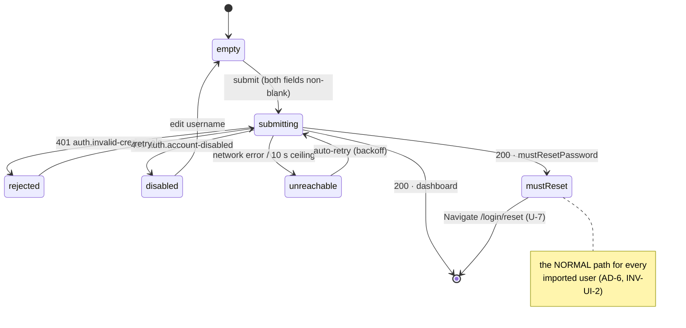

# S-01 Login — approved wireframe & screen design

> Closes **W-13** in [screen-inventory §9](../screen-inventory.md#9-screens-needing-wireframe-approval)
> ("Login — *redesign*: removing the prototype's role picker leaves a hole in the
> card layout"). Nothing in this document may be contradicted by a plan or by
> generated code; if it must change, that is a gate discussion, not an in-run
> improvisation ([frontend-conventions](../frontend-conventions.md) preamble).
>
> **Status:** approved 2026-08-04. Blocks: Wave 1, and therefore everything.
> Sibling: [S-02](S-02-design.md).

---

## 0. Evidence base

Every claim below traces to one of these. No endpoint, token, state or copy
string is invented outside §9's four contract changes, which are named as
changes rather than assumed.

| Source | What it fixed here |
|---|---|
| [screen-inventory §2 S-01](../screen-inventory.md) | The seven states, the data surface, the touch/kiosk notes, the 380 px keyboard reserve |
| [screen-inventory §0.3](../screen-inventory.md) | U-1…U-7, inherited rather than restated |
| [screen-inventory §8](../screen-inventory.md) | Every token used below; no new colour, size or spacing value |
| [`contracts/openapi.yaml`](../../../contracts/openapi.yaml) | `login`, `getMe`, `refreshToken`, the `Problem` enum, and the four gaps in §9 |
| [state-machines §8](../state-machines.md) | Line 918: the login screen is **out of scope** for machines 1a–5c |
| [PRD LP-1](../../PRD.md) | One login screen for both roles, real credentials |
| [behavioral-inventory B-40, B-41](../../discovery/behavioral-inventory.md) | The dual user source survives; the `root`→`dev-admin` magic username does not |
| [`frontend-scaffold.md:4081`](../../plans/frontend-scaffold.md) | The on-screen-keyboard host was explicitly deferred **to this screen** |
| `apps/panel/src/` | The Wave-0 scaffold this screen lands into |

---

## 1. Constraints that are not design choices

These are properties of the contract and the scaffold. They are recorded first
because three of them look like design freedom and are not.

**C-1. Nothing is readable before a successful `login`.** Only `login` and
`refreshToken` carry `security: []`. `getProvisioning` (the hall name),
`/health`, `getMe` and `listAlerts` are all bearer-authenticated. S-01 therefore
has **no live data at all** — not the hall name, not the device health, not the
firmware version. Any block placed in the card would be static or invented.
This decided [S01-D-1](#11-decisions-taken-here).

**C-2. The prototype card does not fit above the keyboard.**
`.us-login__card` is 475 px tall; the inventory reserves the lower 380 px of the
800 px panel, leaving 420 px. See [§3](#3-the-on-screen-keyboard-host).

**C-3. `LoginRequest` requires `client`.** The panel always sends
`client: "panel"`. It is not a user-visible choice and never appears in the UI.

**C-4. `mustResetPassword` arrives on the login response *and* on `getMe`.**
`LoginResponse` carries `user`, `tokens` and `mustResetPassword`. The redirect to
S-02 is therefore decidable from the login response alone — no second round trip
before navigating (INV-U-3, U-7).

**C-5. The U-7 redirect already exists.** `apps/panel/src/auth/require-role.tsx:25`
implements it. S-01 does not reimplement the gate; it populates the auth context
that the gate reads.

---

## 2. Wireframe

```
 OSK CLOSED  (--osk-h: 0px)                    OSK OPEN  (--osk-h: 380px)
┌──────────── .us-panel 1280×800 ────────────┐ ┌──────────── 1280×800 ─────────────┐
│                                            │ │ ┌────────── 420 ──────────┐  y=13 │
│         ┌────────── 420 ──────────┐  y=162 │ │ │                         │       │
│         │███ band 82px · logo ████│        │ │ │  Welcome back      24px │       │
│         │                         │        │ │ │  Sign in to your…  14px │       │
│         │  Welcome back      24px │        │ │ │  USERNAME          12px │       │
│         │  Sign in to your…  14px │        │ │ │  [___________________]  │  48px │
│         │  USERNAME          12px │        │ │ │  PASSWORD               │       │
│         │  [___________________]  │  48px  │ │ │  [___________________]  │  48px │
│         │  PASSWORD               │        │ │ │  ┌─ message slot ────┐  │       │
│         │  [___________________]  │  48px  │ │ │  │ (reserved, empty) │  │  40px │
│         │  ┌─ message slot ────┐  │        │ │ │  └───────────────────┘  │       │
│         │  │ (reserved, empty) │  │  40px  │ │ │  [      Log In      ]   │  56px │
│         │  └───────────────────┘  │        │ │ │                         │ y=380 │
│         │  [      Log In      ]   │  56px  │ │ └─────────────────────────┘ y=406 │
│         └─────────────────────────┘  y=637 │ ├───────────────────────────── y=420 │
│                                            │ │▓▓▓▓ react-simple-keyboard 380 ▓▓▓▓│
│                                            │ │▓▓▓▓ q w e r t y u i o p      ▓▓▓▓│
│                                            │ │▓▓▓▓ [space]           [✕]    ▓▓▓▓│
└────────────────────────────────────────────┘ └───────────────────────────────────┘
   475px card                                     393px card — band collapsed 82→0
```

**Height budget (OSK open, 420 px available):**

| Element | px |
|---|---|
| body padding (22 top + 26 bottom) | 48 |
| title `--fs-3xl` / 800 | 29 |
| subtitle `--fs-sm` | 18 |
| 2 × field (label 17 + gap 6 + input 48) + gap `--sp-5` | 154 |
| message slot — **reserved unconditionally** | 40 |
| submit | 56 |
| 4 × flex gap `--sp-5` | 48 |
| **total** | **393** |

Top edge at `(420 − 393) / 2 = 13`, bottom edge at 406 — 14 px clear of the
keyboard. The submit button's own bottom sits at y≈380.

### 2.1 Why the message slot never collapses

Four of the seven states are message-only (`rejected`, `disabled account`,
`backend unreachable`, `session expired`). A slot that mounts on demand would
move a 56 px submit button up by 40 px at the exact moment a lecturer is
reaching for it. The slot is present from first paint, empty and unannounced,
and only its contents change. This is the direct use of the space the role
picker vacated.

### 2.2 The role picker is gone and nothing replaces it

The prototype's 2-up Lecturer/Administrator grid
(`prototype/src/components/LoginPage.tsx:60-80`) exists only because the
prototype has no auth — its own comment says the credentials are decorative.
Role now comes from `getMe`/`LoginResponse` (LP-1, INV-U-4), and by **C-1**
there is no other data to put there. The card is shorter; the reclaimed ~90 px
becomes the message slot and the headroom that lets the card clear the keyboard.

---

## 3. The on-screen-keyboard host

`frontend-scaffold.md:4081` deferred this component to S-01 because its one hard
requirement — *"must not cover the submit button at 1280×800; reserve the lower
380 px"* — is an S-01 layout decision. **S-01 owns it; every later panel screen
with a text field inherits it unchanged.**

```
apps/panel/src/keyboard/
  keyboard-host.tsx   mounts once inside .us-panel; renders react-simple-keyboard
  use-keyboard.ts     open/close + layout selection, consumed by inputs
```

**Contract:**

- The host is `position: absolute` inside `.us-panel`, **never** `position: fixed`
  (prototype CLAUDE.md; same rule as `.us-recframe` and `OverlayHost`).
- Open/closed is React state. It changes at most a few times per screen, so it
  does not need the transient-store treatment that `audio.levels` does
  (frontend-conventions §1).
- The **reserved height is published as a CSS custom property `--osk-h`** on
  `.us-panel`: `0px` closed, `380px` open. Screens centre their content in
  `calc(var(--panel-h) - var(--osk-h))`. That single property is the entire
  integration surface — no props threaded through screens, no context read, and
  **no screen re-renders when the keyboard opens**.
- Layout is `default` for text and `numeric` for numeric fields
  (screen-inventory §0.4).
- Opens on focus; closes on blur or on an explicit ✕ key ≥44 px.
- Because S-01 autofocuses Username on mount (§8), the keyboard is open before
  first paint and the card renders in its 393 px geometry immediately. The band
  collapse is therefore **never seen on arrival** — it only plays if the user
  dismisses the keyboard, and it survives `prefers-reduced-motion` because the
  band is decorative and carries no information (§8.6).

---

## 4. Component breakdown

```
apps/panel/src/screens/login/
  login-screen.tsx      route component — form values, submit, navigation
  login-card.tsx        the card: collapsible band, title, slots. Presentation only
  use-login.ts          the login mutation, the form state union, the 10 s ceiling
apps/panel/src/auth/
  password-field.tsx    label + input + optional reveal button   [shared with S-02]
  auth-message.tsx      the message slot                          [shared with S-02]
apps/panel/src/keyboard/
  keyboard-host.tsx     §3 — ships here, inherited by every screen
  use-keyboard.ts
```

| Unit | What it does | How you use it | What it depends on |
|---|---|---|---|
| `login-screen.tsx` | Holds `username`/`password`, calls `use-login`, navigates on success. No layout. | Route element for `/login` | `use-login`, `LoginCard`, `useAuth` |
| `login-card.tsx` | Renders band, title, subtitle and three slots (`fields`, `message`, `action`). Knows nothing about auth. | `<LoginCard message={…}>…</LoginCard>` | `--osk-h` only |
| `use-login.ts` | Owns the state union in §5, maps `Problem` → message, enforces the 10 s ceiling, and writes the resolved `User` into `AuthProvider`. | `const { state, submit } = useLogin()` | `EduscopeClient.login`, `auth-context` |
| `password-field.tsx` | One password input. `reveal` prop **off** on this screen (S02-D-4). | `<PasswordField label="Password" …/>` | `use-keyboard` |
| `auth-message.tsx` | Discriminated union → one of three visual treatments. Fixed 40 px, `aria-live="polite"`. | `<AuthMessage value={state.message}/>` | `--danger`, `--info`, `--warning` |

`login-card.tsx` is deliberately auth-blind: it is the only piece with layout
maths in it, and keeping credentials out of it means the geometry in §2 can be
tested without a client. Nothing here imports `fetch`, `axios` or `WebSocket` —
the client boundary is `EduscopeClient` (frontend-conventions §1).

---

## 5. States

**There is no server state machine for this screen.**
[state-machines §8](../state-machines.md) line 918 classifies `LoginPage` as
*"out of scope here — auth/`AuthSession` is the API contract's concern"*. S-01 is
governed by the universal states of screen-inventory §0.3 and by rule
**SM-R-2** (an in-flight command is not a state), not by machines 1a–5c. The one
real edge from a machine into this screen is **R-21**.

| State | Entered by | Rendering | Governed by |
|---|---|---|---|
| `empty` | mount | Both fields blank, submit **disabled**, slot empty | — |
| `submitting` | submit tapped | Submit shows the pending affordance; both fields locked; keyboard stays open | **SM-R-2**, U-4 |
| `rejected` | `401 auth.invalid-credentials` | Slot = error. **Username kept, password cleared**, focus returns to password. One message — **no enumeration** of which field was wrong | U-5 |
| `disabled account` | `401 auth.account-disabled` (§9 #2) | Slot = warning. Not a credential error | U-5 |
| `must-reset` | `LoginResponse.mustResetPassword === true` | No render — `<Navigate to="/login/reset" replace>` | **U-7**, INV-U-3, INV-UI-2, LP-2 |
| `backend unreachable` | network error, **or 10 s elapsed with no response** | Slot = info. Auto-retry with backoff; submit stays pending-disabled between attempts | U-1 |
| `session expired` | arrived carrying `Problem.meta.reason` (§9 #3) | Slot = info, worded per reason | **R-21** for `takeover` |
| *(success)* | `200`, `mustResetPassword === false` | Write `User` to `AuthProvider`, navigate to `state.from ?? '/'` | — |

**U-2 deviates, as the inventory requires.** There is no socket on this screen —
S-03 opens it only once a token exists. "Reconnecting" here means *retry the
POST*, which is exactly the `backend unreachable` behaviour above. No separate
treatment.

**The 10 s ceiling is borrowed, not invented.** `T-CMD-RESOLVE`
([state-machines §9](../state-machines.md)) is 10 s and exists so that U-4's
*"no indefinite spinners anywhere"* holds. `login` is REST rather than a 202
command, so the timer is not literally `T-CMD-RESOLVE` — but the ceiling is set
to the same 10 s so the panel never shows a spinner the rest of the product
would have already failed.

### 5.1 State diagram



---

## 6. Copy deck

Plain language, no codes, no field enumeration (§0.4 Class A, U-5).

| State | Copy |
|---|---|
| title / subtitle | **Welcome back** / Sign in to your recording panel |
| `rejected` | That username and password do not match. Try again. |
| `disabled account` | This account is not active — ask your administrator. |
| `backend unreachable` | The recording panel is starting up. Trying again… |
| `session expired`, `reason: expired` | Your session ended after a period of inactivity. Sign in again. |
| `session expired`, `reason: takeover` | An administrator took over this recording. Sign in again to continue. |
| `session expired`, `reason: admin` | An administrator ended your session. Sign in again. |
| `session expired`, `reason: logout` | *(no message — the user meant to)* |
| submit | **Log In** |

---

## 7. Token usage

Every value comes from [§8](../screen-inventory.md#8-design-token-sheet). No new
token is introduced by this screen.

| Element | Tokens |
|---|---|
| Backdrop | `--bg` |
| Card | `--surface`, `1px --border`, `--radius-panel`, `--shadow-lg` |
| Band | `--ink`, collapses to `0` height on `--osk-h > 0` |
| Title | `--fs-3xl` / 800 / `--tracking-tight` |
| Subtitle | `--fs-sm`, `--text-muted` |
| Field label | `--fs-2xs` / 700 / uppercase / `--tracking-wide`, `--text-muted` |
| Input | 48 px, `--surface-2`, `1px --border`, `--radius-md`, `--fs-base` |
| Message · error | `--danger`, `--danger-soft`, `--radius-md`, `--fs-xs` |
| Message · warning | `--warning`, `--radius-md`, `--fs-xs` |
| Message · info | `--info`, `--info-soft`, `--radius-md`, `--fs-xs` |
| Submit | `--ink` / `#fff`, 56 px, `--radius-lg` (14 px), `--fs-md` / 700, `--shadow-md` |
| Focus ring | 3 px `--accent`, `:focus-visible` |

**This screen consumes `--danger`/`--danger-soft` and `--info`/`--info-soft`,**
the two additions §8.2 flagged as *"needing approval with the wireframes"*. They
already exist in `apps/panel/src/styles/tokens.css:44-48` marked pending.
Approval of this document closes that item.

---

## 8. Touch, kiosk & accessibility

- Inputs 48 px, submit 56 px, keyboard ✕ 44 px — all ≥ `--tap-min`.
- **No hover-only affordance.** The submit's `:hover` brightness is a bench
  nicety; the press state is the real feedback and it is CSS, so it lands under
  100 ms (INT-8) without touching the network.
- Username is autofocused on mount, so the keyboard is open before first paint
  (§3) and the panel is usable without a deliberate tap into a field.
- **`autoComplete="off"` on both fields** — a deliberate deviation from the
  prototype's `username` / `current-password`. On a shared lecture-hall kiosk
  browser autofill is a credential leak between lecturers, and there is no
  password manager to serve. Field `name`s are chosen not to trigger a save
  prompt.
- No "remember me" (kiosk; PF-17 short-lived tokens).
- **No password-visibility toggle on this screen** (S02-D-4): a wrong password
  here costs one retry, so the bystander exposure buys nothing. S-02's *New
  password* field is the one place it earns its keep.
- Message slot is `aria-live="polite"` and is never the sole carrier of a state.
- Page never scrolls; the card is sized to fit, not to overflow.

---

## 9. Contract changes this design requires (v0.2)

Two, both additive. Both **block Wave 1**. They belong in
[screen-inventory §10](../screen-inventory.md#10-contract-gaps) as CG rows;
this document names them, it does not edit §10.

| # | Change | Why | Decided by |
|---|---|---|---|
| **1** | `Problem.code` — add `auth.account-disabled` | S-01 enumerates a `disabled account` state whose message is *not* a credential error. The closed enum currently has no code that can produce it, so the state is unreachable | [S01-D-3](#11-decisions-taken-here) |
| **2** | `Problem.meta.reason` on `auth.session-revoked` — `expired \| logout \| takeover \| admin` | `auth.session-revoked` cannot distinguish an ordinary expiry from **R-21**'s `AuthSession.revokedReason = takeover`. `Problem` already carries a free-form `meta`, so this needs **no change to the closed `code` enum** | [S01-D-5](#11-decisions-taken-here) |

S-02 requires two more (a server-side password policy and a `/auth/logout`
exemption) — see [S-02 §9](S-02-design.md#9-contract-changes-this-design-requires-v02).

---

## 10. Mock & scenario work Wave 1 inherits

`frontend-conventions.md` §4 requires every enumerated state to be implemented
**and reachable via the scenario dev overlay**. Three of S-01's states are not
reachable today:

| Gap | Where | Fix |
|---|---|---|
| `login` never checks `user.disabled`, and no seed row is disabled | `packages/api-client/src/mock/rest/auth.ts:54-61`, `mock/seed/users.ts` | Add the check; add a fourth seed user with `disabled: true` |
| No `Problem` carries `meta.reason` | `mock/rest/auth.ts` | Emit it on `auth.session-revoked` |
| No scenario script exercises an auth failure — the catalog is `happy`, `start-fails`, `pipeline-crash-midway`, `llm-timeout`, `disk-full`, `ws-flap`, `quiz-network-loss` | `mock/scenario/scripts/` | **Extend, never fork** the catalog. The hook already exists: `engine.onCommand('login')` at `mock/rest/auth.ts:51` |

---

## 11. Decisions taken here

| Id | Decision | Rationale | Cost to reverse |
|---|---|---|---|
| **S01-D-1** | The role picker is removed and **nothing replaces it**; the card shrinks | By **C-1** there is genuinely nothing readable pre-auth. A device-identity block would need a new kiosk runtime-config surface, and B-46's disposition explicitly rejects baking device values into the frontend. Filler text says nothing on the 99 % of logins that succeed | Low — one card |
| **S01-D-2** | The dark logo band **collapses to 0** when the keyboard opens, rather than the card clipping or the touch targets shrinking | The 475 px prototype card cannot fit in 420 px (**C-2**). The band is decorative, so collapsing it loses no information and survives `prefers-reduced-motion` | Low |
| **S01-D-3** | Disabled accounts get a distinct code and a distinct message | It is account enumeration, but the attacker must already be standing at a kiosk in a lecture hall on the campus LAN, and INT-1 named account flows a V1 must-have precisely because *"my password stopped working"* was a real support burden | Medium — an enum member and a copy string |
| **S01-D-4** | The message slot is reserved unconditionally at 40 px | §2.1 — a slot that appears would move the submit button under a reaching finger | Low |
| **S01-D-5** | The session-end reason travels in `Problem.meta.reason`, not in new `code` members | Additive; leaves the closed enum alone; and it is the only option that carries **R-21**'s takeover through to the screen, which W-2 (S-06) needs anyway | Low |
| **S01-D-6** | `autoComplete="off"`, deviating from the prototype | Shared kiosk; autofill leaks credentials between lecturers | Low |
| **S01-D-7** | The keyboard host lands here and publishes `--osk-h` | `frontend-scaffold.md:4081` deferred it to this screen. A CSS custom property means no screen re-renders on keyboard toggle | Medium — every text field inherits it |

---

## 12. Requirements this screen places on other screens

- **S-03** must render **no header** on `/login`. Both routes sit inside the
  `PanelShell` layout route (`apps/panel/src/routes/router.tsx:53-64`), but by
  **C-1** the header's hall name is unavailable and there is no user to show. A
  header with empty slots is worse than no header.
- **S-06 (W-2)** should consume the same `meta.reason` vocabulary from §9 #2 so
  takeover reads identically on both sides of the event.

---

## 13. Testing floor

Per frontend-conventions §5, and additional to it where this screen is unusual.

- **Testing Library:** one rendering test per row of §5 — seven, plus success.
- **Geometry:** an assertion that with `--osk-h: 380px` the submit button's
  bottom edge is ≤ 404 px. This is the one number the whole layout turns on.
- **Playwright:** the primary journey (login → dashboard), plus **two** failure
  scenarios rather than the required one — `rejected` and `must-reset`, because
  `must-reset` is the *normal* path for every imported user (AD-6, INV-UI-2) and
  is not really a failure at all.
- **Contract honesty:** every mocked response validates against the `contracts/`
  zod schemas, including the two additions in §9.
