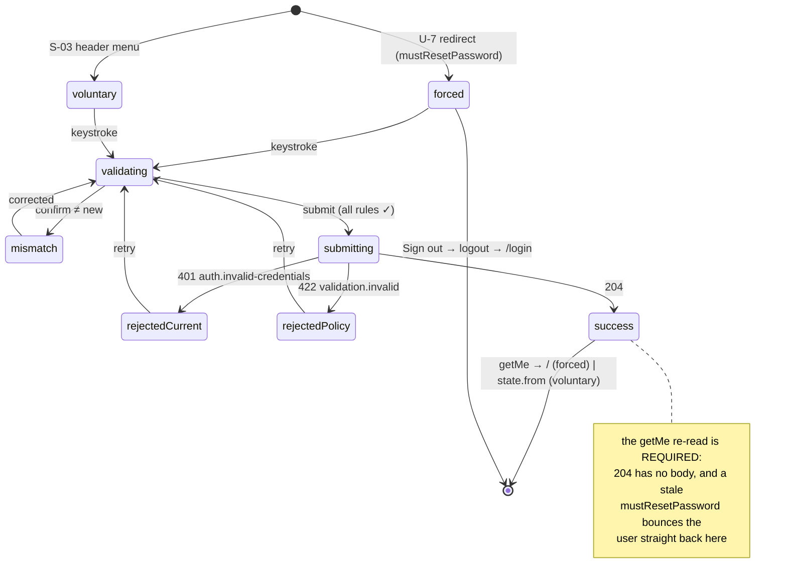

# S-02 Forced password reset / change password — approved wireframe & screen design

> Closes **W-1** in [screen-inventory §9](../screen-inventory.md#9-screens-needing-wireframe-approval)
> ("Forced password reset — no design; User Management only *adds* users today").
> Nothing in this document may be contradicted by a plan or by generated code; if
> it must change, that is a gate discussion, not an in-run improvisation
> ([frontend-conventions](../frontend-conventions.md) preamble).
>
> **Status:** approved 2026-08-04. Blocks: any realistic user-management demo —
> S-32/S-33 create users who land here. Sibling: [S-01](S-01-design.md).

---

## 0. Evidence base

| Source | What it fixed here |
|---|---|
| [screen-inventory §2 S-02](../screen-inventory.md) | The seven states, the data surface, and the two-column-or-collapse instruction |
| [screen-inventory §0.3](../screen-inventory.md) | U-1…U-7, especially **U-7** |
| [screen-inventory §8](../screen-inventory.md) | Every token used below, including `--modal-w` |
| [`contracts/openapi.yaml`](../../../contracts/openapi.yaml) | `changePassword`, `getMe`, `logout`, and the four gaps in §9 |
| [domain-model INV-U-3, INV-UI-2](../domain-model.md) | The reset is authenticated end-to-end; every imported user arrives here |
| [PRD LP-2](../../PRD.md) | *"Forced first-login reset **& change-password**"* — both halves are V1 |
| [behavioral-inventory B-42](../../discovery/behavioral-inventory.md) | The flow survives; its unauthenticated `/resetpass` endpoint does not. The legacy password regex is the parity baseline |
| [S-01 §3](S-01-design.md#3-the-on-screen-keyboard-host) | The keyboard host, inherited unchanged |
| `apps/panel/src/` | The Wave-0 scaffold this screen lands into |

**What this screen is for.** It closes B-42's hole. In the legacy system a user
who logged in with `flogin` falsy had their token withheld by the *UI* while the
new password went to `POST /api/admin/resetpass` — `settingsController.umUpUser`
mounted with **no auth middleware at all**, so anyone who knew a userid could
overwrite any local user's password. Here the whole flow is authenticated end to
end: the user holds a real token, the server refuses every other surface, and the
change goes to a bearer-authenticated route.

---

## 1. Constraints that are not design choices

**C-1. `currentPassword` is required, unconditionally.**
`ChangePasswordRequest.required` is `[currentPassword, newPassword]` with no
exemption for the forced path. See [S02-D-2](#11-decisions-taken-here).

**C-2. `changePassword` returns `204` — no body.** The cleared
`mustResetPassword` is observable **only** by re-reading `getMe`. Skipping that
read leaves `useAuth().mustResetPassword` true, and
`apps/panel/src/auth/require-role.tsx:25` bounces the user straight back here.

**C-3. Almost every surface is 403 while `mustResetPassword` is true.**
`openapi.yaml:33-35` exempts only `/auth/change-password` and `/auth/me`. So on
this screen there is no hall name, no device health, no alerts — and, until §9 #4
lands, no working logout.

**C-4. The keyboard is effectively always open.** Three password fields means the
user is typing from arrival to submit. Unlike S-01, this screen is designed for
the keyboard-open geometry as its *primary* state; the keyboard-closed case is
just the same card, centred lower.

**C-5. The U-7 redirect already exists** (`require-role.tsx:25`), and
`/login/reset` is already routed (`router.tsx:19`). This screen does not
reimplement the gate.

---

## 2. Wireframe

```
┌─────────────────────── .us-panel 1280×800 ────────────────────────┐
│                                                                   │
│      ┌──────────────────── 680 (--modal-w) ────────────────┐ y=12 │
│      │  Set a new password                     [ Sign out ]│  44  │
│      │  ─────────────────────────────────────────────────  │      │
│      │  ┌─── 380 ──────────────┐  ┌──── 236 ─────────────┐ │      │
│      │  │ CURRENT PASSWORD     │  │ Your account was     │ │      │
│      │  │ [••••••••••••••••]   │  │ created by an admin- │ │  60  │
│      │  │                      │  │ istrator. Choose a   │ │      │
│      │  │ NEW PASSWORD         │  │ password only you    │ │      │
│      │  │ [••••••••••••] [👁]  │  │ know.                │ │      │
│      │  │                      │  │                      │ │      │
│      │  │ CONFIRM NEW PASSWORD │  │ PASSWORD MUST        │ │  17  │
│      │  │ [••••••••••••••••]   │  │  ✓ be 8+ characters  │ │      │
│      │  │                      │  │  ✓ include a number  │ │ 5 ×  │
│      │  │ ┌ message slot ────┐ │  │  ○ include a capital │ │  24  │
│      │  │ │ (reserved, 40px) │ │  │  ✓ include a small…  │ │      │
│      │  │ └──────────────────┘ │  │  ○ match confirm     │ │      │
│      │  └──────────────────────┘  │                      │ │      │
│      │                            │ [   Set password   ] │ │  56  │
│      │                            └──────────────────────┘ │      │
│      └───────────────────────────────────────────────────┘ y=407 │
├──────────────────────────────────────────────────────────── y=420 │
│▓▓▓▓▓▓▓▓▓▓▓ react-simple-keyboard · 380px ▓▓▓▓▓▓▓▓▓▓▓▓▓▓▓▓▓▓▓▓▓▓▓▓│
└───────────────────────────────────────────────────────────────────┘

voluntary mode:  [ Sign out ] → [ Cancel ]   ·   right-column reason text omitted
```

**Height budget (OSK open, 420 px available):**

| Element | px |
|---|---|
| card padding (`--sp-10` × 2) | 48 |
| header row (title + Sign out, ≥44) | 44 |
| gap `--sp-7` | 16 |
| body = `max(left, right)` | 287 |
| **total** | **395** |

| Left column (380 px) | px | | Right column (236 px) | px |
|---|---|---|---|---|
| 3 × field (17 + 6 + 48) | 213 | | reason block, 4 lines `--fs-sm` | 60 |
| 2 × gap `--sp-5` | 24 | | gap `--sp-5` | 12 |
| — | — | | checklist heading | 17 |
| — | — | | gap `--sp-2` + 5 rules × 24 | 126 |
| — | — | | gap `--sp-7` | 16 |
| — | — | | submit | 56 |
| **total** | **237** | | **total** | **287** |

Top edge at `(420 − 395) / 2 = 12`, bottom at 407 — 13 px clear of the keyboard.

### 2.1 Why two columns, and why 680 px

The inventory states the constraint and offers two ways out: *"the layout must
either use a two-column card (rules beside fields) or collapse the checklist to a
single live line."* Two columns wins, and the collapse is unnecessary — because
the real fix is **width**. At 1280×800 horizontal space is free and vertical
space is not. Widening the card from S-01's 420 px to 680 px turns a form that
cannot fit into one with 25 px of slack, and 680 px is not a new number: it is
`--modal-w`, already in §8.7. Reusing it is what makes this screen read as part
of the same system as the prototype-derived ones.

### 2.2 Why the submit button is in the right column

It sits directly beneath the live checklist, so the rules read as the
precondition for the action immediately below them — the eye travels
*requirements → button* without crossing columns. It also leaves the left column
a clean three-field stack with nothing else competing in it, and it top-aligns
both columns at 237 vs 287 px without a stretched gap.

### 2.3 The forced/voluntary difference is three elements

| | `forced` | `voluntary` |
|---|---|---|
| Header action | **Sign out** | **Cancel** |
| Right-column reason text | shown | omitted (card shortens to 345 px) |
| On success | → `/` (S-04) | → the route it came from |

Everything else — three fields, the checklist, the submit, the message slot — is
identical. One component, one `mode` prop. There is **no skip, no dismiss, and no
route back to the dashboard** in `forced`; Sign out is not an escape from the
reset, it ends the session (§3).

---

## 3. Sign out on the forced screen

The forced state is specified as *"no escape hatch, no 'skip', no back to
dashboard"*. Sign out is none of those — it is the opposite of reaching the
dashboard. It exists because this is a **shared lecture-hall kiosk**: a lecturer
who starts a reset and walks away must not leave the panel unusable for the next
person until a token expires.

With §9 #4 landed, the control is real:

```
tap Sign out
  → POST /auth/logout            (204 — AuthSession genuinely revoked)
  → discard tokens client-side
  → Navigate /login  (no message: reason = "logout", the user meant to)
```

Without §9 #4 the call answers `403 auth.password-reset-required` and only the
client-side half is possible, leaving a live server session behind. **That is why
§9 #4 blocks Wave 1 rather than being a nice-to-have.**

---

## 4. Component breakdown

```
apps/panel/src/screens/reset/
  reset-screen.tsx      route component — mode, form values, submit, navigation
  reset-card.tsx        the two-column card. Presentation only
  password-policy.ts    the ONLY client mirror of the server rule
  policy-checklist.tsx  live ✓/○ per rule
  use-change-password.ts the mutation + the getMe re-read + the state union
apps/panel/src/auth/
  password-field.tsx    shared with S-01; `reveal` enabled on New password only
  auth-message.tsx      shared with S-01
```

| Unit | What it does | How you use it | What it depends on |
|---|---|---|---|
| `reset-screen.tsx` | Derives `mode` from `useAuth().mustResetPassword` — never from a prop or a URL, so the mode cannot disagree with the gate that sent the user here. Owns the three field values. | Route element for `/login/reset` | `use-change-password`, `useAuth` |
| `reset-card.tsx` | The 680 px two-column card with slots (`fields`, `reason`, `checklist`, `message`, `action`). Auth-blind. | `<ResetCard mode="forced" …>` | `--osk-h`, `--modal-w` |
| `password-policy.ts` | Exports `PASSWORD_RULES: { id, label, test }[]` — the client mirror of the server rule. **The checklist renders whatever this exports.** Changing the policy is a one-constant edit, never a relayout | `PASSWORD_RULES.map(r => r.test(pw))` | — |
| `policy-checklist.tsx` | Renders one row per rule with ✓/○ and `aria-live="polite"` | `<PolicyChecklist value={newPw} confirm={confirmPw}/>` | `password-policy` |
| `use-change-password.ts` | Calls `changePassword`, then **re-reads `getMe`** (**C-2**), then navigates. Maps `Problem` → per-field message | `const { state, submit } = useChangePassword(mode)` | `EduscopeClient`, `auth-context` |

`password-policy.ts` being the single source is the point of the whole
right-hand column: a checklist that can drift from the server is worse than no
checklist, because it promises acceptance it cannot deliver.

---

## 5. States

As with S-01, **no server state machine owns this screen**
([state-machines §8](../state-machines.md) line 918). It is governed by the
universal states and by **SM-R-2**.

| State | Entered by | Rendering | Governed by |
|---|---|---|---|
| `forced` | U-7 redirect from `require-role.tsx:25` | Sign out, reason text, no Cancel | **U-7**, INV-U-3, INV-UI-2, LP-2 |
| `voluntary` | S-03 header menu → `/login/reset` with `state.from` | Cancel, no reason text | LP-2 |
| `validating` | any keystroke in New | Checklist updates live; submit disabled until every rule is ✓ | — |
| `mismatch` | Confirm ≠ New | The `match confirm` row goes ○; message slot names it in words | — |
| `submitting` | submit tapped | Pending on submit; all three fields locked | **SM-R-2**, U-4 |
| `rejected` (current) | `401 auth.invalid-credentials` | Message beside **Current password**; that field cleared and refocused | U-5 |
| `rejected` (policy) | `422 validation.invalid` | Message beside **New password**; the checklist shows which rule the server disagreed on | U-5 |
| `success` | `204` → re-read `getMe` (**C-2**) | `forced` → `/`; `voluntary` → `state.from` | INV-U-3 |

**A server-side `422` should be unreachable.** If `password-policy.ts` mirrors
the server rule correctly, the client never submits a non-compliant password. The
state is implemented anyway, because a checklist that has silently drifted is
exactly the failure this state exists to make visible — and U-5 forbids a silent
no-op.

`U-2` on this screen means retrying the POST, as on S-01: there is no socket
while `mustResetPassword` is true.

### 5.1 State diagram



---

## 6. Copy deck

| Element | Copy |
|---|---|
| Title | **Set a new password** |
| Reason (`forced` only) | Your account was created by an administrator. Choose a password only you know. |
| Field labels | Current password · New password · Confirm new password |
| Checklist heading | PASSWORD MUST |
| Rule rows | be 8+ characters · include a number · include a capital letter · include a small letter · match confirm |
| `mismatch` | The two new passwords do not match. |
| `rejected` (current) | Your current password is not correct. |
| `rejected` (policy) | That password does not meet the requirements above. |
| Submit | **Set password** |
| Header action | **Sign out** (`forced`) · **Cancel** (`voluntary`) |

The reason line answers *why am I here* in one sentence. It is the difference
between a screen that feels like a lock and one that feels like an instruction —
and for an imported user (INV-UI-2) this is the very first thing the product
says to them.

---

## 7. Token usage

No new token. `--modal-w` is reused for the card width (§2.1).

| Element | Tokens |
|---|---|
| Backdrop | `--bg` |
| Card | `--surface`, `1px --border`, `--radius-panel`, `--shadow-lg`, `--sp-10` padding |
| Title | `--fs-2xl` / 800 |
| Header rule | `1px --border` |
| Header action | `--fs-sm` / 700, `--text-muted`, ≥44 px, `--radius-md` |
| Field label | `--fs-2xs` / 700 / uppercase / `--tracking-wide`, `--text-muted` |
| Input | 48 px, `--surface-2`, `1px --border`, `--radius-md`, `--fs-base` |
| Reveal button | 44 px, `--radius-md`, `--text-muted`, `aria-label` + `aria-pressed` |
| Reason block | `--fs-sm`, `--text-muted`, `--info-soft` background, `--radius-md` |
| Checklist heading | `--fs-2xs` / 700 / uppercase / `--tracking-caps`, `--text-faint` |
| Rule · met | `--success`, ✓ glyph |
| Rule · unmet | `--text-faint`, ○ glyph |
| Message · error | `--danger`, `--danger-soft`, `--fs-xs` |
| Submit | `--ink` / `#fff`, 56 px, `--radius-lg`, `--fs-md` / 700, `--shadow-md` |
| Column gap | `--sp-9` (20 px) |

`--danger`/`--danger-soft` and `--info`/`--info-soft` are the two §8.2 additions
pending wireframe approval; approving this document and S-01 closes that item.

---

## 8. Touch, kiosk & accessibility

- Inputs 48 px, submit 56 px, reveal 44 px, header action 44 px — all ≥ `--tap-min`.
- Current password is autofocused on mount, so the keyboard is open before first
  paint and the card renders in its final geometry (no shift).
- **Rule state is never carried by colour alone.** Each row has a ✓/○ glyph as
  well as a colour, and the checklist is `aria-live="polite"` so a change is
  announced, not merely coloured.
- **The reveal button is on *New password* only.** That is the one field where a
  typo is unrecoverable — the user is inventing a string on an on-screen
  keyboard and will be locked out by it, and the confirm field can say *that* they
  mistyped but never *what* they typed. It is an explicit ≥44 px button (never
  hover-triggered), defaults to hidden, and auto-hides on blur and after 10 s.
- **`autoComplete="off"` on all three fields**, as on S-01 (S01-D-6).
- Password fields are `type="password"` toggled only by that explicit button —
  never by hover, per the inventory's touch note.
- 8 px minimum separation between Sign out and every other target (§0.4).
- Page never scrolls; the card fits.

---

## 9. Contract changes this design requires (v0.2)

Two, additional to [S-01 §9](S-01-design.md#9-contract-changes-this-design-requires-v02)'s
two. Both **block Wave 1**. They belong in
[screen-inventory §10](../screen-inventory.md#10-contract-gaps) as CG rows; this
document names them, it does not edit §10.

| # | Change | Why | Decided by |
|---|---|---|---|
| **3** | `ChangePasswordRequest.newPassword` — enforce **≥8 characters + at least one digit, one uppercase, one lowercase** server-side. The schema currently carries `minLength: 8` and nothing else | This is legacy parity: B-42 enforced exactly this regex. Shipping the contract as written would be a deliberate security regression against the system being replaced. The server rule and `password-policy.ts` must be identical or the checklist promises acceptance it cannot deliver | [S02-D-1](#11-decisions-taken-here) |
| **4** | §Auth prose — add `/auth/logout` to the `mustResetPassword` exemption list, alongside `/auth/change-password` and `/auth/me` | Revoking your own session is not a surface the reset lock protects: the lock exists to stop a half-provisioned account **reaching** the dashboard, and logging out is the opposite of that. Without it, Sign out (§3) cannot revoke and an abandoned kiosk carries a live session | [S02-D-3](#11-decisions-taken-here) |

---

## 10. Mock & scenario work Wave 1 inherits

| Gap | Where | Fix |
|---|---|---|
| `changePassword` validates nothing but the current password — it will accept `"a"` as a new password, so `rejected (policy)` is unreachable | `packages/api-client/src/mock/rest/auth.ts:88-103` | Validate `newPassword` against the same rule `password-policy.ts` uses, throwing `422 validation.invalid` |
| `logout` is not gated on `mustResetPassword`, so the mock cannot demonstrate either side of §9 #4 | `mock/rest/auth.ts:79-84` | Follow whichever way #4 resolves — and only that way |
| No scenario script exercises an auth failure | `mock/scenario/scripts/` | **Extend, never fork** the catalog. The hook already exists: `engine.onCommand('changePassword')` at `mock/rest/auth.ts:89` |
| The seeded forced-reset user is already correct | `mock/seed/users.ts:34-44` — `n.silva`, `mustResetPassword: true`, credential `temp-pass-1` | No change; this is the demo account for the whole flow |

---

## 11. Decisions taken here

| Id | Decision | Rationale | Cost to reverse |
|---|---|---|---|
| **S02-D-1** | The password policy is **legacy parity**: ≥8 + digit + uppercase + lowercase (5 checklist rows, counting `match confirm`) | B-42 enforced exactly this. No security regression against the system being replaced, and no retraining — these users already meet this rule today. The alternative, taking `minLength: 8` literally, would weaken the product in a way any comparison review would find | Low in the UI (`password-policy.ts` is one constant); medium in the server |
| **S02-D-2** | **Three fields on both paths** — the forced path re-types the current password | The contract requires `currentPassword` (**C-1**). Replaying the password captured at S-01 would hold plaintext in JS memory across a route transition on a shared kiosk, *and* would still need the three-field form as a fallback for a reload or a restored token — so it builds both forms to save one field. One component, one `mode` prop | Low |
| **S02-D-3** | The forced screen carries **Sign out**, and `/auth/logout` is exempted so it genuinely revokes | §3. A shared kiosk must not be dead until a token expires. Sign out is not an escape from the reset — it ends the session | Low in the UI; one prose line in the contract |
| **S02-D-4** | Password reveal on **New password only**, not on Current, Confirm, or anything on S-01 | It is the only field where a typo is unrecoverable and the confirm field cannot diagnose it. Every other placement adds bystander exposure in a lecture hall for no ergonomic gain | Low |
| **S02-D-5** | Two-column card at **680 px** (`--modal-w`), not a collapsed one-line checklist | §2.1 — width is free at 1280×800, height is not, and reusing an existing layout constant is what keeps this screen native beside the prototype-derived ones | Low |
| **S02-D-6** | Submit lives at the bottom of the **right** column, under the checklist | §2.2 — requirements read directly into the action | Low |
| **S02-D-7** | `success` **always re-reads `getMe`** before navigating | **C-2** — `204` has no body, and a stale `mustResetPassword` sends the user straight back here via `require-role.tsx:25` | Low |
| **S02-D-8** | The `voluntary` path is entered from a new **S-03 header user menu**, not from Advanced and not dropped | LP-2 is titled *"Forced first-login reset **& change-password**"*, so dropping the voluntary half drops a named V1 capability. The header already hosts logout and already shows the user, so one control becomes a two-row menu rather than new chrome appearing somewhere else. See [§12](#12-requirements-this-screen-places-on-other-screens) | Low — one menu |

---

## 12. Requirements this screen places on other screens

- **S-03 must render no header on `/login/reset`.** By **C-3** the hall name is
  403 while `mustResetPassword` is true, so the header cannot be populated. The
  Sign out control lives in the card (§3), not in absent chrome.
- **S-03 gains a header user menu** ([S02-D-8](#11-decisions-taken-here)). S-02
  specifies a `voluntary` path "reached from the header menu", but S-03 currently
  enumerates only a logout control. The user name becomes a `▾` menu with two
  ≥56 px rows — **Change password** → `/login/reset` carrying `state.from`, and
  **Sign out**:

  ```
  ┌─ S-03 header · 62px ──────────────────────┐
  │ [logo]  Hall A            14:32  A. Perera ▾│
  └─────────────────────────────────────────────┘
                                  ┌─────────────┐
                                  │ Change      │ 56px
                                  │ password    │
                                  │ Sign out    │ 56px
                                  └─────────────┘
  ```
- **S-32 / S-33** create users with `mustResetPassword: true` (INV-UI-2); their
  demo path terminates on this screen, so neither can be demonstrated end to end
  before this screen exists.

---

## 13. Testing floor

- **Testing Library:** one rendering test per row of §5 — eight, plus both modes.
- **Policy mirror:** a test asserting `password-policy.ts` and the mock's
  `changePassword` validator accept and reject **the same set** of inputs. If
  these two ever disagree, the checklist is lying, and that is the one defect
  this screen cannot tolerate.
- **Geometry:** an assertion that with `--osk-h: 380px` the submit button's
  bottom edge is ≤ 404 px, in both `forced` (5 rules + reason) and `voluntary`.
- **The `getMe` re-read:** a test that a `204` followed by a stale
  `mustResetPassword` does **not** navigate — the regression this guards against
  is an infinite redirect loop between here and `require-role.tsx:25`.
- **Playwright:** the primary journey (login as `n.silva` → forced reset →
  dashboard), plus `rejected (current)` as the failure scenario.
- **Contract honesty:** every mocked response validates against the `contracts/`
  zod schemas, including §9's two additions.
