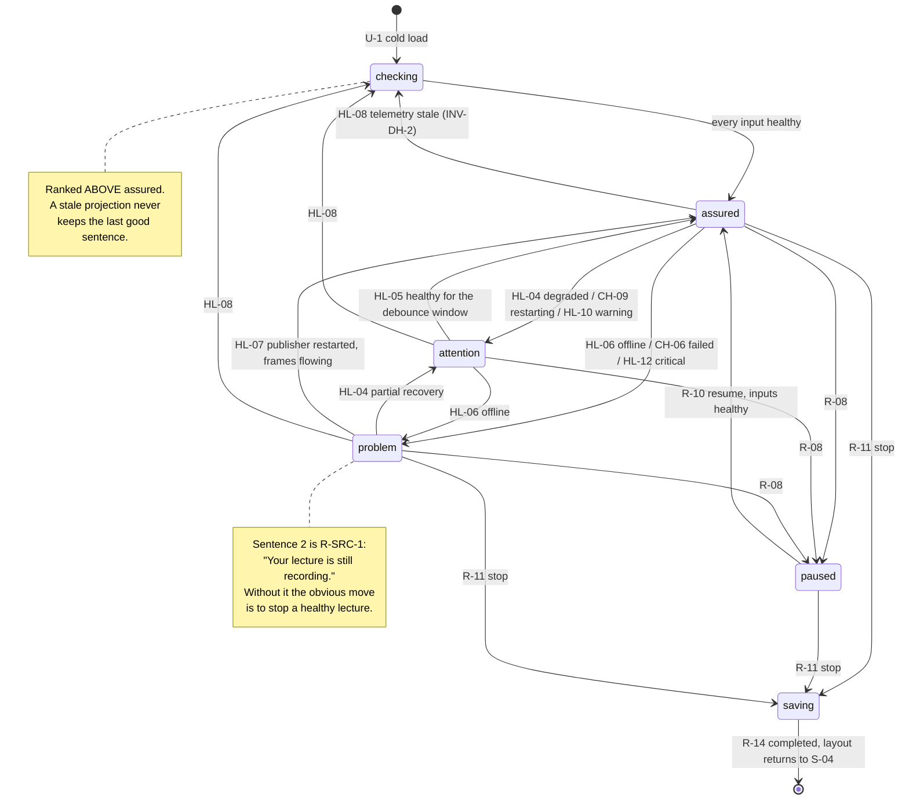

# S-05 Dashboard — the `ai disabled` layout — approved wireframe & screen design

> Closes **W-14** in [screen-inventory §9](../screen-inventory.md#9-screens-needing-wireframe-approval)
> ("with the AI flag off the main column is empty; what replaces it is
> undesigned"). Nothing in this document may be contradicted by a plan or by
> generated code; if it must change, that is a gate discussion, not an in-run
> improvisation ([frontend-conventions](../frontend-conventions.md) preamble).
>
> **Status:** proposed 2026-08-05, Wave 2 design gate. Blocks: Wave 2.
> Sibling: [S-11](S-11-placeholders-design.md) — its bar redesign is what makes
> this screen's vertical floor 388 px rather than 330 px (§1 **C-2**).
>
> **This is not an edge case.** INT-10 makes `aiQuizEnabled = false` the
> **go-live default** for recording-first rooms, so this is the layout most
> rooms will actually run for most of their first year. It is designed as a
> first-class layout, not a fallback.

---

## 0. Evidence base

| Source | What it fixed here |
|---|---|
| [screen-inventory §2 S-05](../screen-inventory.md) | The composition, the 430 px right column, the `ai disabled` state, the vertical-budget rule, and the *"source/output confidence view"* suggestion this design **accepts and reframes** |
| [screen-inventory §2 S-04](../screen-inventory.md) | The idle layout this one replaces, and its "a disabled control always shows its reason inline" rule |
| [screen-inventory §2 S-08](../screen-inventory.md) | The meeting card that inherits the sidebar's freed space (§3) |
| [screen-inventory §2 S-09 / S-10](../screen-inventory.md) | The tile vocabulary (`online`/`degraded`/`offline`/`unknown`/`unbound`), the 152 px tile, and the preview lightbox this screen's tiles open |
| [screen-inventory §2 S-13](../screen-inventory.md) | `unavailable` — the studio is **hidden**, "not shown greyed". This design does not re-open that ruling |
| [screen-inventory §3 S-16 / S-17](../screen-inventory.md) | The insights card that can never fill in this layout (§3) |
| [screen-inventory §0.3, §0.4](../screen-inventory.md) | U-1…U-7 and the kiosk rules, inherited rather than restated |
| [screen-inventory §8](../screen-inventory.md) | Every token used below; **no new colour, size or spacing value** |
| [state-machines §3.1](../state-machines.md) | Machine 2a never leaves `unavailable` with the flag off — *"flipping the flag off must not affect recording in any way"* (INV-DP-4, LP-18) |
| [state-machines §6.1 HL-01…HL-09](../state-machines.md) | Per-role health, and **INV-DH-2**: stale telemetry reads `unknown`, never the last healthy value |
| [state-machines §6.2 R-SRC-1](../state-machines.md) | *A dead source never ends a lecture* — the sentence §2.4 has to say out loud |
| [state-machines §6.3 HL-10…HL-14](../state-machines.md) | Storage pressure, and **INV-RP-1**: warning text is generated from `RetentionPolicy`, never hardcoded |
| [state-machines §2.2 CH-01…CH-10](../state-machines.md) | Channel runtime states, and *"the switch must never read ON for a dead consumer"* |
| [state-machines §8](../state-machines.md) | The prototype→machine hand-check, including the row that already anticipates a *"studio unavailable"* surface |
| [`contracts/openapi.yaml`](../../../contracts/openapi.yaml) v0.2.0 | `getProvisioning`, `getSourcesStatus`, `listChannels`, `listLayoutPresets`, `getStorageOverview`, `RetentionPolicy` — **all of it already exists**, which is why §9 is empty |
| [`contracts/events.md`](../../../contracts/events.md) | `sources.status`, `channel.state`, `storage.status`, `recording.state` |
| [PRD INT-10, PF-20](../../PRD.md) | Per-room feature flag; recording go-live is independent of AI/quiz enablement |
| [PRD LP-18](../../PRD.md) | *"the AI studio is hidden or shows an unavailable state; recording is never affected"* |
| [PRD G-1, G-2, G-5](../../PRD.md) | Never silently lose a lecture; recording feels safe to a non-technical lecturer; zero placebo controls |
| [behavioral-inventory B-12](../../discovery/behavioral-inventory.md) | The silent-success class — a UI that claims a healthy state it has not verified. §2.3's aggregation rule is its inversion |
| [behavioral-inventory B-53](../../discovery/behavioral-inventory.md) | Warned at 70 % about an 80 % policy. §2.5 quotes the real policy or says nothing |
| `prototype/src/App.tsx`, `styles/app.css` | `.us-main` (14/18 padding, `overflow: hidden` backstop), `.us-session`, `.us-sidebar` 430 px, `.us-insightswrap`, `.us-srctile` 152 px, and the **independent** `sourcesOpen` / `controlsOpen` flags that make §1 **C-2** true |
| `prototype/CLAUDE.md` | "no Live Streaming card and no Local Capture card on the dashboard" — a constraint this design does not get to relax |

---

## 1. Constraints that are not design choices

**C-1. The AI flag is readable by a lecturer, today.** `getProvisioning` carries
`featureFlags.aiQuizEnabled` and `llmEndpoint`, and the operation declares **no**
`x-required-role` — so `G-AI-ENABLED` resolves client-side from data the panel
already fetches for the hall name. Nothing has to be invented to *know* which
layout to render. This is the single reason [§9](#9-contract-changes-this-design-requires)
is empty.

**C-2. The vertical budget is a range, not a number.** `App.tsx:41-42` holds
`sourcesOpen` and `controlsOpen` as **independent** state, and `.us-main` carries
`overflow: hidden` as a *backstop* (`app.css:459`) — meaning the prototype clips
rather than solves this. Measured, with [S-11](S-11-placeholders-design.md)'s
redesigned room bar:

| Bars | Room bar | Sources bar | Bars total | **Main column** |
|---|---|---|---|---|
| both collapsed | 54 | 54 | 108 | **602 px** |
| sources open | 54 | 154 | 208 | 502 px |
| room open | 168 | 54 | 222 | 488 px |
| **both open** | 168 | 154 | 322 | **388 px** |

`800 − 62 (--header-h) − 28 (--sp-6 × 2) − bars`. **388 px is the design floor**
and every number in §2 is checked against it. No new mutual-exclusion rule is
invented for the two bars — inventing one would change S-09 and S-11 to save a
card that can simply be designed to fit.

**C-3. The right column empties too.** S-16 and S-17 derive entirely from
publications and responses. With `aiQuizEnabled = false`, machine 2a never leaves
`unavailable` (§3.1), no `QuestionSet` is ever created, no publication is ever
opened, and no quiz session exists. The insights card is therefore not *empty* —
it is **unfillable**. Designing only the main column would leave S-05 half-drawn
and re-open W-14 at Wave 4.

**C-4. `unknown` is a real state and it outranks optimism.** HL-08 sends any role
to `unknown` when telemetry goes stale, and INV-DH-2 requires it to read
"checking", **never the last healthy value**. Any summary this screen renders is
constrained by that before it is constrained by taste.

**C-5. A dead source does not stop the lecture.** R-SRC-1: the record consumer is
not terminated when a source disappears; the compositor is fed a placeholder and
*"the lecture keeps growing"*. A confidence screen that reports a failed camera
without reporting that fact would cause the exact harm it exists to prevent — a
lecturer stopping a healthy recording.

**C-6. The dashboard may not grow cards.** The prototype's CLAUDE.md states there
is deliberately **no** Live Streaming card and **no** Local Capture card here.
This design surfaces channel *state* as rows inside one card; it does not
reintroduce the cards that decision removed.

---

## 2. Wireframe

One card fills the main column: **Capture Assurance**. It answers the only
question a lecturer with no AI studio has — *is this lecture being captured, and
is it safe?* — as a verdict followed by the evidence behind it.

Main column width: `1280 − 36 (--sp-8 × 2) − 430 (--sidebar-w) − 16 (gap) = 798 px`.

### 2.1 Comfortable density (main column ≥ 480 px)

```
┌─ 798 × 602 · --surface · --radius (16) · --shadow-sm · --sp-6 pad ──┐
│                                                                      │
│  RECORDING · HALL A                        --fs-2xs/700/caps/faint   │
│  Everything this lecture needs              --fs-2xl/800/--text      │
│  is working                                                          │
│                                                                      │
│  CAPTURING                                          --fs-2xs/caps    │
│  ┌──────────────┐   ┌──────────────┐   ┌──────────────┐              │
│  │              │   │              │   │              │  tap → S-10  │
│  │   248 × 140  │   │              │   │              │  ≥44px ✓     │
│  │              │   │              │   │              │              │
│  └──────────────┘   └──────────────┘   └──────────────┘              │
│   ● PC               ● CAM 1            ● CAM 2      --fs-md/700     │
│     Live               Live               Live       --fs-sm/muted   │
│                                                                      │
│  SAVING TO                                                           │
│  ┌────────────────────────────────────────────────────────────┐ 44   │
│  │ ▪ This device — side by side                    Recording  │      │
│  ├────────────────────────────────────────────────────────────┤ 44   │
│  │ ▪ Live Meeting                                  Off        │      │
│  └────────────────────────────────────────────────────────────┘      │
│                                                                      │
│  DISK                                                                │
│  ████████████████████████░░░░░░░░░  418 GB free of 1.8 TB            │
│  Recordings are deleted 14 days after they upload.  ← GENERATED      │
│                                                                      │
└──────────────────────────────────────────────────────────────────────┘
```

**Height at 602 px.** `--sp-6` × 2 padding 28 + verdict block 76 + `--sp-7` 16 +
(label 15 + `--sp-3` 8 + tile 140 + `--sp-3` 8 + caption 44) 215 + 16 + (label 15
+ 8 + 44 + 8 + 44) 119 + 16 + (label 15 + 6 + bar 10 + 6 + 2 lines 40) 77 =
**563 px**, leaving 39 px that widens the three gaps. Tiles are
**width**-constrained at `(798 − 28 − 24)/3 = 248 px` → 140 px tall at 16:9, so
they never grow past the column's shape.

**The external tile caption is the point of the comfortable density.** S-09's
`.us-srctile__label` is a 10.5 px mono chip overlaid on the video — legible at
arm's length, invisible at three metres. Below the 11 px floor and inside the
image, it can never be the read-across-a-room carrier. The 44 px caption strip
here is `--fs-md`/700 for the role and `--fs-sm` for the health word, outside the
image, on `--surface`.

### 2.2 Dense density (main column < 480 px, floor 388 px)

Reached when both bottom bars are open (**C-2**).

```
┌─ 798 × 388 ─────────────────────────────────────────────────────────┐
│  RECORDING · HALL A                                                  │
│  Everything this lecture needs is working        one line, --fs-xl   │
│                                                                      │
│  CAPTURING                                                           │
│  ┌────────┐ ┌────────┐ ┌────────┐   152 × 86 — S-09's proven floor   │
│  │ ●  PC  │ │ ● CAM1 │ │ ● CAM2 │   label returns to the overlay     │
│  └────────┘ └────────┘ └────────┘                                    │
│                                                                      │
│  SAVING TO                                                           │
│  ▪ This device — side by side                       Recording   44   │
│  ▪ Live Meeting                                     Off         44   │
│                                                                      │
│  DISK   418 GB free · deleted 14 days after upload   one line        │
└──────────────────────────────────────────────────────────────────────┘
```

`28 + 46 + 12 + 109 + 12 + 119 + 12 + 40 = 378 px` in 388. Fits.

**The collapse order is fixed, and nothing is ever removed:**

| Order | What condenses | What is never lost |
|---|---|---|
| 1 | Disk block → one line, progress bar dropped | The free figure **and** the policy sentence |
| 2 | Tiles → 152 × 86, caption returns to the overlay label | Role name, health dot, tap target |
| 3 | Verdict → one line at `--fs-xl` | The full sentence; it wraps rather than truncates |
| — | **`SAVING TO` never condenses** | A channel row you cannot see is a channel a lecturer assumes |

Condensation is not omission. Every fact present at 602 px is present at 388 px;
only its typography and chrome change. A screen that hides a fact when the room
bar opens would make the room bar a way to lose information.

### 2.3 The verdict, and the rule that governs it

The verdict is a **computed sentence, not a badge**, and it obeys one rule:

> **The verdict is never greener than its worst input.**

This is B-12 inverted. B-12's defect class is a UI that reports success it has not
verified; an aggregate "all good" over a stale projection is that same defect
wearing a friendlier sentence. The aggregation is therefore a strict worst-case
fold over four machines, with `unknown` ranked **above** `online` in severity, not
below it:

| Tier | Any input in this state | Verdict | Chrome |
|---|---|---|---|
| 4 · problem | 5a `offline` (HL-03/HL-06) · 1c `failed` (CH-06) · 5b `critical` (HL-12) | Names the thing, then **C-5**'s reassurance | `--danger`, `--danger-soft` |
| 3 · attention | 5a `degraded` (HL-04) · 1c `restarting` (CH-09) · 5b `warning` (HL-10) | Names the thing | `--warning` |
| 2 · checking | 5a `unknown` (HL-08) · U-1 cold · U-2 after `T-WS-STALE` | "Checking the room…" | `--text-muted`, no colour claim |
| 1 · assured | every enabled role `online`, every enabled channel `on`/`recording`, 5b `ok` | "Everything this lecture needs is working" | `--success` dot only |

Tier 2 sitting **above** tier 1 is the load-bearing part. A panel whose telemetry
has gone stale must not keep displaying the last good sentence — that is
literally INV-DH-2, and it is the difference between a confidence instrument and
a decoration.

`mic-lecturer` at `offline` is ranked **critical** by §6.2 ("a silent lecture is
bad, so this is impossible to miss") and is therefore always the sentence that
wins when several inputs are equally bad.

### 2.4 `problem` — the state the card exists for

```
┌─ 798 × 602 ──────────────────────────────────────────────────────────┐
│  RECORDING · HALL A                                                   │
│  CAM 1 has no signal.                        --fs-2xl/800/--danger    │
│  Your lecture is still recording.            --fs-lg/700/--text       │
│                                                                       │
│  CAPTURING                                                            │
│  ┌──────────────┐   ┌──────────────┐   ┌──────────────┐               │
│  │              │   │  ░░░░░░░░░░  │   │              │               │
│  │              │   │  no signal   │   │              │  not tappable │
│  └──────────────┘   └──────────────┘   └──────────────┘               │
│   ● PC               ○ CAM 1            ● CAM 2                       │
│     Live               No signal         Live       --danger          │
│         ▲ promoted: the failing tile keeps its position, and the       │
│           row order never changes — a moving tile is a second problem  │
└───────────────────────────────────────────────────────────────────────┘
```

Two sentences, in this order, and the order is not cosmetic. The first names the
fault; the second is **C-5** spoken aloud. A lecturer who sees a red camera and
no second sentence has one obvious move — stop the lecture and find help — and
that move destroys the thing R-SRC-1 was built to protect. The reassurance is not
reassurance; it is the operative instruction.

The failing tile is **promoted by treatment, never by position**. Reordering
tiles so the broken one leads would mean the trio changes shape under stress,
which is when a lecturer can least afford to re-read a layout.

### 2.5 The disk block

```
  DISK
  ████████████████████████░░░░░░░░░  418 GB free of 1.8 TB
  Recordings are deleted 14 days after they upload.
```

- **Bytes, not hours.** No bitrate figure is reachable by this screen —
  `getEncoderSettings` is an admin surface, and even it describes intent rather
  than achieved rate. "≈ 4 h 20 m left" would be a fabricated number on the one
  card whose entire job is to be trustworthy. Recorded as
  [CG-18](../screen-inventory.md#10-contract-gaps), closed on arrival.
- **The sentence is generated from `RetentionPolicy`**, never written into the
  component: `maxAgeDays`, `earlyDeleteOrder`, `neverDeleteUnuploaded`. INV-RP-1
  exists because B-53 warned at 70 % about an 80 % policy — a hardcoded sentence
  here would re-commit that defect in a nicer font.
- The bar is a **fill indicator, not a threshold gauge**: it carries no tick at
  `warningThresholdPct`, because the pressure state is already the verdict's
  input and a second rendering of it would let the two disagree.

### 2.6 What this card is not

- **Not an operator dashboard.** The persona is a non-technical lecturer (G-2).
  Four blocks, one sentence each, is the ceiling. Every candidate addition —
  CPU, temperature, segment count, encoder bitrate, publisher restart counts —
  was rejected: they belong to S-36 and S-34, where an admin is looking for them.
- **Not a second transport.** Elapsed time, Pause, Resume and Stop stay in S-07
  in the sidebar. Rendering the clock twice would be two truths on one screen,
  and moving S-07 would give one approved screen two geometries to build and test
  in the same wave.
- **Not video.** The tiles are status surfaces that open S-10 on tap
  ([S05-D-4](#11-decisions-taken-here)).
- **Not dark.** See [S05-D-5](#11-decisions-taken-here).

---

## 3. The sidebar — the second half of the hole

With `aiQuizEnabled = false` the 430 px column loses its third card (**C-3**).

```
   AI ENABLED (S-05 as approved)        AI DISABLED (this design)
  ┌──────────────┬──────────┐          ┌──────────────┬──────────┐
  │              │ S-07     │          │              │ S-07     │
  │              │ Timer    │          │              │ Timer    │
  │  S-13        ├──────────┤          │  Capture     ├──────────┤
  │  AI Studio   │ S-08     │          │  Assurance   │ S-08     │
  │  (ink)       │ Meeting  │          │  (light)     │ Meeting  │
  │              ├──────────┤          │              │          │
  │              │ S-16/17  │          │              │ accordion│
  │              │ Insights │          │              │ open by  │
  │              │ (ink)    │          │              │ default  │
  └──────────────┴──────────┘          └──────────────┴──────────┘
       798            430                   798            430
```

**`.us-insightswrap` is not rendered.** Not collapsed, not empty-stated —
absent. An empty-state card that says "questions you send will appear here" in a
room where no question can ever be sent is a promise the room cannot keep, and
sits one step from the placebo class G-5 forbids.

**S-08 takes the slack** (`flex: 1 1 auto`) and its layout accordion **defaults
to open**, because the only thing that competed with it for that space is gone.
S-05's mutual-exclusion rule — *"only one of the two is fully open at a time…
must survive any redesign"* — survives **verbatim**; it simply has no second
participant in this layout. Nothing about `.us-insightswrap--collapsed` is
changed, deleted, or reimplemented; it is not mounted.

The accordion stays **collapsible**. At the 388 px floor, S-07 (~200) + S-08 with
the accordion open (~290) exceeds the column, so the lecturer must still be able
to close it. Default-open is a default, not a lock.

**Nothing new is built for the sidebar.** The freed space is absorbed by an
existing card, which is why §4 lists no sidebar component.

---

## 4. Component breakdown

```
apps/panel/src/screens/session/
  capture-assurance-card.tsx    the main-column card; owns density only
  capture-verdict.tsx           the sentence + its chrome
  capture-sources-row.tsx       three role tiles → S-10
  capture-outputs-row.tsx       one row per enabled channel
  capture-disk-row.tsx          free bytes + the generated policy sentence
  use-capture-assurance.ts      the §2.3 worst-case fold — the ONE place it lives
  use-ai-enabled.ts             G-AI-ENABLED from getProvisioning (C-1)
```

| Unit | What it does | How you use it | What it depends on |
|---|---|---|---|
| `use-ai-enabled.ts` | Resolves `G-AI-ENABLED` = `featureFlags.aiQuizEnabled && llmEndpoint !== null`. Nothing else in the panel may compute this | `const aiEnabled = useAiEnabled()` | `getProvisioning` via TanStack Query |
| `use-capture-assurance.ts` | Folds 5a rows, 1c states and 5b pressure into `{ tier, subject, sentence }` by §2.3's ranking. **Pure**, exported, and directly unit-testable | `const verdict = useCaptureAssurance()` | `selectors.ts` atomic WS reads |
| `capture-verdict.tsx` | Renders the tier's chrome and sentence(s). Holds no logic — swapping the fold changes the verdict everywhere | `<CaptureVerdict/>` | `use-capture-assurance` |
| `capture-sources-row.tsx` | Three tiles in role order `pc`, `cam1`, `cam2` (fixed, §2.4), each opening S-10. `unbound` roles are not rendered (HL-01) | `<CaptureSourcesRow/>` | `sources.status`, `useOverlays` |
| `capture-outputs-row.tsx` | One row per channel from `listChannels`, preset name resolved through `listLayoutPresets`. `local` is always present (INV-CC-1) | `<CaptureOutputsRow/>` | `listChannels`, `channel.state` |
| `capture-disk-row.tsx` | Free/total and the sentence generated from `RetentionPolicy` (INV-RP-1) | `<CaptureDiskRow/>` | `getStorageOverview`, `storage.status` |
| `capture-assurance-card.tsx` | Composition + the §2.2 density switch. Owns no data | mounted by S-05 when `!aiEnabled` | the five above |

**The fold is a hook, not a component**, because §2.3 is the one rule in this
screen that can be wrong in a way nobody notices — a verdict that reads "working"
over a stale projection looks perfectly fine in a screenshot. Keeping it pure
means the ranking is asserted directly rather than inferred from rendered text.

**S-05 chooses the layout; it does not fork.** One `useAiEnabled()` at the top of
the session view picks between `<QuestionAssistant/>` and
`<CaptureAssuranceCard/>`, and between mounting `.us-insightswrap` or not.
Everything else in S-05 — chrome, transport, meeting card, both bottom bars — is
shared, so the two layouts cannot drift into two screens.

---

## 5. States

The card composes four machines and owns none. Nothing here is a persisted
state; all of it is a projection (SM-R-2).

| # | State | Entered by | Rendering | Governed by |
|---|---|---|---|---|
| 1 | `assured` | every enabled role `online`, every enabled channel `on`/`recording`, 5b `ok` | §2.1; tier 1 | HL-02, CH-05, §2.3 |
| 2 | `attention` | any role `degraded` (HL-04) · channel `restarting` (CH-09) · 5b `warning` (HL-10) | Verdict names the subject; that tile/row gains `--warning` | §2.3 tier 3 |
| 3 | `problem` | any role `offline` (HL-03/HL-06) · channel `failed` (CH-06) · 5b `critical` (HL-12) | §2.4 — two sentences, the second being **C-5** | §2.3 tier 4, **R-SRC-1** |
| 4 | `problem (mic)` | `mic-lecturer` `offline` | Same as 3, and **always wins** ties | §6.2 — ranked critical |
| 5 | `checking` | any role `unknown` (HL-08) | "Checking the room…" — never the last healthy sentence | **INV-DH-2**, §2.3 tier 2 |
| 6 | `paused` | 1a `paused` (R-08) | Amber chrome from S-03. Tiles stay live — publishers are device-lifetime (§6.1) — and the verdict reads "Paused" | R-08/R-09 |
| 7 | `stopping / finalizing` | 1a `stopping`/`finalizing` (R-11) | Card freezes at its last values; verdict becomes "Saving your lecture". Tiles stop being tappable | R-11→R-14, INT-5 |
| — | U-1 | cold load | Skeleton **in the card's own shape**: four blocks, verdict at tier 2. Never a spinner, never layout shift | §0.3 |
| — | U-2 | `T-WS-STALE` | Live regions dim; after the stale window the verdict **degrades to tier 2**, it does not hold tier 1. The recording frame is kept | §0.3, C-4 |
| — | U-3 | `seq` gap | Full snapshot re-request; must not flash populated→skeleton→populated for unchanged rows | events.md §1 |
| — | U-4 / U-5 | — | **Do not apply.** The card issues no command; it has no control on it | §0.3 |

U-4 and U-5 being inapplicable is worth stating rather than omitting: this is a
**read-only** card in a product whose universal states assume controls. The
absence of any command surface is the reason the whole card is safe to render
during `stopping`, when every transport control is disabled.

### 5.1 State diagram



---

## 6. Copy deck

Plain language, no codes (§0.4 Class A). Every sentence below is a constant, not
a template assembled at the call site.

| Where | Copy |
|---|---|
| Eyebrow | RECORDING · *HALL A* (`PAUSED · HALL A` when 1a `paused`) |
| Verdict · `assured` | Everything this lecture needs is working |
| Verdict · `checking` | Checking the room… |
| Verdict · `attention` (source) | *CAM 1* is reconnecting. |
| Verdict · `attention` (storage) | The disk is filling up. |
| Verdict · `problem` (source), line 1 | *CAM 1* has no signal. |
| Verdict · `problem` (mic), line 1 | The microphone has no signal — this lecture is recording silence. |
| Verdict · `problem` (channel), line 1 | *Live Meeting* stopped. |
| Verdict · `problem`, line 2 | **Your lecture is still recording.** |
| Verdict · `paused` | Paused — nothing is being recorded right now. |
| Verdict · `stopping` | Saving your lecture… |
| Section labels | CAPTURING · SAVING TO · DISK |
| Tile health | Live · Reconnecting · No signal · Checking |
| Channel state | Recording · On · Off · Starting · Reconnecting · Stopped |
| Disk figure | *418 GB* free of *1.8 TB* |
| Disk policy | Recordings are deleted *14* days after they upload. *(generated)* |

Two deliberate choices:

- **"this lecture is recording silence"** for a dead mic. §6.2 ranks it critical
  precisely because the failure is invisible — the picture looks perfect. The
  sentence has to carry what the screen cannot show.
- **"nothing is being recorded right now"** for `paused`. The prototype's timer
  card says "Recording paused", which is accurate and still lets a lecturer
  believe audio is being captured. Pause stops the consumer (A-12); saying so is
  free.

---

## 7. Token usage

**No new token.** Every value is from [§8](../screen-inventory.md#8-design-token-sheet).

| Element | Tokens |
|---|---|
| Card | `--surface`, 1 px `--border`, `--radius` (16), `--shadow-sm`, `--sp-6` padding |
| Eyebrow | `--fs-2xs` / 700 / uppercase / `--tracking-caps`, `--text-faint` |
| Verdict · comfortable | `--fs-2xl` / 800, `--tracking-tight` |
| Verdict · dense | `--fs-xl` / 800 |
| Verdict line 2 (`problem`) | `--fs-lg` / 700, `--text` — **not** `--danger`; the reassurance must not read as part of the alarm |
| Verdict chrome · tier 1 | `--success` dot only; no fill |
| Verdict chrome · tier 2 | `--text-muted`; **no colour** — "checking" is not a claim |
| Verdict chrome · tier 3 | `--warning`, `--warning` at 12 % as the block tint |
| Verdict chrome · tier 4 | `--danger`, `--danger-soft` |
| Section label | `--fs-2xs` / 700 / caps / `--tracking-caps`, `--text-faint` |
| Tile | `--radius-sm` (10), 1 px `--border`, `aspect-ratio: 16/9` — identical to `.us-srctile` |
| Tile · degraded | 2 px `--warning` ring |
| Tile · offline / unknown | `--surface-3` fill, `--text-faint` label, no ring |
| Tile caption role | `--fs-md` / 700, `--text` |
| Tile caption health | `--fs-sm`, `--text-muted` (`--warning` / `--danger` when tiered) |
| Channel row | `--surface-2`, `--radius-md` (12), `--tap-row` (56) → 44 px min at dense |
| Channel state word | `--fs-sm` / 700 |
| Disk bar | `--surface-3` track, `--text-muted` fill; `--warning` / `--danger` at 5b `warning` / `critical` |
| Disk figures | `--fs-base` / 700, `font-variant-numeric: tabular-nums` |
| Disk policy sentence | `--fs-sm`, `--text-muted` |

**The card is light (`--surface`), not ink.** `.us-assistant` re-declares the
token values to create the dark scope, and in this product that scope *means* the
AI/insights family (§8.3). Borrowing it for a capture card would dilute the one
piece of visual vocabulary the product has. A room without the AI stack therefore
shows **no ink surface below the header** — which is the honest visual
consequence of the flag, not a hole to patch.
See [S05-D-5](#11-decisions-taken-here).

---

## 8. Touch, kiosk & accessibility

- **Tiles are the tap target themselves** (no separate expand icon), 248 × 140 px
  comfortable / 152 × 86 dense — both far above `--tap-min`. `offline` and
  `unknown` tiles are **not tappable** (HL-03; there is nothing to preview) and
  are `aria-disabled` with the health word as their accessible name.
- Channel rows are `--tap-row` 56 px at comfortable, 44 px at dense — but they
  are **not interactive**. They carry no target and open nothing; the meeting
  channel's controls live in S-08, where they always have.
- **No hover-only affordance and no tooltip anywhere.** Every health word is
  always-visible text beside its tile. The verdict is text, not an icon needing
  explanation.
- **No page scroll**, and no internal scroll either: §2.2 proves the card fits at
  its floor. A scrollbar in this card would mean a fact was below the fold on a
  screen whose purpose is a glance.
- The verdict block is `aria-live="polite"` and is the **only** live region on
  the card — tile and row changes are announced through it, not individually, or
  a flapping source would produce a stream of announcements during a lecture.
- Tier 4 does **not** use `assertive`: the lecture is still recording (**C-5**),
  so this is urgent information, not an interruption of the room.
- Colour is never the sole carrier: every tier changes the **sentence**, and
  every tile state changes its **word**. Rendered greyscale, all seven states of
  §5 remain distinguishable.
- `prefers-reduced-motion`: the card has no animation at all. Tier changes are
  instant. Nothing is carried by motion, so §8.6's 0.001 ms block is a no-op here.
- Nothing below `--fs-3xs`. The smallest text on the card is `--fs-2xs` (12 px)
  section labels; the smallest text carrying *state* is `--fs-sm` (14 px).

---

## 9. Contract changes this design requires

**None.** This is the first Route B screen in the project to require no contract
change, and the reason is worth recording rather than leaving as luck: this
screen **surfaces existing projections instead of asking new questions**. Every
fact on it is already modelled, already emitted and already mirrored over REST
because some other screen needed it first.

| What the card needs | What already provides it | Verified |
|---|---|---|
| Which layout to render | `getProvisioning` → `featureFlags.aiQuizEnabled`, `llmEndpoint`. **No `x-required-role`** on the operation | `openapi.yaml:719-731`, `2390-2435` |
| Per-role health + detail | `getSourcesStatus` → `SourceStatus{roleId,state,detail,since}`; WS `sources.status` | `openapi.yaml:378-394`, `2175-2186` |
| Which roles exist / are bound | `listSourceRoles`; `unbound` roles are simply absent (HL-01) | `openapi.yaml:360-377` |
| Channel state + preset | `listChannels` → `{config, status}`; `ChannelStatus{state,presetId,reason}`; WS `channel.state` | `openapi.yaml:267-289`, `2152-2163` |
| Preset display name | `listLayoutPresets` — geometry and naming as data (DM-6) | `openapi.yaml:341-357` |
| Free / total bytes | `getStorageOverview` → `StorageOverview{freeBytes,totalBytes,pressure}`; WS `storage.status`. **No `x-required-role`** | `openapi.yaml:795-807`, `2500-2510` |
| The policy sentence | `StorageOverview.policy` → `RetentionPolicy{maxAgeDays,earlyDeleteOrder,neverDeleteUnuploaded}` (INV-RP-1) | `openapi.yaml:2487-2498` |
| Hall name, recording state | `getProvisioning.hallDisplayName`, `getRecordingState`; WS `recording.state` | already consumed by S-03 / S-04 |

### 9.1 Changes this design deliberately does **not** require

- **No "remaining recording time" figure.** Converting `freeBytes` to hours needs
  an achieved bitrate the panel cannot see, and a fabricated estimate on a
  confidence card is worse than an honest byte count. Recorded as
  [CG-18](../screen-inventory.md#10-contract-gaps) so it reads as a decision, not
  an oversight — the same treatment CG-9 gives question provenance.
- **No aggregate "system health" field.** §2.3's fold is deliberately **client-
  side**. A server-computed verdict would have to be re-derived every time a tier
  rule changed, and it would let the sentence and the tiles disagree — the exact
  failure the fold exists to prevent. The inputs are already events; the sentence
  is a rendering of them.
- **No new event for the flag flipping.** `getProvisioning` is fetched at mount
  and the flag changes only through the deploy layer (INV-DP-1), which does not
  happen mid-lecture. A room that is re-provisioned gets the new layout on the
  next load, which is the same guarantee every other provisioning field has.
- **No `x-required-role` relaxation.** Both operations this screen leans on are
  already reachable by a lecturer; nothing needed loosening.

---

## 10. Mock & scenario work Wave 2 inherits

| Gap | Where | Fix |
|---|---|---|
| The mock always reports `aiQuizEnabled: true`, so this layout is unreachable | `packages/api-client/src/mock/rest/` provisioning | A mock flag flipping `featureFlags.aiQuizEnabled` + `llmEndpoint`. **This is the go-live default (INT-10)** — the mock's default should arguably be `false`, and the AI-enabled layout the opt-in |
| §5 states 2–5 need source, channel and storage faults **simultaneously** available | `mock/scenario/` | **Extend, never fork** the catalog (`happy`, `start-fails`, `pipeline-crash-midway`, `llm-timeout`, `disk-full`, `ws-flap`, `quiz-network-loss`). `pipeline-crash-midway` reaches state 3, `disk-full` reaches states 2 and 3 via 5b, `ws-flap` reaches state 5. **No new script is required** |
| `unknown` (state 5) is not reachable — no script produces HL-08 stale telemetry | `mock/scenario/scripts/ws-flap` | Extend `ws-flap` to stop emitting `sources.status` without closing the socket. This is the one input for which "the socket is fine but the data is old" is the whole point, and it is currently untestable |
| Storage mock returns a policy but no test asserts the sentence is generated | `mock/` + Testing Library | A test that changes `maxAgeDays` and asserts the rendered sentence changes. INV-RP-1 is only true if it cannot be bypassed |

---

## 11. Decisions taken here

| Id | Decision | Rationale | Cost to reverse |
|---|---|---|---|
| **S05-D-1** | The `ai disabled` main column is a **Capture Assurance card** — the inventory's "source/output confidence view" **accepted and reframed** as one verdict plus its evidence | The inventory suggested the ingredients; what it did not settle is that the card must be *calm when healthy*. A four-block telemetry panel handed to a non-technical lecturer (G-2) is noise; a sentence they can read from the lectern, with the detail underneath, is an instrument | Medium — it is the screen |
| **S05-D-2** | W-14 covers the **whole layout**: the sidebar's insights slot is not rendered, S-08 absorbs the space, its accordion defaults open | S-16/S-17 are unfillable with the flag off (**C-3**), not merely empty. Closing only the main column would ship Wave 2 with a visibly unfinished right column and re-open W-14 at Wave 4. S-05's mutual-exclusion rule survives verbatim — it has no second participant | Low |
| **S05-D-3** | **The verdict is never greener than its worst input**, and `unknown` outranks `online` | B-12's silent-success class, applied to a sentence. An aggregate "all good" over a stale projection is the same defect in a friendlier font, and INV-DH-2 already forbids it for tiles. Ranking `checking` *above* `assured` is the whole rule | Low — it is one pure function |
| **S05-D-4** | Tiles are **status surfaces, not video**; full motion stays in S-10 | Three decodes here plus S-09's expanded bar is six concurrent WebRTC previews on a board that is simultaneously recording, streaming and driving HDMI-out #2 (A-06's budget, PF-5/6). Tap-to-preview is also the interaction S-09 already teaches | Low |
| **S05-D-5** | The card is **light**, not ink | `.us-assistant`'s dark scope means "the AI/insights family" (§8.3). Borrowing it for a capture card would spend the product's one piece of visual vocabulary on something unrelated. A room without the AI stack showing no ink below the header is the honest consequence of the flag | Low — a token block |
| **S05-D-6** | The disk block shows **bytes and the generated policy sentence**, never an hours estimate | No achieved-bitrate figure is reachable, and INV-RP-1 exists because B-53 shipped a hardcoded threshold that contradicted the real policy. Fabricating a number on the trust card would be that defect at a higher stake | Low — CG-18 reopens additively |
| **S05-D-7** | No **AI-off notice** anywhere on `/` | S-13 already rules the card is hidden rather than greyed; a sentence explaining the absence re-introduces the surface by other means. In a never-enabled room it advertises a feature the room cannot have — support burden, not clarity. The fact belongs in **S-36**, which already renders `DeviceProvisioning.featureFlags` read-only, beside the people who can change it | Low — a line |
| **S05-D-8** | The two bottom bars stay **independent**; the card is designed at the **388 px floor** | Inventing a mutual-exclusion rule would change two approved screens (S-09, S-11) to save one card that can simply fit. `.us-main`'s `overflow: hidden` becomes a genuine backstop rather than the layout | Low |
| **S05-D-9** | **Condensation, never omission** — every fact at 602 px is present at 388 px | Otherwise opening the room bar becomes a way to lose information, and a lecturer would have to remember which bar hides which fact | Low |
| **S05-D-10** | S-05 **chooses** between two layouts; it does not fork into two screens | Chrome, transport, meeting card and both bars are identical. Two screens would drift, and INT-10 means both layouts are long-lived — the flag-off one *more* so | Low |

---

## 12. Requirements this screen places on other screens

- **S-13 is not mounted** in this layout, and `use-ai-enabled.ts` is the only
  gate. S-13 does not need an `unavailable` rendering for the **flag-off** case —
  the inventory's `unavailable` state remains for `llmEndpoint = null` reached at
  runtime, and its `degraded` state (Q-05) is untouched: an LLM that dies
  mid-lecture is a *different* layout, where the studio stays and shows Retry.
- **S-08 must accept `flex: 1 1 auto` and an `defaultExpanded` prop.** It gains
  no new state — `accordion open` is already enumerated — only the freedom to
  start open when nothing competes for the space.
- **S-16 / S-17 must not render an empty state for this layout.** They are not
  mounted. If Wave 4 gives them a general `empty` rendering, it is for an
  AI-enabled room before the first question is sent, never for a flag-off room.
- **S-09 keeps the authoritative source bar.** This card and S-09 bind to the
  **same** `sources.status` selector — one truth, two renderings, the pattern
  LP-14/LP-9 already established for the mic across S-09 and S-11. A test asserts
  they cannot disagree.
- **S-36 gains nothing new** but becomes the documented home of "is AI on in this
  room" ([S05-D-7](#11-decisions-taken-here)). It already fetches
  `getProvisioning`; W-10 should render `featureFlags` legibly rather than as raw
  booleans.
- **S-11** contributes the 168 px expanded bar that makes the 388 px floor true
  ([S-11 §2](S-11-placeholders-design.md#2-wireframe)). If that bar grows, this
  card's floor must be rechecked.

---

## 13. Testing floor

- **Testing Library:** one rendering test per row of §5 — ten, including both
  U-1 and the U-2 tier degradation.
- **The fold is tested as a pure function, exhaustively.** `use-capture-assurance`
  gets a table-driven test over the cross-product of 5a × 1c × 5b states
  asserting the resulting tier. This is the assertion that S05-D-3 is real rather
  than aspirational.
- **`unknown` outranks `online`:** an explicit test that one role at `unknown`
  with every other input healthy produces tier 2 and the sentence *"Checking the
  room…"* — **not** tier 1. If this test is ever deleted, INV-DH-2 is unenforced.
- **The R-SRC-1 sentence:** a test that every tier-4 rendering contains *"Your
  lecture is still recording."* while 1a is non-terminal. §2.4's whole argument
  fails silently without it.
- **Generated policy text:** change `RetentionPolicy.maxAgeDays` in the mock and
  assert the sentence changes (INV-RP-1, B-53).
- **The 388 px floor:** a Playwright assertion at 1280 × 800 with **both** bottom
  bars expanded that the card's scroll height does not exceed its client height
  and `.us-main` clips nothing. This is the one failure that a component test
  cannot see.
- **One truth, two renderings:** a test driving a single `sources.status` event
  and asserting the card's tile and S-09's tile report the same health word.
- **Playwright:** the primary journey (flag off → live session → capture card
  renders → tap a tile → S-10 opens → close), plus `pipeline-crash-midway` as the
  failure scenario, which reaches §5 state 3.
- **Contract honesty:** every mocked response validates against the `contracts/`
  zod schemas.
