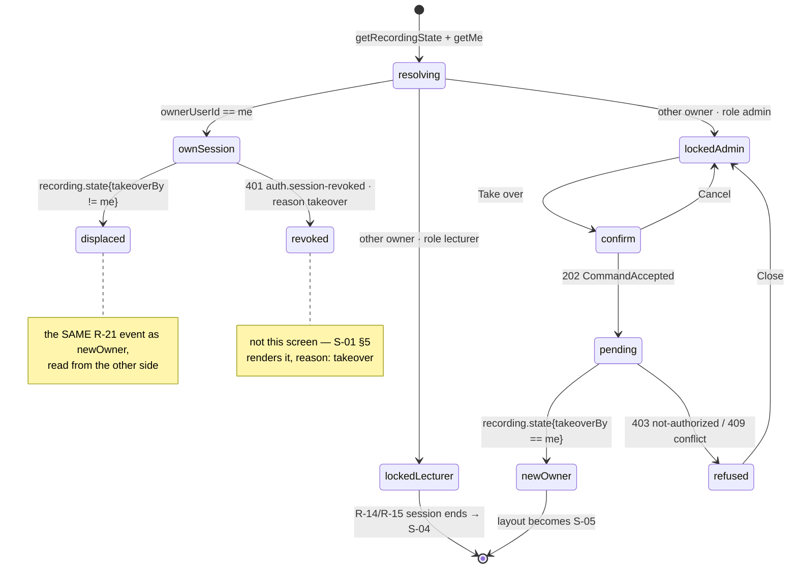

# S-06 Recorder lock & takeover — approved wireframe & screen design

> Closes **W-2** in [screen-inventory §9](../screen-inventory.md#9-screens-needing-wireframe-approval)
> ("Recorder lock & takeover: legacy enforced it in the UI, which is why it needs
> redesigning as a server-enforced view"). Nothing in this document may be
> contradicted by a plan or by generated code; if it must change, that is a gate
> discussion, not an in-run improvisation
> ([frontend-conventions](../frontend-conventions.md) preamble).
>
> **Status:** proposed 2026-08-05, Wave 2 design gate. Blocks: Wave 2.
> Sibling: [S-12](S-12-design.md). Predecessors: [S-01](S-01-design.md),
> [S-02](S-02-design.md).
>
> **§3 is product-wide.** It defines the destructive-action vocabulary that
> **S-12, S-24 and S-30 inherit unchanged**. It is written here because S-06's
> Take over is the first destructive confirm in the product.

---

## 0. Evidence base

Every claim below traces to one of these. No endpoint, token, state or copy
string is invented outside §9's two contract changes, which are named as
changes rather than assumed.

| Source | What it fixed here |
|---|---|
| [screen-inventory §2 S-06](../screen-inventory.md) | The seven states, the data surface, the ≥21 px legibility floor, the 24 px danger separation |
| [screen-inventory §2 S-03/S-04/S-05](../screen-inventory.md) | The chrome S-06 sits inside, and the hero slot its card occupies |
| [screen-inventory §0.3](../screen-inventory.md) | U-1…U-7, inherited rather than restated |
| [screen-inventory §8](../screen-inventory.md) | Every token used below; no new colour, size or spacing value |
| [state-machines §1.2](../state-machines.md) | **R-03** (recorder-busy refusal), **R-11** (stop), **R-21** (takeover) |
| [state-machines §0.3](../state-machines.md) | **`G-AUTH-OWNER`**, **`G-ADMIN`**, `G-NO-ACTIVE-SESSION` |
| [state-machines §0.2](../state-machines.md) | **SM-R-2** — an in-flight command is not a state |
| [`contracts/openapi.yaml`](../../../contracts/openapi.yaml) v0.2.0 | `getRecordingState`, `takeoverRecording`, `RecordingStateSnapshot`, `SessionRevokedReason`, and the four gaps in §9 |
| [`contracts/events.md`](../../../contracts/events.md) §2.1 | `recording.state` — emitted by R-03 *and* R-21, carrying the owner and `takeoverBy` |
| [PRD LP-6](../../PRD.md) | Mutual exclusion is server-enforced; a second user sees a locked view; only the owner or an admin may stop/take over |
| [behavioral-inventory B-15](../../discovery/behavioral-inventory.md) | The legacy lock was **UI-only** — `home.jsx` gated the buttons and the server did not. That defect is the reason this screen exists |
| [S-01-design.md §5, §9 #2](S-01-design.md) | `Problem.meta.reason = takeover` — the **other side of the same event**; S-06 must not invent a parallel vocabulary |
| `apps/panel/src/overlays/overlay-host.tsx` | The mount point, z-stack and Escape handling this screen's confirm uses (SI-D-2) |

---

## 1. Constraints that are not design choices

These are properties of the contract and the machines. Four of them look like
design freedom and are not.

**C-1. Takeover transfers authority, not attribution.** R-21's *To* column is
**`unchanged`**: it sets `takeoverBy`/`takeoverAt` and writes an
`AuditLogEntry(action=takeover)`. It does **not** rewrite `ownerUserId`. The
lecture therefore remains the prior owner's recording in the library for the
rest of its life. Every string in §6 is written so that an admin cannot mistake
takeover for claiming the lecture.

**C-2. A lecturer can never take over.** `/recording/takeover` carries
`x-required-role: admin` and R-21's guard is `G-ADMIN` — not `G-AUTH-OWNER`. A
second *lecturer* walking into an occupied room has no action at all, so the
locked-lecturer view must tell them what to do instead of showing them a control
they cannot use (§6).

**C-3. An admin already passes `G-AUTH-OWNER`.** The guard is
`actor = session.ownerUserId ∨ actor.role = admin`, so `stopRecording` would
succeed for an admin **without** any takeover. This is what makes
[S06-D-2](#11-decisions-taken-here) a choice rather than a technical limit.

**C-4. The locked view reads the snapshot, not the refusal.**
`RecordingStateSnapshot` already carries `ownerUserId`, `ownerDisplayName`,
`title`, `startedAt`, `recordedDurationMs` and `takeoverBy`, and `/recording/state`
is readable by any authenticated user. S-06 therefore renders from the snapshot
and the `recording.state` event, **not** from R-03's `recorder.busy` meta.
R-03 remains the refusal for the race in which a start is tapped as another
session begins; it routes to this screen and adds nothing to it. See
[§9.1](#91-changes-this-design-deliberately-does-not-require).

**C-5. The elapsed figure ticks locally.** `recording.state` is emitted on
transition only — there are no per-second events (INV-G-7, events.md §2.1). The
digits are computed from `startedAt` + `recordedDurationMs` exactly as S-07
computes them, and are **frozen at `recordedDurationMs` while `paused`** so pause
gaps are excluded (the B-08 `NaN` fix). One rule, two screens.

**C-6. The displaced owner has two possible endings and the server picks.**
R-21 says the prior owner's authority ends, *"`AuthSession.revokedReason=takeover`
**if** their kiosk session is replaced"*. Whether it is replaced is a server rule
this wireframe deliberately does not decide ([S06-D-6](#11-decisions-taken-here)).
Both branches are designed: the in-panel branch here (§5 state 7) and the
sign-in branch on [S-01](S-01-design.md) (`session expired`, `reason: takeover`).

---

## 2. Wireframe

S-06 is the **locked variant of `/`**. The S-03 chrome is active and correct:
the device *is* recording, so `.us-recframe` + `.us-recnotch` paint red exactly
as they would for the owner. Hiding the frame from a non-owner would be the same
class of lie U-2 refuses to tell.

The lock card occupies **S-04's hero slot** — `/` shows the hero when you are
not in a session you own, and this is that same sentence with a different
subject: the hero says *this device is yours right now*, the lock card says
*this device is A. Perera's right now*.

```
 LOCKED (lecturer)                              LOCKED (admin)
┌─ .us-panel 1280×800 · recframe 4px --record ─┐ ┌─ 1280×800 ────────────────────┐
│        ● RECORDING  (notch)                  │ │        ● RECORDING            │
│┌─ .us-header --header-h 62 ─────────────────┐│ │┌─────────────────────────── 62┐│
││ [logo] Hall A          14:32   N. Silva ▾  ││ ││ [logo] Hall A  14:32  R.F. ▾ ││
│└────────────────────────────────────────────┘│ │└──────────────────────────────┘│
│                                              │ │                                │
│         ┌───────── .us-lock 560 ─────────┐   │ │      ┌──────── 560 ────────┐   │
│         │ RECORDING IN PROGRESS    12px  │   │ │      │ RECORDING IN PROG…  │   │
│         │                                │   │ │      │                     │   │
│         │ A. Perera                24px  │   │ │      │ A. Perera      24px │   │
│         │ CS2043 — Lecture 7       17px  │   │ │      │ CS2043 — Lect… 17px │   │
│         │                                │   │ │      │                     │   │
│         │      01:47:12            38px  │   │ │      │   01:47:12     38px │   │
│         │      started 12:45       13px  │   │ │      │   started 12:45     │   │
│         │                                │   │ │      │                     │   │
│         │ Only A. Perera or an           │   │ │      │ You can take over…  │   │
│         │ administrator can stop this    │14px│ │      ├─────────────────────┤ 1px│
│         │ recording.                     │   │ │      │      [ Take over ]  │56px│
│         └────────────────────────────────┘   │ │      └─────────────────────┘   │
│                                              │ │            danger-quiet        │
│┌─ S-09 sources bar (collapsed)  54 ─────────┐│ │┌──────────────────────────── 54┐│
│├─ S-11 room controls (collapsed) 54 ────────┤│ │├──────────────────────────── 54┤│
│└────────────────────────────────────────────┘│ │└──────────────────────────────┘│
└──────────────────────────────────────────────┘ └────────────────────────────────┘
   270px card                                       367px card
```

**Vertical budget.** `--panel-h` 800 − `--header-h` 62 − 2 × `--sp-6` main
padding 28 − 2 × `--panelbar-head-h` 108 = **602 px** for the main region.

| Element | px |
|---|---|
| card padding (`--sp-10` × 2) | 48 |
| eyebrow `--fs-2xs` / `--tracking-caps` | 17 |
| gap `--sp-5` | 12 |
| owner name `--fs-3xl` / 800 | 29 |
| session title `--fs-lg` | 25 |
| gap `--sp-7` | 16 |
| elapsed `--fs-timer` `--mono` | 46 |
| started caption `--fs-xs` | 19 |
| gap `--sp-7` | 16 |
| note, 2 lines `--fs-sm` | 42 |
| **subtotal — lecturer** | **270** |
| + rule `--sp-9` 20 · 1 px · `--sp-9` 20 | 41 |
| + Take over 56 | 56 |
| **subtotal — admin** | **367** |

Both centre inside 602 px with room to spare. The card is **560 px** wide, not
the full column: the three facts on it are read from across a room, and a wide
measure moves the eye further than the fact is worth.

### 2.1 Why the card does not simply disable S-05

The obvious alternative — render S-05 with its transport greyed out — is the
B-15 defect wearing new paint. A greyed Pause implies the panel is the thing
saying no. It is not: the *server* is, and it would refuse the command even if
the button were live. The inventory already required Pause/Resume/Stop to be
**absent, not disabled-with-tooltip**; a screen with nothing to disable is the
honest form of that requirement, and it is also the only form that survives a
non-owner learning to tap the greyed control anyway.

### 2.2 Owner name at 24 px, elapsed at 38 px — and why that order

The inventory's floor is ≥21 px for both. The elapsed figure gets `--fs-timer`
(38 px `--mono`) because it is the **same instrument** the owner is looking at on
their S-07 TimerCard — one vocabulary for one number, and the digits are what
answer *"has this been left running since this morning?"*. The owner name gets
`--fs-3xl` (24 px), above the floor and clearly subordinate to the digits: it
answers *"whose is it"*, which is a question you ask once. The session title is
`--fs-lg` context, deliberately below the floor — it is not an across-the-room
fact.

---

## 3. The destructive-action vocabulary  *(product-wide)*

S-06's **Take over** and S-12's **Power off** are the first two destructive
confirms in the product. **S-24** (delete recording) and **S-30** (format
storage) inherit everything in this section unchanged. It is settled once, here.

The constraints are not new: screen-inventory already requires the destructive
button on the **right**, **≥24 px** from the safe action, and Cancel at
**default weight**; `--danger`/`--danger-soft` were approved with W-1/W-13 and
already ship in `apps/panel/src/styles/tokens.css:47-48`. What this section adds
is the rule that makes those constraints reproducible.

### 3.1 DGR-D-1 — two tiers, and the rule between them

| Tier | Name | Treatment | Where it may appear |
|---|---|---|---|
| **2** | `danger-quiet` | `--danger-soft` fill · `--danger` label · 1 px `--danger` border · `--radius-lg` · ≥`--tap-min` | The **entry** control on any screen surface — S-06 Take over, S-11 Power off, S-24 Delete, S-30 Format |
| **1** | `danger-solid` | `--danger` fill · `#fff` label · `--radius-lg` · `--shadow-md` · 56 px | The **confirming** button inside a `DangerConfirm`, and nowhere else. Exactly one per dialog |

> **The rule: destructive intent is quiet on a surface and solid only in a
> confirm.** No filled red button anywhere in this product acts on first tap. A
> lecturer who has learned that shape has learned it product-wide, and the
> learning transfers to screens they have never seen.

`#fff` as the solid label follows the precedent already set by S-01 §7's submit
(`--ink` / `#fff`); it does **not** introduce an `--on-danger` token for one
consumer.

### 3.2 DGR-D-2 — the shared dialog

```
apps/panel/src/danger/
  danger-button.tsx   variant: 'quiet' | 'solid'
  danger-confirm.tsx  the dialog: title, body, footer, pending/refused slots
  danger.css
```

A single folder owning the product-wide destructive vocabulary — the same
pattern `auth/` (shared by S-01 and S-02) and `keyboard/` (shared by every
screen with a field) already establish in this codebase.

```
┌──────────── DangerConfirm · --modal-w 680 · --radius-xl ────────────┐
│  Title                                                  --fs-2xl/800│
│                                                                     │
│  Body — one consequence per sentence, ≈60ch measure     --fs-base   │
│  --text-muted                                                       │
│                                                                     │
│  ┌─ message slot (pending / refused) ────────────────┐  40px        │
│  └───────────────────────────────────────────────────┘              │
│                                                                     │
│                              [  Cancel  ]◄─24px─►[ Destructive ]  56│
│                               default weight        danger-solid    │
└─────────────────────────────────────────────────────────────────────┘
                    scrim: color-mix(in srgb, var(--ink) 55%, transparent)
```

- Footer is `justify-content: flex-end`; the gap is **`--sp-10`**, which the
  token sheet (§8.5) already names *"danger separation"*. The destructive button
  is last in DOM order and therefore rightmost and last in the tab order.
- Cancel is default weight: `--surface` fill, 1 px `--border`, `--text`, 600.
- The message slot is **reserved unconditionally at 40 px**, for the same reason
  S-01's is ([S01-D-4](S-01-design.md#11-decisions-taken-here)): a refusal must
  not move a 56 px button under a finger that is already reaching for it.
- The scrim uses `color-mix` over `--ink` rather than a new colour token
  (Chromium ≥ 111; the kiosk browser is well past it).

### 3.3 DGR-D-3 — dismissal, focus and the mount point

`OverlayHost` (`apps/panel/src/overlays/overlay-host.tsx`) already provides the
mount point, the z-stack, the `inset: 0` interaction block and Escape handling.
**No second mechanism is proposed.** `DangerConfirm` is opened through
`useOverlays().open(node, { dismissible: false })`.

`dismissible: false` — deliberately:

- The kiosk has **no Escape key**. Escape dismissal would be a bench-browser
  affordance that is also the only non-touch exit, and Cancel is already the
  touch exit — so nothing is lost.
- A stray palm on the scrim must not cancel, and must certainly not dismiss a
  dialog whose command is already in flight.
- The only exits are **Cancel**, the destructive action, or the outcome.

Focus: the dialog traps focus, and **initial focus is on Cancel — never on the
destructive button.** A bench keyboard's stray Enter must not destroy anything.
`role="alertdialog"`, `aria-labelledby` the title, `aria-describedby` the body;
the message slot is `aria-live="polite"`.

### 3.4 DGR-D-4 — the four shared states

Every `DangerConfirm` in the product has these and only these:

| State | Rendering | Governed by |
|---|---|---|
| `confirm` | Title, body, both buttons live | — |
| `pending` | Pending affordance on the destructive button; both buttons locked; ceiling = `CommandAccepted.resolveBySec` | **SM-R-2**, U-4 |
| `refused` | Message slot carries the named reason in plain language; the destructive button is **replaced** by the screen's remedy (never left live to be re-tapped) | U-5 |
| `done` | The dialog closes, or is replaced by a terminal state the screen owns (S-12 `accepted`) | — |

---

## 4. Component breakdown

```
apps/panel/src/screens/dashboard/
  lock-card.tsx          the read-mostly card. Presentation only
  use-recorder-lock.ts   the lock verdict: snapshot + getMe → a discriminated union
  takeover-confirm.tsx   the DangerConfirm instance + the takeover mutation
  takeover-notice.tsx    the two persistent attribution strips (§5 states 6 & 7)
apps/panel/src/danger/
  danger-button.tsx      §3 — SHARED with S-12, S-24, S-30
  danger-confirm.tsx     §3 — SHARED with S-12, S-24, S-30
```

| Unit | What it does | How you use it | What it depends on |
|---|---|---|---|
| `use-recorder-lock.ts` | Reads `getRecordingState` + `getMe` and returns the §5 union — `owned` / `locked` / `takenOver` / `displaced` / `idle`. **The only place the owner comparison is written.** No JSX | `const lock = useRecorderLock()` | `selectors.ts` (`recording.state`), `auth-context` |
| `lock-card.tsx` | Renders eyebrow, owner, title, elapsed, note, and an optional action slot. Knows nothing about takeover or roles | `<LockCard owner={…} action={…}/>` | `use-ticker` (C-5), tokens |
| `takeover-confirm.tsx` | Owns the confirm copy, the 202 command and its resolution on `recording.state{takeoverBy}` | `<TakeoverConfirm/>` mounted from the card's action | `DangerConfirm`, `EduscopeClient.takeoverRecording` |
| `takeover-notice.tsx` | The persistent strip for both sides of a completed takeover | `<TakeoverNotice value={lock}/>` | `--info-soft` / `--warning` |
| `DangerButton` | `quiet` \| `solid` — the only two destructive treatments that exist | `<DangerButton variant="quiet">Take over</DangerButton>` | tokens only |
| `DangerConfirm` | Title/body/footer, the four §3.4 states, focus trap, scrim | `open(<DangerConfirm …/>, { dismissible: false })` | `useOverlays` |

`lock-card.tsx` is deliberately role-blind and takeover-blind: the entire
authority question lives in `use-recorder-lock.ts`, so the one comparison this
screen exists to get right (`ownerUserId === me.id`, `role === 'admin'`,
`takeoverBy`) is written once and tested without rendering. Nothing here imports
`fetch`, `axios` or `WebSocket` (frontend-conventions §1).

---

## 5. States

Machine 1a governs this screen; the screen itself owns no server state. "Locked"
is not a state of anything — it is a **rendering of machine 1a from a viewer who
is not `ownerUserId`**, which is why `use-recorder-lock.ts` takes the viewer as
an input rather than the store deciding on its own.

Throughout: *non-terminal* = 1a ∈ `starting | recording | paused | stopping |
finalizing` (`G-NO-ACTIVE-SESSION` false).

| # | State | Entered by | Rendering | Governed by |
|---|---|---|---|---|
| 1 | `locked (lecturer)` | non-terminal ∧ `ownerUserId ≠ me.id` ∧ `me.role = lecturer` | Card, no action slot. The note names the remedy (**C-2**) | **R-03**, `G-ADMIN` false |
| 2 | `locked (admin)` | as 1, `me.role = admin`, 1a ∈ `starting\|recording\|paused` | Card + **Take over** (`danger-quiet`). **No Stop** — [S06-D-2](#11-decisions-taken-here) | `G-ADMIN` |
| 2b | `locked (admin, session ending)` | as 2 but 1a ∈ `stopping\|finalizing` | Card, **action slot withdrawn**, caption "Saving…". R-21 would still be accepted; there is no authority left worth transferring | R-11 → R-12/R-14 |
| 2c | `locked (starting)` | 1a `starting`, `startedAt` null | Digits replaced by "Starting…"; `startedAt` is set at R-05 on the first segment only | R-01 → R-05 |
| 3 | `takeover confirm` | Take over tapped | `DangerConfirm` (§3), **UI-local overlay** | **SI-D-2**, SM-R-2 |
| 4 | `takeover pending` | 202 + `commandId` | §3.4 `pending`; resolves on `recording.state{takeoverBy}` | **SM-R-2**, U-4 |
| 5 | `takeover refused` | `403 not-authorized` (role changed underneath) or `409 conflict` (the session ended while the dialog was open) | §3.4 `refused`; the destructive button is replaced by **Close**, never left live | U-5 |
| 6 | `taken over (new owner)` | `takeoverBy = me.id` | Layout becomes **S-05**; a persistent attribution strip states whose lecture it still is (**C-1**) | **R-21** |
| 7 | `taken over (displaced owner, still signed in)` | `ownerUserId = me.id` ∧ `takeoverBy ∉ {null, me.id}` | S-05 collapses back to this card; a persistent, **non-dismissible** notice states why. Same vocabulary as S-01 (§6) | **R-21**, **C-6** |
| 8 | `taken over (displaced owner, session revoked)` | `401 auth.session-revoked` + `meta.reason = takeover` | **Not rendered here** — `use-session-revocation.ts` routes to S-01, which already words it | **R-21**, CG-11, [S-01 §5](S-01-design.md#5-states) |
| 9 | `taken over (third party)` | non-terminal ∧ `takeoverBy ∉ {null, me.id}` ∧ `ownerUserId ≠ me.id` | Card + a "taken over by" line. No action for anyone: the authority is already settled | R-21 |
| 10 | `owner's own session` | `ownerUserId = me.id` ∧ `takeoverBy` null | **S-06 never renders** — S-05 does, on any client. The owner is not locked out of their own session | LP-6 |
| 11 | `session ended while locked` | 1a → `completed` \| `error` | Card unmounts; `/` returns to **S-04** | R-14 / R-15 |
| — | U-1 | cold load | Card skeleton in its own shape — never a full-screen spinner | §0.3 |
| — | U-2 | `T-WS-STALE` | Digits keep ticking from the last known `startedAt` but the card is marked stale; **Take over is disabled** — a takeover tapped offline must never fire on reconnect (the S-07 rule, for the same reason) | §0.3 |
| — | U-4, U-5 | — | On the confirm, per §3.4 | §0.3 |

### 5.1 State diagram



### 5.2 One event, two screens, one vocabulary

States 6, 7 and 8 are **the same R-21 transition** observed from three seats.
The contract makes that literal: `SessionRevokedReason.takeover` is documented as
*"R-21's `AuthSession.revokedReason`; S-06 reads the same vocabulary on the other
side of that event"* (`openapi.yaml:1766-1768`). So S-06 does not get its own
word for it. The sentence **"An administrator took over this recording."** is
S-01's copy for `reason: takeover`, reused verbatim as the first sentence of the
displaced-owner notice — only the trailing clause differs, because on S-01 the
next step is signing in again and here it is not.

---

## 6. Copy deck

Plain language, no codes (§0.4 Class A, U-5). Names in *italics* are data.

| Where | Copy |
|---|---|
| Eyebrow, 1a `recording` | **RECORDING IN PROGRESS** |
| Eyebrow, 1a `paused` | **RECORDING PAUSED** |
| Eyebrow, 1a `stopping` / `finalizing` | **SAVING** |
| Elapsed caption | started *12:45* |
| Note — `locked (lecturer)` | Only *A. Perera* or an administrator can stop this recording. |
| Note — `locked (admin)` | You can take over this recording. It keeps recording either way. |
| Note — `locked (admin, session ending)` | This lecture is being saved. |
| Line — `taken over (third party)` | Taken over by *R. Fernando*. |
| Confirm title | **Take over this recording?** |
| Confirm body | *A. Perera* is recording *CS2043 — Lecture 7*. Taking over ends their control of this panel. The lecture keeps recording, and it is still saved as **their** recording. |
| Confirm body, 2nd line | This is recorded against your name. |
| Confirm buttons | Cancel · **Take over** |
| `takeover refused`, 403 | You are no longer an administrator on this device. |
| `takeover refused`, 409 | That lecture has already ended. |
| Strip — `taken over (new owner)` | You took over this recording from *A. Perera* at *14:12*. It is still saved as their lecture. |
| Notice — `taken over (displaced owner)` | **An administrator took over this recording.** *R. Fernando* took over at *14:12*. You can no longer pause or stop this lecture. |
| Notice, without §9 #1 | **An administrator took over this recording.** You can no longer pause or stop this lecture. |
| U-2 marker | Not connected — this may be out of date. |

*"It keeps recording either way"* and *"The lecture keeps recording"* are load-
bearing, not reassurance: the single most likely misreading of a button called
**Take over** on a screen showing a live lecture is that it interrupts the
lecture. R-21's *To* column says `unchanged`; the copy says so too.

---

## 7. Token usage

Every value comes from [§8](../screen-inventory.md#8-design-token-sheet). **No
new token is introduced by this screen**, including by §3 — `--danger` and
`--danger-soft` were approved with W-1/W-13 and already ship.

| Element | Tokens |
|---|---|
| Backdrop / chrome | inherited from S-03 (`--record` frame, `--warning` when paused) |
| Lock card | `--surface`, 1 px `--border`, `--radius-panel`, `--shadow-lg`, `--sp-10` padding, 560 px |
| Eyebrow | `--fs-2xs` / 700 / uppercase / `--tracking-caps`, `--record` (recording), `--warning` (paused), `--text-muted` (saving) |
| Owner name | `--fs-3xl` / 800 / `--tracking-tight`, `--text` |
| Session title | `--fs-lg` / 600, `--text-muted` |
| Elapsed | `--fs-timer` / `--mono` / 700, `--text` |
| Started caption | `--fs-xs`, `--text-faint` |
| Note | `--fs-sm`, `--text-muted` |
| Card rule | 1 px `--border`, `--sp-9` above and below |
| **Take over** (`danger-quiet`) | `--danger-soft`, 1 px `--danger`, `--danger` label, `--radius-lg`, `--fs-md` / 700, 56 px |
| Confirm dialog | `--surface`, `--radius-xl`, `--shadow-lg`, `--sp-10`, `--modal-w` |
| Confirm title / body | `--fs-2xl` / 800 · `--fs-base`, `--text-muted` |
| **Take over** (`danger-solid`) | `--danger` fill, `#fff`, `--radius-lg`, `--shadow-md`, `--fs-md` / 700, 56 px |
| Cancel | `--surface`, 1 px `--border`, `--text`, `--radius-lg`, `--fs-md` / 700, 56 px |
| Footer gap | `--sp-10` (24 px — §8.5 *"danger separation"*) |
| Scrim | `color-mix(in srgb, var(--ink) 55%, transparent)` |
| New-owner strip | `--info`, `--info-soft`, `--radius-md`, `--fs-xs` |
| Displaced notice | `--warning`, `--radius-md`, `--fs-sm` |
| Focus ring | 3 px `--accent`, `:focus-visible` |

The displaced notice is `--warning`, not `--danger`: nothing was destroyed, and
`--danger` in this product means *this will destroy data* — the exact conflation
§8.2 added the token to end.

---

## 8. Touch, kiosk & accessibility

- Take over 56 px, Cancel 56 px, confirm buttons ≥`--tap-min` — all above the
  floor. The footer gap is 24 px, the inventory's requirement for this screen
  (8 px is the general rule; this screen was called out as an exception).
- **No hover-only affordance.** The lock card has no controls other than the one
  button; the note that explains the lock is always visible text, never a
  tooltip on a disabled control.
- **The card is read from across a room**: owner 24 px, elapsed 38 px, both above
  the inventory's ≥21 px floor for this screen (§2.2).
- Elapsed digits are `--mono` with tabular figures so the seconds column does not
  jitter, and are wrapped in `aria-live="off"` — a per-second announcement would
  make a screen reader unusable. The card exposes a static
  `aria-label` carrying owner, title and *"recording in progress"*.
- The confirm traps focus, opens focus on **Cancel**, and is `role="alertdialog"`.
- `prefers-reduced-motion`: the pending affordance must not be motion-only — it
  also changes the button label to "Taking over…" and locks the control.
- Page never scrolls; the card is sized to fit (§2).
- **Nothing on this screen is disabled without its reason next to it.** Where a
  control is disabled for authority (the mic controls, §9 #2) the reason is
  inline text, not a tooltip and not a bare grey.

---

## 9. Contract changes this design requires (v0.3)

Two, both **additive**. They belong in
[screen-inventory §10](../screen-inventory.md#10-contract-gaps) as CG rows; this
document names them, it does not edit §10. S-12 requires two more, plus the
answer to CG-6 — see [S-12 §9](S-12-design.md#9-contract-changes-this-design-requires-v03).

| # | Change | Kind | What it blocks | Decided by |
|---|---|---|---|---|
| **1** | `RecordingStateSnapshot` **and** `RecordingStatePayload` — add `takeoverAt: Instant \| null` and `takeoverByDisplayName: string \| null`, populated by R-21 alongside the existing `takeoverBy` | **Additive** — two nullable properties; no existing field changes meaning | The **named** form of §5 states 6, 7 and 9. `takeoverBy` is a ULID and `listUsers` carries `x-required-role: admin`, so a displaced *lecturer* has no way to resolve it — their notice degrades to "An administrator", with no name and no time, and the new-owner attribution strip cannot say when. R-21 already sets both values server-side; they simply never reach the wire | [S06-D-4](#11-decisions-taken-here) |
| **2** | `PUT /audio/controls/{roleId}` (`updateAudioControl`) — guard with **`G-AUTH-OWNER`** while a session is non-terminal; declare `403 not-authorized` | **Additive** — a newly declared refusal on an existing operation; request and success schemas unchanged. Behavioural change server-side | S-06 disabling the mic **honestly**. The endpoint declares only `202`/`422` today, so a non-owner standing at the panel can mute the lecturer's microphone mid-lecture via S-09 or S-11's master mute. Client-side disabling without this guard is precisely **B-15** — "the legacy UI enforced it, which is to say it didn't". **If this is rejected, S-06 must show those controls live** and say so, not fake-disable them | [S06-D-5](#11-decisions-taken-here) |

### 9.1 Changes this design deliberately does **not** require

Recorded so a later run does not re-open them as gaps:

- **`Problem.meta` needs no declared shape for `recorder.busy`.** `/recording/start`'s
  description promises the owner name and title in `meta`, and `meta` is
  `additionalProperties: true` so nothing forbids it — but S-06 reads
  `RecordingStateSnapshot`, which carries both fields under a declared schema
  (**C-4**). Formalising `meta.owner` would add a second source for one fact
  (SM-R-1).
- **No new `Problem.code` for takeover.** `SessionRevokedReason.takeover`
  (CG-11, applied v0.2.0) already carries it, and §5.2 is the reason S-06 must
  not add a parallel one.
- **No `system.alert` for takeover.** R-21 emits `recording.state{takeoverBy}` and
  a `log.entry(Auth,WARN)`, and `takeoverBy` is **durable state**, not a transient
  condition. The strips in §5 states 6/7 are derived from it, so they survive
  reconnect and resync for free (U-3) — which an acknowledgeable alert would not.

---

## 10. Mock & scenario work Wave 2 inherits

`frontend-conventions.md` §4 requires every enumerated state to be implemented
**and reachable via the scenario dev overlay**.

| Gap | Where | Fix |
|---|---|---|
| No seeded second user is an owner — every mock session is owned by the logged-in user, so states 1, 2 and 9 are unreachable | `packages/api-client/src/mock/` recording state + `mock/seed/users.ts` | Seed a session owned by a *different* user; the existing seed roster already has more than one |
| `takeoverRecording` has no mock handler, so states 4–7 are unreachable | `mock/rest/` recording | Implement R-21: set `takeoverBy`/`takeoverAt`, re-broadcast `recording.state`, and **leave `ownerUserId` alone** (**C-1**) — a mock that rewrites the owner would teach the UI a lie the server will not tell |
| The scenario catalog has no multi-user script | `mock/scenario/scripts/` | **Extend, never fork** the catalog (`happy`, `start-fails`, `pipeline-crash-midway`, `llm-timeout`, `disk-full`, `ws-flap`, `quiz-network-loss`). The lock is a *seed* condition and the takeover a *forced transition*, so this needs a forced-transition hook rather than an eighth script |
| Contract honesty for §9 #1 — the two new fields must be in the zod layer before the mock can emit them | `contracts/` → generated zod | Lands with the v0.3 bump, before Wave 2's plan run (§10.1) |

---

## 11. Decisions taken here

| Id | Decision | Rationale | Cost to reverse |
|---|---|---|---|
| **S06-D-1** | The locked view is a **card in S-04's hero slot**, not a disabled S-05 | §2.1 — a greyed transport says *the panel is refusing you*, which is false and is the exact shape of B-15. There is nothing to disable if the controls were never rendered, and `/` already has a "not in a session you own" layout | Low — one card |
| **S06-D-2** | `locked (admin)` offers **Take over only. Stop is removed** | *Deviates from screen-inventory §2 S-06, which lists Stop alongside.* Three reasons. (1) It leaves the screen with the **one dangerous button** the inventory's own touch note assumes, dissolving the "8 px is not enough" problem instead of patching it. (2) **Audit:** R-21 writes an `AuditLogEntry(action=takeover)`; R-11 writes only a `log.entry`. Routing every third-party stop through takeover means nobody ends another person's lecture without their name on it. (3) Stop-after-takeover is then the *owner-equivalent* one-tap stop, so **S-07's "do not add a confirm dialog to Stop" stands unchanged** — no Stop that behaves differently depending on who is looking at it. Cost: one extra tap for an admin resolving a stuck session, which the confirm was going to be anyway. **C-3** notes the server would still accept an admin's stop; this is a UI choice, not a claimed refusal | Low — one button, no contract impact |
| **S06-D-3** | Takeover is a **destructive confirm**, and §3 settles that vocabulary for the whole product | S-24 and S-30 are already promised the same treatment by the inventory. Deciding it twice more, later, is how two red buttons end up meaning two different things | Medium — three screens inherit it |
| **S06-D-4** | `takeoverAt` + `takeoverByDisplayName` travel on the recording snapshot, **not** via a user lookup | `listUsers` is admin-only, so the displaced lecturer — the person with the most need to know — is the one person who cannot resolve the ULID. R-21 already computes both values; a lookup would be a second source for a fact the snapshot is already carrying (SM-R-1) | Low — two nullable fields |
| **S06-D-5** | The mic controls are **disabled for a non-owner**, and that requires a server guard first | §9 #2. Disabling in the client alone reproduces B-15 exactly. Filed as a contract change with an explicit fallback: if the guard is rejected, S-06 shows the controls live rather than pretending | Low in the UI; medium in the server |
| **S06-D-6** | S-06 designs **both** displaced-owner branches and does **not** decide which one fires | **C-6** — whether R-21 replaces the prior owner's `AuthSession` is a server rule, and a UI wireframe is the wrong place to settle it. Designing only one branch would make the other unhandled whichever way it lands; designing both costs one notice component, and state 8 was already built for S-01 | Low |
| **S06-D-7** | The elapsed figure uses S-07's **exact** computation and freeze rule | **C-5** — two screens showing the same lecture's duration by two rules is how B-08 happened. One rule, and the lock card is the second consumer that proves it is shared | Low |

---

## 12. Requirements this screen places on other screens

- **S-04** routes to this screen on `409 recorder.busy` (its `refused: recorder busy`
  state) **and** whenever `use-recorder-lock` reports `locked` on cold load — the
  refusal is the race, the snapshot is the common case (**C-4**).
- **S-05** must accept a **collapse back to S-06** while mounted (§5 state 7). It
  is not enough to pick a layout once at mount: a displaced owner's S-05 has to
  become a lock card mid-session, and its children must unmount cleanly.
- **S-07** hides its transport on `¬G-AUTH-OWNER` (already its `not owner`
  state) and **keeps its one-tap Stop unchanged** — S06-D-2 exists so that rule
  never has to bend.
- **S-09 and S-11** must render their audio controls disabled-with-reason when
  `use-recorder-lock` reports `locked`, conditional on §9 #2 landing. Both bars
  otherwise stay mounted and readable: a non-owner still needs to see whether the
  lecture is actually capturing, and S-11 hosts the Advanced entry point.
- **S-24 and S-30** inherit §3 in full — `danger-quiet` entry, `danger-solid`
  confirm, `--sp-10` separation, Cancel-focused, `dismissible: false`. Neither
  screen may define its own destructive treatment.
- **S-03** already renders the recording chrome for every viewer; §2 depends on it
  not being suppressed for non-owners.

---

## 13. Testing floor

Per frontend-conventions §5, and additional to it where this screen is unusual.

- **Testing Library:** one rendering test per row of §5 — thirteen, plus the four
  §3.4 dialog states.
- **The authority table:** an exhaustive test of `use-recorder-lock` over the
  cross-product of *{owner, other-lecturer, admin, admin-who-took-over}* ×
  *{idle, starting, recording, paused, stopping, finalizing}* × *{takeoverBy:
  null, me, other}*. This is the one function the screen exists to get right, and
  it is pure — there is no excuse for testing it through the DOM.
- **The copy identity:** an assertion that the displaced-owner notice's first
  sentence is **byte-identical** to S-01's `reason: takeover` string, from a
  shared constant. §5.2 is only true if it cannot drift.
- **No-attribution-rewrite:** a test that after a successful takeover
  `ownerUserId` is unchanged and the new-owner strip still names the prior owner
  (**C-1**). This guards the misreading the whole copy deck is written against.
- **Playwright:** the primary journey (admin arrives → locked → take over →
  S-05 with the attribution strip), plus **two** failure scenarios rather than
  the required one — `takeover refused (409)` and the displaced-owner collapse,
  because the second is the only end-to-end proof that one R-21 event renders
  correctly on both sides.
- **Contract honesty:** every mocked response validates against the `contracts/`
  zod schemas, including §9 #1's two fields.
