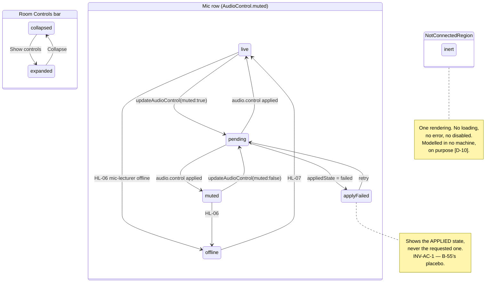

# S-11 Room Controls — the `[D-10]` placeholder pattern — approved wireframe & screen design

> Closes **W-15** in [screen-inventory §9](../screen-inventory.md#9-screens-needing-wireframe-approval)
> ("G-5 forbids controls that pretend to work; how the five `[D-10]` rows signal
> 'not connected yet' is a design decision"). Nothing in this document may be
> contradicted by a plan or by generated code; if it must change, that is a gate
> discussion, not an in-run improvisation
> ([frontend-conventions](../frontend-conventions.md) preamble).
>
> **Status:** proposed 2026-08-05, Wave 2 design gate. Blocks: Wave 2.
> Siblings: [S-12](S-12-design.md) — its `PowerOffRow` is mounted here and is not
> redefined; [S-05](S-05-ai-disabled-design.md) — its 388 px vertical floor
> depends on §2's bar height.
>
> **This is a pattern decision, not a screen.** `NotConnectedRegion` is the
> product-wide rendering for `[D-10]` hardware and is inherited wherever that
> hardware appears — the same way S-24 and S-30 inherit
> [S-06 §3](S-06-design.md#3-the-destructive-action-vocabulary--product-wide)
> rather than defining their own destructive treatment.

---

## 0. Evidence base

| Source | What it fixed here |
|---|---|
| [screen-inventory §2 S-11](../screen-inventory.md) | The groups, the master mic as the one live control, the `power off` and `advanced` entries, and the sentence this document answers: *"How they are marked is a wireframe decision (§9)"* |
| [screen-inventory §2 S-09](../screen-inventory.md) | The mic row this bar mirrors exactly — `live`/`muted`/`pending`/`apply failed`, one `AudioControl.muted` field |
| [screen-inventory §2 S-12](../screen-inventory.md) | The power-off entry and its three-taps-to-destruction requirement |
| [screen-inventory §0.4](../screen-inventory.md) | 44 px targets, **no hover-only affordance**, tooltips banned as the sole carrier, no page scroll |
| [screen-inventory §8](../screen-inventory.md) | Every token used below; **no new colour, size or spacing value** |
| [S-12-design.md §2.1](S-12-design.md#21-the-entry-row-s-11-expanded) | The illustrative sketch that wrote *"not connected yet · (W-15 owns this mark)"* — non-binding by its own words (§1 **C-5**) |
| [S-06-design.md §3](S-06-design.md#3-the-destructive-action-vocabulary--product-wide) | `danger-quiet` for an entry control — the tier the Power off button uses here |
| [state-machines §8](../state-machines.md) | *"Room Controls Projector / Environment groups → **inert placeholder** `[D-10]` — modelled nowhere on purpose"* and *"Live/Muted row → same `AudioControl.muted` field — one control, one truth"* |
| [state-machines §6.1](../state-machines.md) | `mic-lecturer` health; `mic-room` is permanently `unbound` (INV-SR-2, A-08 amended) |
| [`contracts/openapi.yaml`](../../../contracts/openapi.yaml) v0.2.0 | `listAudioControls`, `updateAudioControl`, `AudioControl{gain,muted,appliedState,lastError}` — and the **absence** of any lights/AC/projector operation |
| [`contracts/events.md`](../../../contracts/events.md) | `audio.control` (applied state), `audio.levels` (telemetry, never a row) |
| [PRD G-5](../../PRD.md) | *"Every control in the shipped UI verifiably affects the system (B-55/B-56 lesson); verified in Phase-5 parity check"* |
| [PRD LP-14](../../PRD.md) | *"Projector/Audio/Environment groups render as designed but are inert except master mic mute"* — the wording this design deviates from, deliberately (§1 **C-4**) |
| [PRD LP-9](../../PRD.md) | The real mic control, *"all verifiably affecting captured audio (no placebo, B-55 lesson)"* |
| [PRD §3.2](../../PRD.md) | *"Room controls are placeholder-only… no backend for lights, AC, or projector power"* |
| [open-decisions D-10](../../discovery/open-decisions.md#d-10--room-controls-hardware-projector-power--lights--ac) | Control pipelines *"still in progress"*; default = UI placeholder; **post-launch (Phase 5+)**; decided by PM **with hardware engineer** |
| [behavioral-inventory B-55 / B-56](../../discovery/behavioral-inventory.md) | The placebo class G-5 exists to kill |
| `prototype/src/components/room/RoomControlsPanel.tsx` | The bar being replaced — including the five `useState` values and the state strings §1 **C-1** deletes |
| `prototype/src/styles/app.css` | `.us-panelbar__head` 54 px, `.us-room` 3-col grid, `.us-roomrow` 52 px, `.us-toggle` 54 × 32 |

---

## 1. Constraints that are not design choices

**C-1. The prototype ships a placebo *readout*, not just a placebo control.**
`RoomControlsPanel.tsx` renders `{projectorOn ? 'On' : 'Off'}`,
`{lightsOn ? 'On' : 'Off'}`, `{screenLowered ? 'Lowered' : 'Raised'}`,
`{speakerVol}%` and `{acTemp}°C` — every one of them a **claim about hardware
nothing is talking to**, driven by five `useState` values seeded at module load.
G-5 is usually read as being about controls. It is not: a display that asserts
"the projector is On" when no wire exists is the same lie with no button
attached, and it is the lie a lecturer would actually act on. **Every option for
W-15 has to delete these strings.** Styling the switch differently does not
address them.

**C-2. There is no endpoint, and none will be invented.** `openapi.yaml` has no
operation for a projector, a screen, a speaker, a light or an air conditioner,
and `[D-10]` is explicitly deferred to post-launch with a hardware engineer in
the loop. This document does not propose one. That is also why
[§9](#9-contract-changes-this-design-requires) is empty and why the five rows
appear in **no state machine** — state-machines §8 already records that as
deliberate.

**C-3. "Readable from across a room" is a claim about geometry, not text.** At
three metres, `--fs-sm` (14 px) is not resolvable and `--fs-2xs` (12 px) group
labels certainly are not. Nor is a 1 px dashed border, nor a `--text-faint`
label. What *is* resolvable at that distance is **silhouette** — whether a row
carries a 54 × 32 px switch or a stepper pair, or carries nothing. Any pattern
whose distinguishing feature is a caption is, at distance, a pattern with no
distinguishing feature. This constraint eliminated the "keep the controls,
disable and label them" option on its own, before accessibility was considered.

**C-4. LP-14's wording says "Projector / Audio / Environment groups render as
designed".** This design **deviates** from that grouping. The deviation is
recorded, not smuggled: G-5 is a measurable *goal* with a Phase-5 audit behind it,
LP-14 is a feature description whose actual content is *"inert except master mic
mute"* — which is preserved exactly. Precedent for a gate deviating from an
approved row with rationale is
[S06-D-2](../../discovery/open-decisions.md#61-outcomes), which removed a Stop
button the inventory specified.

**C-5. S-12 §2.1's sketch is illustrative and says so.** It renders per-row
*"not connected yet"* text and annotates it *"(W-15 owns this mark)"*. That
sketch becomes stale on approval of this document. It is not edited — an approved
design is a record of what was decided at its gate, and S-12's decisions are
untouched by this one.

**C-6. The bar competes with the main column for pixels.** S-11 expanded eats
directly into S-05's main column ([S-05 §1 C-2](S-05-ai-disabled-design.md#1-constraints-that-are-not-design-choices)).
The prototype's expanded bar is **226 px**. Any redesign that grows it lowers the
floor every dashboard layout must survive.

---

## 2. Wireframe

**The pattern in one sentence:** a `[D-10]` row loses its control, its stepper
**and** its state string, keeping only an icon and a name; and real controls never
share a region with dead ones, so the carrier is silhouette (**C-3**).

### 2.1 Collapsed (the default, and what most rooms see all day)

```
┌──────────────────────────────────────────────────────────────────────┐
│  ROOM CONTROLS                          [ ⚙ Advanced ]  [ Show ⌃ ]   │ 54
└──────────────────────────────────────────────────────────────────────┘
   --fs-2xs/caps/muted                    ≥24px apart (inventory rule)
```

Unchanged from the prototype. No dot cluster: S-09's collapsed head carries three
health dots because it has health to report; this bar's only live control is a
mute, and a mute has no ambient state worth a dot on a collapsed bar — the mic's
state is already on S-09's head, one bar up.

### 2.2 Expanded

```
┌──────────────────────────────────────────────────────────────────────────┐
│  ROOM CONTROLS                              [ ⚙ Advanced ]  [ Collapse ⌄ ]│  54
├──────────────────────────────────────────────────────────────────────────┤
│                                                                          │
│ ┌ MICROPHONE ─────────┐ ┌ POWER ──────────┐ ┌ NOT CONNECTED ───────────┐ │
│ │ ┌─────────────────┐ │ │                 │ │ These are not wired to   │ │
│ │ │🎤 Lecturer Mic  │ │ │ [  Power off  ] │ │ this device.             │ │ 100
│ │ │   Live  [ ●——— ]│ │ │   danger-quiet  │ │ ▫Projector  ▫Screen      │ │
│ │ └─────────────────┘ │ │      56 px      │ │ ▫Speaker  ▫Lights  ▫A/C  │ │
│ └─────────────────────┘ └─────────────────┘ └──────────────────────────┘ │
│         ~300 px                ~220 px                ~700 px            │
│    real · has a control    real · S-12 owns it    inert · has nothing    │  14
└──────────────────────────────────────────────────────────────────────────┘
                                                                          168 total
```

**Two regions you can press. One you cannot.** The silhouette carries it: the
left third has a switch and a button; the right two-thirds have five labelled
chips with no affordance of any kind — no toggle, no stepper, no value, no
chevron, no tap target. From the lectern you do not read "not connected"; you see
that nothing there is a control.

### 2.3 Height — the bar gets *shorter*

| | Prototype | This design |
|---|---|---|
| Head | 54 | 54 |
| Content | 158 (3 groups × 2 rows of 52) | 100 |
| Bottom padding | 14 | 14 |
| **Total expanded** | **226 px** | **168 px** |

Five two-row groups of dead switches become one strip of five inert chips. The
58 px returned is what makes [S-05](S-05-ai-disabled-design.md)'s floor 388 px
rather than 330 px — and it happens *because* the placeholders lost their
controls, not in spite of it. **This is the pattern paying for itself.**

**All three regions are exactly 100 px**, which is what makes the total a flat
168 and not a range:

| Region | Arithmetic |
|---|---|
| `MICROPHONE` | `--sp-5` × 2 padding 24 + title 14 + `--sp-2` 6 + row 56 = **100** |
| `POWER` | 24 + title 14 + `--sp-2` 6 + button 56 = **100** |
| `NOT CONNECTED` | 24 + title 14 + `--sp-2` 6 + notice 20 + `--sp-2` 6 + chip row 30 = **100** |

The chip row is **30 px** (20 px icon, `--fs-sm` name at 1.2 line-height), which
§2.4 permits because nothing in it is a target. **54 + 100 + 14 = 168 px.**

### 2.4 Why the placeholders have no 44 px floor

`--tap-min` protects **targets**. A `NotConnectedRow` is not a target: it has no
`onClick`, no `role="button"`, no `tabIndex`, and is not focusable. Nothing on a
touch panel can be mis-hit if nothing responds to being hit. So five rows that
would need 5 × 52 px as controls occupy one 30 px strip — which is exactly why
§2.3 is possible.

This is the strongest argument for the whole pattern and it is not aesthetic:
**a row that is honestly inert costs less space than a row pretending to be
live.** Honesty is the cheaper layout.

### 2.5 What a `NotConnectedRow` renders, and what it must not

```
   ▫ Projector              ✔ icon (muted)  ✔ name
                            ✘ toggle  ✘ stepper  ✘ value  ✘ state word
                            ✘ chevron  ✘ tap target  ✘ tooltip
```

| Removed | Why |
|---|---|
| `Toggle` | The control G-5 forbids |
| `us-stepper` pairs (speaker %, A/C °C) | Same, twice per row |
| `"On" / "Off" / "Lowered" / "Raised"` | **C-1** — a state claim about absent hardware |
| `"50%" / "22°C"` | Worse than a word: a *precise* claim about absent hardware |
| The five `useState` seeds | The mechanism that made the claims look plausible across a reload |

The icon stays, muted. It is what makes the strip scannable as *room hardware*
rather than a list of words, and an icon that opens nothing asserts nothing.

### 2.6 The notice, and why it does not say "yet"

> **These are not wired to this device.**

Not *"not connected **yet**"*. Not *"…once the room wiring is installed"*.

`[D-10]` is genuinely open: control pipelines are *"still in progress"*, the
decision belongs to **PM with a hardware engineer**, and it is deferred to
**post-launch (Phase 5+)** with "UI stays placeholder" as the *default if
unresolved* — which is not the same as a commitment to build it. A panel that
promises hardware nobody has committed to is a smaller version of the same defect
this whole redesign exists to remove: a UI asserting something it cannot know.
The sentence states the fact. If `[D-10]` lands, the row moves out of the region
and the sentence never needed to change.

One notice for five rows, not five marks. Repeating the same sentence five times
teaches a lecturer to stop reading it, and the region already carries the message
structurally.

### 2.7 The mic row — the one real control in the bar

```
┌ MICROPHONE ──────────────────────┐
│ ┌──────────────────────────────┐ │
│ │ 🎤 Lecturer Mic              │ │  56 px (--tap-row)
│ │    Live            [ ●——— ]  │ │  Toggle 54 × 32, hit area 56
│ └──────────────────────────────┘ │
└──────────────────────────────────┘

   apply failed (INV-AC-1):
│ │ 🎤 Lecturer Mic              │ │
│ │    Still live — the mute     │ │  --danger, --fs-sm
│ │    didn't apply.   [ ●——— ]  │ │  switch shows the APPLIED state
```

**One control, one truth.** This is the same `AudioControl.muted` field S-09
renders (LP-14, LP-9, state-machines §8), bound through the same selector — not a
copy, not a mirror with its own optimistic state. Its four states are S-09's
verbatim and are not redefined here (§5).

The `apply failed` rendering is the anti-placebo rule made visible: INV-AC-1
requires the panel to show *the applied state and the failure*, never the
requested value. A switch that flips to "muted" because the user asked, while the
microphone is still live, is B-55 with better animation — and on this screen it
would mean a lecturer believing they are off-mic when the hall can hear them.

`updateAudioControl`'s missing owner guard is **already filed as CG-15** at the
W-2 gate; this design inherits that answer and does not re-litigate it. If the
guard is rejected, [S-06 §9](S-06-design.md#9-contract-changes-this-design-requires-v03)'s
recorded fallback applies here too: the control renders **live**, not
fake-disabled.

### 2.8 The Power region

`<PowerOffRow/>` is **owned by S-12** ([S12-D-7](S-12-design.md#11-decisions-taken-here))
and mounted here. This document defines its *placement* only:

- Its own region, so it is neither adjacent to the mic switch nor inside the
  inert strip. A destructive control must not sit where a lecturer's hand is
  already travelling to reach a mute.
- ≥ `--sp-10` (24 px) from the `MICROPHONE` region, matching the destructive
  separation the token sheet already names.
- Not adjacent to `Advanced` — the inventory's existing ≥24 px rule between
  `Advanced` and `Collapse` exists for the same reason and is unchanged.
- S-12's "three taps before anything destructive" holds: expand the bar → tap
  `Power off` → confirm.

---

## 3. The `[D-10]` pattern, stated for reuse

Four rules. Any surface rendering `[D-10]` hardware uses `NotConnectedRegion` and
may not restate or vary them.

**RC-D-1 — Structural separation.** Real controls and `[D-10]` rows never share a
group, a card or a row. The boundary between "this does something" and "this does
nothing" is always a container boundary, because that is the only distinction
visible at three metres (**C-3**).

**RC-D-2 — Total inertness.** A `[D-10]` row renders an icon and a name. No
control, no value, no state word, no tap target, no focus stop, no tooltip. It is
not a disabled control; it is **not a control**. `aria-disabled` is wrong here —
there is nothing to disable.

**RC-D-3 — One notice per region, stating a fact.** *"These are not wired to this
device."* One sentence for the whole region, never per row, and never a promise
about future hardware (**§2.6**).

**RC-D-4 — Silhouette is the carrier; text and colour are secondary.** The
pattern must survive being read at three metres, in greyscale, with the caption
illegible. If a proposed variant fails that test, it is not this pattern.

> **When `[D-10]` lands**, a row *moves out* of the region into a real group and
> gains a control bound to a real operation. Nothing about the pattern is
> redesigned, and a region that empties completely is simply not rendered. The
> pattern is built to be dismantled one row at a time.

---

## 4. Component breakdown

```
apps/panel/src/screens/room/
  room-controls-bar.tsx     the bar: head, Advanced, Collapse, region layout
  mic-master-row.tsx        the one real control → AudioControl
  not-connected-region.tsx  the [D-10] region — PRODUCT-WIDE, §3
  not-connected-row.tsx     one inert row: icon + name, nothing else
  power-off-row.tsx         owned by S-12, mounted here (S12-D-7)
```

| Unit | What it does | How you use it | What it depends on |
|---|---|---|---|
| `room-controls-bar.tsx` | Collapsed/expanded, the head actions, the three regions. Owns **no** command and **no** hardware knowledge | `<RoomControlsBar/>` mounted by S-03's bottom-bar host | the four below |
| `mic-master-row.tsx` | Renders `AudioControl` for `mic-lecturer` and issues `updateAudioControl`. Shows `appliedState`, never the requested value (INV-AC-1) | `<MicMasterRow/>` | `listAudioControls`, `audio.control`, `EduscopeClient` |
| `not-connected-region.tsx` | Title, the RC-D-3 notice, and a strip of `NotConnectedRow`s from a `{icon, name}[]` prop. **Product-wide** | `<NotConnectedRegion items={ROOM_HARDWARE}/>` | nothing — it has no data source, by design |
| `not-connected-row.tsx` | Icon + name. Not focusable, not clickable, has no props beyond those two | internal to the region | nothing |
| `power-off-row.tsx` | S-12's entry control and its three forms | `<PowerOffRow/>` | S-12 §4 |

**`not-connected-region.tsx` takes no data source and never will.** It has no
client, no query, no store subscription and no props except a static list. That
is not minimalism — it is the enforcement mechanism. A component with no way to
receive a value cannot be given one in a later run, so no future change can
quietly wire a placebo state into it. The eslint client-boundary rule
(frontend-conventions §1) is already the second lock.

**The item list is a constant, not a fetch.** `ROOM_HARDWARE` lives beside the
component as five `{icon, name}` pairs. There is no endpoint (**C-2**); pretending
there might be one — an empty array from a query, a loading state — would build a
data path for hardware that does not exist.

---

## 5. States

### 5.1 The mic row — S-09's four states, unchanged

| # | State | Entered by | Rendering | Governed by |
|---|---|---|---|---|
| 1 | `live` | `AudioControl.muted = false`, `appliedState = applied` | Switch on, "Live" | LP-9 |
| 2 | `muted` | `muted = true`, `appliedState = applied` | Switch off, "Muted" | LP-9 |
| 3 | `pending` | 202 accepted, `appliedState = pending` | U-4 affordance **on the switch**; the switch does **not** move | U-4, SM-R-2 |
| 4 | `apply failed` | `appliedState = failed` | Switch shows the **applied** state; `lastError` in plain language beneath | **INV-AC-1**, B-55 |
| 5 | `mic offline` | 5a `offline` for `mic-lecturer` | Row disabled with the reason inline; the fault is ranked **critical** (§6.2) and its alarm belongs to S-09 and S-05, not to a switch in a collapsed bar | HL-06 |
| — | U-1 | cold load | Row renders disabled until `listAudioControls` resolves; **no default switch position is guessed** | §0.3 |
| — | U-2 | `T-WS-STALE` | Switch disabled — a command cannot be sent and must not appear sendable | §0.3 |
| — | U-5 | refusal | The named reason inline beneath the row, never a tooltip | §0.4 |

State 3 not moving the switch is the same rule as state 4: the switch renders
**applied truth only**. An optimistic flip followed by a revert is how a lecturer
learns that the switch is a suggestion.

### 5.2 The `[D-10]` region — no states, and that is the design

The region has **one** rendering. It has no loading state (nothing loads), no
error state (nothing can fail), no empty state (the list is a constant), no
disabled state (nothing is enabled), and no U-1/U-2/U-4/U-5 (it is not connected
to the WS store, issues no command, and is unaffected by disconnection —
screen-inventory S-11 already anticipates this: *"placeholders unaffected because
they are local"*).

**It is modelled in no state machine on purpose**, which state-machines §8
already records. This document does not add one. A machine here would be the
first step toward a row that changes.

### 5.3 Bar states

| # | State | Rendering |
|---|---|---|
| 1 | `collapsed` | §2.1 — 54 px head only |
| 2 | `expanded` | §2.2 — 168 px |
| 3 | `advanced visible` | Shown to **all roles** (AD-1, prototype `showAdvanced`); the *destination* is role-scoped, not the button |

### 5.4 Diagram



---

## 6. Copy deck

| Where | Copy |
|---|---|
| Bar title | ROOM CONTROLS |
| Head actions | Advanced · Show controls / Collapse |
| Region titles | MICROPHONE · POWER · NOT CONNECTED |
| Region notice | **These are not wired to this device.** |
| Row names | Projector · Projector Screen · Speaker Volume · Lights · A/C |
| Mic row name | Lecturer Mic |
| Mic `live` | Live |
| Mic `muted` | Muted |
| Mic `pending` | Applying… |
| Mic `apply failed` | Still live — the mute didn't apply. *(or)* Still muted — the change didn't apply. |
| Mic `offline` | No microphone signal. |
| Mic U-2 | Not connected — you can't change this right now. |
| Power | *(S-12 §6, inherited unchanged)* |

Three notes:

- **"NOT CONNECTED"** as the region title, not "Room hardware" or "Coming soon".
  The title is the message; a neutral title would push the whole meaning onto the
  20 px notice line, which **C-3** says is unreadable at distance anyway.
- The `apply failed` copy names **which way the failure fell** ("still live" vs
  "still muted"). "Failed to apply" tells a lecturer something went wrong and
  leaves them guessing whether the hall can hear them — which is the entire
  question.
- **"A/C"**, not "Air Conditioning" — the strip is 5 chips wide and the prototype's
  `aria-label` ("Air conditioning") carries the long form for screen readers.

---

## 7. Token usage

**No new token.**

| Element | Tokens |
|---|---|
| Bar | `--surface`, 1 px `--border` top, `--panelbar-head-h` (54), `--sp-8` (18) horizontal padding |
| Bar title | `--fs-2xs` / 700 / caps / `--tracking-caps`, `--text-muted` |
| Advanced / Collapse | `--surface-2`, 1 px `--border`, `--radius-sm`, `--fs-sm` / 600, ≥`--tap-min`, ≥`--sp-10` apart |
| Region (all three) | `--surface-2`, 1 px `--border`, `--radius-lg` (14), `--sp-5` (12) padding |
| Region title | `--fs-2xs` / 700 / caps / `--tracking-caps`, `--text-faint` |
| Region notice | `--fs-sm`, `--text-muted` |
| Mic row | `--surface`, 1 px `--border`, `--radius-md` (12), `--tap-row` (56) |
| Mic row name | `--fs-sm` / 600, `--text` |
| Mic row state | `--fs-2xs`, `--text-muted` |
| Mic `apply failed` | `--fs-sm`, `--danger` — the failure line, not the switch |
| Toggle | existing `Toggle` primitive, 54 × 32 in a 56 px hit area |
| `NotConnectedRow` | **`--surface-2`** — deliberately *not* raised to `--surface`. It stays flush with the region; a raised inset would read as a card, and cards in this bar contain controls |
| `NotConnectedRow` | row height **30 px** (§2.3) — no `--tap-row`, because it is not a target (§2.4) |
| `NotConnectedRow` icon | 20 px, `--text-faint` |
| `NotConnectedRow` name | `--fs-sm` / 600, **`--text-muted`** — not `--text-faint`; the row is inert, not unimportant, and a lecturer must still be able to read what is planned for the room |
| Power off | `danger-quiet` per [S-06 §3.1](S-06-design.md#31-dgr-d-1--two-tiers-and-the-rule-between-them) |

**No new "disabled" or "placeholder" colour is introduced**, and none should be.
A dedicated placeholder tint would make the pattern depend on colour, which
**RC-D-4** forbids and which colour-blind users and greyscale reading both defeat.
The existing muted/faint pair is sufficient *because* it is only the secondary
carrier.

---

## 8. Touch, kiosk & accessibility

- **Mic row 56 px**, `Toggle` 54 × 32 inside a 56 px hit area, `Power off` 56 px,
  `Advanced` / `Collapse` ≥44 px and ≥24 px apart. All above the floor.
- **`NotConnectedRow` has no minimum height** because it has no target (§2.4).
  It is not focusable, not in the tab order, and not reachable by keyboard.
- **No hover-only affordance and no tooltip anywhere in this bar.** The region
  notice is permanent, on-screen text. Nothing in the pattern is revealed by
  pointing at it — which also means the pattern works identically on a touch
  panel with no pointer at all.
- **Screen readers get the same structure, not a substitute.** The region is a
  `<section>` with `aria-labelledby` on its title and the notice as its first
  child, so the message is announced before the five names. Rows are plain
  content, **not** `aria-disabled` — there is no control to describe as disabled
  (RC-D-2). Announcing "Projector, dimmed button" would recreate in audio exactly
  the false affordance the visual design removes.
- **Greyscale test:** with all colour removed, the three regions remain
  distinguishable by their contents alone — switch, button, nothing.
- **Distance test:** at three metres the captions are illegible and the pattern
  still reads correctly, because it was never carrying the message (**C-3**,
  RC-D-4).
- `prefers-reduced-motion`: the only animation in the bar is the `Toggle` knob and
  the expand transition, both already covered by the prototype's block. The
  pattern adds none.
- **The bar never scrolls.** §2.3 fits at 168 px inside an 800 px panel.

---

## 9. Contract changes this design requires

**None.**

| What the bar needs | What already provides it |
|---|---|
| The master mute's state and applied truth | `listAudioControls` → `AudioControl{muted, appliedState, lastAppliedAt, lastError}`; WS `audio.control` |
| Issuing the mute | `updateAudioControl` (`PUT /audio/controls/{roleId}`) |
| Owner-guarding that mute | **Already filed as CG-15** at the W-2 gate; inherited, not re-raised |
| Mic health for state 5 | `getSourcesStatus` / `sources.status` (5a) |
| Power off | S-12's design and its CG-16 / CG-17 rows; inherited unchanged |
| The five `[D-10]` rows | **Nothing, and nothing is asked for** (**C-2**) |

### 9.1 Changes this design deliberately does **not** require

- **No endpoint for lights, AC, projector, screen or speaker.** `[D-10]` is a
  hardware decision with a hardware engineer in the loop; a contract written now
  would be a guess at a control protocol nobody has chosen. screen-inventory
  S-11 already commits to this: *"there is no endpoint for lights/AC/projector
  and none will be invented"*.
- **No "capability" or "installed" flag on any schema.** A boolean saying whether
  the projector is wired would be the first field of the API this design declines
  to invent, and it would have exactly one possible value (`false`) for the whole
  of v0. When `[D-10]` lands, the row gains a real operation and the flag is
  redundant.
- **No state machine for the placeholders.** state-machines §8 records their
  absence as deliberate; adding one would model a thing that cannot change.

---

## 10. Mock & scenario work Wave 2 inherits

| Gap | Where | Fix |
|---|---|---|
| The prototype's five `useState` values must not be ported | `apps/panel/src/screens/room/` | They have no successor. `NotConnectedRegion` holds no state at all — a review check, not a mock task |
| `appliedState: 'failed'` is not reachable, so §5.1 state 4 cannot be demonstrated | `packages/api-client/src/mock/rest/` audio | The mock accepts `updateAudioControl`, then emits `audio.control` with `appliedState: failed` + a `lastError` under a scenario flag. **This is the one state that proves B-55 is closed** and it is currently untestable |
| No script covers a mute that does not apply | `mock/scenario/scripts/` | **Extend, never fork** the catalog. `happy` gains a flag rather than a new script; the failure is a property of the audio mock, not of a session narrative |
| `mic-lecturer` offline (state 5) | `mock/scenario/scripts/pipeline-crash-midway` | Already produces source faults; extend it to include the audio role, which §6.2 ranks critical and which no current script exercises |

---

## 11. Decisions taken here

| Id | Decision | Rationale | Cost to reverse |
|---|---|---|---|
| **S11-D-1** | **Regroup: real controls and `[D-10]` rows never share a region** (RC-D-1). Groups become `MICROPHONE` / `POWER` / `NOT CONNECTED` | At three metres only silhouette resolves (**C-3**), so the distinction must be structural. The prototype's `Audio` group mixes a live mic with a dead speaker control — the arrangement that most reliably teaches a lecturer that a row's neighbours prove nothing about it. **Deviates from PRD LP-14's grouping**, deliberately (**C-4**), preserving its actual content ("inert except master mic mute") exactly | Medium — it is the bar's layout |
| **S11-D-2** | A `[D-10]` row loses its control, its stepper **and its state string** (RC-D-2) | **C-1**. "Projector · On" is a claim about hardware nothing is talking to — the placebo G-5 forbids, with no button attached and more likely to be acted on. Deleting the switch while keeping the readout would close the smaller half of the defect | Low |
| **S11-D-3** | **Silhouette is the carrier; text and colour are secondary** (RC-D-4) | Stated because the alternative is a pattern that *claims* to work across a room while depending on 14 px captions. This is also what eliminated the "disable and label" option, and it is the criterion any future variant must pass | Low |
| **S11-D-4** | `NotConnectedRegion` is the **product-wide `[D-10]` pattern**, inherited wherever that hardware appears | The same reasoning as DGR-D-1: a shape learned on one screen must transfer to screens the lecturer has never seen. `[D-10]` hardware is the second thing in this product that will appear in more than one place | Low |
| **S11-D-5** | The notice states a **fact, not a roadmap**: *"These are not wired to this device."* — no "yet", no promised wiring | `[D-10]` is genuinely undecided, post-launch, and owned by PM **with a hardware engineer**. A panel promising hardware nobody has committed to is the same class of defect as a panel claiming a projector is On. If it lands, the row leaves the region and the sentence never had to change | Low |
| **S11-D-6** | **One notice per region, never per row** (RC-D-3) | Five identical sentences train a lecturer to stop reading them, and the region already carries the message structurally. It is also what keeps the strip one 30 px row (§2.3) | Low |
| **S11-D-7** | `NotConnectedRegion` takes **no data source and no client**, only a static `{icon,name}[]` | Enforcement, not minimalism: a component with no way to receive a value cannot be given one in a later run. G-5 is audited in Phase 5 — this makes the audit structural rather than a code review | Low |
| **S11-D-8** | The mic switch renders the **applied** state in `pending` and `apply failed`, never the requested one | INV-AC-1 and B-55. An optimistic flip that reverts teaches that the switch is a suggestion; on a mute it means believing you are off-mic while the hall can hear you | Low |
| **S11-D-9** | The expanded bar is **168 px**, down from the prototype's 226 px | A consequence, not a goal: five rows that are honestly inert need no 44 px floor (§2.4). The 58 px returned is what makes [S-05](S-05-ai-disabled-design.md)'s floor 388 px. **Honesty is the cheaper layout** | Low |
| **S11-D-10** | **No new placeholder colour or tint** | A dedicated tint would make the pattern depend on colour, which RC-D-4 forbids and which greyscale and colour-blind reading both defeat | Low |

---

## 12. Requirements this screen places on other screens

- **S-09 renders the same `AudioControl.muted` through the same selector.** One
  control, one truth (LP-14, LP-9). Neither screen holds local mute state, and a
  test asserts they cannot disagree.
- **S-12's `PowerOffRow` is mounted, not reimplemented** (S12-D-7). This design
  contributes its *placement* (§2.8) and nothing else; S-12's states, copy and
  dialog are untouched.
- **S-12 §2.1's sketch is superseded but not edited** (**C-5**). It is annotated
  *"(W-15 owns this mark)"*, which is exactly this document.
- **S-05's floor depends on §2.3's 168 px.** Any future growth of this bar
  requires rechecking
  [S-05 §1 C-2](S-05-ai-disabled-design.md#1-constraints-that-are-not-design-choices).
- **Any future `[D-10]` surface** uses `NotConnectedRegion` and may not define its
  own treatment (S11-D-4), the same way S-24 and S-30 inherit S-06 §3.
- **S-36 (W-10)** is where a curious lecturer or an IT visitor learns *why*
  nothing is wired — it already renders `DeviceProvisioning` read-only. This bar
  does not explain `[D-10]`; it states the consequence.

---

## 13. Testing floor

- **Testing Library:** one rendering test per row of §5.1 — eight — plus one for
  the region and one per bar state.
- **The anti-placebo assertions**, which are the point of this screen:
  - `NotConnectedRow` renders **no** `button`, `input`, `[role=switch]`,
    `[tabindex]` or `onClick`. Asserted by querying for interactive roles inside
    the region and expecting **zero**. If this test ever fails, G-5 has been
    broken.
  - The region contains **no** text matching `/\b(on|off|lowered|raised|\d+%|\d+°C)\b/`.
    This is **C-1** as an executable rule — the prototype would fail it today.
  - The region is not focusable: a tab sweep of the expanded bar reaches the
    `Toggle`, `Power off`, `Advanced` and `Collapse`, and nothing else.
- **`apply failed` shows applied truth:** a test that a `muted: true` request
  resolving as `appliedState: failed` leaves the switch reading **Live** and
  renders the failure line. INV-AC-1 is only real if this exists.
- **One control, one truth:** a test driving a single `audio.control` event and
  asserting S-09's and S-11's renderings match.
- **The 168 px envelope:** a Playwright assertion that the expanded bar's height
  is ≤ 168 px at 1280 × 800, since [S-05](S-05-ai-disabled-design.md)'s 388 px
  floor is derived from it. This is a cross-screen coupling, so it is asserted
  rather than commented.
- **Playwright:** the primary journey (expand → mute → confirm applied → collapse),
  plus the `apply failed` scenario as the failure path.
- **Contract honesty:** every mocked response validates against the `contracts/`
  zod schemas.
