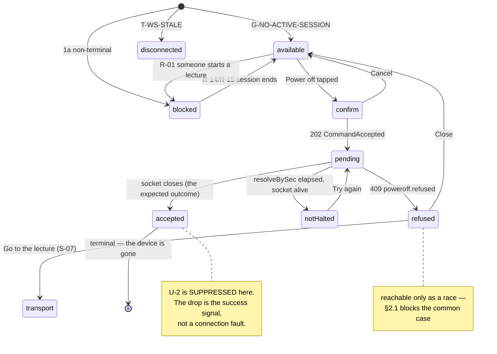

# S-12 Power-off confirm — approved wireframe & screen design

> Closes **W-3** in [screen-inventory §9](../screen-inventory.md#9-screens-needing-wireframe-approval)
> ("Power-off confirm: lived on the retired Menu page") and **answers CG-6** in
> [§10](../screen-inventory.md#10-contract-gaps). Nothing in this document may be
> contradicted by a plan or by generated code; if it must change, that is a gate
> discussion, not an in-run improvisation
> ([frontend-conventions](../frontend-conventions.md) preamble).
>
> **Status:** proposed 2026-08-05, Wave 2 design gate. Blocks: Wave 2.
> Sibling: [S-06](S-06-design.md) — **its §3 is this screen's dialog**, inherited
> unchanged and not restated here.

---

## 0. Evidence base

| Source | What it fixed here |
|---|---|
| [screen-inventory §2 S-12](../screen-inventory.md) | The five states, the data surface, "destructive button on the right", "not reachable in two adjacent taps" |
| [screen-inventory §2 S-11](../screen-inventory.md) | The bar this overlay is opened from, and the `power off` entry it already enumerates |
| [screen-inventory §2 S-03](../screen-inventory.md) | The banner host, including its existing `poweroff.refused` row |
| [screen-inventory §0.2 SI-D-2](../screen-inventory.md) | Overlays are **UI-local state, never URLs** |
| [screen-inventory §0.3](../screen-inventory.md) | U-1…U-7, inherited rather than restated |
| [screen-inventory §8](../screen-inventory.md) | Every token used below; no new colour, size or spacing value |
| [S-06-design.md §3](S-06-design.md) | **DGR-D-1…DGR-D-4** — the product-wide destructive vocabulary, dialog, dismissal rule and four dialog states |
| [state-machines §1.2 R-22](../state-machines.md) | Power-off is **refused server-side** while a session is non-terminal |
| [state-machines §0.2 SM-R-2 / SM-R-3](../state-machines.md) | In-flight commands are not states; every transition has an emitter *and* a named consumer |
| [`contracts/openapi.yaml`](../../../contracts/openapi.yaml) v0.2.0 | `powerOffDevice`, `poweroff.refused`, `CommandAccepted.resolveBySec`, `getProvisioning`, and the two gaps in §9 |
| [`contracts/events.md`](../../../contracts/events.md) §2.10, §10 | The `system.alert` emitter list — and the fact that §10 is a **closed catalog** |
| [PRD LP-13](../../PRD.md) | "A power-off control (Room Controls area) that confirms, then halts — and is **refused server-side while recording**." Power-off only; no restart |
| [behavioral-inventory B-50](../../discovery/behavioral-inventory.md) | Legacy `GET /settings/poweroff`: any authenticated user, always answered "Successfull" **in both branches**, and the UI treated a failed request as success |
| `apps/panel/src/overlays/overlay-host.tsx` | The mount point, z-stack and Escape handling (SI-D-2) |
| `apps/panel/src/store/connection.ts`, `shell/offline-marker.tsx` | The U-2 machinery this screen must suppress on purpose |

---

## 1. Constraints that are not design choices

**C-1. There is no resolving event.** `POST /device/power-off` returns
`202 CommandAccepted` with `resolveBySec`, whose contract meaning is *"failure
rendered after this many seconds without a resolving event"*. events.md §10 is a
**closed catalog** and it contains no event that resolves a power-off — because
a successful power-off's only observable outcome is that **the device stops
answering**. Taken literally, U-4 would render a failure ten seconds after every
*successful* shutdown. §5 and [§9 #3](#9-contract-changes-this-design-requires-v03)
exist because of this.

**C-2. The refusal is a 409, not an event.** `poweroff.refused` reaches the
caller synchronously as `application/problem+json`. R-22 *also* emits
`system.alert{poweroff.refused}`, which is the carrier for every panel that did
**not** press the button. U-5 requires the refusal to appear next to the control
that was pressed, so the requester reads the 409 and the shell banner is
suppressed for them ([§12](#12-requirements-this-screen-places-on-other-screens)).

**C-3. Any authenticated user may power off.** `powerOffDevice` carries no
`x-required-role` and R-22 has no guard — the only gate is the recording state.
This is deliberate legacy parity (B-50 was open to any authenticated user) and
LP-13 names the lecturer at end of day as the primary persona. The confirm is not
a role gate and must not read like one.

**C-4. The hall name is readable.** `getProvisioning` supplies
`hallDisplayName`, which S-03's header already renders, so naming the device in
the confirm costs no new data (screen-inventory's "names the device/hall").

**C-5. B-50 answered "Successfull" on both branches.** The legacy endpoint
reported success whether or not the shutdown ran, and the legacy UI *also*
treated request failure as success. Every honesty rule in §5 — the `refused`
state, the not-halted branch, the absence of an optimistic close — is a direct
inversion of that behaviour.

---

## 2. Wireframe

Three surfaces: the **entry row** in S-11, the **confirm dialog**, and the
**terminal state**. The dialog is [S-06 §3](S-06-design.md#3-the-destructive-action-vocabulary--product-wide)'s
`DangerConfirm` with this screen's copy in it — no second mechanism, no second
geometry.

### 2.1 The entry row (S-11, expanded)

The inventory requires that the confirm "must not be reachable in two adjacent
taps from anywhere", which the Room Controls collapse already provides: expand
the bar, then the row, then the dialog — **three** taps before anything
destructive is possible, and the third is the quiet-tier entry, not the act.

```
┌─ S-11 Room Controls · expanded ───────────────────────────────────────┐
│  Projector          not connected yet                                 │
│  Speaker Volume     not connected yet          (W-15 owns this mark)   │
│  Microphone         [ Live / Muted ]                                   │
├───────────────────────────────────────────────────────────────────────┤
│  Power                                            [  Power off  ]  56 │  ← danger-quiet
└───────────────────────────────────────────────────────────────────────┘

   while machine 1a is NON-TERMINAL (the common blocked case):
├───────────────────────────────────────────────────────────────────────┤
│  Power    This device is recording — stop the lecture first.  --fs-sm │  ← reason INLINE,
│           [ Go to the lecture ]                   [  Power off  ]     │    never a tooltip
│            --fs-sm, ≥44px                            disabled         │
└───────────────────────────────────────────────────────────────────────┘
```

The reason sits **inline above the disabled control**, never in a tooltip — the
same rule S-04 applies to a disabled Start ("a disabled Start always shows its
reason inline"), and §0.4 bans tooltips as the sole carrier of information
outright.

### 2.2 The confirm dialog

```
┌──────────────── DangerConfirm · --modal-w 680 · --radius-xl ────────────────┐
│                                                                             │
│   Power off this device?                                        --fs-2xl/800│
│                                                                             │
│   Hall A · Eduscope recording panel                             --fs-base   │
│   The device will halt. Someone has to press the power button   --text-muted│
│   in this room to turn it back on.                                          │
│                                                                             │
│   ┌─ message slot — reserved unconditionally ──────────────┐    40px        │
│   └────────────────────────────────────────────────────────┘                │
│                                                                             │
│                                 [   Cancel   ]◄─24px─►[  Power off  ]    56 │
│                                  default weight        danger-solid         │
└─────────────────────────────────────────────────────────────────────────────┘
        scrim: color-mix(in srgb, var(--ink) 55%, transparent) · dismissible: false
```

**Height:** `--sp-10` × 2 padding 48 + title 29 + `--sp-5` 12 + body 2 lines 44 +
`--sp-7` 16 + message slot 40 + `--sp-9` 20 + footer 56 = **265 px**, centred in
`.us-panel`. No text field, so `--osk-h` is 0 and does not enter the maths.

The second sentence is the one that earns its place. "The device will halt" is
abstract; *"someone has to press the power button in this room to turn it back
on"* is the actual consequence, and it is the fact that makes a lecturer at
16:55 pause. It is also why [S12-D-1](#11-decisions-taken-here) can answer CG-6
the way it does.

### 2.3 `refused (recording)` — the race

Reachable only when a session becomes non-terminal between opening the dialog and
confirming it (the entry row blocks the common case). It is nonetheless a
**required** state, not an edge case: it is the one place the server's authority
over §2.1's client-side belief becomes visible.

```
│   ┌─ message slot ─────────────────────────────────────────┐               │
│   │ This device is recording — stop the lecture first.      │  --danger     │
│   └────────────────────────────────────────────────────────┘               │
│                                                                             │
│                              [   Close   ]◄─24px─►[ Go to the lecture ]  56 │
│                                                    NEUTRAL primary          │
```

Per DGR-D-4 the destructive button is **replaced**, never left live to be
re-tapped. Its replacement is a neutral primary (`--ink` / `#fff`, the S-01
submit treatment) because going to the transport is not destructive — this is
also the inventory's "offers a jump to S-07, **not** a force option". There is no
force option anywhere in this design.

### 2.4 `accepted` — the terminal state

```
┌──────────────────── .us-panel 1280×800 ─────────────────────────┐
│                                                                 │
│              scrim over the whole panel; the shell              │
│              beneath is frozen and not re-rendered              │
│                                                                 │
│                                                                 │
│                      Shutting down                    --fs-3xl  │
│              Hall A · Eduscope recording panel        --fs-base │
│                                                                 │
│         ── only after resolveBySec, socket still alive ──       │
│                                                                 │
│              The device has not shut down yet.        --fs-sm   │
│                      [  Try again  ]                  56 px     │
│                                                       danger-solid
└─────────────────────────────────────────────────────────────────┘
```

This is a **dead end by design** — there is no Cancel, because a shutdown cannot
be un-sent. Two things it must do:

1. **Stop pretending to be live.** Live regions freeze; the clock keeps ticking
   because it is local wall time, not a claim about the device.
2. **Suppress U-2.** The WS drop that follows is the *expected* outcome of the
   command, and rendering "reconnecting" over a device that is correctly halting
   would be a false alarm at the exact moment the user did the right thing. A
   flag on the connection store, set when the 202 arrives, carries this
   ([§12](#12-requirements-this-screen-places-on-other-screens)).

**Try again** exists because of **C-1** and **C-5**. If the socket is still alive
after `resolveBySec`, the shutdown plausibly did not run — and a device that is
perfectly healthy must not be left on a terminal screen with no exit, which is
exactly the shape of B-50's "always answers Successfull". One retry, at
`danger-solid` because it is the same destructive act, and **no** automatic
retry: a shutdown is not a request you repeat on a timer.

---

## 3. Overlay mechanics

Nothing new. `apps/panel/src/overlays/overlay-host.tsx` provides the mount point,
the z-stack, the `inset: 0` interaction block and Escape handling; S-12 opens
through `useOverlays().open(node, { dismissible: false })` per
[DGR-D-3](S-06-design.md#33-dgr-d-3--dismissal-focus-and-the-mount-point).

Two S-12-specific notes:

- **SI-D-2 holds.** Power-off never changes the location. There is no
  `/power-off` route and no query flag; a kiosk has no address bar to deep-link
  from, and a reload landing on a shutdown confirm would be absurd.
- **The `accepted` state stays inside the same overlay layer**, expanded to fill
  the panel. It is not a route and not a second overlay: it is the terminal
  rendering of the dialog that issued the command, so there is no moment where
  the confirm has closed and the terminal state has not yet mounted.

---

## 4. Component breakdown

```
apps/panel/src/screens/room/
  power-off-row.tsx      the S-11 entry control + its blocked/disconnected forms
  power-off-confirm.tsx  the DangerConfirm instance, the terminal state
  use-power-off.ts       the command, the ceiling, the expected-drop flag
apps/panel/src/danger/
  danger-button.tsx      inherited from S-06 §3 — not defined here
  danger-confirm.tsx     inherited from S-06 §3 — not defined here
```

| Unit | What it does | How you use it | What it depends on |
|---|---|---|---|
| `power-off-row.tsx` | Renders the three entry forms (available / blocked / disconnected) and opens the confirm. Owns no command | `<PowerOffRow/>` mounted by S-11 | `use-recorder-lock` (S-06), `useOverlays` |
| `use-power-off.ts` | Owns the §5 union, issues the 202, sets the expected-drop flag, runs the `resolveBySec` ceiling, maps `409 poweroff.refused` to the message | `const { state, confirm, retry } = usePowerOff()` | `EduscopeClient.powerOffDevice`, connection store |
| `power-off-confirm.tsx` | The copy and the terminal rendering. Presentation plus the `use-power-off` binding | `open(<PowerOffConfirm/>, { dismissible: false })` | `DangerConfirm` |

`power-off-row.tsx` deliberately holds no command: S-11 owns a bar full of
controls, and a row that could fire a shutdown from inside a layout component is
the kind of coupling that makes a bar hard to test. The row opens an overlay; the
overlay owns the act.

**S-12 owns `power-off-row.tsx` even though S-11 renders it** — the same
arrangement by which [S-01 §3](S-01-design.md#3-the-on-screen-keyboard-host) owns
the keyboard host that every screen mounts. The screen that owns the consequence
owns the control.

---

## 5. States

R-22 governs this screen. Note that R-22's *To* column is **`unchanged
(refused)`** — power-off is not a transition of machine 1a at all, it is a
command that machine 1a can veto. Nothing here is a persisted state; all of it is
UI-local (SM-R-2).

Throughout: *non-terminal* = 1a ∈ `starting | recording | paused | stopping |
finalizing`.

| # | State | Entered by | Rendering | Governed by |
|---|---|---|---|---|
| 1 | `entry available` | `G-NO-ACTIVE-SESSION` believed true | Row + `danger-quiet` **Power off** | §2.1 |
| 2 | `entry blocked (recording)` | non-terminal | Control disabled, **reason inline above it**, plus a jump to S-07. The dialog does not open | **R-22**, U-5 |
| 3 | `entry disconnected` | `T-WS-STALE` | Control disabled, "Not connected". A command cannot be sent and must not appear sendable | **U-2** |
| 4 | `confirm` | Power off tapped | `DangerConfirm` (§2.2), `dismissible: false` | **SI-D-2**, DGR-D-4 |
| 5 | `pending` | `202 CommandAccepted` | Pending affordance on the destructive button, both buttons locked | **SM-R-2**, U-4, DGR-D-4 |
| 6 | `refused (recording)` | `409 poweroff.refused` | §2.3 — message slot + the destructive button replaced by the S-07 jump | **R-22**, U-5, DGR-D-4 |
| 7 | `accepted` | `202` resolved by the socket closing | §2.4 terminal "Shutting down". **U-2 suppressed** — this drop is expected | **C-1** |
| 8 | `accepted, not halted` | `resolveBySec` elapsed, socket still alive | §2.4 plus the second line and one **Try again** | **C-1**, **C-5**, U-4 |
| 9 | `refused (other)` | any other `Problem` | Message slot carries `Problem.title` in plain language; destructive button replaced by **Close** | U-5 |
| — | U-1 | cold load | The row renders disabled until `getRecordingState` resolves — the same rule S-04 applies to Start | §0.3 |

### 5.1 State diagram



---

## 6. Copy deck

Plain language, no codes (§0.4 Class A, U-5).

| Where | Copy |
|---|---|
| Entry control | **Power off** |
| Entry group label | Power |
| `entry blocked` reason | This device is recording — stop the lecture first. |
| `entry blocked` jump | Go to the lecture |
| `entry disconnected` | Not connected — you cannot power off right now. |
| Confirm title | **Power off this device?** |
| Confirm body, line 1 | *Hall A* · Eduscope recording panel |
| Confirm body, line 2 | The device will halt. Someone has to press the power button in this room to turn it back on. |
| Confirm buttons | Cancel · **Power off** |
| `pending` | Powering off… |
| `refused (recording)` | This device is recording — stop the lecture first. |
| `refused (recording)` buttons | Close · **Go to the lecture** |
| `accepted` | **Shutting down** / *Hall A* · Eduscope recording panel |
| `accepted, not halted` | The device has not shut down yet. |
| `accepted, not halted` button | **Try again** |
| `refused (other)` | *(`Problem.title`, which the contract already requires to be "plain language for a non-technical lecturer")* |

The blocked reason is **one string used in two places** (§2.1 and §2.3) — the
client's belief and the server's ruling must not be worded differently, or the
race in §2.3 reads as a second, unrelated problem.

---

## 7. Token usage

No new token. The dialog's tokens are [S-06 §7](S-06-design.md#7-token-usage)'s
and are not restated; this table covers only what S-12 adds.

| Element | Tokens |
|---|---|
| Entry row | `--surface-2`, `--radius-md`, `--tap-row` (56 px) |
| Entry group label | `--fs-2xs` / 700 / uppercase / `--tracking-caps`, `--text-faint` |
| **Power off** (`danger-quiet`) | `--danger-soft`, 1 px `--danger`, `--danger` label, `--radius-lg`, `--fs-md` / 700, 56 px |
| Entry disabled | `--surface-2`, `--text-faint`, 1 px `--border`; **no colour-only signalling** — the label is joined by the reason text |
| Entry reason | `--fs-sm`, `--danger` |
| Entry jump | `--fs-sm` / 700, `--accent`, ≥`--tap-min` |
| **Power off** (`danger-solid`) | `--danger` fill, `#fff`, `--radius-lg`, `--shadow-md`, `--fs-md` / 700, 56 px |
| **Go to the lecture** (neutral primary) | `--ink` / `#fff`, `--radius-lg`, `--fs-md` / 700, 56 px |
| Message slot · error | `--danger`, `--danger-soft`, `--radius-md`, `--fs-xs` |
| Terminal title | `--fs-3xl` / 800, `--text` |
| Terminal subtitle | `--fs-base`, `--text-muted` |
| Terminal scrim | `color-mix(in srgb, var(--ink) 55%, transparent)` |

---

## 8. Touch, kiosk & accessibility

- Entry control 56 px (`--tap-row`), dialog buttons 56 px, the S-07 jump
  ≥`--tap-min` — all above the floor. Footer separation `--sp-10` (24 px).
- **Three taps minimum** before anything destructive is possible (§2.1), and the
  first two are non-destructive by construction.
- **No hover-only affordance.** The blocked reason is inline text; there is no
  tooltip anywhere in this screen.
- `role="alertdialog"`, focus trapped, **initial focus on Cancel** (DGR-D-3).
- The message slot is `aria-live="polite"`; the terminal state is
  `aria-live="assertive"` — it is the one announcement on the panel that
  genuinely interrupts.
- `prefers-reduced-motion`: the pending affordance also changes the label to
  "Powering off…", so nothing is carried by motion alone (§8.6).
- The disabled entry control is `aria-disabled` with `aria-describedby` pointing
  at the reason, so the reason reaches a screen reader as well as an eye.
- Page never scrolls; the dialog is 265 px in an 800 px panel.

---

## 9. Contract changes this design requires (v0.3)

Two, both **additive**, continuing [S-06 §9](S-06-design.md#9-contract-changes-this-design-requires-v03)'s
numbering. They belong in
[screen-inventory §10](../screen-inventory.md#10-contract-gaps) as CG rows; this
document names them, it does not edit §10.

| # | Change | Kind | What it blocks | Decided by |
|---|---|---|---|---|
| **3** | `POST /device/power-off` — state in the operation description that this command has **no resolving event**, and that its resolution is the transport closing. `CommandAccepted.resolveBySec` becomes the *not-halted* threshold (§5 state 8) rather than a failure deadline | **Additive** — description/prose only; no schema, path or code changes | The `accepted` state being distinguishable from a failure. `resolveBySec` is contractually *"failure rendered after this many seconds without a resolving event"*, and events.md §10 is a closed catalog containing no such event (**C-1**) — so a literal reading makes the panel declare failure ten seconds after every **successful** shutdown | [S12-D-2](#11-decisions-taken-here) |
| **4** | `events.md` §2.10 `system.alert` — add **R-22** to the emitter list | **Additive** — one entry in an existing list | The cross-panel carrier for a refused halt. state-machines R-22 emits `system.alert{poweroff.refused}` and screen-inventory §2 S-03's banner host already has a `poweroff.refused` row, but §10 is the **closed catalog** and R-22 is absent from it — so the emitter is unlicensed and SM-R-3 is violated on paper. S-12's own path works from the 409 without it (**C-2**); what is blocked is the second panel and the alert list | [S12-D-3](#11-decisions-taken-here) |

### 9.1 CG-6 — answered: **confirmed, power-off only**

[§10 CG-6](../screen-inventory.md#10-contract-gaps) asked whether to add
`POST /device/restart` or confirm power-off-only at this gate. **Confirmed as-is.
No restart command in v0.x, and §10.1's `v0.3` row no longer carries CG-6.**

Four reasons, in decreasing weight:

1. **PRD LP-13 is power-off only**, and B-50 — the behaviour being replaced —
   was `sudo shutdown -h now` and nothing else. Adding restart is scope, not
   parity.
2. **The operational argument in CG-6 does not survive contact with the
   wireframe.** The row reasons that "a kiosk that can only be power-cycled by
   walking to the rack is an operational cost" — but the person tapping this
   control is **standing at the panel, in the room, next to the device**. §2.2's
   second sentence is exactly that fact. Restart would save them no walk they
   were not already taking.
3. **A restart endpoint is served by the process a restart exists to fix.** In
   the fault that motivates it — core-api wedged — the endpoint is unavailable.
   A control that works only when you do not need it is worse than no control,
   which is the same principle G-5 applies to placebo rows.
4. **Deferring is free.** `POST /device/restart` would be additive and would
   reuse R-22's refusal and this exact dialog verbatim. Nothing in this design
   forecloses it; if operations later shows a real need, it is a v-next addition,
   not a redesign.

### 9.2 Changes this design deliberately does **not** require

- **No `Problem.meta` shape for `poweroff.refused`.** The message is fixed
  ("stop the lecture first") and does not vary by which non-terminal state 1a is
  in — a lecturer does not need to know whether the device is `recording` or
  `finalizing`, only that a lecture is in progress.
- **No confirmation event for a successful power-off.** There cannot be one:
  the device is the thing that would emit it. **C-1** is a property of the world,
  and §9 #3 documents it rather than papering over it.

---

## 10. Mock & scenario work Wave 2 inherits

| Gap | Where | Fix |
|---|---|---|
| `powerOffDevice` has no mock handler — none of §5 states 4–9 is reachable | `packages/api-client/src/mock/rest/` device | Implement R-22: refuse with `409 poweroff.refused` while 1a is non-terminal, otherwise 202 |
| A 202 must be followed by the **socket closing**, or `accepted` cannot be demonstrated and `notHalted` becomes the only reachable outcome | `mock/` WS transport | The mock closes the socket after the 202, and the scenario engine gains a variant that does **not** — states 7 and 8 are both required and are distinguished only by this |
| No scenario script covers a refused halt | `mock/scenario/scripts/` | **Extend, never fork** the catalog (`happy`, `start-fails`, `pipeline-crash-midway`, `llm-timeout`, `disk-full`, `ws-flap`, `quiz-network-loss`). A power-off attempt during `happy`'s live session reaches state 6 with no new script |
| The expected-drop flag must not leak between scenario runs, or a later `ws-flap` renders as a shutdown | `apps/panel/src/store/connection.ts` | Reset it with the rest of the connection state on scenario switch — a test asserts this |

---

## 11. Decisions taken here

| Id | Decision | Rationale | Cost to reverse |
|---|---|---|---|
| **S12-D-1** | **CG-6 answered: power-off only. No `POST /device/restart`.** | §9.1 — LP-13's scope, and the operational case for restart evaporates once you notice the actor is standing next to the device. A restart route served by core-api is also unavailable in the fault it exists for | Low — additive later, reusing R-22 and this dialog unchanged |
| **S12-D-2** | The command's resolution is the **transport closing**, and that is written into the contract rather than handled as a client special case | **C-1**. Left implicit, every panel author who meets `resolveBySec` has to rediscover it, and the honest reading of today's contract produces a false failure after every successful shutdown | Low — prose |
| **S12-D-3** | The requester reads the **409**; the shell banner is suppressed for them | **C-2**, U-5 — the refusal belongs next to the control that was pressed. Two carriers for one fact on one screen is how a user learns to ignore banners | Low |
| **S12-D-4** | The entry control is **blocked client-side** while a session is non-terminal, *and* the dialog still implements `refused` | The server is the authority and the client's belief can be stale by one event, so the refused state is required. Blocking at the row is what stops a lecturer opening a shutdown dialog over a live lecture in the first place — it is not a substitute for the refusal, it is a way of rarely needing it | Low |
| **S12-D-5** | `accepted` is a **dead end with one Try again**, not an auto-retry and not a closable dialog | A shutdown cannot be un-sent, so Cancel would be a lie. But B-50 shipped "always Successfull", and a healthy device stranded on a terminal screen is that same defect from the other direction (**C-5**). One explicit retry, never automatic — a shutdown is not a request you repeat on a timer | Low |
| **S12-D-6** | U-2 is **suppressed** in `accepted` | The drop is the success signal. "Reconnecting" over a correctly halting device is a false alarm at the exact moment the user did the right thing. A flag on the connection store, reset with it | Low |
| **S12-D-7** | S-12 **owns** `power-off-row.tsx`, which S-11 renders | The same arrangement as S-01 owning the keyboard host every screen mounts: the screen that owns the consequence owns the control, so the consequence and its affordance cannot drift apart in two design runs | Low |

---

## 12. Requirements this screen places on other screens

- **S-11** mounts `<PowerOffRow/>` in its Power group and does not reimplement
  the entry control ([S12-D-7](#11-decisions-taken-here)). The row is the last
  item in the expanded bar and is **not** adjacent to the Advanced entry — the
  inventory already requires ≥24 px between Advanced and Collapse for the same
  reason.
- **S-03 must suppress its `poweroff.refused` banner while this overlay is
  open** ([S12-D-3](#11-decisions-taken-here)). The banner-host row stays — it is
  the correct carrier for a second panel and for the alert list — but the
  requester reads the 409.
- **S-03 must honour the expected-drop flag.** `offline-marker.tsx` renders
  nothing while it is set, and `connection.ts` owns and resets it
  ([S12-D-6](#11-decisions-taken-here)).
- **S-07** is the jump target of `Go to the lecture` in both §2.1 and §2.3. No
  new affordance is required of it — the jump scrolls/focuses the transport card
  that already exists.
- **S-24 and S-30** inherit [S-06 §3](S-06-design.md#3-the-destructive-action-vocabulary--product-wide),
  not this document. S-12 adds no destructive treatment of its own; the neutral
  primary in §2.3 is a *replacement* for a destructive button, not a new tier.

---

## 13. Testing floor

- **Testing Library:** one rendering test per row of §5 — ten.
- **The blocked/refused copy identity:** an assertion that §2.1's inline reason
  and §2.3's message-slot text come from **one constant**. §6 is only true if
  they cannot drift.
- **The expected-drop suppression:** a test that a socket close *after* a
  power-off 202 renders `accepted` and **no** U-2 marker, and that the same close
  without a preceding 202 renders U-2 normally. This is the one behaviour that,
  if inverted, makes a correct shutdown look like a fault.
- **The not-halted branch:** a fake-timer test that `resolveBySec` elapsing with
  a live socket produces state 8 and **not** a U-4 failure (**C-1**).
- **No optimistic close:** a test that the dialog does not close on the 202 —
  B-50's UI treated request failure as success, and this is the assertion that
  the rewrite does not.
- **Playwright:** the primary journey (expand Room Controls → Power off →
  confirm → shutting down), plus `refused (recording)` as the failure scenario,
  reached by attempting a power-off during the `happy` scenario's live session.
- **Contract honesty:** every mocked response validates against the `contracts/`
  zod schemas.
