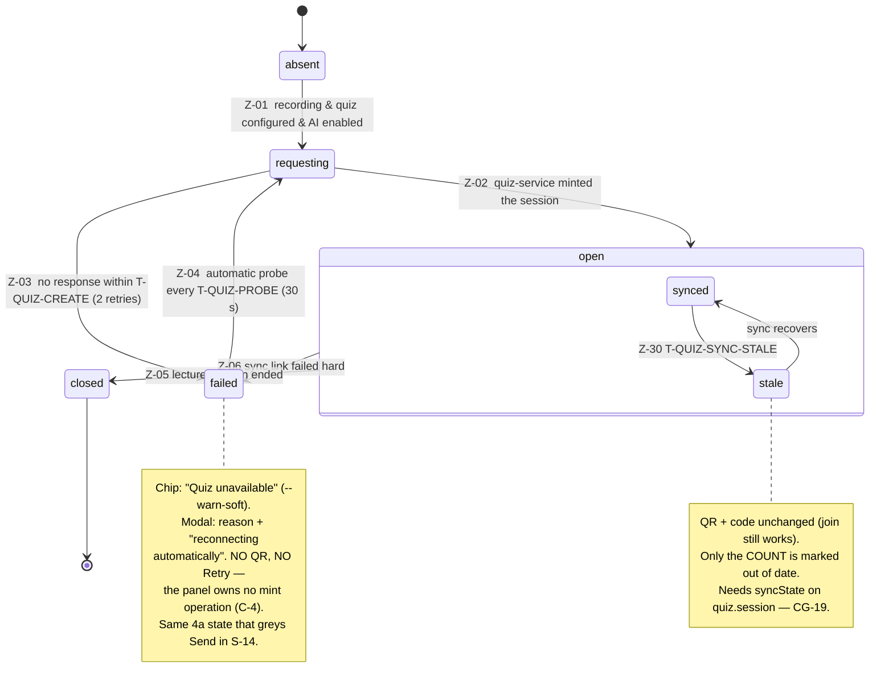

# S-20 Quiz join / QR card — the header-chip + join modal — wireframe & screen design

> Closes **W-4** in [screen-inventory §9](../screen-inventory.md#9-screens-needing-wireframe-approval)
> ("New (A-22); **placement in a full 430 px column is the open question**") and
> settles **SI-D-4** ("Quiz QR placement"). Nothing in this document may be
> contradicted by a plan or by generated code; if it must change, that is a gate
> discussion, not an in-run improvisation
> ([frontend-conventions](../frontend-conventions.md) preamble).
>
> **Status:** ✅ **approved 2026-08-08**, Wave 4 design gate. Blocks: J-3 (the
> student join journey's device-side half). Depends on: [S-13](../screen-inventory.md#3-lecturer-panel--ai-studio-insights--quiz)
> (the AI Studio card that hosts the chip) and [S-05](../screen-inventory.md#s-05-dashboard--session-live)
> (the composition and its vertical budget).
> Siblings: [S-42](../screen-inventory.md) — the projector-side join QR, the same
> `joinUrl` encoded for a different viewer and a different distance;
> [S-14](../screen-inventory.md#s-14-questions-review-modal) — its **Send to
> Projector** is the control this screen's `failed` state explains.
>
> **This is a small read-only surface with one load-bearing job:** answer the
> lecturer's question *"has anyone joined?"* and give the room a panel-side way in
> when the projector isn't showing the QR — without spending a pixel of a vertical
> budget that has none to give.

---

## 0. Evidence base

| Source | What it fixed here |
|---|---|
| [screen-inventory §2 S-20](../screen-inventory.md#s-20-quiz-join--qr-card-overlay-or-right-column-card-on-s-05) | The six states, the `getQuizSession`/`quiz.session` data, "commands: none", the QR ≥ 240 px rule, "never hover-revealed", and the sentence this document answers: *"Placement is the open question (§9)"* — with its own recommendation (the chip → modal) as the starting point |
| [screen-inventory §2 S-05](../screen-inventory.md#s-05-dashboard--session-live) | The composition: dark AI Studio card in the main column, a **430 px right column already full** with S-07 + S-08 + insights, and *"the vertical budget is the hard constraint"* |
| [screen-inventory §2 S-13](../screen-inventory.md) | The AI Studio card that hosts the chip; its **dark scope** (`.us-assistant` re-declares `--surface`/`--text`/`--accent`) that nested children inherit; that it **blocks S-20** |
| [screen-inventory §9 W-4](../screen-inventory.md#9-screens-needing-wireframe-approval) | The gate this closes; *"placement in a full 430 px column is the open question"* |
| [screen-inventory §0.3](../screen-inventory.md#03-universal-states--implemented-once-inherited-by-every-screen) | U-1 (cold skeleton), U-2 (reconnecting — dim, never hide), U-5 (refusal in plain language) — inherited, not re-invented |
| [screen-inventory §8](../screen-inventory.md) | Every token used below; the 680 px `--modal-w`; **no new colour, size or spacing value** |
| [state-machines §5.1 Machine 4a](../state-machines.md) | The whole lifecycle: `absent → requesting → open → closed`, `requesting/open → failed`, transitions Z-01…Z-06 and their guards — including **Z-01's `aiEnabledAtStart` guard** (§1 C-1) |
| [state-machines §5.4 Machine 4d](../state-machines.md) | `syncState = stale` (Z-30) — the joined-count staleness this screen must surface without fabricating (INV-AP-2, QZ-7) |
| [state-machines §7 timings](../state-machines.md) | `T-QUIZ-CREATE` 8 s / 2 retries (Z-03), `T-QUIZ-PROBE` 30 s automatic retry (Z-04) — the reason there is **no panel Retry button** (§1 C-4) |
| [state-machines §8](../state-machines.md#8-prototype-ui--state-mapping-the-mandated-hand-check) | The two *(new)* rows: "join QR + joined count → 4a `open`" and "quiz unavailable → 4a `failed`" |
| [`contracts/openapi.yaml`](../../../contracts/openapi.yaml) v0.3.0 | `getQuizSession` → `QuizSessionProjection{state, joinUrl, joinCode(≤8), joinedCount, syncState}`; **no QR-image operation** (§1 C-3); **no panel session-mint operation** (§1 C-4) |
| [`contracts/events.md` §2.15](../../../contracts/events.md) v0.4.0 | `quiz.session` payload `{state, quizSessionId, joinUrl, joinCode, joinedCount, syncState}` — `syncState` added by **CG-19** (§9), coalesced ≤ 1/s; `system.alert{quiz.unavailable}` for `failed` |
| [`contracts/events.md` §4](../../../contracts/events.md) | `sync.participants{joinedCount, onlineCount}` — the device holds both, `quiz.session` surfaces **only `joinedCount`** (§1 C-6) |
| [PRD QZ-2](../../PRD.md) | *"The projector overlay's QR takes a student straight to the active session"* — the panel QR is the **fallback** for students who can't read it (S-20 purpose) |
| [PRD J-2 / J-3](../../PRD.md) | The projector shows the join QR **only once a question is published**; before that it is slides passthrough — which is why the panel is the *pre-publication* join surface (§12, **QO-1**) |
| [PRD LP-18](../../PRD.md) | AI-degraded mode: *"sync failure degrades the panel visibly without affecting recording"* — the `failed`/`stale` states, kept off the recording path |
| [PRD G-5](../../PRD.md) | *"Every control in the shipped UI verifiably affects the system"* — the reason a Retry button that maps to no operation is forbidden here (§1 C-4) |
| [behavioral-inventory](../../discovery/behavioral-inventory.md) | Checked directly: **no `B-*` quiz / QR / join item exists.** S-20 is net-new (A-22); there is nothing legacy to preserve, and the whole constraint set is contract + parity + kiosk budget |
| [open-decisions SI-D-4](../../discovery/open-decisions.md) | The placement recommendation this document adopts and settles |
| [open-decisions D-21](../../discovery/open-decisions.md#d-21--class-roster-provenance-for-quiz-identity--leaderboard) | Student identity / `joinCode` namespace is quiz-service-owned; the panel renders the code **as received** (§1 C-6, §11 S20-D-7) |

---

## 1. Constraints that are not design choices

**C-1. A quiz session exists only when AI is enabled — so the AI Studio card is
always present when this screen has anything to show.** Machine 4a's first
transition, Z-01, is guarded by `quizServerBaseUrl ≠ null ∧ **aiEnabledAtStart**`.
There is no path to `requesting`/`open`/`failed` in a room where the AI flag is
off. That is what makes *"a chip in the AI Studio header"* coherent rather than
orphaned: S-05's `ai disabled` layout (INT-10, the go-live default) hides the
whole studio — and in exactly that layout there is **no quiz either**, so there is
nothing for the chip to carry. The chip and its host appear and disappear
together, by construction. This is not a placement convenience; it is why the
placement is sound.

**C-2. The vertical budget is the whole problem.** S-05's own notes call it *"the
hard constraint"*: 800 px − 62 px header − 28 px main padding − two bottom bars,
with the 430 px right column already spent on S-07 + S-08 + insights and a
mutual-exclusion accordion that exists *because* of the budget. Any always-on
join surface — a right-column card, a strip in the studio body — is bought with
pixels the layout does not have. The steady state must therefore cost **zero
vertical pixels**, which a header chip does and a card does not (§11 S20-D-1).

**C-3. There is no QR-image endpoint, and none is needed.** `getQuizSession`
returns `joinUrl` as a **string**; `quiz.session` carries the same string. No
operation returns a rendered QR. The panel therefore **encodes `joinUrl`
client-side** into the QR bitmap. This is not a gap — a QR is a pure function of
its payload, and a server-rendered image would be a larger thing to move for no
benefit. §9 asks for nothing here.

**C-4. The panel cannot mint or re-mint a session — so a Retry button would be a
placebo.** Minting is server-to-server: `quizSyncCreateSession`
(device → quiz-service, `quiz-sync` tag) is not a panel-reachable operation, and
after a failure Machine 4a **retries automatically** — Z-04 probes every
`T-QUIZ-PROBE` (30 s) with no human in the loop. A panel button labelled *Retry*
would either call nothing (a dead control, G-5) or duplicate an automatic probe
(a control that pretends the user is driving recovery they are not). This is the
same anti-placebo rule S-11 applied to dead hardware, here applied to a recovery
the panel does not own. **S-20's `failed` state states that reconnection is
automatic; it offers no button.** (Contrast S-13's `degraded`, which *does* carry
Retry — because `generateNow` is a real panel command. The difference is the
endpoint, not the mood.)

**C-5. "Readable by a student two rows back" is a claim about QR geometry.** A QR
scanned from a phone at 3–5 m needs physical size and quiet-zone margin, not
styling. S-20's own note fixes the floor at **≥ 240 px**; below it the code is a
decoration, not a scan target. A chip-sized QR cannot meet this — which is the
positive reason the QR lives in a **modal** (big, on demand) and only a
**count** lives on the chip (§11 S20-D-1). The modal is not a disclosure nicety;
it is what lets the QR be large enough to work.

**C-6. `joinedCount`, not `onlineCount`; and the join code is opaque.** The device
holds both counts (`sync.participants{joinedCount, onlineCount}`), but
`quiz.session` surfaces only `joinedCount` — and *"has anyone joined?"* is a
`joinedCount` question, so the screen shows that and does not invent an
online/offline split the event does not carry. Separately, `joinCode` (≤ 8 chars)
is minted by quiz-service, whose URL/code namespace is its own (DM-15, D-21). The
panel renders whatever string arrives and **makes no assumption about its format**
— no digit grouping, no case-forcing, no validation. A panel that reformats a code
it does not own can only be wrong.

**C-7. This screen never touches the recording path.** LP-18 is explicit: quiz
sync failure *"degrades the panel visibly without affecting recording"*. Every
`failed`/`stale` rendering below is a statement about the quiz, rendered in the
studio's scope, and reaches nothing in S-03's recording chrome or S-07's timer.
The red/amber recording frame is not this screen's to touch.

---

## 2. Wireframe

**The design in one sentence:** a state-carrying **chip** in the AI Studio card
header answers *"has anyone joined?"* at zero vertical cost, and a **680 px modal**
— opened only on demand — carries the ≥ 240 px QR, the join code and the join URL
for a student who needs the panel because the projector isn't showing them the way
in.

### 2.1 The chip, in the AI Studio header

```
┌ EDUSCOPE AI STUDIO ────────────────────────  [ ▦ Quiz · 24 joined ] ─┐  header
│  (dark scope — .us-assistant re-declares --surface / --text / --accent) │
│                                                                         │
│   ⟳ Next set in 12:45        Interval [ 20 ▾ ]        [ Generate Now ]   │
│   … generation controls (S-13) …                                        │
└─────────────────────────────────────────────────────────────────────────┘
```

The chip sits at the **trailing edge of the S-13 header**, in the studio's dark
scope, so it inherits `--text`/`--accent` and needs no literal colours. It is a
real ≥ 44 px tap target (§8). It is the *only* steady-state footprint of this
entire screen.

### 2.2 The chip's states — the whole of Machine 4a on one control

```
absent      (not rendered)                     ── no session; feature not present here
requesting  [ ◌ Quiz · starting… ]             ── non-interactive, bounded ≤ 8 s (C-4, U-4)
open        [ ▦ Quiz · 24 joined ]             ── tap → modal (§2.3)
open+stale  [ ▦ Quiz · 24 joined · ⚠ ]         ── count dimmed + stale dot; tap → modal (§2.4)
failed      [ ⚠ Quiz unavailable ]             ── --warn-soft chip; tap → modal (§2.5)
closed      (unmounts with the session)        ── the lecture is ending; nothing to join
```

**The chip is legible without opening anything.** *"24 joined"* answers the
lecturer's actual question on the header, and `Quiz unavailable` on the header is
the same fact that greys out **Send to Projector** in S-14 — one truth, two places
(§11 S20-D-5). Only the QR — the one thing that needs 240 px — is behind a tap.

### 2.3 The modal — `open`

```
┌──────────────────────────  Quiz join  ─────────────────────────[ ✕ ]┐   680 px
│                                                                      │
│   Students can scan this code, or join at the address below.         │
│                                                                      │
│                  ┌────────────────────────┐                          │
│                  │                        │                          │
│                  │        █▀▀▀▀▀█         │                          │
│                  │        █ QR  █          │   ≥ 240 × 240 px         │
│                  │        █▄▄▄▄▄█          │   encodes joinUrl (C-3)  │
│                  │                        │                          │
│                  └────────────────────────┘                          │
│                                                                      │
│                  Join code                                           │
│                  ┌──────────────┐                                    │
│                  │  QUIZ-4821   │   ≤ 8 chars, --fs-2xl, as-received  │
│                  └──────────────┘                                    │
│                                                                      │
│                  quiz.example.edu/j/QUIZ-4821    ── the joinUrl text  │
│                                                                      │
│  ──────────────────────────────────────────────────────────────     │
│   ● 24 joined                                    updated just now     │
│                                                                      │
└──────────────────────────────────────────────────────────────────────┘
```

Three ways in, one payload: **scan** the QR, **type** the code at `/j/`, or read
the **URL**. All three are `joinUrl`/`joinCode` verbatim from the projection — no
derived or reformatted value (C-6). The footer restates `joinedCount` and its
freshness, so a lecturer who opened the modal *because* they were unsure gets the
answer without closing it.

### 2.4 The modal — `open` with `syncState = stale`

```
│   … QR and join code unchanged — the way in still works …            │
│  ──────────────────────────────────────────────────────────────     │
│   ● 24 joined   ·  may be out of date          last synced 2 min ago  │
│     --text-muted                                --warn                 │
```

**The QR and code do not change when sync goes stale** — the session is still
`open`, the join URL is still valid, students can still join; what the device has
lost is fresh *counts*, not the session. So the two join affordances stay solid
and only the **count** is marked out of date, with the last-synced time. This is
INV-AP-2 / QZ-7 made literal: *mark stale, never display stale as current, never
fabricate*. It is also why this screen needs **CG-19** — see §9.

### 2.5 The modal — `failed`

```
┌──────────────────────────  Quiz join  ─────────────────────────[ ✕ ]┐
│                                                                      │
│   ⚠  Quiz unavailable — questions can't be sent.                     │
│      --warn                                                          │
│                                                                      │
│   This device can't reach the quiz server, so there's no session     │
│   for students to join, and Send to Projector stays off until it     │
│   reconnects.                                                        │
│                                                                      │
│   Reconnecting automatically…                                        │
│   --text-muted   (Machine 4a Z-04 probes every 30 s — no button, C-4) │
│                                                                      │
└──────────────────────────────────────────────────────────────────────┘
```

**No QR — there is no session to encode.** **No Retry button — the panel owns no
mint** (C-4); the sentence tells the lecturer recovery is automatic so they are
not left hunting for a control that would do nothing. And it names the
*consequence they will actually hit*: **Send to Projector is off**. That is the
join between this screen and S-14 — the disabled Send there is explained here,
both bound to the same 4a `failed` (§11 S20-D-5).

### 2.6 `requesting` and cold load — bounded, never an open spinner

`requesting` is transient by contract — Z-02 or Z-03 resolves it within
`T-QUIZ-CREATE` (8 s). The chip shows `Quiz · starting…` and is not tappable;
if the modal is somehow open across the transition it shows the same bounded
"starting…", never an indefinite spinner (U-4, §0.3). On cold load (U-1) the chip
renders a skeleton in its own shape from the `getQuizSession` REST snapshot — no
layout shift, no guessed count.

### 2.7 What the chip never does

| Never | Why |
|---|---|
| Show a count it cannot vouch for as current | INV-AP-2 / QZ-7 — `stale` marks it; it is not shown as live (§2.4, CG-19) |
| Offer a Retry / reconnect button | The panel owns no mint operation; recovery is automatic (C-4) |
| Reveal the QR or code on hover | No hover-only affordance anywhere (§0.4); the modal is an explicit tap |
| Reformat or validate the join code | The code namespace is quiz-service's (C-6) |
| Appear in the `ai disabled` layout | No AI ⇒ no quiz session ⇒ nothing to render (C-1) |
| Touch S-03's recording chrome | LP-18 — quiz degradation never reaches the recording path (C-7) |

---

## 3. The disclosure pattern, stated for reuse

S-20 is not a product-wide pattern the way S-11's `NotConnectedRegion` is — there
is one quiz join surface, not a class of them. But it applies two rules already
established elsewhere, and records that it is applying them, not inventing them:

- **QC-1 — Cost the steady state nothing; pay for size on demand.** A value the
  lecturer glances at (a count) lives on always-visible chrome; a thing that needs
  real estate to function (a ≥ 240 px QR) lives in a modal opened on tap. This is
  the same trade S-11 made when it refused to grow the room-controls bar, applied
  to a different scarcity.
- **QC-2 — A control maps to an operation, or it does not exist.** No Retry button
  without a mint endpoint (C-4); no reformatted code without owning the namespace
  (C-6). This is S-11's anti-placebo rule (RC-D-2) and G-5, re-applied.

If a future surface needs to show the same join session (it should not — the
projector is S-42's), it inherits these two rules and the modal, not a second
design.

---

## 4. Component breakdown

```
apps/panel/src/screens/quiz/
  quiz-join-chip.tsx       header chip: state label + tap → modal; the only steady footprint
  quiz-join-modal.tsx      the 680 px modal shell and its per-state body
  quiz-qr.tsx              encodes joinUrl → QR bitmap client-side (C-3); pure, no data source
  use-quiz-session.ts      one selector over the WS store + getQuizSession snapshot
```

| Unit | What it does | How you use it | What it depends on |
|---|---|---|---|
| `quiz-join-chip.tsx` | Renders the current 4a state as a header chip; tappable only in `open`/`failed`; issues **no** command | `<QuizJoinChip/>` mounted in the S-13 header | `use-quiz-session` |
| `quiz-join-modal.tsx` | The modal shell (S-14's 680 px pattern) and the four bodies of §2.3–§2.5 | `<QuizJoinModal open={…} onClose={…}/>` | `use-quiz-session`, `quiz-qr` |
| `quiz-qr.tsx` | `joinUrl → <svg>` QR at a caller-given size, error-correction level M, with quiet-zone margin. **Pure function of its prop** | `<QuizQr value={joinUrl} size={240}/>` | a QR-encoding lib only — **no client, no store** |
| `use-quiz-session.ts` | One atomic read of `QuizSessionProjection` merged from the `getQuizSession` snapshot and `quiz.session` events, through `selectors.ts` (frontend-conventions §1) | `const s = useQuizSession()` | `EduscopeClient.getQuizSession`, WS `quiz.session`, `system.alert{quiz.unavailable}` |

**`quiz-qr.tsx` takes no data source and never will** — exactly like S-11's
`NotConnectedRegion`, the enforcement is structural: a QR component that can only
receive a string cannot be wired to a placebo state later, and it cannot leak the
join session anywhere it should not go. It renders what it is handed and nothing
else.

**The chip and modal read one selector, not two.** Both bind the same
`QuizSessionProjection` through `use-quiz-session`, so the header count and the
modal footer count are the *same value by construction* and cannot disagree — the
same "one control, one truth" discipline S-09/S-11 use for the mic.

---

## 5. States

### 5.1 The join surface — Machine 4a, verbatim

| # | State | Entered by | Chip | Modal | Governed by |
|---|---|---|---|---|---|
| 1 | `absent` | Z-00 default; `quizServerBaseUrl` null **or** not recording | **not rendered** | — | S-20 states; C-1 |
| 2 | `requesting` | Z-01 (R-05, `G-QUIZ-AVAILABLE ∧ aiEnabledAtStart`) | `Quiz · starting…`, non-interactive | bounded "starting…" | Z-01; U-4 |
| 3 | `open` | Z-02 (mint ≤ `T-QUIZ-CREATE`) | `Quiz · N joined`, tappable | §2.3 — QR + code + URL + count | Z-02, QZ-2 |
| 3s | `open` + `syncState=stale` | Machine 4d Z-30 (`T-QUIZ-SYNC-STALE`) | count dimmed + stale dot | §2.4 — join intact, count marked stale | Z-30, INV-AP-2, QZ-7; **needs CG-19** |
| 4 | `failed` | Z-03 (mint expiry after 2 retries) or Z-06 (sync link hard-fail) | `Quiz unavailable`, `--warn-soft` | §2.5 — reason + "reconnecting automatically", no QR, no button | Z-03/Z-06, LP-18, C-4 |
| 5 | `closed` | Z-05 (R-11, lecture ends) | **unmounts** | closes if open | Z-05 |
| — | U-1 | cold load | skeleton chip from REST snapshot | — | §0.3 |
| — | U-2 | `T-WS-STALE` (10 s) | chip **dimmed**, count frozen at last value with a reconnecting marker (never hidden) | modal usable read-only; count marked not-live | §0.3 |
| — | U-5 | n/a | **no command exists on this screen to refuse** | — | §0.3 (recorded as inapplicable) |

Two notes on the universal states:

- **U-2 dims, it does not hide.** Losing the event socket does not end the quiz
  session; the last-known count is frozen and marked not-live (same discipline as
  `stale`), and the QR/code — which are static strings — stay perfectly usable, so
  a student can still join while the *panel's* link is flapping.
- **U-5 does not apply and that is recorded, not omitted.** S-20 issues no
  command (the device auto-requests the session), so there is no pressed control
  for a refusal to attach to. The one refusal a lecturer *will* meet — Send to
  Projector while `failed` — belongs to **S-14**, and this screen's `failed` modal
  is its explanation (§11 S20-D-5).

### 5.2 The QR component — no states, by design

`quiz-qr.tsx` has **one rendering** per `joinUrl`. No loading (it computes
synchronously), no error (a non-empty string always encodes), no empty (it is only
mounted in `open`/`stale`, where `joinUrl` is present). It is modelled in no state
machine — like S-11's inert rows, a machine here would be the first step toward a
QR that means something other than its payload.

### 5.3 Diagram



---

## 6. Copy deck

| Where | Copy |
|---|---|
| Chip — `requesting` | `Quiz · starting…` |
| Chip — `open` | `Quiz · {n} joined` *( `Quiz · 1 joined` / `Quiz · 0 joined` — no "no-one yet" euphemism; 0 is a fact the lecturer asked for )* |
| Chip — `open` + stale | `Quiz · {n} joined ·` ⚠ |
| Chip — `failed` | `Quiz unavailable` |
| Chip — aria-label | `Quiz join. {n} joined. Opens join code and QR.` / `Quiz unavailable. Opens details.` |
| Modal title | `Quiz join` |
| Modal — `open` lead | `Students can scan this code, or join at the address below.` |
| Modal — join code label | `Join code` |
| Modal — footer | `● {n} joined` · `updated just now` / `updated {t} ago` |
| Modal — stale footer | `● {n} joined · may be out of date` · `last synced {t} ago` |
| Modal — `failed` head | `Quiz unavailable — questions can't be sent.` |
| Modal — `failed` body | `This device can't reach the quiz server, so there's no session for students to join, and Send to Projector stays off until it reconnects.` |
| Modal — `failed` status | `Reconnecting automatically…` |
| QR alt text | `Join QR for code {joinCode}. Or go to {joinUrl}.` |

Three notes:

- **`Quiz · 0 joined` is shown, not softened.** *"Has anyone joined?"* deserves a
  straight *no* when the answer is no. "Waiting for students" reads as a system
  state; `0 joined` reads as the count it is.
- **The `failed` copy names the consequence** (*Send to Projector stays off*), the
  same way S-11's mic-failure copy names *which way the mute fell*. "Quiz
  unavailable" alone leaves a lecturer guessing what they've lost.
- **"questions can't be sent"** is quoted from the screen-inventory / state-machines
  §8 wording verbatim, so the panel says the same thing the contract's alert does.

---

## 7. Token usage

**No new token.**

| Element | Tokens |
|---|---|
| Chip | `--surface-2` within the studio's dark scope, 1 px `--border`, `--radius-pill`, `--fs-sm` / 600, `--sp-2` padding, ≥ `--tap-min` (44) hit area |
| Chip icon (▦ QR glyph) | 18 px, `--text-muted` |
| Chip — `open` | `--text` label, `--accent` count dot if used |
| Chip — stale marker | `--warn` dot; count to `--text-muted` |
| Chip — `failed` | `--warn-soft` fill, `--warn` text/icon |
| Modal shell | `--modal-w` (680), `--surface`, `--radius-xl`, `--sp-10` (24) padding, `--shadow-lg` |
| Modal title | `--fs-lg` / 700, `--text` |
| Modal lead / URL | `--fs-sm`, `--text-muted` |
| QR frame | white plate, `--radius-md`, `--sp-5` quiet-zone padding, **≥ 240 px** (C-5) |
| Join code | `--fs-2xl` / 700, `--text`, `--surface-2` plate, `--radius-md` |
| Footer count | `--fs-sm`, `--text`; freshness `--text-muted`; stale freshness `--warn` |
| `failed` head | `--fs-md` / 600, `--warn` |
| `failed` body / status | `--fs-sm`, `--text-muted` |
| Modal close ✕ | existing icon-button, ≥ `--tap-min` |

The QR plate is deliberately **white regardless of theme** — a QR needs
light-module / dark-module contrast to scan, and it is the one element whose
colours are a functional requirement, not a design choice. Everything else sits in
the studio's dark scope and inherits it. `--warn` / `--warn-soft` are the existing
semantic warning pair (§8.2); if a plan finds they are not yet defined, that is a
token-sheet question for the gate, **not** a new colour invented in-run.

> **Token check for the reviewer:** this design assumes `--warn` / `--warn-soft`
> exist in §8.2 alongside `--danger` / `--info`. If they do not, the `failed` and
> `stale` treatments fall back to `--info` (the existing non-destructive "attention"
> pair) rather than minting a colour. Flagged here rather than assumed.

---

## 8. Touch, kiosk & accessibility

- **Chip is a real target:** ≥ 44 px hit area, ≥ 8 px from the nearest S-13 control
  (Generate Now / interval). It is a `button` with `aria-haspopup="dialog"`.
- **Modal:** standard 680 px overlay (S-14's pattern); focus trapped, `Esc` and a
  ≥ 44 px ✕ both close, focus returns to the chip. Opening it does **not**
  re-render S-13 (it is a sibling overlay, not a child of the studio body).
- **QR ≥ 240 px** with quiet-zone margin (C-5); it is never hover-revealed and
  never shrinks below the floor to fit — if a future layout can't hold 240 px, that
  is a design bug, not a smaller QR.
- **No text input** on this screen, so no on-screen keyboard is involved; the join
  code is display-only (students type it on *their* phones, not the panel).
- **Screen readers get the join info as text, not a picture.** The QR carries
  `alt` = the code + URL; the modal announces `{n} joined` and the freshness. A
  lecturer using a screen reader can read out the code/URL to the room even though
  the QR itself is unscannable to them.
- **Colour is never the sole carrier.** `failed` pairs `--warn` with the words
  "Quiz unavailable"; `stale` pairs the ⚠ dot with "may be out of date". Greyscale
  and colour-blind reading both survive.
- **`prefers-reduced-motion`:** the only motion is the modal's existing fade/scale
  and the chip's state cross-fade; both must survive the reduced-motion block — no
  information is carried by motion (a spinner is bounded, never the state signal).
- **No page scroll; the chip adds no height** to S-13's header (it sits in existing
  header chrome), and the modal is an overlay — neither participates in the vertical
  budget C-2 protects.

---

## 9. Contract changes this design requires

**One — CG-19 (additive, small).**

### CG-19 — `quiz.session` cannot say the joined count is stale

`QuizSessionProjection` (REST) carries `syncState ∈ {synced, stale, failed}` and it
is a **required** field — so on cold load and on any U-3 resync the panel knows
whether the count is fresh. But the WS `quiz.session` payload
([events.md §2.15](../../../contracts/events.md)) is
`{state, quizSessionId, joinUrl, joinCode, joinedCount}` — it **omits `syncState`**.

Machine 4d's staleness is emitted on `quiz.publication` and `quiz.responses`
(§2.16 / §2.17) — those drive the **Insights** panel's stale marker (S-16/S-17),
not the **joined count**. So *live*, between REST snapshots, a device whose
`sync.participants` stream has gone quiet (link degraded, Z-30 `stale`) keeps
broadcasting the last `joinedCount` on `quiz.session` with no way to mark it
out of date — and the chip would show a two-minute-old count **as current**. That
is precisely the display INV-AP-2 and QZ-7 exist to forbid: *mark stale, never
present stale as live.*

| | |
|---|---|
| **Gap** | WS `quiz.session` payload omits `syncState`, which the REST projection already carries and requires |
| **Screen** | S-20 (state 3s `stale`, §2.4 / §5.1); no other screen consumes it |
| **Severity** | **Medium** — without it, S-20's `stale` state is unreachable over the live socket and the chip silently shows stale counts as current on a degraded sync link (the exact QZ-7 failure the state exists to show) |
| **Fix** | Add `syncState` to `QuizSessionPayload` in events.md §2.15, mirroring `QuizSessionProjection.syncState`. **Additive** — one field, already modelled and named in the REST schema; the emitter (core-api Machine 4a/4d) already holds the value |
| **Status** | ✅ **applied v0.4.0** (2026-08-08) — events.md §2.15 `QuizSessionPayload` carries `syncState`; registered as CG-19 in [screen-inventory §10](../screen-inventory.md#10-contract-gaps) |
| **If rejected** | S-20's `stale` state degrades to *snapshot-only*: the chip cannot flip to stale live and must instead **poll `getQuizSession` on a `T-QUIZ-SYNC-STALE` cadence** to detect it — strictly worse (a REST poll to recover a value the socket already has in hand), and recorded here so the fallback is a decision, not a silent omission |

### 9.1 Changes this design deliberately does **not** require

- **No QR-image endpoint.** A QR is a pure function of `joinUrl`; the panel encodes
  it client-side (C-3). Shipping a bitmap from the server would be more bytes for a
  value the client already holds.
- **No panel session-mint / retry operation.** Minting is server-to-server and
  recovery is automatic (C-4); a panel-facing mint or retry endpoint would exist
  only to back a button this design refuses to draw.
- **No `onlineCount` on `quiz.session`.** The screen answers a `joinedCount`
  question (C-6); surfacing `onlineCount` would invite an online/offline UI the
  event does not otherwise support and the lecturer did not ask for.
- **No new join-code shape or validation.** The code namespace is quiz-service's
  (D-21); the panel renders the string as received.

---

## 10. Mock & scenario work Wave 4 inherits

| Gap | Where | Fix |
|---|---|---|
| The `stale` state (3s) cannot be demonstrated until CG-19 lands | `packages/api-client/src/mock/ws/` quiz | Once `syncState` is on `quiz.session`, the mock emits `open` then flips `syncState: stale` under the `quiz-network-loss` script — the joined count freezes and the chip/modal mark it out of date |
| `failed` (Z-03 mint timeout, Z-06 sync hard-fail) | `mock/scenario/scripts/quiz-network-loss` | **Extend, never fork** the existing script (frontend-conventions §4): drive `requesting → failed` with `system.alert{quiz.unavailable}`; assert **no Retry control** renders and the modal shows "reconnecting automatically" |
| Joined-count churn (coalesced ≤ 1/s) | `mock/ws/` quiz | Emit `quiz.session` joined-count updates at ≤ 1/s so the chip's live count and the coalescing budget are exercised as contracted (events.md §2.15) |
| The QR must encode the *real* `joinUrl`, not a placeholder | `mock/rest/` quiz | Mock `getQuizSession` returns a scannable `joinUrl` + `joinCode` so the QR path is testable end-to-end (a mock URL that doesn't resolve is fine — the encoding is what's under test) |
| `requesting → open` within `T-QUIZ-CREATE` | `mock/scenario/scripts/happy` | `happy` gains the timed `Z-02` so the bounded "starting…" is exercised and proven not to become an open spinner |

---

## 11. Decisions taken here

| Id | Decision | Rationale | Cost to reverse |
|---|---|---|---|
| **S20-D-1** | **Placement: a state-carrying chip in the S-13 AI Studio header, opening a 680 px join modal** (settles W-4 / SI-D-4) | The 430 px column is full and the vertical budget has no slack (**C-2**); a chip costs zero steady-state pixels while a card costs real ones. The QR needs ≥ 240 px to scan (**C-5**), which only a modal affords. And the host is always present exactly when the quiz exists (**C-1**), so the chip is never orphaned | Medium — it is the screen's shape |
| **S20-D-2** | **S-20 issues no command and draws no Retry button; `failed` states that reconnection is automatic** | The panel owns no session-mint operation and Machine 4a retries on its own (Z-04, **C-4**). A Retry button would call nothing or duplicate an automatic probe — G-5's placebo, S-11's rule re-applied | Low |
| **S20-D-3** | **The QR is encoded client-side from `joinUrl`; `quiz-qr.tsx` takes no data source** | A QR is a pure function of its payload (**C-3**); a component that can only receive a string cannot be wired to a placebo later (S-11 S11-D-7's enforcement logic) | Low |
| **S20-D-4** | **The chip carries all of Machine 4a — count in `open`, warning in `failed`, stale marker in `stale` — legibly without opening the modal** | *"Has anyone joined?"* is answered on the header; only the QR hides behind a tap. The lecturer's question does not require a modal to answer | Low |
| **S20-D-5** | **`failed` is the panel-side explanation of S-14's disabled Send; both bind the same 4a `failed`** | One truth, two surfaces. A greyed Send with no stated cause leaves a lecturer guessing; the chip/modal name the cause and the consequence in the same words the contract's alert uses | Low |
| **S20-D-6** | **Show `joinedCount`, not `onlineCount`; mark it stale rather than hide or fabricate it** | `quiz.session` surfaces only `joinedCount` (**C-6**), and *"has anyone joined?"* is a joined question. INV-AP-2 / QZ-7 require stale-marking, not concealment or invention | Low — but depends on **CG-19** for the live path |
| **S20-D-7** | **Render `joinCode` and `joinUrl` verbatim — no reformatting, grouping, case-forcing or validation** | The code/URL namespace is quiz-service's (DM-15, D-21, **C-6**). A panel that reformats a code it does not own can only introduce a mismatch | Low |
| **S20-D-8** | **The QR plate is white in both themes** | Scannability is a contrast requirement, not a style choice; it is the one element whose colours are functional | Low |

---

## 12. Requirements this screen places on other screens

- **S-13 hosts the chip in its header** and must leave a ≥ 44 px, ≥ 8-px-separated
  slot at the header's trailing edge, in the studio's dark scope. The chip is
  mounted by S-13, not reimplemented per S-05 layout.
- **S-14's disabled Send and S-20's `failed` are the same truth.** Both read 4a
  `failed` / `G-QUIZ-AVAILABLE` through the same selector; a test asserts they
  cannot disagree (one shows unavailable while the other still offers Send).
- **S-16 / S-17's stale marker and S-20's stale count are different stalenesses.**
  Insights staleness rides `quiz.publication` / `quiz.responses` (§2.16/§2.17);
  the joined-count staleness rides `quiz.session.syncState` (**CG-19**). They must
  not be conflated into one flag — a live session with stale *responses* can still
  have a fresh *joined count*, and vice versa.
- **S-42 (W-12) owns the projector-side join QR** — the same `joinUrl`, encoded for
  a 10–20 m read, shown only when a question is published. S-20 is the panel-side
  path, and the relationship between them is the subject of **QO-1** (§ open
  decisions). S-20 does not assume S-42's behaviour; it records the dependency.
- **The shell (S-03) owns `system.alert{quiz.unavailable}`.** How loud that alert
  is beyond S-20's chip and S-14's disabled Send is **QO-2** (§ open decisions);
  S-20 assumes the chip + S-14 are the primary carriers and the shell alert is a
  non-blocking notice, not a persistent banner.

---

## 13. Testing floor

- **Testing Library:** one rendering test per row of §5.1 — `absent` (renders
  nothing), `requesting`, `open`, `open`+`stale`, `failed`, `closed`, U-1, U-2 —
  plus the modal's `open` / `stale` / `failed` bodies.
- **The anti-placebo assertions**, the point of §11 S20-D-2 / S20-D-6:
  - In `failed`, the modal renders **no** `button` other than close, **no** input,
    **no** control matching `/retry|reconnect/i`. Querying for interactive roles in
    the `failed` modal expects exactly one (the ✕).
  - In `stale`, the joined count is **marked** (a test asserts the freshness text /
    stale marker is present and the count is not styled as live). If this ever
    fails, QZ-7 has been broken.
  - `quiz-qr.tsx` given the same `joinUrl` twice renders identical output and holds
    no state, client or store subscription (a structural test).
- **One truth across S-14:** a test driving a single 4a `failed` and asserting
  S-20's chip reads `Quiz unavailable` **and** S-14's Send is disabled with the
  matching reason.
- **The count is one value:** a test driving a single `quiz.session` joined-count
  event and asserting the header chip and the modal footer show the same number.
- **CG-19 live path** (the field is applied, v0.4.0): a test that a `quiz.session`
  with `syncState: stale` flips the chip/modal to the stale rendering **without** a
  REST refetch.
- **Playwright:** the primary journey (recording live → chip shows `starting…` →
  `N joined` → open modal → QR + code visible → close), plus the `quiz-network-loss`
  scenario as the failure path (chip → `Quiz unavailable`, modal explains, no Retry).
- **Contract honesty:** every mocked `getQuizSession` / `quiz.session` validates
  against the `contracts/` zod schemas, including `syncState` once CG-19 is applied.
