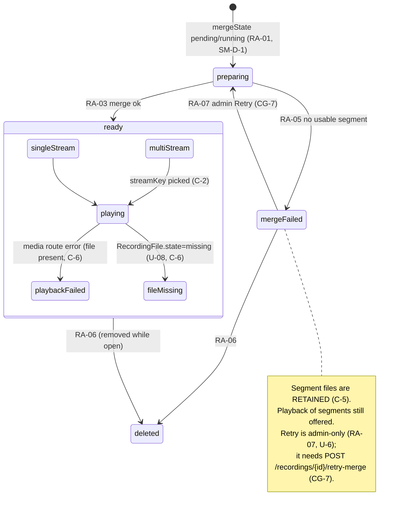

# S-22 Recording detail & player — files by stream, authenticated playback & the merge-retry exit — wireframe & screen design

> Closes **W-6** in [screen-inventory §9](../screen-inventory.md#9-screens-needing-wireframe-approval)
> ("Same row; authenticated playback is new (B-37)"). Nothing in this document may
> be contradicted by a plan or by generated code; if it must change, that is a
> gate discussion, not an in-run improvisation
> ([frontend-conventions](../frontend-conventions.md) preamble).
>
> **Status:** ✅ **approved 2026-08-09**, Wave 5 design gate. Depends on:
> [S-21](S-21-design.md) (the list this opens from, and the shared badge
> vocabulary). Blocks: nothing downstream, but it is the **only exit** for a
> `merge failed` recording — so [S-21](S-21-design.md#3-the-uploadmerge-badge-vocabulary-shared-with-s-35)'s
> badge #2 and [S-35](S-35-design.md)'s dead-letter row both assume this screen's
> Retry exists. Owns: **CG-7** (the merge-retry endpoint, §9).
>
> **This screen answers one lecturer question — *"did my lecture record
> correctly?"* — and gives an admin the one control that rescues a failed merge.**
> It replaces legacy's unauthenticated `/record/` playback (B-37) with
> authorization-checked, Range-based media, and it renders segments and files
> honestly — `truncated`/`crash` segments shown, not hidden (SEG-5).

---

## 0. Evidence base

| Source | What it fixed here |
|---|---|
| [screen-inventory §4 S-22](../screen-inventory.md#s-22-recording-detail--player-panel-libraryrecordingid) | The states (`loading`/`not found`/`forbidden`/`populated`/`preparing`/`merge failed`/`playing`/`playback failed`/`file missing`/`deleted`), the `getRecording`/`getRecordingMedia` data, the SEG-3 files-per-output rule, the custom-controls touch note, and *"prototype coverage none → wireframe required"* |
| [screen-inventory §4 preamble](../screen-inventory.md#4-lecturer-panel--recordings-library) | A-20 (everyone plays), authenticated playback (B-37 closed), A-12 (system merges — no user convert flow) |
| [screen-inventory §0.3](../screen-inventory.md#03-universal-states--implemented-once-inherited-by-every-screen) | U-1, U-2, U-5, U-6 — inherited |
| [screen-inventory §8](../screen-inventory.md#8-design-token-sheet) | Every token used below; no new value |
| [state-machines §1 SEG-2/3/5](../state-machines.md#1-machine-1a--recordingstate-the-spine) | **SEG-2** (order by `index`, never id arithmetic), **SEG-3** (a `separate-files` preset → one `RecordingFile` per `LayoutPreset.outputs` entry, per segment), **SEG-5** (`truncated`/`crash` segments participate in the merge; only zero-byte `failed` segments are excluded, and their rows are kept for audit) |
| [state-machines §2 Machine 1b](../state-machines.md#2-machine-1b--recording-artifact-and-1c--channel-consumer) | `mergeState` lifecycle; **RA-05** (finalizing → `failed`), **RA-07** (`failed` → `merging` via `cmd.recording.retry-merge`, admin, `G-ADMIN`) — the transition this screen exposes and CG-7 binds |
| [`contracts/openapi.yaml`](../../../contracts/openapi.yaml) `getRecording` | `GET /recordings/{recordingId}` → `RecordingDetail` (= `Recording` + `segments: RecordingSegment[]` + `files: RecordingFile[]`); `404` on absence; **authorization-checked per request** (INV-RC-6) |
| [`contracts/openapi.yaml`](../../../contracts/openapi.yaml) `getRecordingMedia` | `GET /recordings/{recordingId}/files/{fileId}/media` — HTTP **Range** (`200`/`206`), `?download=1` → Content-Disposition; **every request authenticated + authorization-checked** (INV-RC-6, `playbackAuthRequired`, B-37 closed) |
| [`contracts/openapi.yaml`](../../../contracts/openapi.yaml) `RecordingFile` | `{id, kind: segment\|merged\|derived, streamKey, container: mpegts\|mp4, sizeBytes, durationMs, state: writing\|finalized\|missing\|deleted, hasAudio, isUploadable}` — no consumer parses the filename (INV-RF-1, B-02) |
| [`contracts/openapi.yaml`](../../../contracts/openapi.yaml) `RecordingSegment` | `{index, startedAt, endedAt, durationMs, endReason: pause\|stop\|crash\|error\|takeover, state: capturing\|finalizing\|finalized\|truncated\|failed}` |
| [`contracts/events.md` §2.3](../../../contracts/events.md) | `recording.artifact` — drives `preparing`→`ready`/`failed` and the `deleted` case live |
| [PRD LP-10](../../PRD.md) | *"playback, download"* — the charter; playback is in-panel and authenticated |
| [behavioral-inventory B-37](../../discovery/behavioral-inventory.md#b-37-playbackdownload-of-recordings-via-nginx-record) | Legacy played/downloaded from an **unauthenticated** nginx `/record/`. **KEEP in-browser playback/download; CHANGE the unauthenticated static exposure** — this screen is that change |
| [behavioral-inventory B-34](../../discovery/behavioral-inventory.md#b-34-pause-segment-combining-cmb-on-file-manager-open) | Legacy merged on FM-open, user-initiated. **CHANGE to automatic (A-12)**; the only manual trace is an admin *retry* of a failed merge |
| [behavioral-inventory B-02/B-09](../../discovery/behavioral-inventory.md) | The `~1`/`~2` dual-file convention → now `streamKey` + `RecordingFile` rows (SEG-3), never a filename parse |

---

## 1. Constraints that are not design choices

**C-1. Playback and download are authenticated and authorization-checked on every
request.** `getRecordingMedia` closes B-37: the legacy `/record/` URL served every
recording to anyone on the network. Here, the `<video>` `src` is the
`getRecordingMedia` route carrying the panel's bearer credential, and **every**
Range request (`206`) is authorized per request (INV-RC-6). A lecturer opening
another lecturer's recording gets `403` (state `forbidden`), checked server-side,
not hidden client-side (the B-31 mistake this wave is built to avoid).

**C-2. Files are addressed by `id` and grouped by `streamKey`; no filename is ever
parsed.** A `separate-files` preset produces one `RecordingFile` **per output spec,
per segment** (SEG-3) — the `~1`/`~2` successor. The player groups files by
`streamKey` (the semantic output, e.g. "composite" vs "camera-2") and orders
segments by `index` (SEG-2), never by id arithmetic (B-25/B-10) and never by
reading a name (INV-RF-1). When there is more than one `streamKey`, the user
picks which deliverable to play (§2.3, §11 DTL-D-1).

**C-3. Honest segments: `truncated` and `crash` are shown, not swept.** SEG-5 keeps
`truncated`/`crash` segments in the merge and keeps `failed`-segment rows for
audit. This screen **renders those markers** on the segment list rather than
presenting a seamless lie — a lecture that lost 5 s at a pipeline seam (R-16, INT-6)
is honestly a lecture with a seam, and the person verifying the recording is the
person who most needs to know.

**C-4. Merge is automatic; the only manual control is an admin *retry of a
failure*.** A-12/SM-D-1 removed the user convert flow (B-34). The `preparing` state
here is read-only waiting; playback is offered on **what already exists** (the
segment files) while the merged file is produced. The single manual affordance is
**Retry** on a `merge failed` recording, shown to **admins only** (RA-07,
`G-ADMIN`) — and it needs an endpoint the contract does not yet have (§9, CG-7).

**C-5. A failed merge never destroys the segment files.** RA-05 → `failed` retains
the segment files (SEG-5); a failed merge is recoverable precisely because the
inputs survive. So `merge failed` still offers playback of the segments and, for an
admin, Retry — it is never a dead end that also lost the footage.

**C-6. `file missing` is a named consequence, not a blank player.** A
`RecordingFile.state = missing` means the upload job dead-lettered on that file
(U-08). The screen names that — *"this file is no longer on the device"* — and
distinguishes it from a **playback route error** (a transport failure on a file
that *is* present, C-1). Two different failures, two different messages; neither is
a frozen last frame.

---

## 2. Wireframe

**The design in one sentence:** a metadata header, a segment/file view grouped by
`streamKey` with honest seam markers, a custom touch video player fed by the
authenticated Range route, and — for a failed merge — an admin Retry that is this
screen's reason to own CG-7.

### 2.1 Populated — single deliverable (the common case)

```
┌ .us-panel 1280×800 ─────────────────────────────────────────────────────────┐
│  [Header S-03]                                                               │
│  ‹ Back to recordings                                                        │  back affordance (SI-D-1 router)
│  ────────────────────────────────────────────────────────────────────────── │
│  Data Structures — Lecture 12                              ● Uploaded        │  title --fs-2xl; badge from S-21 §3
│  Priya Fernando · Hall A · Fri 8 Aug 2026, 14:02 · 1:04:11 · 2.1 GB          │  meta --fs-sm --text-muted
│  ┌────────────────────────────────────┐  ┌──────────────────────────────┐   │
│  │                                    │  │ Segments                     │   │
│  │          [ video playing ]         │  │  1 · 14:02–14:41 · 39:00     │   │  segment list (by index, SEG-2)
│  │        (authenticated Range)       │  │  2 · 14:43–15:06 · 23:00 ⚠   │   │  ⚠ = truncated/crash (SEG-5)
│  │                                    │  │       seam: pipeline restart │   │
│  │  0:00 ─────────●──────────── 1:04  │  │  3 · 15:06–15:06 · —   ✕      │   │  ✕ = failed segment (audit only)
│  │  [ ⏸ ]  ⟲10  ⟳10      🔊  ⤢         │  └──────────────────────────────┘   │  custom controls (touch)
│  └────────────────────────────────────┘                                      │
│  Files                                                                       │
│  ┌──────────────────────────────────────────────────────────────────────┐   │
│  │ composite · mp4 · 2.1 GB · 1:04:11 · with audio        [ Download ⤓ ]  │   │  merged/derived deliverable
│  └──────────────────────────────────────────────────────────────────────┘   │
│  Download saves to this browser. To copy to a USB drive, use Copy to USB.    │  clarifies target (touch note)
└──────────────────────────────────────────────────────────────────────────────┘
```

The **player** is the merged/derived deliverable for the single `streamKey`. The
**segment list** is informational — it shows the seam structure (SEG-5 markers) but
is not the playback source once a merged file exists. **Files** lists the
downloadable deliverable(s). **Download** targets the browser and says so; the
copy-to-USB path is S-23 (touch note).

### 2.2 Populated — `preparing` (merge in flight, SM-D-1)

```
│  Algorithms — Lecture 11                                  ◐ Preparing…        │
│  ┌────────────────────────────────────┐  ┌──────────────────────────────┐   │
│  │         ▷ play a segment            │  │ Segments                     │   │
│  │   (merged file not ready yet)       │  │  1 · 09:00–09:52 · 52:00     │   │
│  │                                     │  │                              │   │
│  └────────────────────────────────────┘  └──────────────────────────────┘   │
│  We're preparing the full recording. You can play the segments meanwhile.    │  read-only wait (C-4)
```

`preparing` (1b `merging`) offers playback on the **segment files** that already
exist (C-4); the merged deliverable is not yet in Files. No convert button, no ETA
fabricated from a filename (B-34 is gone).

### 2.3 Populated — multiple deliverables (`separate-files`, SEG-3)

```
│  Guest Lecture — dual capture                             ● Uploaded          │
│  Play:  [ composite ]  [ camera-2 ]                                           │  streamKey picker (C-2)
│  ┌────────────────────────────────────┐  …                                    │
│  │        ▲ composite playing ▼        │                                       │
│  └────────────────────────────────────┘                                       │
│  Files                                                                        │
│  │ composite · mp4 · 1.9 GB · 58:00 · with audio          [ Download ⤓ ]  │    │
│  │ camera-2  · mp4 · 1.4 GB · 58:00 · no audio            [ Download ⤓ ]  │    │
```

When `RecordingDetail.files` carries more than one `streamKey`, a **picker** (not a
dropdown — ≥ 44 px chips) selects which deliverable plays; Files lists them all.
The picker is keyed on `streamKey` (C-2), never on file order.

### 2.4 `merge failed` — admin Retry (the CG-7 control)

```
│  Networks — Lecture 9                          ⚠ Couldn't prepare this        │
│  ┌────────────────────────────────────┐  ┌──────────────────────────────┐   │
│  │      ▷ play a segment (kept)        │  │ Segments (kept for audit)    │   │
│  └────────────────────────────────────┘  │  1 · 10:00–10:24 · 24:00     │   │
│                                           │  2 · 10:26–10:48 · 22:00     │   │
│  We couldn't combine the segments into one file. The segments are safe.      │  C-5
│                                       [ Retry preparing ]   ← admin only      │  RA-07; CG-7 binds this
```

`merge failed` (1b `failed`) keeps the segment files (C-5) and still plays them.
**Retry preparing** is shown **only to admins** (RA-07 `G-ADMIN`, U-6 hides it from
lecturers) and calls `cmd.recording.retry-merge` — the endpoint §9/CG-7 adds. On
202 it shows U-4 pending; the recording returns to `preparing` on
`recording.artifact{merging}`.

### 2.5 Failure and edge states

```
not found (404):        forbidden (403):           file missing:
┌─────────────────┐     ┌─────────────────────┐    ┌──────────────────────────┐
│ This recording  │     │ You don't have       │    │ This file is no longer   │
│ no longer       │     │ access to this       │    │ on the device. Its       │
│ exists.         │     │ recording.           │    │ upload needs attention.  │
│ ‹ Back          │     │ ‹ Back               │    │ (admin: → S-35)          │
└─────────────────┘     └─────────────────────┘    └──────────────────────────┘

playback failed (route error, file present):        deleted (while open):
┌──────────────────────────────────────┐            ┌──────────────────────────┐
│ Playback stopped. [ Try again ]       │            │ This recording was       │
│ (the file is here; the stream failed) │            │ removed. ‹ Back          │
└──────────────────────────────────────┘            └──────────────────────────┘
```

`file missing` (C-6) names the dead-letter cause and, for an admin, links to S-35;
`playback failed` is the distinct transport error on a present file, with **Try
again**. `deleted` fires on `recording.artifact{deleted}` while the screen is open
and routes back to S-21.

---

## 3. Component breakdown

```
apps/panel/src/screens/library/detail/
  recording-detail-screen.tsx   route container: header, player, segments, files, per-state bodies
  recording-player.tsx          custom-control <video> over the authenticated Range route
  stream-picker.tsx             the streamKey chips (only when files span >1 streamKey)
  segment-list.tsx              segments by index with SEG-5 seam/failure markers
  file-list.tsx                 downloadable deliverables; Download targets the browser
  retry-merge.tsx               admin-only Retry on merge failed → cmd.recording.retry-merge (CG-7)
  use-recording-detail.ts       getRecording query merged with recording.artifact / upload.job
```

| Unit | What it does | How you use it | What it depends on |
|---|---|---|---|
| `use-recording-detail.ts` | `getRecording(id)` query merged live with `recording.artifact` (merge/ready/failed/deleted) and `upload.job` (the header badge), through `selectors.ts`. Surfaces `404`/`403` as typed states | `const d = useRecordingDetail(id)` | `EduscopeClient.getRecording`, WS `recording.artifact` / `upload.job` |
| `recording-player.tsx` | A `<video>` with **custom** touch controls (≥ 56 px play, ≥ 24 px scrub) whose `src` is the `getRecordingMedia` route for the selected file; handles Range natively; emits `playback failed` on a media error distinct from `file missing` | `<RecordingPlayer file={…}/>` | `EduscopeClient` media URL builder (carries auth), tokens |
| `stream-picker.tsx` | Chips over the distinct `streamKey`s in `files`; selects the playing deliverable (C-2). Absent when there is one `streamKey` | `<StreamPicker files={…} value={…} onChange={…}/>` | — |
| `segment-list.tsx` | Segments ordered by `index` (SEG-2) with `truncated`/`crash`/`failed` markers (SEG-5) and the seam note; informational, not a playback source once merged | `<SegmentList segments={…}/>` | tokens |
| `file-list.tsx` | The downloadable deliverables; Download uses `?download=1` and states it targets the browser | `<FileList files={…}/>` | `EduscopeClient` media URL builder |
| `retry-merge.tsx` | Admin-only; owns the `cmd.recording.retry-merge` 202 and its resolution on `recording.artifact{merging}` (U-4). Hidden for lecturers (U-6) | `<RetryMerge recordingId={…}/>` | `EduscopeClient.retryMerge` (CG-7), `auth-context` |

Nothing here imports `fetch`, `axios` or `WebSocket`; the media URL (with its
credential) is built by the `EduscopeClient` boundary, never assembled in a
component (frontend-conventions §1). The one authority comparison for the admin
Retry (`role === 'admin'`) lives in `retry-merge.tsx` and is tested without
rendering the player.

---

## 4. States

### 4.1 Mapped to the machines

| # | State | Entered by | Rendering | Governed by |
|---|---|---|---|---|
| 1 | `loading` (U-1) | cold mount | skeleton header + player frame; no full-screen spinner | §0.3 U-1 |
| 2 | `not found` | `getRecording` → `404` | "This recording no longer exists." + Back (§2.5) | INV-RC-6 |
| 3 | `forbidden` | `getRecording` → `403` | "You don't have access…" + Back — the check is **per request** (C-1) | INV-RC-6, U-6 |
| 4 | `populated` (single) | 200, one `streamKey` | §2.1 — player on the merged deliverable, segments, files | LP-10 |
| 5 | `populated` (multi) | 200, >1 `streamKey` | §2.3 — stream picker + player + all files | SEG-3, C-2 |
| 6 | `preparing` | `mergeState ∈ {pending, running}` | §2.2 — play a segment; merged file not yet in Files (C-4) | RA-01, SM-D-1 |
| 7 | `merge failed` | `mergeState = failed` (1b `failed`) | §2.4 — segments kept (C-5); admin sees Retry | RA-05, C-5, CG-7 |
| 8 | `playing` / `paused` / `seeking` | video events | custom controls reflect state; Range requests authorized per seek (C-1) | HTML5 media + C-1 |
| 9 | `playback failed` | media route error on a **present** file | "Playback stopped. Try again." — distinct from `file missing` (C-6) | C-1/C-6 |
| 10 | `file missing` | `RecordingFile.state = missing` | names the dead-letter cause (U-08); admin → S-35 (§2.5) | C-6, U-08 |
| 11 | `retry pending` (U-4) | admin tapped Retry | pending on the button; resolves on `recording.artifact{merging}` → back to `preparing` | RA-07, §0.3 U-4 |
| 12 | `deleted` | `recording.artifact{deleted}` while open | "This recording was removed." + Back to S-21 (§2.5) | RA-06 |
| — | `U-2` reconnecting | `T-WS-STALE` | already-buffered playback **continues**; controls that call the API (Retry, Download initiation) are disabled — a Retry tapped offline must not fire on reconnect | §0.3 U-2 |
| — | `U-5` refused | Retry refused (`403`/`409`) | named reason next to the button; the button is replaced by the screen's remedy, never left live | §0.3 U-5 |

### 4.2 Diagram — the artifact states this screen renders



---

## 5. Copy deck

| Where | Copy |
|---|---|
| Back | `‹ Back to recordings` |
| Meta line | `{owner ·} {hall} · {date}, {time} · {duration} · {size}` |
| Stream picker label | `Play:` |
| Segments heading | `Segments` / (merge failed) `Segments (kept for audit)` |
| Segment row | `{index+1} · {start}–{end} · {duration}` |
| Segment marker — truncated/crash | `⚠ seam: {endReason == crash ? "pipeline restart" : "ended early"}` |
| Segment marker — failed | `✕ no usable footage` |
| Files heading | `Files` |
| File row | `{streamKey} · {container} · {size} · {duration} · {hasAudio ? "with audio" : "no audio"}` |
| Download | `Download ⤓` |
| Download hint | `Download saves to this browser. To copy to a USB drive, use Copy to USB.` |
| Preparing body | `We're preparing the full recording. You can play the segments meanwhile.` |
| Merge-failed body | `We couldn't combine the segments into one file. The segments are safe.` |
| Retry button (admin) | `Retry preparing` |
| Not found | `This recording no longer exists.` |
| Forbidden | `You don't have access to this recording.` |
| File missing | `This file is no longer on the device. Its upload needs attention.` |
| Playback failed | `Playback stopped.` / `Try again` |
| Deleted | `This recording was removed.` |

Two notes:

- **The segment markers name the seam cause** (`endReason`), because "ended early"
  and "pipeline restart" mean different things to someone checking whether their
  lecture is intact (C-3, SEG-5).
- **"The segments are safe"** is the load-bearing sentence of the merge-failed
  state: it tells the lecturer the footage survives the failure (C-5) before the
  admin decides whether to Retry.

---

## 6. Token usage

**No new token.**

| Element | Tokens |
|---|---|
| Title | `--fs-2xl` / 800, `--text` |
| Header badge | reuses S-21 §3 (`--success`/`--warning`/`--danger` + soft plate) |
| Meta | `--fs-sm`, `--text-muted` |
| Player frame | `--ink` surround, `--radius-lg`, `--shadow-md` |
| Play/pause | ≥ 56 px, `--on-ink`, `--accent` when focused |
| Scrub track | ≥ 24 px tall, `--ink-3` track, `--accent` fill, ≥ 44 px thumb |
| Skip ⟲10/⟳10, mute, fullscreen | ≥ 44 px icon buttons, `--on-ink` |
| Stream picker chips | `--surface-2`, 1 px `--border`, `--radius-pill`, ≥ `--tap-min`, active = `--surface-3` + `--border-strong` |
| Segment row | `--fs-xs`, `--text-muted`; marker `⚠` `--warning`, `✕` `--danger` |
| Seam note | `--fs-2xs`, `--text-faint` |
| File row | `--surface-2`, `--radius-md`, `--fs-sm`, ≥ `--tap-row` (56) |
| Download button | existing button, ≥ `--tap-min` |
| Download hint | `--fs-2xs`, `--text-faint` |
| Retry (admin) | `--accent` fill button (this is a **recovery**, not a destruction — never `--danger`), ≥ 56 px |
| Error/empty bodies | `--fs-base`, `--text-muted`; Back `--accent` |

The player surround is `--ink`-scoped for video contrast (like the projector's
dark need); it is **not** the `.us-assistant` dark scope and does not re-declare
tokens — it is a local dark surround for a `<video>`, and its custom controls use
`--on-ink`. Retry is deliberately `--accent`, not `--danger`: retrying a merge
creates nothing destructive, and `--danger` in this product means *this will
destroy data* (the S-06 §3 discipline, kept off a recovery control).

---

## 7. Touch, kiosk & accessibility

- **Custom controls, never native** (screen-inventory §4): native `<video>`
  controls are too small for touch. Play/pause ≥ 56 px, scrub track ≥ 24 px tall
  with a ≥ 44 px thumb, skip/mute/fullscreen ≥ 44 px, ≥ 8 px apart.
- **The stream picker is chips, not a dropdown** (≥ 44 px), matching the wave's
  "chips not menus" rule.
- **Download states its target** (touch note): on a kiosk "download" is ambiguous
  between browser and USB; the hint line and the copy-to-USB pointer remove the
  ambiguity (S-23 is the USB path).
- **No page scroll:** the detail body scrolls internally within
  `calc(var(--panel-h) − --header-h)`; the player has a fixed aspect box so the
  layout never reflows on play.
- **Screen readers:** the player exposes standard media semantics with labelled
  custom controls (`aria-label` on every icon button, §0.4); the scrub is a
  `slider` with `aria-valuetext` = the timecode. Segment markers are text
  (`seam`, `no usable footage`), so the honesty of C-3 survives without colour.
  The Retry button is `disabled` + hidden for lecturers (U-6), not merely styled.
- **`prefers-reduced-motion`:** no information is carried by motion; the only motion
  is the play head and standard control transitions, all safe under the reduced
  block (§8.6).
- **U-2:** buffered playback continues while disconnected (the media is already
  streaming); only API-calling controls (Retry, initiating a new Download) disable,
  so a stop-gap network flap does not interrupt someone verifying their lecture.

---

## 8. States → machine cross-check *(the mandated hand-check, screen-inventory §8)*

| This screen's state | Machine state | Note |
|---|---|---|
| `preparing` | 1b `merging` (`mergeState pending/running`) | SM-D-1: no `merging` upload job; playback on segment files (C-4) |
| `merge failed` | 1b `failed` (RA-05) | segments retained (C-5); admin Retry = RA-07 (CG-7) |
| `retry pending` → `preparing` | RA-07 `failed → merging` | admin only, `G-ADMIN`; resolves on `recording.artifact{merging}` |
| `populated` | 1a/1b `ready`, `mergeState done`/`not-needed` | merged/derived deliverable(s) present |
| `file missing` | `RecordingFile.state = missing` (U-08) | the dead-letter cause, named |
| `deleted` | RA-06 (`deleted`) | LectureSession survives (RET-6); route back to S-21 |

Nothing here is a state the machines don't have; the two *(new)* rows this screen
adds to §8's hand-check are **"play a segment while preparing → 1b `merging`"** and
**"admin Retry on merge failed → RA-07"**.

---

## 9. Contract changes this design requires

**One — CG-7 (additive). This screen owns it.**

### CG-7 — no merge-retry endpoint

State-machines **RA-07** defines `cmd.recording.retry-merge` (admin) for a `failed`
artifact, and this screen renders that state (§2.4) with the control that must
trigger it — but **no REST operation binds it**
([screen-inventory §10](../screen-inventory.md#10-contract-gaps) CG-7). `POST
/recordings/{recordingId}/retry-merge` is missing from `openapi.yaml`. Without it,
the `merge failed` state is reachable (RA-05 fires when a merge can't complete) and
has **no exit** — the admin's Retry button would map to nothing (a dead control, G-5).

| | |
|---|---|
| **Gap** | `cmd.recording.retry-merge` (RA-07) has no bound REST path |
| **Screen** | S-22 (state `merge failed`, §2.4 / §4); [S-21](S-21-design.md)'s badge #2 deep-links here for the same exit |
| **Severity** | **Medium** — a reachable state with no exit; a failed merge would be permanently stuck |
| **Fix** | Add **`POST /recordings/{recordingId}/retry-merge`**: `x-required-role: admin`, **202-async** (`CommandAccepted`), resolves via `recording.artifact{merging}` (RA-07 resets the attempt counter). Refusals: `403 not-authorized` (lecturer), `409 conflict` (the recording is not in `failed` — e.g. it already succeeded or was deleted). **Additive** — one operation binding an already-modelled command; no schema change, no new event (`recording.artifact{merging}` already exists) |
| **Kind** | **additive** |
| **Status** | ✅ **answered 2026-08-09** at this gate; to be **applied v0.5** before Wave 5's plan run. Registered in [screen-inventory §10](../screen-inventory.md#10-contract-gaps) CG-7 |
| **If rejected** | `merge failed` becomes a terminal dead end: the admin can only delete-and-re-record (impossible after the fact) or leave the lecture unmergeable forever. Recorded here so the omission would be a decision, not an accident |

### 9.1 Changes this design deliberately does **not** require

- **No poster/thumbnail field on `RecordingFile`.** The player shows the first frame
  natively; a server-rendered poster is more bytes for a value the `<video>` already
  produces. Recorded as a deliberate no-change, in CG-9's style.
- **No "primary file" flag.** The player picks the merged/derived deliverable by
  `kind` and, when multiple, offers the `streamKey` picker (C-2). A stored "primary"
  would be a second truth for a choice `kind` + `streamKey` already determine.
- **No new media-error taxonomy.** `playback failed` vs `file missing` is decided by
  `RecordingFile.state` (`missing`) vs a transport error on a present file (C-6) —
  two signals that already exist; no coded media-error enum is needed.
- **No change to `getRecordingMedia`.** Range (`206`) and `?download=1` already
  cover in-panel playback and browser download; the auth check is already specified
  (INV-RC-6).

---

## 10. Mock & scenario work Wave 5 inherits

| Gap | Where | Fix |
|---|---|---|
| `preparing` playable-segments path | `packages/api-client/src/mock/` recordings | Seed a recording in `mergeState=running` with finalized segment files; assert the player offers a segment and Files has no merged deliverable yet |
| `merge failed` + admin Retry (CG-7) | `mock/scenario/scripts/pipeline-crash-midway` | Drive `finalizing → failed` (RA-05); assert segments are retained and playable (C-5); once CG-7 is applied v0.5, an admin token's Retry issues `cmd.recording.retry-merge` and the recording returns to `preparing` on `recording.artifact{merging}`; a lecturer token sees **no** Retry (U-6) |
| Authenticated Range | `mock/rest/` media | Mock `getRecordingMedia` honours Range (`206`) and rejects an unauthorized/other-owner request with `403` (C-1); a test asserts a lecturer cannot fetch another lecturer's media |
| `separate-files` multi-stream | `mock/rest/` recordings | Seed a recording with two `streamKey`s and assert the picker renders and switches the player source by `streamKey` (C-2) |
| `file missing` | `mock` | Set a `RecordingFile.state=missing`; assert the named consequence (C-6) and the admin S-35 link, distinct from a transport `playback failed` |
| Honest seam markers | `mock/rest/` recordings | Seed segments with `truncated`/`crash`/`failed` and assert the markers and seam notes render (C-3, SEG-5) |

---

## 11. Decisions taken here

| Id | Decision | Rationale | Cost to reverse |
|---|---|---|---|
| **DTL-D-1** | **Files are grouped and the player is selected by `streamKey`; a picker appears only for multi-stream recordings** | SEG-3 makes `separate-files` produce one file per output per segment; the semantic unit a user chooses between is the **output** (`streamKey`), not a file or an index. No filename is parsed (C-2, INV-RF-1) | Low |
| **DTL-D-2** | **The ONLY manual merge control is an admin Retry on a *failed* merge; `preparing` is read-only and plays segments** | A-12/SM-D-1 made merging automatic (B-34 gone); the only human decision left is rescuing a failure, and it is admin-scoped (RA-07). Everything else the user might have "converted" is now the system's job | Low |
| **DTL-D-3** | **Retry is styled `--accent`, not `--danger`** | Retrying a merge destroys nothing; `--danger` is reserved for *this will destroy data* (S-06 §3). A red Retry would miscolour a safe recovery | Low |
| **DTL-D-4** | **`truncated`/`crash`/`failed` segments are shown with named seam markers, never hidden** | The person verifying a recording most needs to know about a seam (C-3, SEG-5, INT-6). A seamless presentation would be a lie about what recorded | Low |
| **DTL-D-5** | **`file missing` and `playback failed` are distinct, differently-worded states** | One is a deleted file (U-08), the other a transport error on a present file (C-6); collapsing them would send the wrong person (or no one) to the fix | Low |
| **DTL-D-6** | **CG-7 is owned here** (the merge-retry endpoint), not by S-21 | The state and its control live on this screen; S-21 only deep-links. Binding the endpoint where the control lives keeps one home for the decision | Medium — it is the exit for a reachable failure state |

---

## 12. Requirements this screen places on other screens

- **S-21 deep-links its merge-failed badge (#2) here for Retry.** The list has no
  inline merge control (S-21 LIB-D-4); this screen is the exit, and both bind the
  same RA-07 / CG-7. A test asserts S-21's badge #2 routes to this screen.
- **S-35 owns the dead-letter destination.** `file missing` links an admin to S-35
  (the upload queue) — this screen states the consequence; S-35 owns the requeue.
- **S-03's alert host** surfaces `recording.pipeline-lost`/`.truncated` beyond this
  screen's seam markers; the markers here are the *artifact* record, the shell alert
  is the *live* notice.
- **The `EduscopeClient` boundary builds the authenticated media URL.** No component
  assembles the `/media` path or attaches the credential (frontend-conventions §1);
  the client owns it so playback and download stay authorized (C-1).

---

## 13. Testing floor

- **Testing Library:** one rendering test per §4 state — `loading`, `not found`,
  `forbidden`, `populated` (single + multi), `preparing`, `merge failed`
  (admin **and** lecturer, U-6), `playback failed`, `file missing`, `retry pending`,
  `deleted`, U-2.
- **The admin gate is tested without rendering the player:** `retry-merge`'s
  visibility is a function of `role`, asserted directly; a lecturer never sees Retry.
- **Authenticated media (C-1):** a test asserts the `<video>` `src` is the
  `getRecordingMedia` route via the client (carrying auth), and that a `403` from the
  media route surfaces `forbidden`, not a frozen frame.
- **`streamKey` selection (C-2):** a multi-stream recording renders the picker and
  switching it changes the player source by `streamKey`, never by file index.
- **Seam honesty (C-3):** segments with `truncated`/`crash`/`failed` render their
  markers; a test asserts the words are present (not colour-only).
- **CG-7 (once applied v0.5):** an admin Retry issues `cmd.recording.retry-merge` and
  the screen returns to `preparing` on `recording.artifact{merging}`; a `409` (not
  failed) surfaces U-5 next to the button, which is then replaced by the remedy.
- **Playwright:** open a recording from S-21 → play the merged file (scrub, seek,
  Range) → download; then `pipeline-crash-midway` producing `merge failed`, an admin
  retrying, and the recording recovering to `preparing → ready`.
- **Contract honesty:** every mocked `getRecording` / `getRecordingMedia` /
  `recording.artifact` validates against the `contracts/` zod schemas, including the
  CG-7 operation once applied v0.5.
