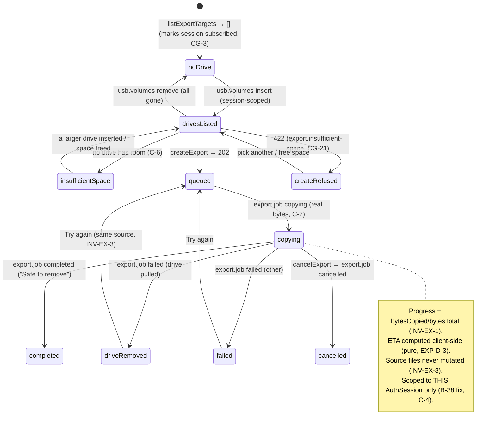

# S-23 USB export flow — drive picking, real transfer progress & session scoping — wireframe & screen design

> Closes **W-7** in [screen-inventory §9](../screen-inventory.md#9-screens-needing-wireframe-approval)
> ("Parity §5.1 items 1 + 10; drive picking and real progress are both new").
> Nothing in this document may be contradicted by a plan or by generated code; if
> it must change, that is a gate discussion, not an in-run improvisation
> ([frontend-conventions](../frontend-conventions.md) preamble).
>
> **Status:** ✅ **approved 2026-08-09**, Wave 5 design gate. Depends on:
> [S-21](S-21-design.md) (the list and selection that open this overlay). Owns:
> **CG-3** (the scoped-subscription mechanism for `usb.volumes`/`export.job`,
> shared with S-34) and **CG-21** (the `export.insufficient-space` refusal code).
> Sibling pattern: [S-20](S-20-design.md) — "cost the steady state nothing, pay
> for size on demand" and "a control maps to an operation or it does not exist".
>
> **One load-bearing job:** copy the recordings a lecturer picked to a USB drive
> *they* pick, showing **real transfer bytes**, and make "safe to remove"
> unmissable — without resurrecting B-32's free-space-polling progress, B-38's
> first-drive-only pick, or B-38's all-clients broadcast.

---

## 0. Evidence base

| Source | What it fixed here |
|---|---|
| [screen-inventory §4 S-23](../screen-inventory.md#s-23-usb-export-flow-overlay-on-s-21) | The states (`no drive`/`drives listed`/`insufficient space`/`queued`→`copying`/`drive removed mid-copy`/`completed`/`failed`/`cancelled`/`another session's export`), the `listExportTargets`/`createExport`/`getExport`/`cancelExport` data, "real `bytesCopied/bytesTotal` progress", the ≥ 64 px drive **cards** (not a dropdown), the ETA requirement, "Safe to remove must be unmissable", and *"prototype coverage none → wireframe required"* |
| [screen-inventory §0.3/§0.4](../screen-inventory.md#03-universal-states--implemented-once-inherited-by-every-screen) | U-1, U-2 (progress marked stale; the copy continues device-side), U-4, U-5; ≥ 44 px targets, no hover-only, no page scroll — inherited |
| [screen-inventory §8](../screen-inventory.md#8-design-token-sheet) | Every token used below; `--modal-w` (680), `--tap-row-lg` (64); no new value |
| [`contracts/openapi.yaml`](../../../contracts/openapi.yaml) `listExportTargets` | `GET /exports/targets` → `UsbVolume[]`; **system + recordings volumes never listed** (INV-EX-2); *"live insert/remove updates arrive as `usb.volumes` events scoped to this session (B-38 fix)"* |
| [`contracts/openapi.yaml`](../../../contracts/openapi.yaml) `createExport` | `POST /exports`, body `ExportCreateRequest{recordingIds, targetDevicePath}` → **202 + `ExportJob`**; `422` on invalid; *"progress arrives as `export.job` events scoped to the requesting AuthSession"* |
| [`contracts/openapi.yaml`](../../../contracts/openapi.yaml) `getExport` / `cancelExport` | `GET /exports/{exportId}` (REST mirror); `POST /exports/{exportId}/cancel` → 202 / `409`; *"source files are never mutated"* (INV-EX-3) |
| [`contracts/openapi.yaml`](../../../contracts/openapi.yaml) `ExportJob` / `UsbVolume` / `ExportJobState` | `ExportJob{bytesTotal, bytesCopied, state, error}`; `UsbVolume{devicePath, mountPath, label, capacityBytes, freeBytes}`; `ExportJobState ∈ {queued, copying, completed, failed, cancelled}` — a **linear entity lifecycle**, no §1–6 machine (events.md §2.20, C-2) |
| [`contracts/openapi.yaml`](../../../contracts/openapi.yaml) `Problem.code` | The **closed** refusal enum; carries `export.invalid-target`, `volume.unavailable` — **but not** `export.insufficient-space` (CG-21, §9) |
| [`contracts/events.md` §2.20/§2.21](../../../contracts/events.md) | `export.job` → **the requesting AuthSession only** (B-38 fix), `{jobId, state, bytesCopied, bytesTotal, error}`, on transition + ≥ 5 % steps; `usb.volumes` → *"sessions with the export flow open"*, on insert/remove |
| [`contracts/events.md` §1](../../../contracts/events.md) | *"clients send **no** WS messages"* — the tension CG-3 resolves: how does a session *become* "one with the export flow open"? |
| [`contracts/events.md` C-1 / open item C-6](../../../contracts/events.md) | scoped-subscription is an open contract item (screen-inventory §10 CG-3) |
| [PRD LP-10 / LP-11](../../PRD.md) | *"multi-select copy-to-USB"*; *"USB drive insert/remove detected live; the user picks the target"* |
| [behavioral-inventory B-32](../../discovery/behavioral-inventory.md#b-32-copy-to-usb-via-rsync) | Legacy `rsync`'d to the **first** non-HDD USB drive and showed progress by **polling USB free space** against expected size. **KEEP offline export; CHANGE to real transfer progress** — INV-EX-1 |
| [behavioral-inventory B-38](../../discovery/behavioral-inventory.md#b-38-usb-drive-hotplug-detection--capacity-broadcasting) | Legacy detected hotplug but **broadcast to all clients** (`io.emit`) and tracked only the first drive. **KEEP hotplug + free-space; CHANGE the global broadcast and first-drive-only** — session scoping + a real picker |

---

## 1. Constraints that are not design choices

**C-1. The user picks the drive; the system never picks "the first one".** B-38
grabbed the first non-HDD USB device; plugging in the wrong drive was a silent,
expensive error. `listExportTargets` returns **every** candidate volume (system and
recordings volumes excluded, INV-EX-2) and the user picks one — rendered as ≥ 64 px
**cards**, not a dropdown, because the cost of picking wrong (copying to a
colleague's drive, or a drive with no room) is high enough to deserve the space
(screen-inventory §4, §11 EXP-D-1).

**C-2. Progress is real transfer bytes, never free-space arithmetic.** B-32
inferred progress by polling the drive's free space against an expected size — which
lies whenever anything else touches the drive, and stalls invisibly. `export.job`
carries `bytesCopied`/`bytesTotal` from the actual copy (INV-EX-1), emitted on
≥ 5 % steps. The bar, the percentage and the ETA are all functions of those two
numbers plus wall-clock time (§2.4); **nothing reads the drive's free space to
measure progress**.

**C-3. The export stream is scoped to the requesting session — and something must
say the session is listening.** `export.job` and `usb.volumes` are scoped to *"the
AuthSession that requested the export / has the export flow open"* (events.md §2.20,
closing B-38's broadcast). But events.md §1 also states clients send **no** WS
messages — so there is no defined moment at which a session *declares* it has the
flow open. This screen forces the question (CG-3, §9): opening the flow (calling
`listExportTargets`) is what marks the session subscribed.

**C-4. A second panel session must not see this export.** A colleague on another
panel in the same room, or an admin elsewhere, must **not** see this lecturer's
export progress or drive list (B-38's exact bug). The scoping (C-3) is a privacy and
correctness boundary, not an optimisation: state `another session's export` is the
explicit assertion that this progress is not shown to a session that didn't request
it.

**C-5. Source files are never mutated or moved.** INV-EX-3: a copy is a copy. Drive
removed mid-transfer, cancelled, failed — the recordings on the device are
untouched. Every failure state below is safe to retry from the same source, and the
copy runs device-side even if the panel that started it drops (U-2, C-2).

**C-6. Space is checked before the copy starts — and the server is the backstop.**
The client pre-computes required bytes (Σ `totalBytes` of the selected recordings,
from S-21) against the picked volume's `freeBytes` and shows `insufficient space`
**before** issuing `createExport` (C-2's discipline: this is a pre-flight check, not
a progress measure). But a drive can fill between listing and copy (another session,
or a stale `freeBytes`), so `createExport` must be able to refuse authoritatively
with a **named** reason — which the contract cannot currently express (CG-21, §9).

---

## 2. Wireframe

**The design in one sentence:** a 680 px modal that walks insert → **pick a drive
card** → confirm space → **real-byte progress with ETA** → an unmissable "Safe to
remove", scoped to this session throughout.

### 2.1 `no drive` — the live listener

```
┌──────────────────────  Copy to USB  ──────────────────────────[ ✕ ]┐   680 px
│                                                                     │
│   4 recordings · 6.8 GB to copy                                     │   Σ totalBytes from S-21 selection
│                                                                     │
│              ┌───────────────────────────────┐                      │
│              │            ⧉  USB              │                      │
│              │                               │                      │
│              │   Insert a USB drive to        │                      │
│              │   continue.                    │                      │
│              └───────────────────────────────┘                      │
│                                                                     │
│   The device disk and the recordings drive are never offered.       │   INV-EX-2
│                                                                     │
│                                              [ Cancel ]              │
└───────────────────────────────────────────────────────────────────────┘
```

The modal opens having called `listExportTargets` — which is what marks this
session subscribed to `usb.volumes` (C-3, CG-3). With no drive present it shows the
live listener; a drive inserted now appears **without a refresh** via the
session-scoped `usb.volumes` event.

### 2.2 `drives listed` — the picker (C-1)

```
│   4 recordings · 6.8 GB to copy                                     │
│                                                                     │
│   Choose a drive:                                                   │
│   ┌─────────────────────────────────────────────────────────────┐  │
│   │  ⧉  KINGSTON                              14.2 GB free / 32 GB │  │  ≥ 64 px card (--tap-row-lg)
│   └─────────────────────────────────────────────────────────────┘  │
│   ┌─────────────────────────────────────────────────────────────┐  │
│   │  ⧉  Lecture Backup                         3.1 GB free / 8 GB │  │  enough? shown per card
│   │     Not enough room for 6.8 GB                    ⚠           │  │  per-card space check (C-6)
│   └─────────────────────────────────────────────────────────────┘  │
│                                                                     │
│                                    [ Cancel ]   [ Copy 6.8 GB → ]   │  action disabled until a card with room is picked
└───────────────────────────────────────────────────────────────────────┘
```

Each candidate is a card showing `label`, `freeBytes` and `capacityBytes`. A card
whose `freeBytes < Σ selected bytes` is shown with the shortfall and is **not
selectable** (C-6) — the picker itself carries the space check, so `insufficient
space` is usually reached before any copy is attempted. **Copy** is enabled only
once a drive with room is selected.

### 2.3 `insufficient space` — nothing fits

```
│   4 recordings · 6.8 GB to copy                                     │
│                                                                     │
│   ⚠  None of the connected drives has room for 6.8 GB.              │
│      KINGSTON has 3.1 GB free · Lecture Backup has 1.4 GB free.     │
│                                                                     │
│   Free up space on a drive, or insert a larger one, then try again. │
│                                              [ Cancel ]              │
└───────────────────────────────────────────────────────────────────────┘
```

When **no** listed drive has room (C-6), the modal states the requirement against
each drive's free space and offers no Copy — the user frees space or inserts a
larger drive (the list updates live). This is the client pre-flight; the server's
`createExport` backstop (CG-21) covers the race where a drive fills after listing.

### 2.4 `copying` — real bytes + ETA (C-2)

```
│   Copying to KINGSTON…                                              │
│                                                                     │
│   ████████████████████░░░░░░░░░░░░░   58%                           │  bar from bytesCopied/bytesTotal
│   3.9 GB of 6.8 GB · about 2 min left                               │  bytes (real) + ETA (client-computed)
│                                                                     │
│   Don't remove the drive until this finishes.                       │
│                                            [ Cancel copy ]           │  cancelExport
└───────────────────────────────────────────────────────────────────────┘
```

The bar and percentage are `bytesCopied/bytesTotal` (C-2); the **ETA** is computed
client-side from the byte-rate over recent `export.job` steps (a pure function of
progress + time, like S-20's QR — no server field, §9.1, §11 EXP-D-3). `queued`
(before the first byte) shows the same frame with "Starting…" and no ETA yet. The
"don't remove" line is present throughout the copy (C-5's consequence made visible).

### 2.5 `completed` — unmissable (screen-inventory §4)

```
│              ┌───────────────────────────────┐                      │
│              │            ✓  Done             │                      │  --success, large
│              │                               │                      │
│              │   4 recordings copied to       │                      │
│              │   KINGSTON.                    │                      │
│              │                               │                      │
│              │   Safe to remove the drive.    │                      │  the load-bearing line
│              └───────────────────────────────┘                      │
│                                                   [ Done ]           │
└───────────────────────────────────────────────────────────────────────┘
```

"Safe to remove" is the whole point of the completion state (screen-inventory §4):
a 2 GB copy over USB 2.0 takes minutes, and the failure mode is a lecturer yanking
the drive early. It is large, `--success`, and unambiguous.

### 2.6 Failure states

```
drive removed mid-copy:              failed:                    cancelled:
┌──────────────────────────┐         ┌────────────────────────┐ ┌──────────────────┐
│ ⚠ The drive was removed   │         │ ⚠ The copy failed.     │ │ Copy cancelled.  │
│   before the copy         │         │   {error}              │ │ Nothing was      │
│   finished.               │         │                        │ │ removed from the │
│                           │         │ Your recordings are    │ │ device.          │
│ Your recordings are safe  │         │ safe on the device.    │ │                  │
│ on the device.            │         │ [ Cancel ] [ Try again]│ │ [ Done ]         │
│ [ Cancel ] [ Try again ]  │         └────────────────────────┘ └──────────────────┘
└──────────────────────────┘
```

All three assert **the source is untouched** (C-5) — the reassurance a lecturer
needs before retrying. `drive removed mid-copy` and `failed` offer **Try again**
(the same source, INV-EX-3); `cancelled` (via `cancelExport`) is a calm terminal.

### 2.7 `another session's export`

Not a modal a user opens — a **guard**: a second panel session that opens Copy-to-USB
gets its **own** `listExportTargets` / `usb.volumes` / `export.job` scope (C-3/C-4)
and never sees this session's in-flight job. If the same `AuthSession` re-opens the
overlay while its own export is running, it re-attaches to that job's progress
(getExport mirror + `export.job`), never starting a second copy of the same
selection.

---

## 3. Component breakdown

```
apps/panel/src/screens/library/export/
  export-modal.tsx        the 680 px overlay shell and its per-state body
  drive-picker.tsx        the ≥64 px candidate cards + per-card space check
  export-progress.tsx     bytes bar + client-computed ETA + Cancel copy
  export-result.tsx       completed / failed / removed / cancelled bodies
  use-export.ts           listExportTargets + usb.volumes (scoped) + createExport/getExport + export.job
  use-eta.ts              pure: (bytesCopied, bytesTotal, samples[]) → seconds remaining
```

| Unit | What it does | How you use it | What it depends on |
|---|---|---|---|
| `use-export.ts` | Opens the flow by calling `listExportTargets` (which marks the session subscribed, CG-3/C-3), merges `usb.volumes` (session-scoped) for live insert/remove, issues `createExport`, and tracks the job via `getExport` + `export.job` (session-scoped). Exposes the §4 state | `const ex = useExport(recordingIds)` | `EduscopeClient.{listExportTargets,createExport,getExport,cancelExport}`, WS `usb.volumes` / `export.job` |
| `drive-picker.tsx` | Renders candidates as ≥ 64 px cards; disables any whose `freeBytes < Σ bytes` with the shortfall (C-6); selection enables Copy | `<DrivePicker volumes={…} needBytes={…} onPick={…}/>` | tokens |
| `export-progress.tsx` | The real-byte bar + percentage + ETA + "don't remove" + Cancel copy | `<ExportProgress job={…} eta={…}/>` | `use-eta`, tokens |
| `export-result.tsx` | The four terminal bodies (§2.5/§2.6), each asserting source safety (C-5) | `<ExportResult state={…} volume={…} error={…}/>` | tokens |
| `use-eta.ts` | **Pure.** `(bytesCopied, bytesTotal, recentSamples)` → seconds remaining, smoothed over recent `export.job` steps; returns `null` before enough samples (shows "Starting…") | `const eta = useEta(job, samples)` | nothing — no client, no store (like S-20's `quiz-qr`) |

`use-eta.ts` takes no data source and holds no state beyond its inputs — the ETA is
a pure function of transfer bytes and time (EXP-D-3), so it can never drift into
B-32's free-space guess. Nothing here imports `fetch`/`axios`/`WebSocket`; the
overlay mounts through `OverlayHost` (the shared mount point S-06 §3.3 established),
light over the panel even if opened from a dark scope (§8.3).

---

## 4. States

### 4.1 Mapped to the ExportJob lifecycle + universals

`ExportJob` has no §1–6 state machine — its lifecycle is the linear enum
`queued → copying → completed | failed | cancelled` (events.md §2.20, C-2 there).
The screen's states are that enum plus the pre-copy picker states and the
universals.

| # | State | Entered by | Rendering | Governed by |
|---|---|---|---|---|
| 1 | `no drive` | overlay open, `listExportTargets` → `[]` | §2.1 live listener; system/recordings volumes never shown (INV-EX-2) | C-1, C-3 |
| 2 | `drives listed` | `listExportTargets` non-empty **or** a live `usb.volumes` insert | §2.2 picker cards with per-card space check | C-1, C-6 |
| 3 | `insufficient space` | no listed drive has `freeBytes ≥ Σ` | §2.3 — states the requirement vs each drive; no Copy | C-6 |
| 4 | `queued` | `createExport` → 202, `ExportJobState=queued` | §2.4 frame, "Starting…", no ETA yet (U-4) | ExportJob lifecycle |
| 5 | `copying` | `export.job{copying}` | §2.4 — real bytes + ETA + "don't remove" | C-2 |
| 6 | `completed` | `export.job{completed}` | §2.5 — "Safe to remove", unmissable | screen-inventory §4 |
| 7 | `drive removed mid-copy` | `export.job{failed, error≈removed}` | §2.6 — source safe (C-5); Try again | INV-EX-3 |
| 8 | `failed` | `export.job{failed}` (other) | §2.6 — names `error`; source safe; Try again | INV-EX-3 |
| 9 | `cancelled` | `cancelExport` → `export.job{cancelled}` | §2.6 — calm terminal; nothing removed | INV-EX-3 |
| 10 | `create refused` (U-5) | `createExport` → `422` | the named reason: `export.insufficient-space` (CG-21) → back to the picker with the shortfall; `export.invalid-target` → "that drive is no longer available"; `volume.unavailable` → same | §0.3 U-5, CG-21 |
| 11 | `another session's export` | a second session opens the overlay | its **own** scope; never this job (§2.7) | C-3/C-4 |
| — | `U-1` cold | overlay open | the modal renders its own skeleton (picker frame); no full-screen spinner | §0.3 U-1 |
| — | `U-2` reconnecting | `T-WS-STALE` during copy | progress marked **stale** ("connection lost — the copy is still running on the device"); the copy continues device-side (C-5); Cancel disabled until reconnect | §0.3 U-2 |
| — | `U-4` pending | Copy / Cancel copy tapped | pending on the tapped control, ceiling `CommandAccepted.resolveBySec` | §0.3 U-4 |

### 4.2 Diagram



---

## 5. Copy deck

| Where | Copy |
|---|---|
| Modal title | `Copy to USB` |
| Selection summary | `{n} recording(s) · {bytes} to copy` |
| No drive | `Insert a USB drive to continue.` |
| No-drive note | `The device disk and the recordings drive are never offered.` |
| Picker heading | `Choose a drive:` |
| Drive card | `{label ?? "USB drive"}` · `{free} free / {capacity}` |
| Card — too small | `Not enough room for {bytes}` |
| Copy button | `Copy {bytes} →` |
| Insufficient (all) | `None of the connected drives has room for {bytes}.` / `{label} has {free} free · …` / `Free up space on a drive, or insert a larger one, then try again.` |
| Queued | `Starting…` |
| Copying | `Copying to {label}…` / `{copied} of {total} · about {eta} left` / `Don't remove the drive until this finishes.` |
| Cancel copy | `Cancel copy` |
| Completed | `Done` / `{n} recordings copied to {label}.` / `Safe to remove the drive.` |
| Drive removed | `The drive was removed before the copy finished.` / `Your recordings are safe on the device.` |
| Failed | `The copy failed.` / `{error}` / `Your recordings are safe on the device.` |
| Cancelled | `Copy cancelled.` / `Nothing was removed from the device.` |
| Try again / Done | `Try again` / `Done` |

Two notes:

- **Every failure states "your recordings are safe on the device"** — the INV-EX-3
  guarantee, made explicit, because a mid-copy failure is exactly when a lecturer
  fears they've lost something (C-5).
- **The ETA reads "about {eta} left"**, never a false-precise countdown — it is a
  smoothed estimate over a variable USB rate, and it says "about" so it is not read
  as a promise (EXP-D-3).

---

## 6. Token usage

**No new token.**

| Element | Tokens |
|---|---|
| Modal shell | `--modal-w` (680), `--surface`, `--radius-xl`, `--sp-10` padding, `--shadow-lg` |
| Title | `--fs-2xl` / 800, `--text` |
| Selection summary | `--fs-sm`, `--text-muted` |
| No-drive plate | `--surface-2`, `--radius-lg`, `--sp-10`; icon `--text-faint` |
| Drive card | `--tap-row-lg` (64) min, `--surface-2`, 1 px `--border`, `--radius-lg`; selected = `--surface-3` + `--border-strong` |
| Card free/capacity | `--fs-sm`, `--text`; shortfall `--warning` |
| Progress bar | track `--surface-3`, fill `--accent`, `--radius-pill`, ≥ 12 px tall |
| Progress bytes/ETA | `--fs-sm`, `--text`; "don't remove" `--warning` / 700 |
| Copy / Try again | `--accent` fill, `--radius-md`, ≥ 56 px |
| Cancel / Cancel copy | default weight: `--surface`, 1 px `--border`, `--text` |
| Completed plate | `--success-soft` bg, `--success` mark, `--fs-2xl` "Done", `--fs-md` "Safe to remove" |
| Failure heading | `--warning` (removed/failed) / `--text` (cancelled) |
| Insufficient heading | `--warning` |

The progress bar is `--accent`, not `--success`, until `completed` — a copy in
flight is not yet a success (the B-32 lie was showing "done" from free-space math
before the bytes landed). Green is reserved for the verified `completed` state.

---

## 7. Touch, kiosk & accessibility

- **Drive cards, not a dropdown** (C-1, screen-inventory §4): each candidate is a
  ≥ 64 px card, ≥ 8 px apart; picking the wrong drive is the expensive error the
  card size guards against.
- **Progress shows bytes and an ETA** (screen-inventory §4): a multi-minute USB 2.0
  copy with only a spinner reads as hung; the bytes and "about {eta} left" tell the
  lecturer it is moving.
- **"Safe to remove" is unmissable**: large, `--success`, its own plate — the one
  line the whole flow exists to deliver (§2.5).
- **No page scroll; the overlay is 680 px** and its body never grows past the panel;
  the drive list scrolls internally if many drives are present (rare, but bounded).
- **Screen readers:** the modal is a `dialog` (`aria-labelledby` the title); each
  drive card is a `button` announcing `{label}, {free} free, {enough/not enough} for
  {bytes}`; the progress is a `progressbar` with `aria-valuenow`/`aria-valuetext` =
  "{copied} of {total}, about {eta} left". "Safe to remove" is `aria-live="polite"`
  so it is announced on completion.
- **Colour is never the sole carrier**: the too-small card pairs `--warning` with
  "Not enough room"; completion pairs green with "Safe to remove"; failures pair the
  colour with the sentence.
- **`prefers-reduced-motion`:** the bar fills without animation under the reduced
  block; no state is carried by motion — the bytes/percentage/label carry it (§8.6).
- **U-2 keeps the copy honest**: on disconnect the progress is marked stale with
  "the copy is still running on the device" (C-2/C-5), Cancel is disabled (a cancel
  tapped offline must not fire on reconnect), and the copy is **not** presumed
  finished or failed — it is unknown until the socket returns.

---

## 8. Contract changes this design requires

**Two — CG-3 (resolved: additive/semantic) and CG-21 (new: additive).**

### CG-3 — no way for a client to declare a scoped subscription *(resolved)*

`export.job` and `usb.volumes` are scoped to *"the AuthSession that … has the export
flow open"* (events.md §2.20/§2.21), but events.md §1 says clients send **no** WS
messages — so nothing defines the moment a session *becomes* subscribed (C-3). The
same gap blocks S-34's live-log tail
([screen-inventory §10](../screen-inventory.md#10-contract-gaps) CG-3).

| | |
|---|---|
| **Gap** | No defined mechanism for a session to opt into a scoped WS stream (`usb.volumes`, `export.job`; and `log.entry` for S-34) |
| **Screen** | S-23 (this flow); S-34 (live log) shares it |
| **Severity** | **Medium** — without it the screens work only by polling, which events §5 forbids |
| **Fix** | **State in the operation descriptions that calling the flow's REST entry marks the calling `AuthSession` as subscribed for a TTL**, refreshed by continued REST reads: `GET /exports/targets` subscribes to `usb.volumes`; `createExport`/`getExport` subscribe to `export.job` for that job; `GET /logs` subscribes to `log.entry` (S-34). **No new endpoint, no new WS client→server message** — a documented semantic on operations that already exist, honouring "clients send no WS messages" while giving scoping a defined trigger. Subscription expires on TTL or on session end |
| **Kind** | **additive** (semantic clarification; no schema change) |
| **Status** | ✅ **answered 2026-08-09** at this gate; to be **applied v0.5** (operation descriptions in `openapi.yaml` + events.md §1 note) before Wave 5's plan run. Registered in [screen-inventory §10](../screen-inventory.md#10-contract-gaps) CG-3 |
| **If rejected** | The alternative — an explicit `POST /subscriptions` — invents an operation and a lifecycle to manage; or the screens poll, which §5 forbids. Recorded so the chosen mechanism is a decision, not a drift |

### CG-21 — `createExport` cannot name an insufficient-space refusal *(new)*

The client pre-checks space in the picker (C-6), but a drive can fill between
`listExportTargets` and `createExport` (another session; a stale `freeBytes`). When
the server refuses for space, `Problem.code` — a **closed** enum — has no value for
it: the nearest is a generic `validation.invalid` (`422`), which U-5 cannot render
as a specific, actionable reason.

| | |
|---|---|
| **Gap** | `Problem.code` lacks `export.insufficient-space`; a space refusal from `createExport` is indistinguishable from any other `validation.invalid` |
| **Screen** | S-23 (state `create refused`, §2, §4 #10) |
| **Severity** | **Low** — the client pre-check catches the common case; this covers the listing→copy race and makes the server authoritative |
| **Fix** | Add **`export.insufficient-space`** to the `Problem.code` enum. `createExport` returns it (`422`) when the target lacks room; U-5 renders it as "that drive filled up — free space or pick another" and returns to the picker with the shortfall. **Additive** — one enum value alongside the existing `export.invalid-target` |
| **Kind** | **additive** (adding an enum value is a contract bump, §10.1) |
| **Status** | ✅ **answered 2026-08-09** at this gate; to be **applied v0.5** before Wave 5's plan run. Registered in [screen-inventory §10](../screen-inventory.md#10-contract-gaps) CG-21 |
| **If rejected** | The listing→copy race surfaces as a vague `validation.invalid`; S-23 must show generic "couldn't start the copy" instead of a named, fixable reason. Recorded as the fallback |

### 8.1 Changes this design deliberately does **not** require

- **No server-computed ETA field.** The ETA is a pure function of
  `bytesCopied`/`bytesTotal` over time (EXP-D-3, §2.4); a server field would move a
  value the client derives from data it already receives. Recorded as a deliberate
  no-change, in CG-9's style.
- **No coded `error` enum on `ExportJob`.** `error` stays a free-text string
  (events.md §2.20); the states are decided by `ExportJobState`, and `drive removed`
  vs generic `failed` is distinguished by the presence/shape of the failure, not by
  a new closed enum. Keeping `error` free-text matches the linear-lifecycle decision
  (events C-2); if operations later needs deterministic copy per cause, that is an
  additive enum, flagged here rather than minted now.
- **No new `usb.volumes`/`export.job` payload fields.** `UsbVolume`
  (`label`/`freeBytes`/`capacityBytes`) and `ExportJob` (`bytesCopied`/`bytesTotal`)
  carry everything the picker and progress need.

---

## 9. Mock & scenario work Wave 5 inherits

| Gap | Where | Fix |
|---|---|---|
| Hotplug insert/remove, session-scoped | `packages/api-client/src/mock/ws/` usb | Emit `usb.volumes` **only** to the requesting session; a second mock session opening the overlay gets its own scope and never sees the first's job (C-4). Assert no cross-session leakage |
| Real-byte progress | `mock/scenario/scripts/happy` | `export.job` steps `queued → copying (≥5% steps) → completed`; assert the bar/percentage track `bytesCopied/bytesTotal` and the ETA appears once enough samples exist |
| Drive removed mid-copy | `mock/scenario/scripts/` (new `usb-pull`, extend the catalog per frontend-conventions §4) | Emit `export.job{failed}` with a removed-drive `error`; assert the source-safe copy and Try again; the mock source recordings are unchanged (C-5) |
| Insufficient space (pre-flight + race) | `mock/rest/` exports | A drive with `freeBytes < Σ` disables its card (C-6); once CG-21 is applied v0.5, a drive that "fills" between listing and `createExport` returns `422 export.insufficient-space` and the modal returns to the picker with the shortfall |
| Multiple drives → user picks | `mock/rest/` exports | `listExportTargets` returns two candidates; assert the user must pick and that neither is auto-selected (B-38's first-drive bug) |
| CG-3 subscription semantic | `mock` | `listExportTargets` marks the mock session subscribed to `usb.volumes`; a session that never called it receives **no** `usb.volumes` events |

---

## 10. Decisions taken here

| Id | Decision | Rationale | Cost to reverse |
|---|---|---|---|
| **EXP-D-1** | **The drive is picked from ≥ 64 px cards; nothing is auto-selected** | B-38's first-drive pick made "copy to the wrong drive" a silent error; the card size and explicit pick make the expensive mistake hard to make (C-1) | Low |
| **EXP-D-2** | **Progress is `bytesCopied/bytesTotal`; the drive's free space is never read to measure it** | B-32 polled free space and lied whenever anything else touched the drive; INV-EX-1 mandates real transfer bytes (C-2) | Low |
| **EXP-D-3** | **The ETA is computed client-side from byte-rate over time; no server field** | The ETA is a pure function of progress + wall-clock (like S-20's QR); a server ETA would move a derived value and risk re-introducing a free-space guess. "about {eta}" is honest about its imprecision | Low |
| **EXP-D-4** | **Opening the flow (calling `listExportTargets`) is what subscribes the session** (settles CG-3's mechanism) | Honours "clients send no WS messages" (events §1) while giving the session-scoped streams a defined trigger; no new endpoint. S-34 reuses it | Low — CG-3 is a semantic, reversible to an explicit subscribe if needed |
| **EXP-D-5** | **Space is pre-checked in the picker AND the server can refuse authoritatively** (CG-21) | The client check catches the common case; the server code covers the listing→copy race and keeps the server the authority (defense in depth) | Low — CG-21 is additive |
| **EXP-D-6** | **Every failure asserts the source is untouched, and offers Try again from the same source** | INV-EX-3 (C-5): a copy is a copy; the retry is always safe, and saying so is what lets a lecturer retry without fear | Low |

---

## 11. Requirements this screen places on other screens

- **S-21 opens this overlay with the selection.** Selection mode passes
  `recordingIds` and the summed bytes (S-21 §2.4); this screen owns the drive pick,
  the space check and the transfer. S-21 does not know about drives or progress.
- **S-34 reuses CG-3's subscription mechanism** for its live log tail (`GET /logs`
  marks the session subscribed to `log.entry`); the semantic is defined here and
  applied to both. S-34's design must not invent a second mechanism.
- **S-03's alert host** owns `upload.dead-letter`/`.offline` and any device-wide USB
  alert; this overlay owns only the per-session export it started.
- **The `EduscopeClient` boundary** owns the `export.job`/`usb.volumes` session
  scoping; a component never subscribes to a raw socket (frontend-conventions §1),
  so the B-38 broadcast bug cannot be reintroduced at the UI layer.

---

## 12. Testing floor

- **Testing Library:** one rendering test per §4 state — `no drive`, `drives listed`
  (with a too-small card), `insufficient space`, `queued`, `copying`, `completed`,
  `drive removed`, `failed`, `cancelled`, `create refused` (each CG-21/existing
  code), U-1, U-2.
- **`use-eta` is a pure-function test:** given byte samples over time it returns a
  smoothed estimate and `null` before enough samples; it holds no state and no store
  subscription (EXP-D-3), mirroring S-20's `quiz-qr` structural test.
- **Progress reads real bytes, never free space (C-2):** a test drives
  `export.job{bytesCopied}` and asserts the bar/percentage follow it — and that the
  component never reads `UsbVolume.freeBytes` to compute progress.
- **Session scoping (C-3/C-4):** a test with two mock sessions asserts session B's
  overlay never receives session A's `export.job`/`usb.volumes`; and that a session
  that never called `listExportTargets` receives no `usb.volumes`.
- **No auto-pick (EXP-D-1):** with two drives listed, Copy is disabled until one is
  explicitly selected.
- **Source safety (C-5):** after `drive removed`/`failed`/`cancelled`, the mock
  source recordings are byte-identical; Try again re-issues `createExport` with the
  same `recordingIds`.
- **CG-21 (once applied v0.5):** a `createExport` returning `422
  export.insufficient-space` renders the named reason and returns to the picker; a
  generic `validation.invalid` is **not** silently treated as a space problem.
- **Playwright:** select recordings in S-21 → open Copy to USB → insert drive (mock
  hotplug) → pick it → watch real-byte progress to `completed` → "Safe to remove";
  then the `usb-pull` scenario as the failure path (source safe, Try again).
- **Contract honesty:** every mocked `listExportTargets` / `createExport` /
  `getExport` / `export.job` / `usb.volumes` validates against the `contracts/` zod
  schemas, including `export.insufficient-space` once CG-21 is applied v0.5.
