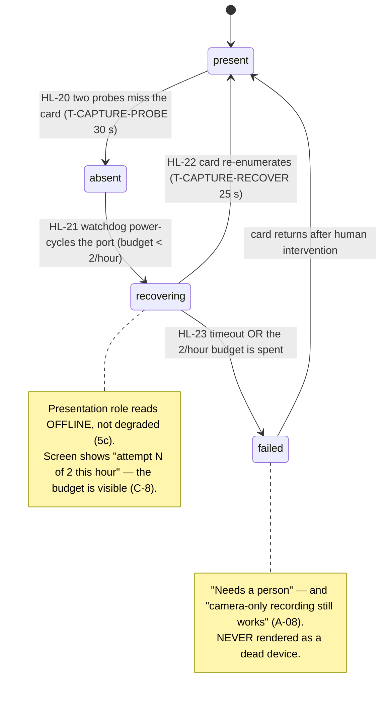
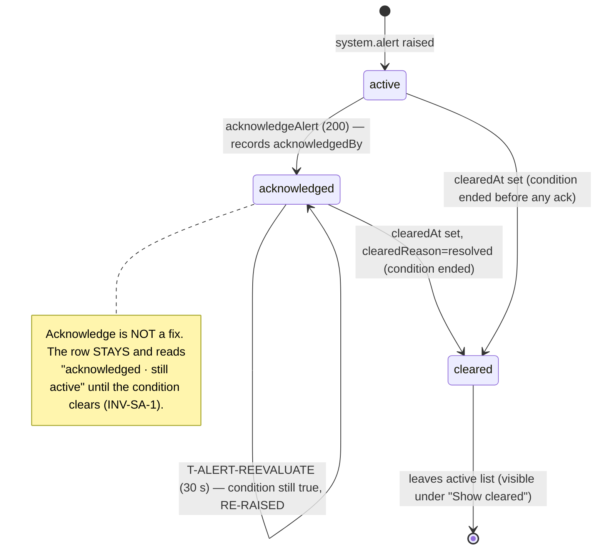

# S-36 Device & Identity — the read-only provisioning window, capture-card watchdog, publisher health & the admin alert home — wireframe & screen design

> Closes **W-10** in [screen-inventory §9](../screen-inventory.md#9-screens-needing-wireframe-approval)
> ("Parity §5.1 items 8, 9, 10, 11"). Nothing in this document may be contradicted
> by a plan or by generated code; if it must change, that is a gate discussion, not
> an in-run improvisation ([frontend-conventions](../frontend-conventions.md) preamble).
>
> **Status:** ✅ **approved 2026-08-10**, Wave 6 design gate. Depends on:
> [S-25](../screen-inventory.md#s-25-advanced-shell-panel-advanced) (the Advanced
> shell that hosts it, admin-only). Inherits the documented "is AI on in this room"
> role from [S-05-ai-disabled-design.md §11 S05-D-7](S-05-ai-disabled-design.md).
> Owns: **no contract change** (the clean "a design run can add nothing" case, in the
> S-24 style, §9) and one routed open decision — **DIO-1** (the expected-vs-actual
> storage cross-check, §14).
>
> **This is the installer's status sheet.** Its load-bearing job: render provisioned
> identity, live device health, the capture-card watchdog and the active-alert list as
> **facts an admin reads to verify a build** — never as a disabled form inviting an
> edit that has no endpoint (AD-10, `[D-20]`), never showing a stale reading as if it
> were current (INV-DH-2), and never letting "acknowledged" read as "fixed" (INV-SA-1).

---

## 0. Evidence base

| Source | What it fixed here |
|---|---|
| [screen-inventory §5 S-36](../screen-inventory.md#s-36-device--identity-admin-advanceddevice) | The purpose ("a window, not a form"), the persona (admin/installer verifying a build), the states (`loading`/`populated`, `not provisioned`, `clock unsynced`, capture `present\|absent\|recovering\|failed`, `publisher states`, `alerts` with acknowledge, `health stale`), the `getProvisioning`/`getDeviceHealth`/`listAlerts` data + `acknowledgeAlert` command, "copy-to-clipboard on ids is the one useful action", "resist edit affordances", and *"prototype coverage none → wireframe required"* |
| [screen-inventory §13 SI-D-5](../screen-inventory.md#13-open-questions--decisions-taken-here) | **Taken:** device identity (AD-10), health/watchdog and the admin alert list **share one screen** — three near-empty read-only screens would be worse, and `/alerts` otherwise has no admin home (C-2) |
| [S-05-ai-disabled-design.md §11 S05-D-7](S-05-ai-disabled-design.md) | **S-36 is the documented home of "is AI on in this room"**: it already fetches `getProvisioning`; W-10 must render `featureFlags` **legibly**, not as raw booleans (C-5) |
| [screen-inventory §0.3](../screen-inventory.md#03-universal-states--implemented-once-inherited-by-every-screen) | U-1, U-2, U-4, U-5, U-6 — inherited (this is an admin route) |
| [screen-inventory §8](../screen-inventory.md#8-design-token-sheet) | Every token used below; **no new token** — the severity palette (`--success`/`--warning`/`--danger` + soft plates) and `--text-muted`/`--text-faint` already exist; `--danger` is the inherited S-06 §3 vocabulary (open-decisions §9.5) |
| [state-machines §6.4 Machine 5c](../state-machines.md#64-machine-5c--capture-card-watchdog-pf-13-b-39) | `captureCardState` HL-20…HL-23: `present`→`absent` (2 misses, `T-CAPTURE-PROBE` 30 s) → `recovering` (supervised power-cycle, **max 2 cycles/hour**, `T-CAPTURE-RECOVER` 25 s) → `present` or `failed`; while recovering the `presentation` role reads **offline**, not degraded; `failed` needs a human but **camera-only recording still works** (A-08) |
| [state-machines §6 Machine 5a / HL-08](../state-machines.md#6-context-5--health--watchdogs) | Telemetry older than `T-HEALTH-STALE` (**6 s**) → **unknown**, "checking…" — **never the last healthy value** (INV-DH-2, reversing B-12's dead `isError`) (C-3) |
| [state-machines §7 timers](../state-machines.md#8-timing-constants) | `T-ALERT-REEVALUATE` (**30 s**) re-raises an alert while its condition is still true (INV-SA-1) (C-4); `T-HEALTH-STALE` (6 s); `T-CAPTURE-RECOVER` (25 s, 2 cycles/hour) |
| [`contracts/openapi.yaml`](../../../contracts/openapi.yaml) `getProvisioning` | `GET /provisioning` → `DeviceProvisioning`, **read-only** — core-api never writes it (INV-DP-1), written only by the deploy flow (`x-decision: D-20`). Secrets omitted. Fields: `deviceId, serialNumber, instituteProfileId, hallCode, hallDisplayName, titlePattern, timezone, ntpServers, expectedStorageVolumeUuid, featureFlags, quizServerBaseUrl, llmEndpoint, provisionedAt, provisionedBy` |
| [`contracts/openapi.yaml`](../../../contracts/openapi.yaml) `getDeviceHealth` | `GET /health` → `DeviceHealth` (snapshot, not history, INV-DH-1): `observedAt, storageTotalBytes, storageFreeBytes, storagePressure, diskHealth (SmartStatus), captureCardState, publisherStates{roleId→{status, lastErrorCode, since}}, ntpSynced, clockOffsetMs, lastBootAt, cpuLoad1m, tempC` |
| [`contracts/openapi.yaml`](../../../contracts/openapi.yaml) `listAlerts` / `acknowledgeAlert` | `GET /alerts?includeCleared=` → `{items: SystemAlert[]}`; `POST /alerts/{alertId}/acknowledge` → the updated `SystemAlert` (200) / `404`. `SystemAlert`: `code, severity ∈ {info,warning,error,critical}, category (LogCategory), title, detail, raisedAt, clearedAt, clearedReason ∈ {resolved,acknowledged,superseded}\|null, acknowledgedBy, context, relatedEntity` — "a current condition, distinct from the log (INV-SA-2); cannot be cleared while still true (INV-SA-1)" |
| [`contracts/openapi.yaml`](../../../contracts/openapi.yaml) `FeatureFlags` | `{recordingEnabled, aiQuizEnabled, streamingEnabled}` — flipping `aiQuizEnabled` off **never affects recording** (INT-10, INV-DP-4); `SmartStatus ∈ {good,warning,failing,unknown}` — "`unknown` is legitimate — never hardcode Good" (AD-4) |
| [`contracts/events.md` §2.9/§2.10](../../../contracts/events.md) | `device.health` (`DeviceHealthPayload`, on change + every 60 s) and `system.alert` (full `SystemAlert` row incl. `clearedAt`/`clearedReason`, on raise/clear, re-evaluated per `T-ALERT-REEVALUATE`) — the two WS streams this screen subscribes to |
| [PRD AD-10 / LP-16 / LP-18](../../PRD.md) | AD-10 device-identity read view; LP-18 `null` endpoint ⇒ that feature is unavailable |
| [behavioral-inventory B-47](../../discovery/behavioral-inventory.md) | Legacy's dev-options page **sed-ed `.env` values** from the browser — a write path with no audit and no validation. **RETIRED:** provisioning is deploy-layer; this screen is its read-only successor (`[D-20]`, C-1) |
| [behavioral-inventory B-39](../../discovery/behavioral-inventory.md) | Legacy's one-shot capture-card boot check. **CHANGE:** the supervised watchdog (Machine 5c) with a per-hour cycle budget; this screen renders its state, not a boolean (C-8) |
| [behavioral-inventory B-12 / B-55](../../discovery/behavioral-inventory.md) | B-12's dead `isError` flag (health that lied) → INV-DH-2 stale-reads-unknown (C-3); B-55's settings CRUD with no consumer → the real time/NTP need lands **here** as a read view (`[D-17]`), not an editable form |

---

## 1. Constraints that are not design choices

**C-1. This is a window, not a form — every field is read-only by design.** AD-10,
`[D-20]`, `[D-17]`: provisioning is written only by the deploy flow (INV-DP-1); core-api
never writes it. B-47's browser-driven `.env`-sed-ing dev-options page is **retired**,
not reproduced. The screen-inventory is explicit: "the temptation to add 'edit'
affordances must be resisted — every field here is deliberately not editable and the UI
should look like a status sheet, not a disabled form." So there are **no greyed-out
inputs, no save buttons, no toggles**. The single interaction on the identity/health
surfaces is **copy-to-clipboard** on the machine ids (device id, serial, hall code,
storage uuid); the single command anywhere on the screen is **`acknowledgeAlert`**.

**C-2. Three concerns share one screen (SI-D-5).** Device identity, health/watchdog and
the admin alert list live together because three near-empty read-only screens would be
worse, and the admin-side `/alerts` view otherwise has no home. This is a **decision
already taken** in screen-inventory §13, not re-litigated here; §3 states the boundary
each concern keeps against S-30 (storage management), S-34 (the log) and S-09 (source
health).

**C-3. Stale health reads `unknown`, never the last healthy value.** INV-DH-2, HL-08:
any `DeviceHealth` projection older than `T-HEALTH-STALE` (6 s) renders **"checking…"**
in a neutral tone — *not* the last-seen `present`/`good`/`running`. A device that has
gone quiet must not look healthy. This reverses B-12's dead `isError` flag, which let a
crashed pipeline keep reporting the last good value. Identity (`/provisioning`) is
static and unaffected by health staleness.

**C-4. Acknowledge is not "fixed" — a still-true condition re-raises.** INV-SA-1: a
`SystemAlert` **cannot be cleared while still true**, and `T-ALERT-REEVALUATE` (30 s)
re-raises it if the condition persists. Acknowledge records `acknowledgedBy` and settles
the row's *emphasis*; it does **not** remove the alert or imply resolution. An
acknowledged-but-still-active alert reads **"✓ acknowledged · still active"**, never
disappears, and clears **only** when `clearedAt` arrives with `clearedReason=resolved`.
The screen must never let acknowledge look like a fix.

**C-5. `featureFlags` render legibly, and this is the home of "is AI on in this room".**
S05-D-7: S-36 already fetches `getProvisioning`, so it renders `featureFlags` as legible
On/Off, **not** raw booleans. `aiQuizEnabled = false` is stated as **intentional for this
room** and carries the guarantee that it **never affects recording** (INT-10, INV-DP-4).
A `null` `llmEndpoint` ⇒ "AI studio unavailable", a `null` `quizServerBaseUrl` ⇒ "quiz
features unavailable" (LP-18) — the endpoints are the *reason* a feature is dark, shown
next to the flag.

**C-6. Not-provisioned is surfaced here but enforced at S-04.** When `G-PROVISIONED` is
false, this screen **names exactly which field is missing** and states that recording
start will be refused (R-04, J-5) — but the refusal itself happens at the recording-start
gate (S-04), not here. S-36 is the diagnostic window that tells the installer *why* a
start will be refused; it does not itself gate recording.

**C-7. SMART disk status is never hardcoded "Good"; `unknown` is legitimate.** AD-4:
`SmartStatus` includes `unknown`, and the UI renders it as `unknown` — a drive whose
SMART data cannot be read is not silently "Good". Storage **management** (register,
format, retention policy) is S-30's; S-36 shows the SMART health line and a free/total
figure as *identity/health context* only, with a pointer to S-30 to act (§3).

**C-8. The capture-card watchdog shows its recovery budget.** Machine 5c: `recovering`
is a supervised power-cycle capped at **2 cycles/hour**; `failed` means a human is
needed — and states that **camera-only recording still works** (A-08), so an installer
does not read `failed` as "the device is dead". The per-hour budget and last attempt are
shown, not hidden behind a bare state word.

---

## 2. Wireframe

**The design in one sentence:** inside the admin-only Advanced shell, a single stacked
column — *Identity → Features → Time & Clock → Health → Alerts* — of read-only status
cards, with copy-to-clipboard on ids, honest stale/`unknown` rendering, and Acknowledge
as the only command.

### 2.1 `populated`

```
┌ .us-adm__content (inside S-25 Advanced shell, admin-only) ─────────────────────┐
│  Device & Identity                                          ● Provisioned       │  summary chip (DI-D-2)
│  ───────────────────────────────────────────────────────────────────────────── │
│                                                                                 │
│  IDENTITY                                                                       │
│  ┌───────────────────────────────────────────────────────────────────────────┐ │
│  │ Device ID          01J8Z…K3QR                                     ⧉ copy    │ │  Ulid, copyable
│  │ Serial number      EDU-2231-0417                                  ⧉ copy    │ │  serialNumber (null → "not recorded")
│  │ Institute profile  Univ. of Ruhuna — Faculty of Eng.                        │ │  instituteProfileId → display
│  │ Hall               LH-2  ·  Lecture Hall 2                        ⧉ copy    │ │  hallCode · hallDisplayName
│  │ Title pattern      {hall} – {date} {time}                                   │ │  titlePattern (data, A-07)
│  │ Expected storage   b3f1-…-9ac2                                    ⧉ copy    │ │  expectedStorageVolumeUuid (DIO-1)
│  │ Provisioned        2026-07-14 09:12  ·  by installer:ravi                   │ │  provisionedAt · provisionedBy
│  └───────────────────────────────────────────────────────────────────────────┘ │
│                                                                                 │
│  FEATURES IN THIS ROOM                                                          │  featureFlags, legible (C-5)
│  ┌───────────────────────────────────────────────────────────────────────────┐ │
│  │ ● Recording        On                                                       │ │  recordingEnabled
│  │ ○ AI quiz          Off — turned off for this room; recording is unaffected  │ │  aiQuizEnabled off = intentional (INV-DP-4)
│  │ ● Streaming        On                                                       │ │  streamingEnabled
│  │ AI endpoint        not configured — AI studio unavailable                   │ │  llmEndpoint null ⇒ LP-18
│  │ Quiz server        https://quiz.ruh.lk                                      │ │  quizServerBaseUrl (null ⇒ unavailable)
│  └───────────────────────────────────────────────────────────────────────────┘ │
│                                                                                 │
│  TIME & CLOCK                                                                   │
│  ┌───────────────────────────────────────────────────────────────────────────┐ │
│  │ ● Clock synced     offset +12 ms          Timezone  Asia/Colombo            │ │  ntpSynced · clockOffsetMs · timezone
│  │ NTP servers        0.pool.ntp.org, time.ruh.lk                              │ │  ntpServers[]
│  └───────────────────────────────────────────────────────────────────────────┘ │
│                                                                                 │
│  HEALTH                              observed 14:32:07 · refreshes every 60 s   │  observedAt; stale → "checking…" (C-3)
│  ┌───────────────────────────────────────────────────────────────────────────┐ │
│  │ Capture card    ● Present                                                   │ │  captureCardState (Machine 5c)
│  │ Disk (SMART)    ● Good           1.4 TB free of 3.6 TB     Manage → S-30    │ │  diskHealth · free/total (C-7)
│  │ CPU load 0.42   ·   Temp 41 °C   ·   Last boot 2026-08-09 06:03             │ │  cpuLoad1m · tempC · lastBootAt
│  │ ┌ Publishers (device-lifetime processes) ───────────────────────────────┐  │ │  publisherStates, keyed by SourceRoleId
│  │ │ presentation   ● running   since 06:03                                 │  │ │
│  │ │ camera-1       ● running   since 06:03                                 │  │ │
│  │ │ mic-lecturer   ✕ exited    since 14:20   err: alsa_xrun                 │  │ │  lastErrorCode surfaced, not swallowed
│  │ └────────────────────────────────────────────────────────────────────────┘ │ │
│  └───────────────────────────────────────────────────────────────────────────┘ │
│                                                                                 │
│  ACTIVE ALERTS                                        [ ] Show cleared          │  listAlerts?includeCleared=
│  ┌───────────────────────────────────────────────────────────────────────────┐ │
│  │ ⛔ critical · Hardware   Capture card not detected            [Acknowledge] │ │  SystemAlert; ack ≠ fixed (C-4)
│  │    The presentation input has no signal. Recovery tried 2/2 this hour.       │ │  detail + recovery budget (C-8)
│  │ ⚠ warning · System      Clock is not synced      ✓ acknowledged · still active│ │  acknowledged but STILL TRUE (C-4)
│  │    Generated titles and retention may be off until NTP recovers. raised 14:20 │ │
│  └───────────────────────────────────────────────────────────────────────────┘ │
└─────────────────────────────────────────────────────────────────────────────────┘
```

The column reads top-to-bottom as a **status sheet** (C-1): identity and features are
static provisioning facts; time, health and alerts are live. The **only** affordances are
the `⧉ copy` ids, the `Manage → S-30` pointer, the `Show cleared` toggle, and the
`Acknowledge` button on an alert. There is no input, no save, no toggle-switch anywhere.

### 2.2 `not provisioned` — inline-flagged + top banner (DI-D-3)

```
│  Device & Identity                                       ⚠ Not provisioned      │  summary chip flips
│  ───────────────────────────────────────────────────────────────────────────── │
│  ⚠ This device is not fully provisioned.                                        │  banner names the fields (C-6)
│    Missing: Hall code, Expected storage volume.                                 │
│    Recording start will be refused until the deploy-layer setup completes.      │  R-04 / J-5 — enforced at S-04, not here
│  ───────────────────────────────────────────────────────────────────────────── │
│  IDENTITY                                                                       │
│  ┌───────────────────────────────────────────────────────────────────────────┐ │
│  │ Device ID          01J8Z…K3QR                                     ⧉ copy    │ │  fields that ARE set still show
│  │ Hall               — not set (required)                                     │ │  the missing field, flagged inline
│  │ Expected storage   — not set (required)                                     │ │
│  └───────────────────────────────────────────────────────────────────────────┘ │
```

All fields that **are** set render normally; the missing one(s) carry an inline
`— not set (required)` marker in `--danger`, and the top banner names exactly which
fields block a start. Health and Alerts still render below — an installer diagnosing a
half-provisioned build keeps full visibility (DI-D-3).

### 2.3 `health stale` (INV-DH-2, C-3)

```
│  HEALTH                              observed 14:31:59 · last update was 41 s ago │  observedAt amber
│  ┌───────────────────────────────────────────────────────────────────────────┐ │
│  │ Capture card    — checking…                                                 │ │  NEVER the last "Present"
│  │ Disk (SMART)    — checking…      — checking…                                │ │
│  │ Publishers      — checking…                                                 │ │
│  └───────────────────────────────────────────────────────────────────────────┘ │
```

When `observedAt` is older than `T-HEALTH-STALE` (6 s), **every** health value reads
`— checking…` in `--text-faint`, the "observed" line turns `--warning`, and no last-known
value is shown. Identity/Features/Time are static and unaffected.

### 2.4 Capture-card `recovering` / `failed` (Machine 5c, C-8)

```
│  Capture card    ◐ Recovering — power-cycling the input (attempt 1 of 2 this hour)│  HL-21, T-CAPTURE-RECOVER 25 s
│  Capture card    ✕ Failed — needs a person. Camera-only recording still works.   │  HL-23; A-08 reassurance
│                    Recovery budget used: 2 of 2 this hour.                       │
```

`recovering` names the supervised power-cycle and the cycle used out of the 2/hour budget;
while recovering the `presentation` role reads **offline** in the source surfaces (S-09),
not degraded. `failed` states that a human is needed **and** that camera-only recording
continues (A-08), so `failed` is never mistaken for a dead device.

### 2.5 `clock unsynced` (`[D-17]`, C-5)

```
│  TIME & CLOCK                                                                   │
│  ┌───────────────────────────────────────────────────────────────────────────┐ │
│  │ ⚠ Clock not synced   offset +4 200 ms     Timezone  Asia/Colombo            │ │  ntpSynced=false
│  │    Correct time is load-bearing for titles, retention and logs — see the     │ │  raises the System alert below (INV alerts)
│  │    System alert below.                                                       │ │
│  └───────────────────────────────────────────────────────────────────────────┘ │
```

`ntpSynced = false` turns the Time card `--warning`, shows the `clockOffsetMs`, and points
at the `system.alert{clock}` row rather than duplicating the explanation — one condition,
one authoritative alert (C-4).

---

## 3. The three concerns — one screen, three boundaries

SI-D-5 puts device identity, health/watchdog and the admin alert list on one screen. Each
keeps a **hard boundary** against the screen that *owns* the neighbouring concern, so S-36
is a window, never a second control surface:

| Concern on S-36 | What S-36 shows | Where the **action** lives | Boundary rule |
|---|---|---|---|
| **Identity** (`/provisioning`) | Every provisioned fact, read-only, with copy-to-clipboard ids | The **deploy layer** (`[D-20]`, B-47 retired) | S-36 never edits; there is no write endpoint (INV-DP-1) |
| **Storage health** (`/health` disk line) | SMART status (`unknown` legitimate, C-7) + free/total context | **S-30** (register, format, retention) | S-36 shows the health line + `Manage → S-30`; it does not format or register (DIO-1 for the expected-vs-actual cross-check) |
| **Publisher health** (`/health` `publisherStates`) | Per-`SourceRoleId` **process** status (`running`/`exited`/`failed`) + `lastErrorCode` | Nothing — publishers are device-lifetime and self-supervised (SM-Q-9) | S-36 shows the *process* view; **S-09 owns the *source* view** (`online`/`offline` tiles). One is "is the process up?", the other "are frames flowing?" — they are different facts and must not be conflated (DI-D-4) |
| **Capture-card watchdog** (`/health` `captureCardState`) | Machine 5c state + recovery budget | The **watchdog** (supervised root helper) | S-36 renders; there is no manual "power-cycle now" button (that would be a placebo — the watchdog acts, C-8) |
| **Alerts** (`/alerts`) | The active `SystemAlert` list + Acknowledge | Acknowledge (`acknowledgeAlert`); resolution is by the underlying condition clearing | S-36 is the **admin home** of alerts; the panel banners (S-03) show the same alerts to lecturers; **S-34 owns the historical log** — a `SystemAlert` is "a current condition, distinct from the log" (INV-SA-2) |

The rule that ties them together: **S-36 shows conditions, other screens change them.** The
one exception is Acknowledge, which changes an alert's *acknowledgement*, never its truth.

---

## 4. Component breakdown

```
apps/panel/src/screens/advanced/device/
  device-identity-screen.tsx    the admin page: stacked column, provisioned summary chip, not-provisioned banner
  identity-card.tsx             DeviceProvisioning read view + copy-to-clipboard ids + inline "not set (required)"
  feature-flags-panel.tsx       featureFlags legible On/Off + endpoint-null "unavailable" lines (C-5)
  time-clock-card.tsx           timezone / ntpServers / ntpSynced / clockOffsetMs; unsynced → warning + alert pointer
  device-health-card.tsx        capture card (5c) + recovery budget, SMART disk, cpu/temp/boot, publishers table; stale → unknown
  publisher-states-table.tsx    per-SourceRoleId process status/since/lastErrorCode (the process view, distinct from S-09)
  alert-list.tsx                active SystemAlerts, Show-cleared toggle
  alert-row.tsx                 one alert: severity/category/title/detail/raisedAt + Acknowledge (U-4); acknowledged-but-active
  copy-id.tsx                   the ⧉ copy affordance (clipboard, aria-live confirmation)
  use-provisioning.ts           getProvisioning query (static; U-1 cold-render)
  use-device-health.ts          getDeviceHealth query merged with device.health; owns the T-HEALTH-STALE staleness derivation
  use-alerts.ts                 listAlerts query merged with system.alert; acknowledgeAlert command
```

| Unit | What it does | How you use it | What it depends on |
|---|---|---|---|
| `use-provisioning.ts` | The static `getProvisioning` query; derives `G-PROVISIONED` (which required fields are set) for the banner + inline markers; handles U-1 | `const { provisioning, missingFields } = useProvisioning()` | `EduscopeClient.getProvisioning` |
| `use-device-health.ts` | The `getDeviceHealth` query merged live with `device.health` through `selectors.ts`; **owns the staleness rule** — `observedAt` older than `T-HEALTH-STALE` (6 s) → every field reads `unknown`/"checking…" (INV-DH-2, C-3); never caches a last-healthy value | `const { health, isStale } = useDeviceHealth()` | `EduscopeClient.getDeviceHealth`, WS `device.health` |
| `use-alerts.ts` | The `listAlerts` query merged live with `system.alert`; the `includeCleared` toggle; owns the `acknowledgeAlert` 202→resolution and the "acknowledged but still active" derivation (an ack does **not** remove the row, C-4) | `const { alerts, acknowledge } = useAlerts({ includeCleared })` | `EduscopeClient.listAlerts` / `acknowledgeAlert`, WS `system.alert` |
| `identity-card.tsx` | Presentation of `DeviceProvisioning`; renders each field read-only; `copy-id` on device id / serial / hall code / storage uuid; inline `— not set (required)` for missing required fields | `<IdentityCard provisioning={…} missing={…}/>` | `use-provisioning`, `copy-id` |
| `feature-flags-panel.tsx` | `featureFlags` as legible On/Off; the "AI off is intentional; recording unaffected" line (INV-DP-4); `null` `llmEndpoint`/`quizServerBaseUrl` → "unavailable" (LP-18, C-5) | `<FeatureFlagsPanel flags={…} endpoints={…}/>` | `use-provisioning` |
| `device-health-card.tsx` | Capture-card state + recovery budget (5c, C-8), SMART line (`unknown` legit, C-7) + free/total + `Manage → S-30`, cpu/temp/boot, and the publishers table; delegates staleness to `use-device-health` | `<DeviceHealthCard/>` | `use-device-health`, `publisher-states-table` |
| `publisher-states-table.tsx` | Per-`SourceRoleId` **process** status/since/`lastErrorCode`; read-only; the process view (S-09 owns the source view, DI-D-4) | `<PublisherStatesTable states={…}/>` | `use-device-health` |
| `alert-row.tsx` | One `SystemAlert`: severity glyph + category + title + detail + `raisedAt`; **Acknowledge** (U-4 pending, resolves on the `system.alert` echo); acknowledged-but-active label; never implies "fixed" (C-4) | `<AlertRow alert={…} onAck={…}/>` | `use-alerts` |
| `copy-id.tsx` | Clipboard copy with an `aria-live` "copied" confirmation; a ≥ 44 px target | `<CopyId value={deviceId} label="device ID"/>` | — |

Nothing here imports `fetch`/`axios`/`WebSocket`; all data flows through `EduscopeClient`
and the WS store via `selectors.ts` (frontend-conventions §1). The screen has **no write
path** except `acknowledgeAlert`.

---

## 5. States

### 5.1 Mapped to the health/alert machines + §0.3

| # | State | Entered by | Rendering | Governed by |
|---|---|---|---|---|
| 1 | `loading` (U-1) | cold mount | skeleton in the card shapes; REST mirrors cold-render before the first WS frame — no full-screen spinner | §0.3 U-1, contract C-9 |
| 2 | `populated` | 200 on all three fetches | §2.1 | — |
| 3 | `not provisioned` | `G-PROVISIONED` false | §2.2 inline-flagged fields + top banner naming the missing fields; "Start will be refused" (surfaced here, enforced at S-04) | R-04, J-5, C-6, DI-D-3 |
| 4 | `clock unsynced` | `ntpSynced=false`, `clockOffsetMs` set | §2.5 Time card `--warning` + `clockOffsetMs` + pointer to the System alert | `[D-17]`, C-5 |
| 5 | capture `present` | `captureCardState=present` | `● Present` | HL-22 |
| 6 | capture `absent` | `captureCardState=absent` (HL-20) | `⚠ Not detected`; the `presentation` role reads offline | HL-20, C-8 |
| 7 | capture `recovering` | `captureCardState=recovering` (HL-21) | §2.4 `◐ Recovering` + attempt N of 2 this hour | HL-21, `T-CAPTURE-RECOVER`, C-8 |
| 8 | capture `failed` | `captureCardState=failed` (HL-23) | §2.4 `✕ Failed — needs a person; camera-only recording still works` (A-08) | HL-23, C-8 |
| 9 | publisher `running`/`starting`/`exited`/`failed`/`unknown` | `publisherStates{role}` | per-role process row + `since` + `lastErrorCode` (surfaced, not swallowed) | SM-Q-9, DI-D-4 |
| 10 | `health stale` | `observedAt` > `T-HEALTH-STALE` (6 s) | §2.3 every health value `— checking…`, never last-healthy | HL-08, INV-DH-2, C-3 |
| 11 | `alerts` populated | `listAlerts` items / `system.alert` | §2.1 alert rows by severity; category + title + detail + `raisedAt` | INV-SA-2 |
| 12 | `alert acknowledged, still active` | `acknowledgeAlert` 200, `clearedAt` still null | `✓ acknowledged · still active`; row **stays**; re-raises per `T-ALERT-REEVALUATE` | INV-SA-1, C-4 |
| 13 | `alert cleared` | `clearedAt` set (`clearedReason=resolved`) | leaves the active list; visible only under `Show cleared` (`includeCleared=true`) | INV-SA-1 |
| 14 | `no active alerts` | `listAlerts` items `[]` | a calm "No active alerts" line — a healthy device, not an empty void | §0.3 (good-empty, S-35 C-7 discipline) |
| 15 | `acknowledge pending` (U-4) | Acknowledge tapped | pending on the button; resolves on the `system.alert` echo; `T-CMD-RESOLVE` (10 s) → failure message, never an endless spinner | §0.3 U-4 |
| — | `U-2` reconnecting | `T-WS-STALE` (10 s) | live health/alert regions dim + a not-live marker; **identity stays crisp** (it is static); Acknowledge disabled while disconnected so a tap can't fire on reconnect | §0.3 U-2 |
| — | `U-5` refused | `404` on acknowledge (alert already cleared) | the named reason next to the button (the alert cleared under the admin — a benign race) | §0.3 U-5 |
| — | `U-6` forbidden | non-admin | the whole route is admin-only; the S-25 nav never offers it to a lecturer; a `403` is a bug surface | §0.3 U-6 |

### 5.2 Diagram — capture-card watchdog as this screen renders it (Machine 5c)



### 5.3 Diagram — an alert row's lifecycle (INV-SA-1, C-4)



---

## 6. Copy deck

| Where | Copy |
|---|---|
| Screen title | `Device & Identity` |
| Summary chip | `Provisioned` / `Not provisioned` |
| Not-provisioned banner | `This device is not fully provisioned.` / `Missing: {fields}.` / `Recording start will be refused until the deploy-layer setup completes.` |
| Missing field marker | `— not set (required)` |
| Serial null | `not recorded` |
| Feature — on | `On` |
| Feature — AI off | `Off — turned off for this room; recording is unaffected` |
| AI endpoint null | `not configured — AI studio unavailable` |
| Quiz server null | `not configured — quiz features unavailable` |
| Clock synced | `Clock synced · offset {n} ms` |
| Clock unsynced | `Clock not synced · offset {n} ms` / `Correct time is load-bearing for titles, retention and logs — see the System alert below.` |
| Health observed | `observed {time} · refreshes every 60 s` |
| Health stale | `observed {time} · last update was {n} s ago` (health values → `— checking…`) |
| Capture — present | `Present` |
| Capture — absent | `Not detected` |
| Capture — recovering | `Recovering — power-cycling the input (attempt {n} of 2 this hour)` |
| Capture — failed | `Failed — needs a person. Camera-only recording still works.` / `Recovery budget used: {n} of 2 this hour.` |
| Disk SMART | `Good` / `Warning` / `Failing` / `unknown` (never hardcode Good, C-7) · `{free} free of {total}` · `Manage → S-30` |
| Publisher row | `{role} · {status} · since {time}` (+ `err: {lastErrorCode}` when set) |
| Alerts header | `Active alerts` · `Show cleared` |
| No active alerts | `No active alerts.` |
| Alert row | `{severity} · {category}   {title}` / `{detail}   raised {time}` |
| Acknowledge button | `Acknowledge` |
| Acknowledged, active | `✓ acknowledged · still active` |
| Copy confirmation | `Copied {label}` (aria-live) |

Two notes:

- **"Acknowledged · still active" is the sentence C-4 exists to protect** (INV-SA-1): it
  tells the admin the condition is *seen*, not *gone*. The row never vanishes on
  acknowledge, and the copy never says "resolved".
- **"— checking…" is deliberate, not a spinner** (C-3): a stale health value reads as an
  honest gap, never the last healthy reading. INV-DH-2 forbids showing `Present`/`Good`
  when the projection has gone quiet.

---

## 7. Token usage

**No new token.** The severity palette (`--success`/`--warning`/`--danger` + soft plates),
`--text`/`--text-muted`/`--text-faint`, and the surface/border scale all already exist;
`--danger` is the **inherited S-06 §3 destructive/critical vocabulary** already settled
across S-06/S-24/S-35 (open-decisions §9.5) — S-36 mints nothing.

| Element | Tokens |
|---|---|
| Screen title | `--fs-xl` / 800, `--text` |
| Summary chip — provisioned | `--success-soft` plate, `--success` dot, `--fs-sm` |
| Summary chip — not provisioned | `--warning-soft` plate, `--warning`, `--fs-sm` |
| Section eyebrow (IDENTITY, HEALTH…) | `--fs-2xs` / 700 uppercase, `--tracking-caps`, `--text-muted` |
| Card | `--surface`, 1 px `--border`, `--radius-md`, `--sp-6` padding |
| Field label | `--fs-sm`, `--text-muted` |
| Field value | `--fs-base` / 700, `--text` (`--mono` for ids/uuids) |
| Missing field marker | `--danger` text, `--fs-sm` |
| Copy id `⧉` | `--text-muted` icon, ≥ `--tap-min`, `--accent` on focus ring |
| Feature On dot | `--success`; Off dot `--text-faint` (Off is neutral, not an error) |
| Not-provisioned banner | `--warning-soft` plate, `--warning` left rule, `--fs-base` |
| Clock unsynced | `--warning` dot + text |
| Capture present | `--success` dot; absent `--warning`; recovering `--warning` `◐`; failed `--danger` `✕` |
| Disk SMART | `--success` (good) / `--warning` (warning) / `--danger` (failing) / `--text-faint` (`unknown`) |
| Health stale values | `--text-faint` "checking…"; observed line `--warning` |
| Publisher running | `--success` dot; exited/failed `--danger` `✕`; `lastErrorCode` `--text-muted` `--mono` |
| Alert — critical/error | `--danger` glyph + left rule; severity `--fs-2xs` caps |
| Alert — warning | `--warning`; info `--text-muted` |
| Acknowledged label | `--text-muted` "✓ acknowledged · still active" |
| Acknowledge button | `--surface-2` fill, 1 px `--border`, `--fs-sm`, ≥ 44 px (a **neutral** action — acknowledging is not destructive and not a primary CTA) |
| Show cleared toggle | checkbox + `--fs-sm` label, ≥ 44 px |

The deliberate colour calls: **Off is `--text-faint`, not `--danger`** (a disabled feature
is a choice, not a fault, C-5); **`unknown` SMART is `--text-faint`, not green** (AD-4,
C-7); **Acknowledge is neutral, not `--accent`/`--danger`** (it neither recovers nor
destroys — it records that a human has seen the condition, C-4).

---

## 8. Touch, kiosk & accessibility

- **Read-mostly, no page scroll:** the column lives in `.us-adm__content` (S-25 shell),
  which scrolls internally if the five cards exceed the viewport; the page itself never
  scrolls (§0.4). The title + summary chip stay fixed above the scroll region.
- **Copy ids are ≥ 44 px** with an `aria-live` "Copied {label}" confirmation — the copy is
  the one useful action on the identity surface and must be reachable without hover
  (§0.4); the confirmation is text, not a hover tooltip.
- **State is always in words, never colour alone:** capture `Present/Recovering/Failed`,
  SMART `Good/Warning/Failing/unknown`, publisher `running/exited`, and alert severity all
  carry a **word**; a colour-blind admin reads every state without the dot (§0.4).
- **Stale reads as text** (`— checking…`), so a screen reader announces the gap rather
  than a stale "Present" (C-3).
- **Alerts are a `list`; each row is an `article`** named `{severity} {title}`; the
  Acknowledge control is a `button` that announces "Acknowledge — record that this alert
  has been seen; it stays active until the condition clears" (C-4), so the ack≠fixed
  meaning survives without sight.
- **No edit affordances to mis-tap:** there are no inputs, switches or save buttons on the
  screen (C-1), so there is nothing for an installer to accidentally change — the one
  temptation the screen-inventory warns against is designed out, not merely disabled.
- **`prefers-reduced-motion`:** the `◐ Recovering` glyph does not spin; the state word and
  the "attempt N of 2" count carry it. No state is motion-only.
- **U-2:** health/alert regions dim and are marked not-live; Acknowledge is disabled while
  disconnected so a tap can't fire on reconnect. Identity stays fully crisp — it is static
  and dimming it would imply a staleness that does not apply.

---

## 9. Contract changes this design requires

**None.** S-36 is a pure consumer of contracts that already exist — `getProvisioning`,
`getDeviceHealth`, `listAlerts`, `acknowledgeAlert`, and the `device.health` /
`system.alert` streams. This is the wave's clean "a design run can add nothing" case, in
the **S-24 style** (open-decisions §9.5): the honest outcome is that the read view the
inventory asked for is fully served by v0.5 as it stands.

### 9.1 Changes this design deliberately does **not** require

- **No provisioning write endpoint.** AD-10 / `[D-20]` / INV-DP-1: provisioning is
  deploy-layer, written by nothing in core-api. B-47's browser `.env`-sed page is retired,
  not resurrected — adding a write path here would reintroduce the exact bug (C-1).
- **No "power-cycle the capture card now" command.** The watchdog acts (Machine 5c); a
  manual button would be a placebo for a supervised automatic action (G-5, C-8).
- **No new alert code or severity.** `SystemAlert` already carries `severity`/`category`/
  `code`; S-36 renders them, it does not mint alert kinds. `clock`, `capture-card.*`,
  `storage.*` alert codes are emitted by the machines already (state-machines §6–§7).
- **No `mustResetProvisioning`-style flag.** `G-PROVISIONED` is a **derivation** over the
  existing required fields (which are `null`/absent); the banner reads it client-side. No
  server field is needed to know a field is unset.

### 9.2 One routed open decision — **DIO-1** (not a contract change; a data-surface choice)

Whether S-36 should *cross-check* the provisioned `expectedStorageVolumeUuid` against the
actually-mounted volume (which lives in `GET /storage`, owned by S-30) to flag a **wrong
drive** at install — or merely **display** the expected uuid — is left open and routed to
[open-decisions.md §9.6 DIO-1](../../discovery/open-decisions.md). The design proceeds on
the **display-only** default (no `/storage` fetch in v0); nothing about the wireframe
changes if the cross-check is added later (it is one extra comparison, additive). It is
recorded as a decision, not smuggled in as an assumption (§14).

---

## 10. Mock & scenario work Wave 6 inherits

| Gap | Where | Fix |
|---|---|---|
| Every state reachable via the scenario overlay | `packages/api-client/src/mock/` provisioning/health/alerts | Seed a `populated` device + forced transitions for `not provisioned` (missing `hallCode`/`expectedStorageVolumeUuid`), `clock unsynced`, capture `absent`/`recovering`/`failed`, publisher `exited`, `health stale`, and an alert list; extend the catalog, never fork (frontend-conventions §4) |
| The stale rule (INV-DH-2, C-3) | `mock/scenario/scripts/` (reuse `ws-flap`) | Stop emitting `device.health` for > `T-HEALTH-STALE` (6 s) and assert **every** health value reads `— checking…`, **never** the last `Present`/`Good`; a test asserts no last-healthy value survives |
| Acknowledge ≠ fixed (INV-SA-1, C-4) | `mock/rest/` alerts + `mock/ws/` system.alert | `acknowledgeAlert` returns the alert with `acknowledgedBy` set and `clearedAt` **still null**; the row stays, reads "acknowledged · still active", and **re-raises** after `T-ALERT-REEVALUATE`; a test asserts the row does not disappear on ack |
| Capture-card budget (C-8) | `mock/scenario/` capture | Drive `present → absent → recovering (attempt 1) → recovering (attempt 2) → failed` and assert the row shows "attempt N of 2 this hour" and, on `failed`, the "camera-only recording still works" reassurance |
| Not-provisioned banner (C-6, DI-D-3) | `mock/rest/` provisioning | `getProvisioning` with `hallCode`/`expectedStorageVolumeUuid` null renders the banner naming both fields + the inline `— not set (required)` markers, while health/alerts still render |
| Feature-flags legibility (C-5) | `mock/rest/` provisioning | `aiQuizEnabled=false` + `llmEndpoint=null` renders "Off — recording unaffected" and "AI studio unavailable"; a test asserts recording is shown On regardless of the AI flag (INV-DP-4) |
| U-6 admin-only | route guard | a lecturer never sees `/advanced/device` in the S-25 nav; a `403` is a bug surface |

---

## 11. Decisions taken here

| Id | Decision | Rationale | Cost to reverse |
|---|---|---|---|
| **DI-D-1** | **The screen is a status sheet with zero edit affordances — copy-to-clipboard on ids and Acknowledge are the only interactions** | AD-10 / `[D-20]` / INV-DP-1: provisioning is deploy-layer and has no write endpoint; the screen-inventory explicitly warns against edit affordances; B-47's write path is the bug being retired (C-1). Designing the inputs out (not merely disabling them) removes the mis-tap surface | Low |
| **DI-D-2** | **A single stacked column — Identity → Features → Time & Clock → Health → Alerts — with a provisioned/not-provisioned summary chip** | SI-D-5 already rules the three concerns share one screen; a top-to-bottom status sheet reads as the window it is, with the only actionable concern (alerts) last where the eye lands after scanning identity/health. Internal scroll on `.us-adm__content` is permitted (§0.4) | Low |
| **DI-D-3** | **`not provisioned` renders inline-flagged fields + a top banner naming the missing fields; health/alerts still render** | An installer diagnosing a half-provisioned build needs to see everything that *is* set and the live health at the same time; a full-screen gate would hide health exactly when it is being read (C-6). The refusal is surfaced here but enforced at S-04, not by this screen | Low |
| **DI-D-4** | **The publishers table is the *process* view (`running`/`exited`); S-09 owns the *source* view (`online`/`offline`)** | `publisherStates` is "is the device-lifetime process up?" (SM-Q-9); S-09's tiles are "are frames flowing?". They are different facts; S-36 surfaces process health + `lastErrorCode` for an installer, and does not duplicate S-09's source tiles | Low |
| **DI-D-5** | **Acknowledge is a neutral action that never implies resolution; an acknowledged-but-true alert stays, labelled "still active", and re-raises** | INV-SA-1: an alert cannot be cleared while true and re-raises per `T-ALERT-REEVALUATE`; making Acknowledge remove or green-tick the row would be the exact lie the invariant forbids (C-4). Neutral tokens (not `--accent`/`--danger`) keep it from reading as recovery or destruction | Low |
| **DI-D-6** | **`featureFlags` render as legible On/Off with intent; Off (esp. AI) is neutral `--text-faint`, not an error, and recording is shown On regardless of the AI flag** | S05-D-7 makes S-36 the home of "is AI on in this room"; INT-10/INV-DP-4 guarantee the AI flag never touches recording. An error colour on a deliberate Off would misread a configuration choice as a fault (C-5) | Low |
| **DI-D-7** | **No new contract and no new token** | Every field is served by existing endpoints/streams; the severity palette and the inherited S-06 §3 `--danger` cover every state. The design adds nothing to `contracts/` (the S-24 clean case) and nothing to §8 (§9, §7) | Low |

---

## 12. Requirements this screen places on other screens

- **S-25 (Advanced shell) hosts this route, admin-only** (U-6). The nav never offers
  `/advanced/device` to a lecturer; the shell's category list grows from the S-35 addition
  to include Device & Identity (S-25 prototype-coverage note: 8 → 10 categories).
- **S-30 owns storage management; S-36 links to it.** The health card's SMART line +
  free/total is *context*; the `Manage → S-30` pointer is where registering/formatting and
  retention policy live. S-36 must not grow storage controls (C-7). The expected-vs-actual
  cross-check (DIO-1) would read S-30's `/storage` if adopted.
- **S-09 owns the source view.** S-36's publisher table is the process view (DI-D-4); a
  test asserts the two screens read the **same** `device.health`/`sources.status` truth and
  never contradict each other (the "one truth, two renderings" pattern LP-14/LP-9 already
  uses for the mic across S-09/S-11).
- **S-03 shows the same alerts to lecturers; S-34 owns the log.** A `SystemAlert` is a
  *current condition* (INV-SA-2); S-36 is the admin home with Acknowledge, S-03 is the
  lecturer-facing banner, and S-34 is the historical audit — the same fact at three
  surfaces, never conflated with the log.
- **S-04 (recording start) enforces the not-provisioned refusal** (R-04); S-36 only
  explains why a start will be refused (C-6, DI-D-3).

---

## 13. Testing floor

- **Testing Library:** one rendering test per §5.1 state — `loading`, `populated`,
  `not provisioned` (asserts the banner names the missing fields **and** the inline
  `— not set (required)` markers, **and** that health/alerts still render), `clock
  unsynced`, capture `present`/`absent`/`recovering` (asserts "attempt N of 2")/`failed`
  (asserts the "camera-only recording still works" line), publisher `exited` (asserts
  `lastErrorCode` is shown), `health stale`, alerts populated, `alert acknowledged still
  active`, `alert cleared` (only under Show cleared), `no active alerts`, `acknowledge
  pending` (U-4), `U-2`, `U-5`, `U-6`.
- **The stale rule is a headline test (INV-DH-2, C-3):** after `device.health` stops for
  > 6 s, **every** health value reads `— checking…` and **no** last-healthy value
  (`Present`/`Good`/`running`) survives anywhere in the card.
- **Acknowledge ≠ fixed is a headline test (INV-SA-1, C-4):** acknowledging an alert whose
  condition is still true leaves the row in the list, labelled "acknowledged · still
  active", and the row re-raises after `T-ALERT-REEVALUATE`; a test asserts the row is
  **never** removed by acknowledge alone.
- **Read-only structural test (C-1):** no `input`, no `button` matching `/save|edit|apply/i`
  renders anywhere on the screen; the only buttons are copy-id, Acknowledge, and the Show
  cleared toggle.
- **Feature-flags/recording independence (C-5, INV-DP-4):** `aiQuizEnabled=false` renders
  AI as a neutral Off while recording still shows On.
- **Source/process agreement (DI-D-4):** a shared-truth test feeds one `device.health` to
  S-36's publisher table and S-09's tiles and asserts they cannot disagree.
- **U-6:** the route is admin-only; a lecturer never sees it in the nav, and a `403` is a
  bug surface, not a normal state.

---

## 14. Open questions — routed to `open-decisions.md`, not assumed

The design is coherent under a stated default for the one genuinely-open item, so nothing
is smuggled in as an assumption.

| ID | Question | Who decides | Default the design assumes | Why it is open |
|----|----------|-------------|----------------------------|----------------|
| **DIO-1** | **Expected-vs-actual storage cross-check.** Should S-36 fetch `GET /storage` (S-30's) to compare `expectedStorageVolumeUuid` against the mounted volume and flag a **wrong drive** at install, or only **display** the expected uuid? | PM + core-api / S-30 owner | **Display-only** in v0 — no `/storage` fetch; the uuid is shown copyable for a manual check | A mismatch is a real install failure, but pulling `/storage` widens S-36's data surface beyond `/provisioning` + `/health` + `/alerts`; the cross-check is additive and changes no wireframe if adopted later |

Two items I explicitly did **not** route, because the evidence already decides them (recorded
here so the non-routing is a decision, not an omission):

- **The `--danger` token** is **not** a new token — it is the inherited S-06 §3
  destructive/critical vocabulary already settled across S-06/S-24/S-35 (open-decisions
  §9.5). S-36 introduces none (DI-D-7, §7).
- **Publisher vs source health** is decided by SM-Q-9 (process view) + the S-09 boundary
  (source view), taken as DI-D-4 — not an open question.

---

**Result:** S-36 closes W-10 as a read-only provisioning window that renders identity,
health, the capture-card watchdog and the admin alert home honestly — stale is `unknown`,
acknowledged is not fixed, Off is a choice not a fault — needing **no contract change and no
new token**, with a single display-only default (DIO-1) recorded as a decision.
