# State Machines — Eduscope UMS Rewrite ("Unistream")

> Phase-1 artifact (revamp-guide prompt 05), successor to
> [domain-model.md](domain-model.md) and [PRD.md](../PRD.md).
> Every state, guard and transition traces to a PRD requirement (LP-/AD-/QZ-/PF-xx),
> a decided architecture item (A-xx), a PM interview answer (INT-xx), a domain
> invariant (INV-xx) or — where it replaces legacy behavior — to a behavioral
> inventory item ([behavioral-inventory.md](../discovery/behavioral-inventory.md), B-xx).
> Transitions whose *existence or outcome* depends on an unclosed decision carry `[D-xx]`.
>
> **Scope guard:** this document defines states, events, guards, side effects,
> emitted WS events and timing policy. It deliberately contains **no HTTP routes,
> no payload schemas and no SQL** — those are the API contract (`contracts/`,
> prompt 06) and Phase 3. Commands are named abstractly (`cmd.*`); binding them
> to REST is prompt 06's job.
>
> **Enum guard:** this document **adds no values** to any enum defined in the
> domain model. Where a phase is finer-grained than the persisted enum, it is
> modelled as an in-flight command or a pseudo-state and said so explicitly.

---

## 0. How to read this document

### 0.1 Notation

| Notation | Meaning |
|---|---|
| `cmd.x.y` | An operator/user command. Transport is REST (202-async); the UI never assumes success and reacts only to the emitted event (frontend-conventions §1) |
| `evt.x.y` | An internal event from another service (pipeline-manager, ai-services, quiz-service, a scheduler) |
| `T-XXX` | A named timer/deadline; every value is in §9 |
| `G-XXX` | A named guard predicate; every definition is in §0.3 |
| `R-nn` `RA-nn` `CH-nn` `Q-nn` `U-nn` `UP-nn` `Z-nn` `HL-nn` `BR-n` | Stable transition ids — Recording session / Recording Artifact / CHannel / Question / Upload job / Upload Part / quiZ / HeaLth / Boot Recovery. Cite these from the API contract and the test matrix. Prefixes are chosen not to collide with project-wide ids (`A-xx` decisions, `B-xx` behaviors, `D-xx` decisions, `P-1`/`H-2` fact-checks) |
| `SEG-n`, `RET-n`, `SM-R-n` | Standing rules (segment bookkeeping / retention / machine-wide) rather than transitions |
| *pseudo-state* | A decision point that is evaluated but never persisted and never emitted |
| `[D-xx]` | Outcome depends on an open decision; the register's default is specified |
| `SM-D-n` | A deliberate deviation from the prompt brief, with rationale |
| `SM-Q-n` | A question this document raises and answers with a stated default (§12) |

### 0.2 The five machines and their single writers

| # | Machine | Backing entity | Single writer | Authoritative for |
|---|---|---|---|---|
| 1a | RECORDING | `LectureSession.state` | `core-api` | the recorder lock, the red frame, the timer |
| 1b | Recording artifact | `Recording.state` + `mergeState` | `core-api` | library badge, upload eligibility |
| 1c | Channel consumer | runtime (`pipeline-manager`) + `ChannelConfig` | `core-api` (intent) / `pipeline-manager` (truth) | meeting/streaming switches |
| 2a | AI countdown | runtime, session-scoped | `core-api` | the countdown display |
| 2b | QuestionSet | `QuestionSet.state` | `core-api` | the "A new set is ready" banner |
| 2c | Question | `Question.state` | `core-api` | question cards, "Yours" chip |
| 2d | QuestionPublication | `QuestionPublication.state` | `core-api` | "Now showing" badge, projector |
| 3a | UploadJob | `UploadJob.state` | `core-api` | AD-9 queue rows |
| 3b | UploadFilePart | `UploadFilePart.state` | `core-api` | per-file progress |
| 4a | QuizSession (device projection) | `QuizSession.state` + sync fields | `quiz-service` (authority) / `core-api` (projection) | join QR, joined count |
| 4b | QuizParticipant | `QuizParticipant.connectionState` | `quiz-service` | joined/online counts |
| 4c | Student answer view | derived from `Answer` + publication | `quiz-service` | the student's phone |
| 4d | Quiz sync link | `QuestionPublication.syncState` | `core-api` | "responses are stale" marker |
| 5a | Source health | `PhysicalInput.presenceState` → per `SourceRole` | `pipeline-manager` (truth) → `core-api` (projection) | source tiles |
| 5b | Storage pressure | `DeviceHealth.storagePressure` | `core-api` | storage warning, refused start |
| 5c | Capture-card watchdog | `DeviceHealth.captureCardState` | `core-api` + root helper | Hardware alerts |

**Rule SM-R-1 (no second truth).** A machine's state is written by exactly one
service. Every other service and every screen reads it through the emitted event
or a projection carrying `syncedAt` (INV-G-8). A projection older than its
staleness window is rendered as *unknown/stale*, never as its last healthy value
(INV-DH-2, B-12's dead `isError` flag).

**Rule SM-R-2 (in-flight commands are not states).** A command that has been
accepted but not yet resolved is rendered from the command's own pending
acknowledgement (202 + `commandId`), **not** by inventing a state. This keeps
the persisted enums identical to the domain model. It applies to: pause, resume
tap-to-`starting`, channel toggles below their own machine's granularity,
question edit/discard, upload re-enqueue. Each such command carries a resolution
deadline (§9) after which the UI shows a failure, never an indefinite spinner.

**Rule SM-R-3 (every transition has an emitter and a consumer).** No row in any
table below is allowed to have an empty *Emits* cell. Where the consumer is not a
screen it is named explicitly (retention job, upload scheduler, projector
consumer, quiz-service). §10 is the closed catalog; anything not in §10 does not
exist.

### 0.3 Guard catalog

| Guard | Predicate | Source |
|---|---|---|
| `G-AUTH-OWNER` | actor = `session.ownerUserId` ∨ actor.role = `admin` | INV-LS-2, LP-6, B-15 |
| `G-NO-ACTIVE-SESSION` | no `LectureSession` in `starting\|recording\|paused\|stopping\|finalizing` | INV-LS-1, LP-6 |
| `G-PROVISIONED` | `hallCode`, `hallDisplayName`, `titlePattern` all non-empty | INV-DP-2, A-07 |
| `G-VOLUME-MOUNTED` | exactly one `StorageVolume` with `role=recordings, state=mounted` | INV-SV-1, B-51 |
| `G-STORAGE-OK` | fresh probe (≤ 500 ms old) returns `storagePressure ≠ critical` | INV-LS-6, `[D-15]` |
| `G-CHANNEL-VALID` | every enabled channel's preset ∈ `allowedChannels` **and** every `requiredRole` has an enabled `SourceBinding` | INV-LP-1, INV-SB-3, PF-1 |
| `G-PUBLISHERS-READY` | every publisher required by the enabled presets reports `running` | A-05, PF-2 |
| `G-CONSUMER-CONFIRMED` | pipeline-manager reports the consumer's process group alive **and** the target file grew across two samples (or the bus reached PLAYING) | PF-2, B-12 (never assume success) |
| `G-SEGMENTS-EXIST` | ≥ 1 `RecordingSegment` in `finalized\|truncated` with `sizeBytes > 0` | INT-6, G-1 |
| `G-MERGE-DONE` | `Recording.mergeState ∈ {not-needed, done}` | INV-RC-2, B-34 |
| `G-RECOVERY-WINDOW` | `now − session.lastHeartbeatAt ≤ T-RECOVERY-WINDOW` | INT-7 |
| `G-DEVICE-REBOOTED` | `DeviceHealth.lastBootAt > session.startedAt` | INT-7, PF-3 |
| `G-AI-ENABLED` | `session.aiEnabledAtStart` ∧ `DeviceProvisioning.llmEndpoint ≠ null` | LP-18, INT-10, INV-DP-4 |
| `G-QUIZ-AVAILABLE` | `quizServerBaseUrl ≠ null` ∧ device-side quiz session is `open` | QZ-1, LP-18 |
| `G-PUBLISH-ACK` | quiz-service acknowledged the publication within `T-PUBLISH-ACK` | INV-QPUB-3 |
| `G-QUESTION-MUTABLE` | `Question.state = draft` | INV-Q-4, INT-3 |
| `G-ANSWER-FIRST` | no `Answer` exists for `(publicationId, studentId)` | INV-AN-1, QZ-4 |
| `G-PUBLICATION-OPEN` | quiz-service receive-time < `publication.closedAt`, or `closedAt` is null | INV-QPUB-4, INT-3 |
| `G-UPLOADABLE` | `Recording.state = ready` ∧ `G-MERGE-DONE` ∧ ≥ 1 file with `isUploadable` | INV-UJ-3, INV-RC-2 |
| `G-ADMIN` | actor.role = `admin` | INV-U-4, A-21 |

### 0.4 Start/refusal classes

Preconditions split into two classes, and the split is deliberate:

- **Class A — refuse the command, create no session.** Deterministic, non-racy
  conditions: storage critical `[D-15]`, provisioning incomplete, no mounted
  recordings volume, invalid channel/preset configuration, recorder busy, actor
  not authorized. The machine stays in `idle`; the failure is a command rejection
  plus a `system.alert` and a `LogEntry` — never a phantom `error` session row in
  the library.
- **Class B — create the session, then fail it to `error`.** Racy runtime
  conditions that can only be known at spawn: publisher/consumer launch failure,
  a source that vanished between the pre-check and the spawn, capture-card loss.
  This is J-1's failure path ("start transitions to `error` within 5 s") and it
  is why a start that fails can never read as `recording` (B-12).

**Rule SM-R-4 (`error` means nothing was captured).** A session that captured at
least one non-empty segment always ends `completed`, however ugly the ending —
with alerts and logs describing the damage. `error` is reserved for sessions with
no usable material. This preserves the domain rule that `errorCode`/`errorMessage`
are populated *iff* `state = error`, and it means a truncated 50-minute lecture is
never thrown away by a state label (G-1, INT-6).

---

## 1. Machine 1a — RECORDING (`LectureSession`)

`idle` is **not a row**: it is the absence of a non-terminal `LectureSession`
(domain model §6.1). Everything else is a persisted value of `LectureSession.state`.

`starting` is entered for three reasons — `initial`, `resume`, `recovery`. The
reason is a property of the transition (broadcast as `startReason`), not a state.
This is how *pause/resume is exposed abstractly* while the split-segment
bookkeeping stays explicit (A-12): **every entry into `recording` opens exactly
one new `RecordingSegment`, and every exit from `recording` closes exactly one.**

### 1.1 Diagram

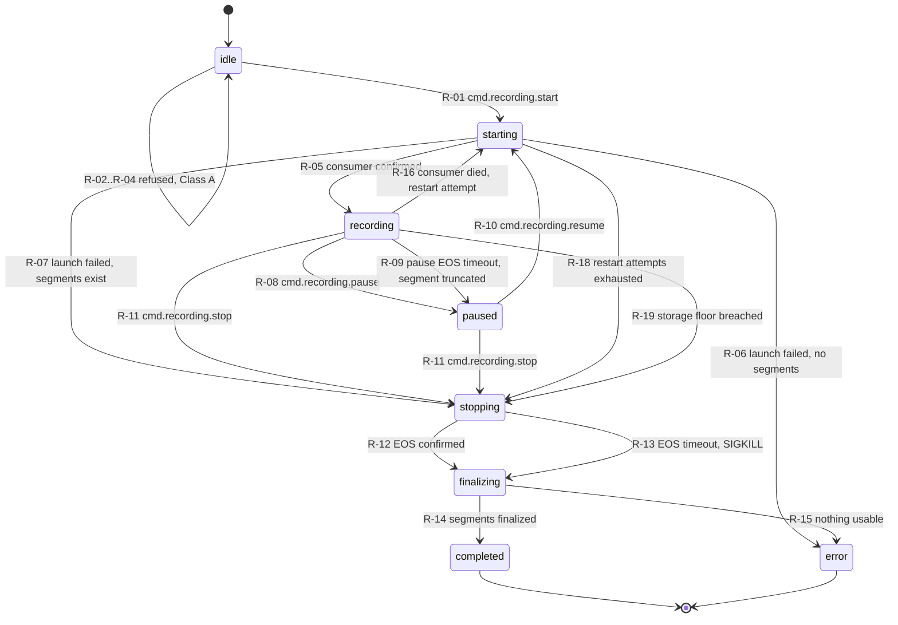

Boot recovery (§1.4) re-enters this machine from persisted state; it is drawn
separately because it is a decision table, not a user-driven path.

### 1.2 Transition table

| # | From | Trigger (emitter) | Guard | To | Side effects | Emits → consumer |
|---|---|---|---|---|---|---|
| R-01 | idle | `cmd.recording.start` (panel) | `G-NO-ACTIVE-SESSION` ∧ `G-PROVISIONED` ∧ `G-VOLUME-MOUNTED` ∧ `G-STORAGE-OK` ∧ `G-CHANNEL-VALID` | starting | Create `LectureSession` (title from `titlePattern` A-07, hall snapshot, `sourceSnapshot`, `channelActivations`, `aiEnabledAtStart`); create `Recording(capturing)`; ensure publishers; request record consumer + enabled channel consumers; start session heartbeat | `recording.state{starting,startReason:initial}` → panel; `log.entry(Session,INFO)` → AD-7 |
| R-02 | idle | `cmd.recording.start` | ¬`G-STORAGE-OK` `[D-15]` | idle | Reject (`storage.critical`); refresh alert with the *actual* policy text from `RetentionPolicy` (INV-RP-1, B-53); kick retention sweep | `system.alert{storage.critical}` → panel LP-12; `log.entry(System,WARN)` |
| R-03 | idle | `cmd.recording.start` | ¬`G-NO-ACTIVE-SESSION` | idle | Reject (`recorder.busy`) with owner display name + title (LP-6 locked view, B-15 server-side now) | `recording.state` (re-broadcast current) → panel; `log.entry(Session,INFO)` |
| R-04 | idle | `cmd.recording.start` | ¬`G-PROVISIONED` ∨ ¬`G-VOLUME-MOUNTED` ∨ ¬`G-CHANNEL-VALID` | idle | Reject with the **named** reason (which role is unbound, which preset is invalid) — never a silent no-op (INV-SB-3, B-01) | `system.alert{config.invalid}` → panel + Admin; `log.entry(System,ERROR)` |
| R-05 | starting | `evt.pm.consumer.running(record)` (pipeline-manager) | `G-CONSUMER-CONFIRMED` within `T-START-CONFIRM` | recording | Open `RecordingSegment(index = prev+1, capturing)`; set `startedAt` on the first segment only; LED → blink (PF-14); arm AI countdown if `G-AI-ENABLED`; request quiz session if `G-QUIZ-AVAILABLE` | `recording.state{recording,segmentIndex}` → panel; `recording.segment{capturing}` → panel; `ai.countdown{armed}`; `quiz.session{requesting}` |
| R-06 | starting | `T-START-CONFIRM` expiry ∨ `evt.pm.consumer.failed` | ¬`G-SEGMENTS-EXIST` (startReason `initial`) | error | Stop any partially started consumers; set `errorCode`/`errorMessage` in plain language; LED off; release recorder lock | `recording.state{error,errorCode}` → panel; `system.alert{recording.start-failed}`; `log.entry(Session,ERROR)` |
| R-07 | starting | `T-START-CONFIRM` expiry ∨ `evt.pm.consumer.failed` | `G-SEGMENTS-EXIST` (startReason `resume`/`recovery`) | stopping | Preserve the lecture: no `errorCode` (SM-R-4); alert names the failed resume | `recording.state{stopping}`; `system.alert{recording.resume-failed}`; `log.entry(Session,ERROR)` |
| R-08 | recording | `cmd.recording.pause` (panel) | `G-AUTH-OWNER` | paused | SIGINT the record consumer's **process group** (never `killall` — B-06); await EOS ≤ `T-PAUSE-EOS`; close segment `(endReason=pause, state=finalized)`; probe duration/size; publishers keep running (A-05/A-12); LED off; AI countdown → `held`; meeting/streaming consumers untouched (SM-Q-4) | `recording.state{paused}` → panel; `recording.segment{finalized,pause}`; `ai.countdown{held}` |
| R-09 | recording | `T-PAUSE-EOS` expiry | — | paused | Escalate SIGKILL to the process group; segment `state=truncated`; the mpegts tail is still playable (PF-4) | as R-08 **+** `system.alert{recording.truncated}` |
| R-10 | paused | `cmd.recording.resume` (panel) | `G-AUTH-OWNER` ∧ `G-STORAGE-OK` ∧ `G-CHANNEL-VALID` | starting | Request a record consumer writing a **new segment file**; publishers are already warm so `T-RESUME-CONFIRM` is shorter | `recording.state{starting,startReason:resume}` → panel |
| R-11 | recording, paused | `cmd.recording.stop` (panel) | `G-AUTH-OWNER` | stopping | If capturing: SIGINT the consumer group, await EOS; stop meeting/streaming consumers; disarm AI countdown; close any open publication `(closeReason=session-ended)`; close the quiz session (INV-QZ-2) | `recording.state{stopping}` → panel; `ai.countdown{stopped}`; `quiz.publication{closed}` → quiz-service + projector; `quiz.session{closed}` |
| R-12 | stopping | `evt.pm.consumer.eos` | ≤ `T-STOP-EOS` | finalizing | Close segment `(endReason=stop, finalized)`; probe every file; set `endedAt`, `wallDurationMs`, `recordedDurationMs` (from persisted values only — kills B-08's `NaN`) | `recording.state{finalizing}` → panel; `recording.segment{finalized,stop}` |
| R-13 | stopping | `T-STOP-EOS` expiry | — | finalizing | SIGKILL the group; segment `state=truncated`; still probe and finalize | as R-12 **+** `system.alert{recording.stop-timeout}`; `log.entry(Session,ERROR)` |
| R-14 | finalizing | probe complete | `G-SEGMENTS-EXIST` | completed | Release the recorder lock; LED off; hand the artifact to machine 1b (merge/convert); **publishers stay up** (they feed idle previews and health) | `recording.state{completed}` → panel "Saved"; `recording.artifact{merging\|ready}` → library; `log.entry(Session,INFO)` |
| R-15 | finalizing | probe complete | ¬`G-SEGMENTS-EXIST` | error | `Recording.state = failed`; `errorCode = capture.empty` | `recording.state{error}`; `recording.artifact{failed}`; `system.alert{recording.empty}` |
| R-16 | recording | `evt.pm.consumer.exited(record, unexpected)` | restart attempts < 3 within 120 s | starting | Close segment `(endReason=crash, state=truncated)`; back off per `T-CONSUMER-RESTART`; request a new consumer/segment. **The lecture is not ended by a dead pipeline.** | `recording.state{starting,startReason:recovery}` → panel banner; `recording.segment{truncated,crash}`; `system.alert{recording.pipeline-lost}`; `log.entry(Session,ERROR)` |
| R-17 | starting | `evt.pm.consumer.running` after R-16 | `G-CONSUMER-CONFIRMED` | recording | Open the next segment; clear `recording.pipeline-lost` (`clearedReason=resolved`) | `recording.state{recording}`; `system.alert{cleared}` |
| R-18 | starting | restart attempts exhausted | `G-SEGMENTS-EXIST` | stopping | Give up on the pipeline; finalize what exists (SM-R-4) | `system.alert{recording.unrecoverable}`; `recording.state{stopping}` |
| R-19 | recording | `evt.storage.floor-breached` (storage probe) `[D-15]` | `freeBytes < absoluteFloorBytes` **after** an emergency retention sweep | stopping | Auto-stop **gracefully** so the lecture survives; critical alert states why; refuse further starts (R-02) | `system.alert{storage.critical}`; `recording.state{stopping}`; `log.entry(System,ERROR)` |
| R-20 | recording | `evt.storage.warning` | crossing `warningThresholdPct` | recording (self) | Raise warning alert with real policy text; trigger retention sweep (§4.5); **do not** interrupt capture | `storage.status` → panel; `system.alert{storage.warning}` |
| R-21 | any non-terminal | `cmd.recording.takeover` (panel) | `G-ADMIN` | unchanged | Set `takeoverBy`/`takeoverAt`; write `AuditLogEntry(action=takeover)`; the prior owner's panel authority for this session ends (`AuthSession.revokedReason=takeover` if their kiosk session is replaced) | `recording.state{takeoverBy}` → panel (both users); `log.entry(Auth,WARN)` |
| R-22 | any non-terminal | `cmd.device.poweroff` | — | unchanged (**refused**) | Power-off is refused server-side while a session is non-terminal (LP-13, B-50 had no such rule) | `system.alert{poweroff.refused}` → panel |

**Not present, by decision:**
`[D-12]` there is no hardware-initiated stop — the GPIO record button is retired
(B-13); if reopened, it adds a `cmd.recording.stop(actorKind=hardware)` trigger to
R-11 and a `startedByActor` value.
`[D-18]` there is no scheduler-initiated start — scheduled recordings are retired
(B-55's dead `ss` settings); if reopened, R-01 gains a second trigger and
`G-AUTH-OWNER` needs a machine-actor variant. These are the two widest-blast
reopenings in this machine.

### 1.3 Segment bookkeeping (A-12, the pause contract)

| Rule | Statement | Source |
|---|---|---|
| SEG-1 | Entering `recording` opens exactly one `RecordingSegment` with `index = max(index)+1`; leaving `recording` closes exactly one with an `endReason` | A-12 |
| SEG-2 | Ordering is by `index` only — never by id arithmetic or insert order | INV-RS-1, B-25 (`id+1`), B-10 (`ORDER BY id DESC LIMIT 1`) |
| SEG-3 | A `separate-files` preset produces one `RecordingFile` **per `LayoutPreset.outputs` entry, per segment** (the `~1`/`~2` successor). All of them belong to one `Recording` | INV-LP-3, B-02, B-09 |
| SEG-4 | Merge groups files by `streamKey` across segments and produces one merged file per `streamKey`; conversion then produces the deliverable container | A-12, PF-5, B-23 |
| SEG-5 | `truncated` and `crash`-ended segments participate in the merge; only `failed` segments with zero bytes are excluded (and their rows are kept for audit) | INV-RS-3, INT-6 |
| SEG-6 | Merging is triggered by the system on entering `finalizing` — never by opening a screen | INV-RS-2, B-34 (the legacy race that shipped unmerged segments) |
| SEG-7 | No consumer of a segment or file parses a filename for metadata | INV-RF-1, INV-G-4, B-02 |

### 1.4 Crash & restart recovery (INT-6, INT-7, PF-3, PF-4, J-4)

The recovery pass runs once per `core-api` start, after `pipeline-manager`
reports publisher status, within `T-BOOT-RECOVERY`. Its input is
`session.lastHeartbeatAt` (written every `T-SESSION-HEARTBEAT`) and
`DeviceHealth.lastBootAt`.

| # | Persisted state | Condition | Outcome | Side effects | Emits |
|---|---|---|---|---|---|
| BR-1 | recording | ¬`G-DEVICE-REBOOTED` ∧ consumer still alive and writing (core-api restarted alone) | **adopt** → recording | No new segment, no data loss; re-attach supervision by process group (`pgrep` adoption, pipeline-audit §4.5) | `recording.state{recording,adopted:true}`; `log.entry(Session,INFO)` |
| BR-2 | recording | `G-DEVICE-REBOOTED` ∧ `G-RECOVERY-WINDOW` ∧ `G-STORAGE-OK` ∧ `G-PROVISIONED` | **auto-resume** → starting(recovery) → recording | Close the crashed segment `(endReason=crash, truncated)`; `recoveredAt`, `recoveryOutcome=auto-resumed`; ≤ 5 s of material lost around the cut (INT-6) | `recording.state{starting,startReason:recovery}`; `system.alert{session.recovered}` → panel banner (J-4); `log.entry(Session,WARN)` |
| BR-3 | recording | ¬`G-RECOVERY-WINDOW` | **finalize** → finalizing → completed | Close crashed segment; `recoveryOutcome=finalized`; the lecture is preserved and visible in the library | `recording.state{completed}`; `system.alert{session.finalized-after-crash}`; `log.entry(Session,WARN)` |
| BR-4 | paused | `G-RECOVERY-WINDOW` | stays **paused** | Publishers restarted; **no** new segment — the lecturer paused deliberately and a machine must not resume for them (SM-Q-3) | `recording.state{paused}`; `system.alert{session.recovered}` |
| BR-5 | paused | ¬`G-RECOVERY-WINDOW` | → finalizing → completed | as BR-3 | as BR-3 |
| BR-6 | starting, stopping | any | → finalizing if `G-SEGMENTS-EXIST`, else → error | Transient states cannot be resumed; finalize or fail honestly | `recording.state{completed\|error}`; `log.entry(Session,WARN)` |
| BR-7 | finalizing | any | re-enter post-stop processing (idempotent) → completed | Probe + merge are restartable; already-merged output is detected by checksum, not redone | `recording.artifact{...}` |
| BR-8 | recording, paused | ¬`G-STORAGE-OK` `[D-15]` | **finalize**, never auto-resume | A resume that immediately fills the disk is worse than a clean finalize | `system.alert{storage.critical}`; as BR-3 |
| BR-9 | > 1 non-terminal session found | violates INV-LS-1 | finalize all but the most recent | Defensive: legacy's single `record_status` row made this impossible to detect (B-03) | `log.entry(Session,ERROR)` per extra session |

**Data-loss budget.** `T-SESSION-HEARTBEAT` (5 s) and the muxer flush interval
together bound the "≤ 5 s lost" promise (INT-6): mpegts capture with periodic
flush means the on-disk tail is always playable, and the heartbeat bounds how
stale the recovery decision's input can be.

### 1.5 Record LED (PF-14, B-05)

The LED is a **pure function of state**, not a machine (domain model §10):

| State | LED |
|---|---|
| `recording` | blinking 1 Hz |
| `starting`, `paused`, `stopping`, `finalizing`, `completed`, `error`, idle | off |

Driven by `pipeline-manager`/GPIO from `recording.state`; correct across pause and
crash paths because it is derived, not separately commanded (legacy drove it with
two `pkill`s and a second script — B-05).

---

## 2. Machine 1b — Recording artifact, and 1c — Channel consumer

### 2.1 Machine 1b: `Recording.state` × `mergeState`

> **SM-D-1 — deviation from the brief.** The brief places `converting` inside the
> UPLOAD JOB machine. It is modelled here instead, on the artifact. Reason: if the
> upload machine owns conversion, an upload can begin while segments are still
> being merged — which is exactly B-34's shipped race (the upload window sent
> unmerged segments if nobody opened the File Manager) and B-25's `~2~cmb`
> duplicate-lecture bug. With merge on the artifact, `G-UPLOADABLE` is a
> structural precondition of job creation (INV-UJ-3), not a timing hope. The
> brief's observable "converting" row in AD-9 is preserved: an `UploadJob` sits in
> `queued` with `blockedBy=merge` and the queue view renders "Preparing…".

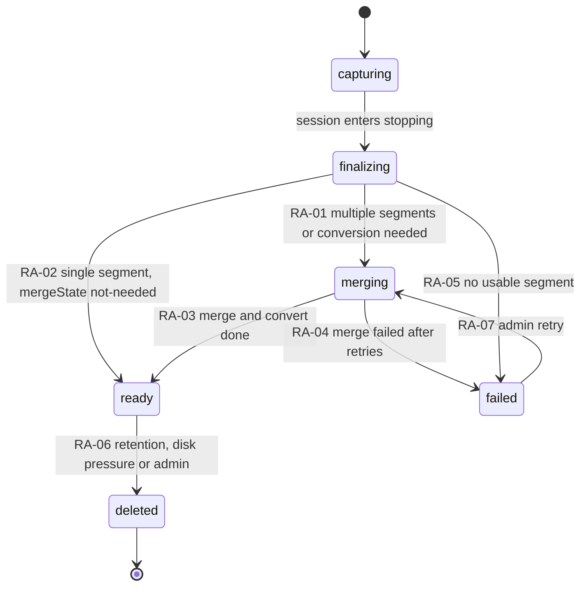

| # | From | Trigger | Guard | To | Side effects | Emits |
|---|---|---|---|---|---|---|
| RA-01 | finalizing | R-12/R-13 completed | `segmentCount > 1` ∨ container conversion required | merging | `mergeState=pending→running`; concat per `streamKey` (SEG-4), then remux to the deliverable container; supervised async job, never on the event loop (B-23's `execSync`) | `recording.artifact{merging}` → library badge |
| RA-02 | finalizing | R-12/R-13 completed | `segmentCount = 1` ∧ no conversion needed | ready | `mergeState=not-needed`; create `UploadJob` (U-01) | `recording.artifact{ready}`; `upload.job{queued}` |
| RA-03 | merging | merge+convert exit 0 | output probes playable | ready | `mergeState=done`; mark merged/derived files `finalized` + `isUploadable`; create `UploadJob` exactly once (INV-UJ-2) | `recording.artifact{ready}`; `upload.job{queued}` → AD-9 |
| RA-04 | merging | 2 failures ∨ `T-MERGE-WATCHDOG` | — | failed | `mergeState=failed`; segment files retained (never destroyed by a failed merge); **no** upload job | `recording.artifact{failed}`; `system.alert{recording.merge-failed}` → panel + AD-9 |
| RA-05 | finalizing | probe found nothing usable | ¬`G-SEGMENTS-EXIST` | failed | Pairs with R-15 | `recording.artifact{failed}` |
| RA-06 | ready | retention sweep / `cmd.recording.delete` (admin) / disk pressure | §4.5 rules; `G-ADMIN` for the manual path | deleted | Set `deletedAt`/`deletedBy`/`deleteReason` as **real columns** (B-33's `deleted(<uid>)` status string dies); remove files; keep the `LectureSession` row (INV-LS-7); `AuditLogEntry` for admin deletes | `recording.artifact{deleted}` → library; `log.entry(Session,INFO)` |
| RA-07 | failed | `cmd.recording.retry-merge` (admin) | `G-ADMIN` | merging | Reset attempt counter | `recording.artifact{merging}` |

### 2.2 Machine 1c: channel consumer (`meeting`, `streaming`)

`local` is not in this machine — the local channel **is** the record consumer and
its lifecycle is machine 1a's. Toggling meeting or streaming starts/stops only
that consumer; publishers and the record consumer are untouched (INV-CC-2 —
this is the death of B-06's global `killall` and B-14's render-time teardown).

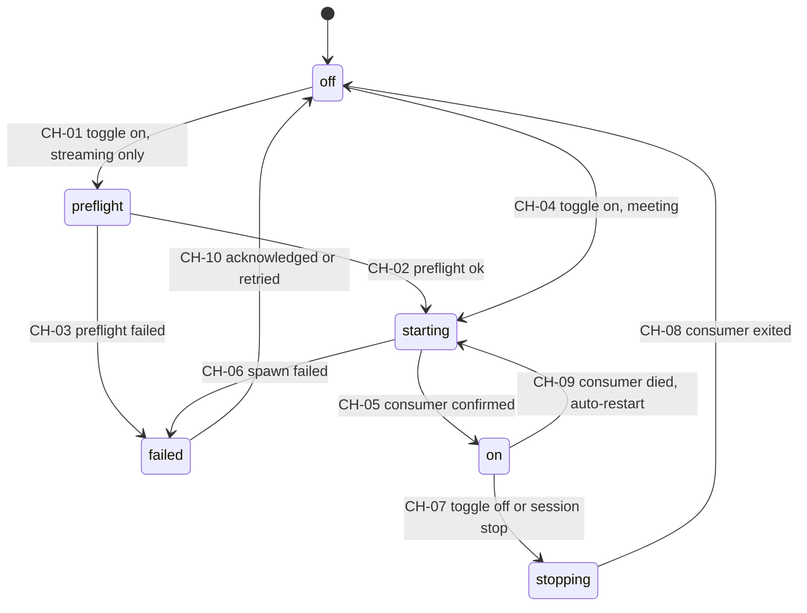

| # | From | Trigger | Guard | To | Side effects | Emits |
|---|---|---|---|---|---|---|
| CH-01 | off | `cmd.channel.enable(streaming)` | `G-CHANNEL-VALID` | preflight | Run the `check_live.sh`-equivalent preflight: elements present, relay + TLS bridge up, push target configured, test push (A-10) | `channel.state{preflight}` → panel |
| CH-02 | preflight | preflight ok | — | starting | **Make push targets active before the pipeline connects** (INV-ST-2 — B-16/B-58 ordering is load-bearing); reload the templated relay config, never rewrite `nginx.conf` mid-stream (B-58) | `channel.state{starting}` |
| CH-03 | preflight | preflight failed | — | failed | Named reason (target unreachable, key rejected, element missing); recording is unaffected (§6 offline behavior) | `channel.state{failed,reason}`; `system.alert{streaming.preflight-failed}` |
| CH-04 | off | `cmd.channel.enable(meeting)` | `G-CHANNEL-VALID` | starting | Spawn the HDMI-out #2 camera composite **with mic audio embedded** (A-15, PF-12) | `channel.state{starting}` |
| CH-05 | starting | `evt.pm.consumer.running` | `G-CONSUMER-CONFIRMED` | on | Append/close `channelActivations` entry on the session (LP-7 audit of what was actually on) | `channel.state{on}` → panel switch |
| CH-06 | starting | `T-CHANNEL-START` expiry ∨ failure | — | failed | Never leave the switch showing ON for a dead consumer (B-12 class) | `channel.state{failed}`; `system.alert` |
| CH-07 | on | `cmd.channel.disable` ∨ R-11 | `G-AUTH-OWNER` for the command | stopping | SIGINT that consumer's group only | `channel.state{stopping}` |
| CH-08 | stopping | consumer exited | — | off | For streaming: remove push targets after the pipeline disconnects | `channel.state{off}` |
| CH-09 | on | `evt.pm.consumer.exited(unexpected)` | attempts < 3 | starting | Auto-restart with backoff; **the record consumer is never touched** | `channel.state{starting}`; `system.alert{channel.restarting}` |
| CH-10 | failed | `cmd.channel.disable` ∨ retry | — | off | — | `channel.state{off}` |

**Pause interaction (SM-Q-4).** Meeting and streaming consumers keep running while
the session is `paused` — channels are independent by design (INV-CC-2). Because
a lecturer who taps Pause may assume *everything* stopped, the panel must show an
explicit "still streaming / still on the meeting output" indicator whenever
`state = paused` ∧ any channel is `on`. Default is *keep running*; flipping this
to *hold channels on pause* would be a PRD change, not a code detail.

---

## 3. Machine 2 — AI QUESTION FLOW

Four coupled machines. The brief's single chain maps onto them like this:

| Brief state | Lives in | Actual state |
|---|---|---|
| scheduled countdown | 2a | `armed` (with `remainingMs`) |
| generating | 2a + 2b | `generating` |
| ready | 2b | `QuestionSet.ready` (drives the green banner) |
| in-review | — | **not a server state**: the modal being open is UI-local; the set stays `ready` until every question is dispositioned (SM-R-2) |
| published | 2d | `QuestionPublication.open` (+ `isShowing`) |
| closed | 2d | `QuestionPublication.closed` |

### 3.1 Machine 2a — AI countdown (session-scoped)

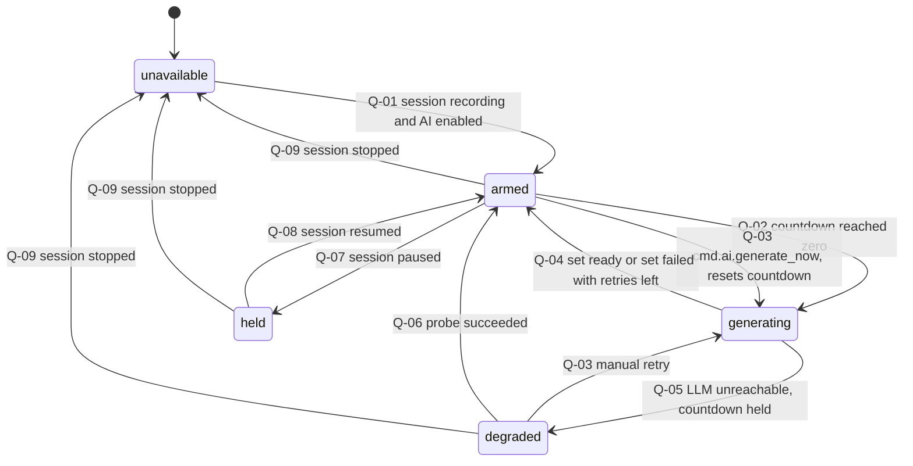

| # | From | Trigger | Guard | To | Side effects | Emits |
|---|---|---|---|---|---|---|
| Q-01 | unavailable | R-05 (session → recording) | `G-AI-ENABLED` | armed | `remainingMs = intervalMinutes × 60 000`, default **20** (A-14, INT-11 — the prototype's 15 is drift to be corrected); a fresh session resets AI state but **keeps lecturer-authored questions** (INV-QS-3, INV-Q-3) | `ai.countdown{armed,remainingMs,nextAt}` → panel |
| Q-02 | armed | `remainingMs = 0` (core-api scheduler) | `G-AI-ENABLED` | generating | Create `QuestionSet(trigger=countdown)` → machine 2b | `ai.countdown{generating}`; `ai.set{requested}` |
| Q-03 | armed, degraded | `cmd.ai.generate_now` (panel) | `G-AI-ENABLED` ∧ session `state = recording` — **not** while `held`/paused, matching the prototype's disabled Generate button (`CountdownToNext.tsx:54`); a paused session has no new transcript to generate from | generating | Create `QuestionSet(trigger=manual)` **and reset the countdown to the full interval** — the key LP-16 requirement; the modal's "Regenerate Questions" uses this same path with `AuditLogEntry.action=regenerate` | `ai.countdown{generating,remainingMs:full}`; `ai.set{requested}` |
| Q-04 | generating | 2b reached `ready` or `failed` | retries remain | armed | Reset `remainingMs` to the full interval (auto and manual generations both reset it) | `ai.countdown{armed}` |
| Q-05 | generating | 2b `failed` with `error ∈ {timeout, unreachable}` after retries | — | degraded | **Countdown is held** (J-2: "countdown pauses"); studio shows an unavailable state with a retry button; recording and every other panel function untouched (LP-18, INV-QS-1) | `ai.countdown{degraded}`; `system.alert{ai.unavailable}` |
| Q-06 | degraded | health probe every `T-LLM-PROBE` succeeds | — | armed | Resume from the held `remainingMs` | `ai.countdown{armed}`; `system.alert{cleared}` |
| Q-07 | armed | R-08 (session → paused) | — | held | The countdown runs **only** while `recording` (INV-QS-3); no generation while paused — the transcript window would be empty | `ai.countdown{held}` |
| Q-08 | held | R-05 after resume | — | armed | Remaining time is preserved across the pause, not reset | `ai.countdown{armed}` |
| Q-09 | armed, held, degraded, generating | R-11 / R-14 / R-15 (session ends) | — | unavailable | Cancel in-flight generation; unreviewed sets → `discarded(session-ended)`; open publication closed by R-11 | `ai.countdown{unavailable}` |
| Q-10 | armed, held | `cmd.ai.set_interval(10\|15\|20\|30)` | `G-AI-ENABLED` | unchanged | Reset `remainingMs` to the new interval (prototype behavior, A-14) | `ai.countdown{remainingMs,intervalMinutes}` |

**Countdown transport.** `ai.countdown` carries `nextAt` (absolute instant) and is
emitted **on transition + every `T-COUNTDOWN-RESYNC`**, not once per second. The
panel renders the ticking display locally from `nextAt`. Countdown ticks are
telemetry, never rows (INV-G-7, domain model §10).

**Availability.** With `aiQuizEnabled = false` (INT-10) or `llmEndpoint = null`,
the machine never leaves `unavailable` and the AI studio is hidden — flipping the
flag off must not affect recording in any way (INV-DP-4, LP-18).

### 3.2 Machine 2b — `QuestionSet`

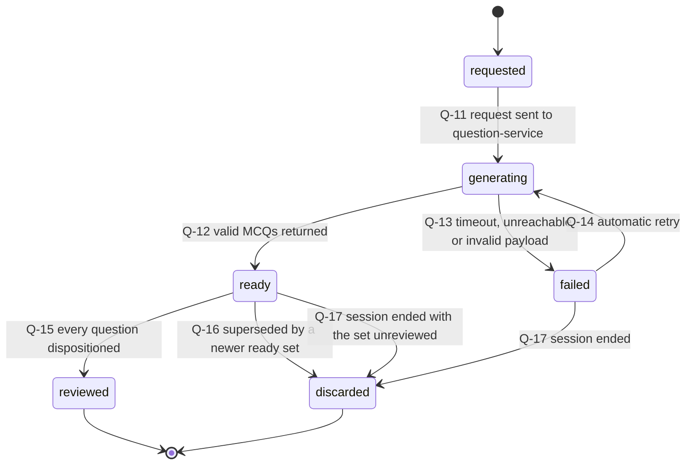

| # | From | Trigger | Guard | To | Side effects | Emits |
|---|---|---|---|---|---|---|
| Q-11 | requested | Q-02/Q-03 | `G-AI-ENABLED` | generating | Compute `inputWindow` (transcript from the previous set's `toOffsetMs` → now) and `slideCaptureIds`; record `modelId`/`promptVersion` for provenance; request 3–5 MCQs (A-14) | `ai.set{generating}` → panel |
| Q-12 | generating | question-service response ≤ `T-LLM-REQUEST` | ≥ 1 item passes validation | ready | Validate every item against INV-Q-1 (2–4 options, exactly one correct, `correctOptionId` is an **id** not an index — INV-Q-2/DM-7); drop invalid items; persist survivors as `Question(draft)`; `returnedCount` set | `ai.set{ready,count}` → **green "A new set is ready" banner**; `ai.question{draft}` ×N; `log.entry(Session,INFO)` |
| Q-13 | generating | `T-LLM-REQUEST` expiry, connection failure, or 0 valid items | — | failed | Store `error`; classify as `timeout \| unreachable \| invalid-payload` | `ai.set{failed,error}` → studio failure state with retry (J-2) |
| Q-14 | failed | automatic retry | attempts < 2 (`T-LLM-RETRY` backoff) | generating | `invalid-payload` gets exactly one automatic regeneration; then it surfaces | `ai.set{generating,attempt}` |
| Q-15 | ready | last question of the set reaches `sent` or `discarded` | — | reviewed | Terminal, historical record of what the batch produced | `ai.set{reviewed}` |
| Q-16 | ready | a newer set reaches `ready` | — | discarded | **Supersession:** remaining generated `draft` questions of the old set → `discarded(superseded)`; lecturer-authored questions (`questionSetId = null`) are untouched and stay in the pool (INV-Q-3, prototype `filter(custom)`) | `ai.set{discarded,superseded}`; `ai.question{discarded}` ×N |
| Q-17 | ready, failed | Q-09 (session ended) | — | discarded | Reason `session-ended` | `ai.set{discarded}` |

**Retry policy.** 2 automatic retries at `T-LLM-RETRY` (10 s, 30 s). After the
second failure the countdown goes `degraded` (Q-05) and only a manual
`cmd.ai.generate_now` or a successful health probe leaves that state. Generation
never blocks, retries or degrades anything outside this machine (INV-QS-1).

### 3.3 Machine 2c — `Question`, and the audit contract

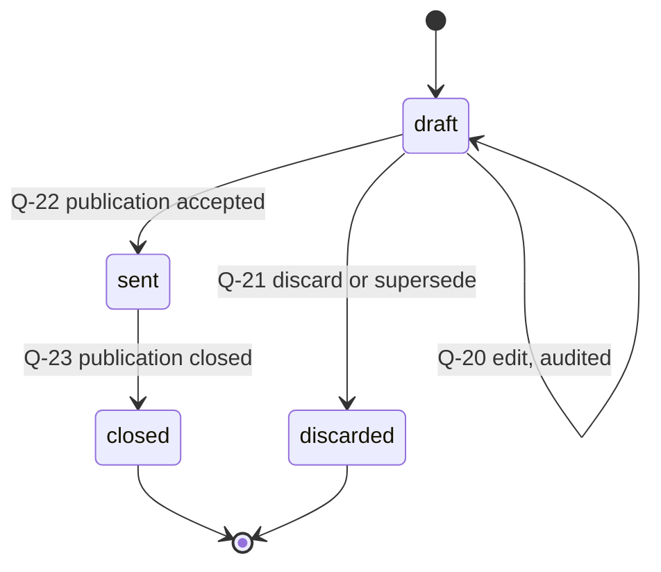

| # | From | Trigger | Guard | To | Audit (`AuditLogEntry.action`) | Emits |
|---|---|---|---|---|---|---|
| Q-18 | — | Q-12 (generated) | — | draft | `create`, `actorKind=system`, `modelId`/`promptVersion` in `context` | `ai.question{draft,generated}` |
| Q-19 | — | `cmd.ai.add_question` (panel) | `G-AI-ENABLED` ∧ INV-Q-1 | draft | `create`, `actorKind=user` — `questionSetId = null`, `provenance=lecturer-authored` ("Yours" chip) | `ai.question{draft,lecturer-authored}` |
| Q-20 | draft | `cmd.ai.edit_question` | `G-QUESTION-MUTABLE` | draft | `edit` with field-level `before`/`after`; sets `Question.edited = true` | `ai.question{draft,edited}` |
| Q-21 | draft | `cmd.ai.discard_question` ∨ Q-16 | — | discarded | `discard` (`actorKind=user`, or `system` with `reason=superseded`) | `ai.question{discarded}` |
| Q-22 | draft | Q-31 (publication accepted) | `G-PUBLISH-ACK` | sent | `send` | `ai.question{sent}` |
| Q-23 | sent | Q-33/Q-34 (publication closed) | — | closed | `close` with `closeReason` | `ai.question{closed}` |

**Edit-auditing rules (INV-Q-5, INV-AU-2, LP-16).**
1. Every create, edit, discard, send and close writes **exactly one**
   `AuditLogEntry` — including system-authored ones, which carry
   `actorKind=system` (INV-G-6). Bounded volume: ≈ 6 sets × 5 questions × ≤ 4
   actions per lecture.
2. `regenerate` is audited at the **set** level (Q-03 from the modal); the
   resulting question creations are audited individually at the question level.
3. A question in `sent` or `closed` is **immutable** — an edit command against it
   is rejected, not silently applied, because answers already reference it
   (INV-Q-4, INT-3). The reject is audited too (`action=edit`, `reason=immutable`).
4. `before`/`after` never contain secret-grade values (INV-AU-3).

### 3.4 Machine 2d — `QuestionPublication` (the send-to-projector contract)

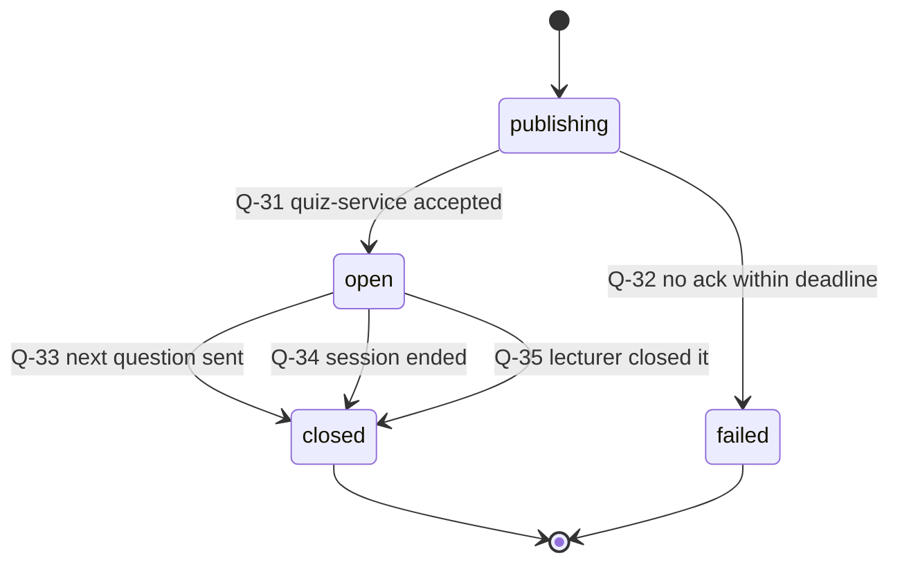

| # | From | Trigger | Guard | To | Side effects | Emits |
|---|---|---|---|---|---|---|
| Q-30 | — | `cmd.ai.send_to_projector(questionId)` | `G-AI-ENABLED` ∧ `G-QUIZ-AVAILABLE` ∧ `G-QUESTION-MUTABLE` | publishing | Create the publication; push question + options to quiz-service. **The projector is not switched yet.** | `quiz.publication{publishing}` → panel |
| Q-31 | publishing | quiz-service ack ≤ `T-PUBLISH-ACK` | `G-PUBLISH-ACK` | open | *In this order:* close the previous open publication (`closeReason=next-question`, INV-QPUB-2) → set `isShowing=true` (exactly one, INV-QPUB-1) → switch the projector consumer from slides passthrough to question + join QR (A-22, PF-11) → set `publishedAt` (the response-time zero point) | `quiz.publication{open,isShowing}` → panel + projector; `quiz.question{open}` → student apps; `ai.question{sent}` |
| Q-32 | publishing | `T-PUBLISH-ACK` expiry after 1 retry | — | failed | **The projector stays on slides passthrough** and the previous publication stays open — students are never shown a question they cannot answer (INV-QPUB-3, DM-9). The panel surfaces the failure with a retry | `quiz.publication{failed}`; `system.alert{quiz.publish-failed}` |
| Q-33 | open | Q-31 of the next publication | — | closed | `closeReason=next-question`; `closedAt` is authoritative for answer acceptance on **both** sides (INV-QPUB-4) | `quiz.publication{closed}` → panel + quiz-service; `quiz.question{closed}` → student apps |
| Q-34 | open | R-11 (session stop) | — | closed | `closeReason=session-ended` (INT-3); projector returns to slides passthrough | as Q-33 |
| Q-35 | open | `cmd.ai.close_question` | `G-AUTH-OWNER` | closed | `closeReason=lecturer-closed` | as Q-33 |
| Q-36 | open, closed | `cmd.ai.project(publicationId \| none)` | `G-AUTH-OWNER` | unchanged | `projectorState` only: `showing` ↔ `withdrawn`. Re-projecting a **closed** publication renders it in reveal mode (correct answer shown) and does **not** reopen acceptance — this is the brief's "revealed", and it is a projector mode, not a state | `quiz.publication{projectorState}` → projector |

**Never on the projector:** leaderboard or any student identity (INV-QZ-3,
INV-LB-3, A-16). The projector consumer is not given access to that data at all —
it is an authorization boundary, not a rendering choice.

---

## 4. Machine 3 — UPLOAD JOB

Brief → model mapping: `pending` = `queued`, `converting` = machine 1b `merging`
(SM-D-1), `uploading` = `uploading`, `verifying` = `completing`, `done` = `done`,
`failed(n)` = `failed` with `attempt = n` → `dead-letter` at the cap.

**One job per Recording** (INV-UJ-1). Every uploadable file of that recording —
every stream of every segment, merged — is a **part** of that one job. This is
structural, not re-derived at upload time, which is what killed B-25 (the
`substr(-4) != "2.ts"` skip rule + `id+1` twin update, and the `~2~cmb` gap that
shipped a paused dual recording's second stream as its own lecture).

### 4.1 Diagram

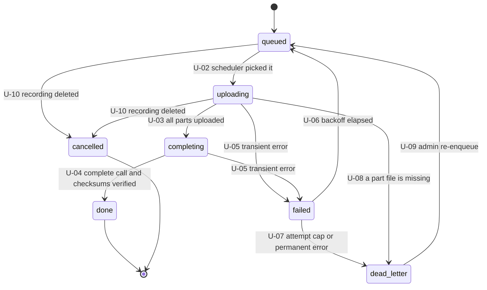

### 4.2 Transition table

| # | From | Trigger | Guard | To | Side effects | Emits |
|---|---|---|---|---|---|---|
| U-01 | — | RA-02/RA-03 (`Recording` → `ready`) | `G-UPLOADABLE` ∧ no existing job for this recording | queued | Create the job **exactly once, automatically** (INV-UJ-2, B-09); create one `UploadFilePart` per uploadable file; `enqueuedAt = now` — immediate, no windows, no instant/scheduled toggle `[D-13]` (B-22, B-30) | `upload.job{queued}` → AD-9 + library badge |
| U-02 | queued | scheduler tick, `nextAttemptAt ≤ now` | concurrency = 1 job, 1 part | uploading | Adapter `add` → `remoteLectureId` if not already held (INV-UJ-6); then parts in order | `upload.job{uploading,progress}` → AD-9 |
| U-03 | uploading | every part `uploaded` | INV-UP-2 | completing | The `complete` call of the add→upload→complete protocol `[D-02b]` (B-24's shape, minus its hardcoded key and `rejectUnauthorized:false` — INV-UJ-5) | `upload.job{completing}` |
| U-04 | completing | complete ok ∧ checksums match | — | done | `completedAt`, `remoteLectureId` retained; notify the retention sweep that this recording is now deletable-eligible (§4.5) | `upload.job{done}` → library badge "done"; `log.entry(System,INFO)` |
| U-05 | uploading, completing | transient error (network, 5xx, stall `T-UPLOAD-STALL`) | — | failed | `attempt++` **only for server-side errors** (see §4.4); `nextAttemptAt` per backoff; if `remoteLectureId` exists → `remoteCleanupState=pending` and delete the partial remote object before the next attempt (B-24/B-27 intent, without B-27's `WHERE id = undefined` bug that never re-queued anything) | `upload.job{failed,attempt,nextAttemptAt,lastError}` → AD-9 retry history |
| U-06 | failed | `nextAttemptAt` reached | connectivity available | queued | Parts resume from `bytesSent`/`resumeToken` `[D-02b]`; if the adapter cannot resume, the part restarts from 0 (adapter capability flag) | `upload.job{queued}` |
| U-07 | failed | `attempt > 8` ∨ permanent error (4xx validation/auth after 2 attempts) | — | dead-letter | Terminal-until-operator, **always visible in AD-9 with its reason** (INV-UJ-4, B-28's silently-excluded `nofile`) | `upload.job{dead-letter,reason}`; `system.alert{upload.dead-letter}` → panel + AD-9 |
| U-08 | uploading | a part reports `missing` | `RecordingFile.state = missing` | dead-letter | Immediate — no retry can fix a deleted file (INV-RF-3, B-28) | as U-07 |
| U-09 | dead-letter | `cmd.upload.requeue` (AD-9) | `G-ADMIN` | queued | `requeuedBy`/`requeuedAt`; `attempt = 0`; remote cleanup first if `remoteLectureId` is set. This is the successor of B-35's hardcoded manual-upload endpoint `[D-13]` | `upload.job{queued,requeued}`; `AuditLogEntry(action=create,reason=requeue)` |
| U-10 | queued, uploading, failed | RA-06 (`Recording` → `deleted`) | — | cancelled | Abort in flight; remote cleanup if `remoteLectureId` is set | `upload.job{cancelled}` |

### 4.3 Machine 3b — `UploadFilePart`

| # | From | Trigger | Guard | To | Side effects | Emits |
|---|---|---|---|---|---|---|
| UP-01 | pending | job entered `uploading`, part selected | file `finalized` | uploading | Stream with `bytesSent` checkpointing; parts are addressed by `recordingFileId`, never by position or adjacency (INV-UP-1, B-25's `id+1`) | `upload.part{uploading,bytesSent}` → AD-9 |
| UP-02 | uploading | transfer complete ∧ checksum verified | — | uploaded | `remoteFileId` recorded `[D-02b]` | `upload.part{uploaded}` |
| UP-03 | uploading | transient failure / stall | — | failed | Keep `bytesSent` + `resumeToken` for resume; propagate U-05 | `upload.part{failed}` |
| UP-04 | pending, uploading | file not found on disk | — | missing | Triggers U-08 for the whole job | `upload.part{missing}` |
| UP-05 | failed | job re-attempt | — | uploading | Resume from `bytesSent` | `upload.part{uploading}` |

### 4.4 Backoff, connectivity and the attempt counter

| Attempt | Delay before the next try |
|---|---|
| 1 | 30 s |
| 2 | 2 min |
| 3 | 8 min |
| 4 | 30 min |
| 5 | 2 h |
| 6–8 | 6 h (capped) |

± 20 % jitter on every value.

**Connectivity failures do not consume attempts.** A device can be offline for a
weekend; burning eight attempts on "no route to host" would dead-letter a
perfectly good recording. Classification:

| Error class | `attempt++`? | Path |
|---|---|---|
| No route / DNS / TLS handshake / connect timeout | **no** | retry at the capped 6 h interval indefinitely; raise `upload.offline` after 24 h |
| 5xx, mid-transfer reset, stall (`T-UPLOAD-STALL`) | yes | backoff table → dead-letter at the cap |
| 4xx validation/auth | yes | dead-letter after 2 attempts |
| Part file missing | — | immediate dead-letter (U-08) |

Recording is never affected by any of this: uploads queue and resume while the
WAN is down, and the panel keeps working (§6 offline behavior, G-3).

### 4.5 Retention sweep (A-20, PF-7, `[D-15]`)

Runs every `T-RETENTION-SWEEP`, plus on `upload.job → done` and on every storage
threshold crossing. It **acts on machine 1b** (transition RA-06); it owns no state
of its own. All decisions read `Recording` state and `UploadJob` outcome from the
database — never a filename, never a directory listing (INV-RP-2, B-20 parsed the
recording date out of the filename).

| Rule | Condition | Action | Source |
|---|---|---|---|
| RET-1 | `Recording.state = ready` ∧ `now ≥ retentionDeleteAfter` (endedAt + 14 d) ∧ a successful `UploadJob` exists | delete media (RA-06, `deleteReason=retention`) | A-20 |
| RET-2 | Same age, but **no** successful upload | **do not delete**; raise `retention.blocked` for an admin `[D-15]` | INV-RC-4, `neverDeleteUnuploaded` — the explicit reversal of B-20 |
| RET-3 | `storagePressure ≥ warning` | delete already-uploaded recordings **oldest-first** until below the warning threshold, even if younger than 14 days (`deleteReason=disk-pressure`) | `[D-15]`, `earlyDeleteOrder = uploaded-oldest-first` |
| RET-4 | `storagePressure = critical` ∧ nothing eligible | refuse new starts (R-02) with a warning that quotes the **real** thresholds from `RetentionPolicy` | `[D-15]`, INV-RP-1, B-53 (which warned at 70 % about an 80 % policy) |
| RET-5 | Foreign or unexpected files under the recordings directory | ignore them; never abort the sweep | INV-RF-4, B-20 (a stray file aborted cleanup every minute) |
| RET-6 | Any deletion | `LectureSession` row survives; `Recording` keeps `deletedAt/By/Reason` columns | INV-LS-7, INV-G-4, B-33 |

`[D-14]` there is no auto-shutdown when the queue drains (B-29's stub stays
retired); if reopened it is one hook on `upload.job{done}` + a config flag.

---

## 5. Machine 4 — QUIZ SESSION, participants, answers and the sync link

> **SM-D-2 — deviation from the brief.** The brief's `locked` and `revealed` are
> **not** quiz-session states. INT-3 closes questions *individually* (when the next
> is sent, or when the session stops) while the session keeps accepting joins and
> answers to the next question — so locking is a property of a
> `QuestionPublication` (machine 2d: `open → closed`) and "revealed" is a projector
> mode (Q-36). The quiz session itself has exactly the two states the domain model
> gives it: `open` and `closed`. The extra values in 4a below are **device-side
> projection/sync states**, not authority (INV-G-8).

### 5.1 Machine 4a — QuizSession (device-side projection)

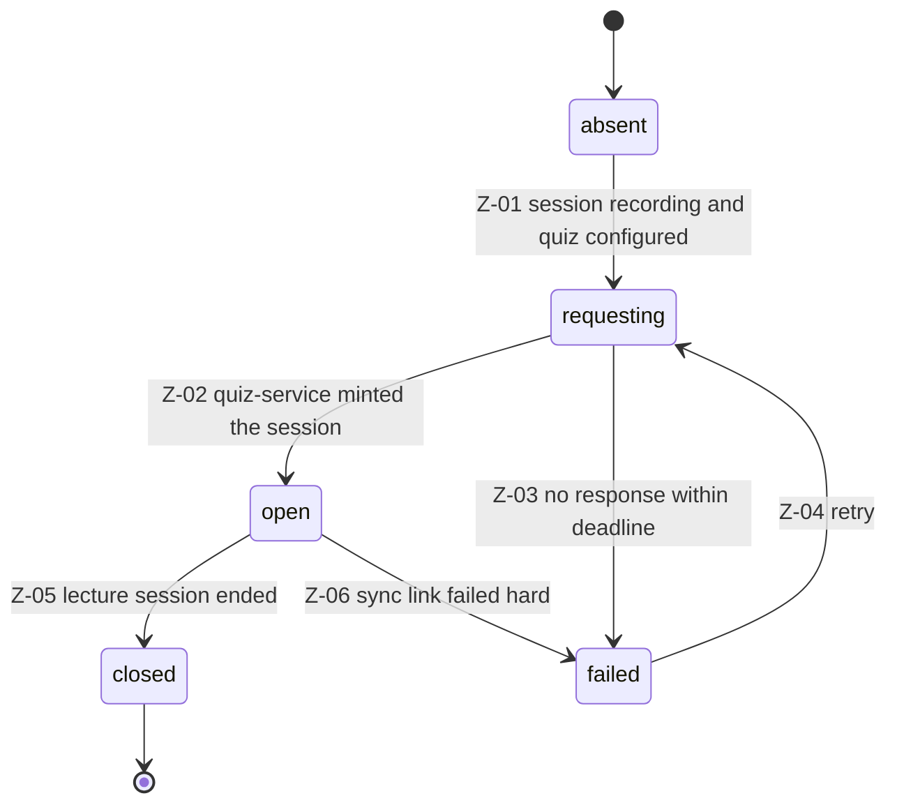

| # | From | Trigger | Guard | To | Side effects | Emits |
|---|---|---|---|---|---|---|
| Z-01 | absent | R-05 (session → recording) | `quizServerBaseUrl ≠ null` ∧ `aiEnabledAtStart` | requesting | Ask quiz-service to mint a `QuizSession` for this `lectureSessionId` (ULIDs are generatable on both sides — INV-G-2) | `quiz.session{requesting}` → panel |
| Z-02 | requesting | quiz-service response ≤ `T-QUIZ-CREATE` | — | open | Store the projection: `joinCode`, `joinUrl`; the projector's join QR encodes `joinUrl` (QZ-2, A-22) | `quiz.session{open,joinUrl,joinCode}` → panel + projector |
| Z-03 | requesting | `T-QUIZ-CREATE` expiry after 2 retries | — | failed | AI studio still works locally; **send-to-projector is refused** while there is no quiz session (`G-QUIZ-AVAILABLE`), because a projected question nobody can answer is worse than none (INV-QPUB-3) | `quiz.session{failed}`; `system.alert{quiz.unavailable}` |
| Z-04 | failed | probe every `T-QUIZ-PROBE` | — | requesting | — | `quiz.session{requesting}` |
| Z-05 | open | R-11 (lecture session ends) | — | closed | Closes any open publication first (INV-QZ-2); students see "session ended" | `quiz.session{closed}` → panel + student apps |
| Z-06 | open | sync link `failed` (§5.4) | — | failed | Existing projected question stays on the projector; the panel marks responses stale, never fabricates them (QZ-7) | `quiz.session{failed}`; `system.alert{quiz.sync-failed}` |

**INV-QZ-1** at most one `open` quiz session per lecture session — enforced by
quiz-service, mirrored here.

### 5.2 Machine 4b — `QuizParticipant` (quiz-service)

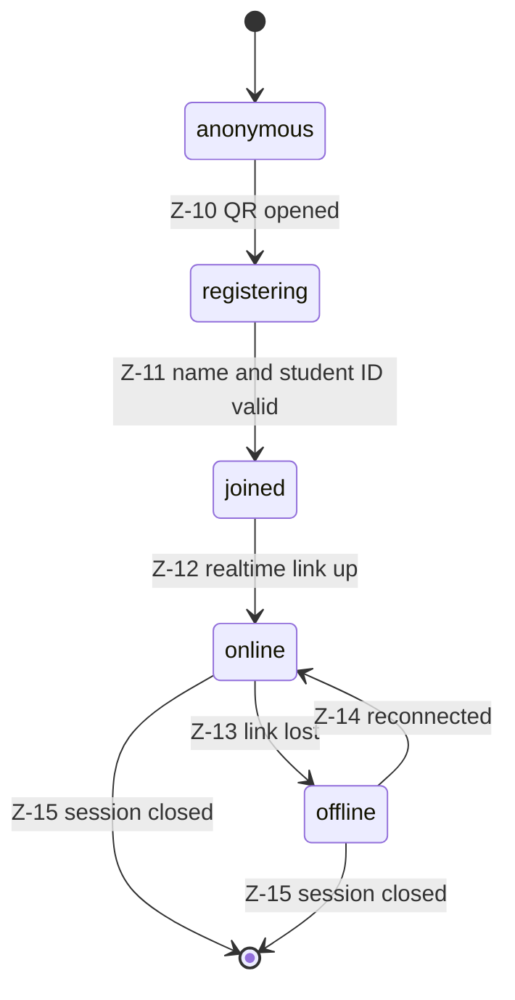

| # | From | Trigger | Guard | To | Side effects | Emits |
|---|---|---|---|---|---|---|
| Z-10 | anonymous | student opens `joinUrl` (QR or code) | quiz session `open` | registering | Show self-registration `[D-21]` | — (client render) |
| Z-11 | registering | student submits name + student ID | real name present ∧ student ID matches the validated **format** (not verified against a roster in V1 `[D-21]`) | joined | Create/lookup `StudentIdentity` by `studentIdNumber` (INV-SI-1 — the leaderboard key); create `QuizParticipant`, unique per `(quizSessionId, studentId)` (INV-QP-1 — rejoining never creates a second participant) | `quiz.participant{joined}` → quiz-service; `sync.participants` → device (joined count for the panel) |
| Z-12 | joined | realtime link established | — | online | On connect the client is sent the current publication, if any | `quiz.question{open\|none}` → that student |
| Z-13 | online | link lost / heartbeat missed | — | offline | Nothing is lost: answers already submitted are durable | `quiz.participant{offline}` |
| Z-14 | offline | reconnect (backoff `T-WS-RECONNECT`) | — | online | Client asks for the current publication; server replies with the open publication **plus this student's own answer state for it**, or "no question". A question that closed while they were away is simply **unanswered** — never counted incorrect (INV-QP-2, J-3) | `quiz.question{open\|none}`, `quiz.result` (own result + own rank only, INT-4) |
| Z-15 | online, offline | Z-05 | — | (terminal) | Student sees "session ended" + their own final result and rank (QZ-6) | `quiz.session{closed}` |

### 5.3 Machine 4c — per-student answer state (per participant × publication)

Server truth is a single `Answer` row (INV-AN-1); this machine is the **client
view** the student's phone renders, and the acceptance rules the server enforces.

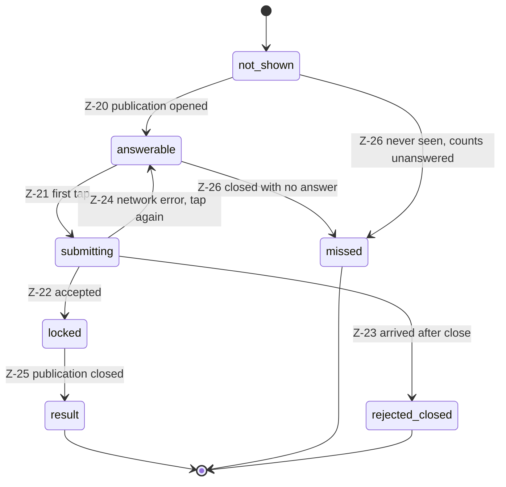

| # | From | Trigger | Guard | To | Side effects | Emits |
|---|---|---|---|---|---|---|
| Z-20 | not-shown | Q-31 (`quiz.question{open}`) | participant `online` | answerable | Options rendered; no timer pressure — response time is **insight only, never score** (INT-2) | `quiz.question{open}` → student |
| Z-21 | answerable | student taps an option | — | submitting | Optimistic lock in the UI; the option is sent as an **id**, never an index (INV-Q-2, DM-7) | — |
| Z-22 | submitting | server accepted | `G-ANSWER-FIRST` ∧ `G-PUBLICATION-OPEN` | locked | Persist `Answer` with `isCorrect` and `pointsAwarded` **evaluated at submit time** (10 × correct, INT-2/QZ-5) so a later question edit cannot rewrite history; `responseTimeMs = receiveAt − publishedAt` | `quiz.responses` → device (batched); `quiz.result` → that student |
| Z-23 | submitting | server rejected | ¬`G-PUBLICATION-OPEN` | rejected-closed | Explicit "question closed" state — never a silent drop (QZ-4, J-3 failure path) | `quiz.answer{rejected,closed}` → student |
| Z-24 | submitting | network error before the server replied | — | answerable | The tap is retried by the client; the server is idempotent on `(publicationId, studentId)` — a duplicate is the *same* answer, not a second attempt (INV-AN-1) | — |
| Z-25 | locked | Q-33/Q-34/Q-35 | — | result | Student sees own correctness, running score, and **own rank only** — never the class list (INT-4, QZ-6, INV-SI-2) | `quiz.result` → student |
| Z-26 | answerable, not-shown | publication closed with no answer | — | missed | Counted as unanswered; accuracy is `correct/answered` so a missed question never lowers accuracy (INV-QP-2, LP-17) | `quiz.question{closed}` → student |

**No grace window.** Acceptance is decided by the **quiz-service's own receive
time** against `publication.closedAt` (INV-QPUB-4). Client-reported instants are
untrusted and are not used to widen acceptance. A question stays open until the
lecturer sends the next one, so students are never racing a hidden clock (INT-3).

**Second submission** is rejected, not overwritten (INV-AN-1) — the first tap is
final, and this is measured in §8 of the PRD ("100 % of answers single-attempt-locked").

### 5.4 Machine 4d — the device ↔ quiz-service sync link (QZ-7)

Cross-zone and unreliable by construction (domain model §8 trust boundary): the
device is on the campus LAN, the quiz server is public, students may be on mobile
data.

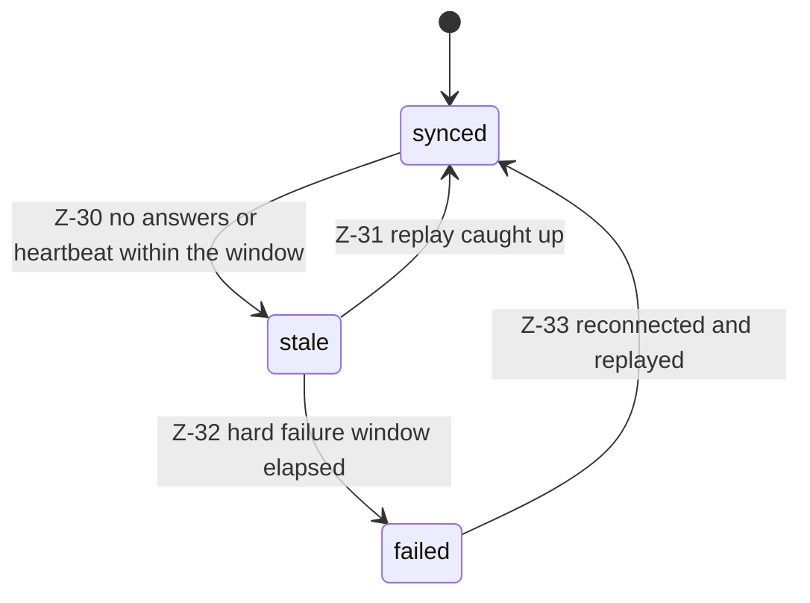

| # | From | Trigger | Guard | To | Side effects | Emits |
|---|---|---|---|---|---|---|
| Z-30 | synced | no answer batch or heartbeat for `T-QUIZ-SYNC-STALE` | — | stale | `QuestionPublication.syncState = stale`; the panel **marks responses stale** rather than displaying them as current (INV-AP-2). Sent questions stay on the projector (J-2 failure path) | `quiz.publication{syncState:stale}` → panel; `quiz.responses{stale:true}` |
| Z-31 | stale | answers received | — | synced | Replay is idempotent: quiz-service resends everything after the device's watermark; projection rows are **replaced, never edited** (INV-AP-1) | `quiz.responses{delta}`; `quiz.publication{syncState:synced}` |
| Z-32 | stale | `T-QUIZ-SYNC-FAIL` elapsed | — | failed | Alert; Insights panel shows a degraded state; **recording is untouched** (QZ-7, LP-18) | `system.alert{quiz.sync-stale}` |
| Z-33 | failed | link restored | — | synced | Full replay since the watermark | `quiz.responses{delta}`; `system.alert{cleared}` |

### 5.5 Panel ↔ core-api WebSocket link

| Condition | Behavior |
|---|---|
| Disconnect | Panel reconnects with `T-WS-RECONNECT` backoff, forever. **Recording continues without the panel** — the device is the authority, not the browser (this is the structural fix for legacy's UI-driven pause bookkeeping, B-10) |
| Reconnect | Panel requests a full snapshot: `recording.state`, `channel.state` ×N, `sources.status` ×N, `storage.status`, `device.health`, `ai.countdown`, `ai.set`, open `quiz.publication`, active alerts. Per-event sequence numbers detect gaps; any gap ⇒ full resync, never a partial patch |
| Disconnected longer than `T-WS-STALE` | The panel dims live regions and shows "reconnecting" — it must not present stale state as current (SM-R-1). The red/amber recording frame is **kept** (the device is still recording; hiding it would be the more dangerous lie) with a "panel offline" marker |
| Command sent while disconnected | Rejected client-side with a clear message; commands are never queued and replayed — a stop tapped five minutes ago must not fire on reconnect |

---

## 6. Machine 5 — DEVICE / SOURCE HEALTH

### 6.1 Machine 5a — per-`SourceRole` health

Truth is `pipeline-manager` telemetry; `core-api` projects it into
`PhysicalInput.presenceState` and per-role status for the panel. An operator can
never mark an input healthy (INV-PI-3).

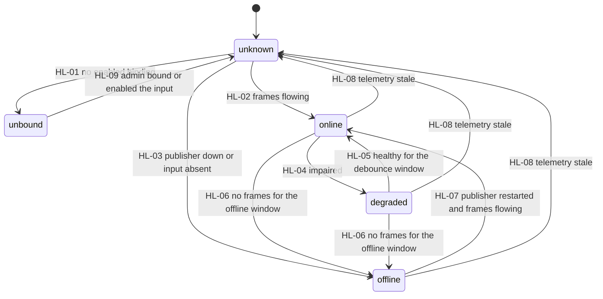

| # | From | Trigger | Guard | To | Panel shows | Emits |
|---|---|---|---|---|---|---|
| HL-01 | unknown | binding absent or `enabled = false` | — | unbound | Tile not rendered on the panel; shown as "not installed" in Admin only. `mic-room` is permanently here (INV-SR-2, A-08 amended) | `sources.status{unbound}` |
| HL-02 | unknown, offline | frames at ≥ threshold for `T-SOURCE-DEBOUNCE` | — | online | Live tile, green dot, tappable → WebRTC preview < 1 s (INT-8, A-17) | `sources.status{online}` → panel |
| HL-03 | unknown | publisher not running ∨ `PhysicalInput` absent | — | offline | Grey tile, "No signal", not tappable | `sources.status{offline}` |
| HL-04 | online | fps < 50 % of expected for `T-SOURCE-DEGRADE`, RTSP reconnecting, or publisher restarted < 10 s ago | — | degraded | Amber ring + "reconnecting…"; preview may stutter | `sources.status{degraded,detail}`; `system.alert{source.degraded}` if used by an enabled channel |
| HL-05 | degraded | healthy for `T-SOURCE-DEBOUNCE` | — | online | Live tile | `sources.status{online}`; `system.alert{cleared}` |
| HL-06 | online, degraded | no frames for `T-SOURCE-OFFLINE` | — | offline | Grey tile + "No signal" | `sources.status{offline}`; `system.alert{source.offline}` |
| HL-07 | offline | publisher auto-restarted and frames flowing | — | online | Live tile; alert cleared | `sources.status{online}`; `system.alert{cleared}` |
| HL-08 | any | telemetry older than `T-HEALTH-STALE` | — | unknown | Grey tile, "checking…" — **never the last healthy value** (INV-DH-2, B-12) | `sources.status{unknown}` |
| HL-09 | unbound | `cmd.admin.set_binding` (AD-2 camera IP / binding change) | `G-ADMIN` | unknown | Re-probe the role; a camera address is edited in exactly one place (INV-PI-2, B-46's duplicate copies) | `sources.status{unknown}`; `log.entry(System,INFO)` |

**Publisher supervision.** Publishers are device-lifetime, not session-lifetime:
they start at boot and stay up so idle previews and health work, and so resume is
fast (A-05). A dead publisher is auto-restarted 3× with `T-CONSUMER-RESTART`
backoff, then held `offline` with an alert until an input change or a manual retry.

### 6.2 Source loss during recording (the interaction the brief asks for)

**Rule R-SRC-1 — a dead source never ends a lecture.** The record consumer is not
terminated because a source went away. Publishers are restarted underneath it and
the consumer's compositor pad is fed a "SOURCE UNAVAILABLE" placeholder at low fps
while the source is `offline`. The lecture keeps growing; the tile goes grey; an
alert is raised. G-1 (never silently lose a lecture) outranks visual fidelity.

| Case | Recording outcome | Alert | Notes |
|---|---|---|---|
| One role of a composite preset goes offline | continues, placeholder tile in the composite | `source.offline` (warning) | The other sources keep recording normally |
| The only video role of a single-source preset goes offline | continues, placeholder card + audio | `source.offline` (error) | The file stays playable and the timeline stays continuous |
| `mic-lecturer` goes offline | continues, silent audio track | `source.offline` (**critical**) | A silent lecture is bad; a stopped lecture is worse. Audio loss is ranked critical so it is impossible to miss |
| The consumer itself dies as a consequence | R-16 restart path: a **new segment** opens; ≤ 5 s lost at the seam (INT-6) | `recording.pipeline-lost` | The seam is visible in segment bookkeeping, which is why segments are first-class (SEG-1) |

> **Implementation note (prompt 10, pipeline-manager design).** Whether the
> placeholder is delivered in-pipeline (a fallback switch on the shm source) or by
> restarting the consumer with the role dropped is an implementation choice. It is
> **state-machine visible**: the in-pipeline route keeps one segment, the restart
> route produces an extra segment via R-16. Default: in-pipeline fallback; bench
> item for Phase 3/4 alongside the existing pause/resume A/V-sync item.

### 6.3 Machine 5b — storage pressure (LP-12, `[D-15]`)

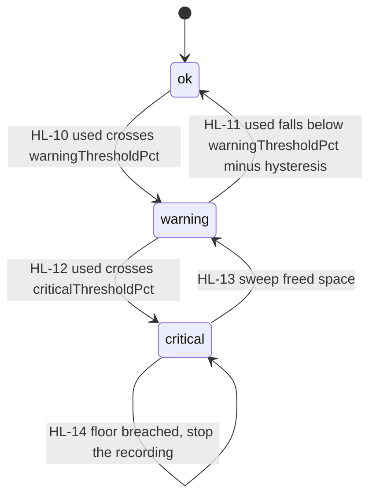

| # | Trigger | To | Panel shows | Consequences | Emits |
|---|---|---|---|---|---|
| HL-10 | probe crosses `warningThresholdPct` | warning | Dashboard warning quoting the **real** policy text generated from `RetentionPolicy` (INV-RP-1 — B-53 warned at 70 % about an 80 % policy) | Retention sweep RET-3 runs | `storage.status{warning}`; `system.alert{storage.warning}` |
| HL-11 | falls below threshold − `HYSTERESIS_PCT` | ok | Warning cleared | — | `storage.status{ok}`; `system.alert{cleared}` |
| HL-12 | crosses `criticalThresholdPct` | critical | Critical warning | **New starts refused** (R-02, `refuseStartWhenCritical` `[D-15]`); auto-resume after a crash is also refused (BR-8) | `storage.status{critical}`; `system.alert{storage.critical}` |
| HL-13 | sweep freed space | warning | — | Starts allowed again | `storage.status{warning}` |
| HL-14 | `freeBytes < absoluteFloorBytes` while recording | critical | Critical + "recording stopped to protect your lecture" | R-19 gracefully stops the session `[D-15]` | `system.alert{storage.critical}`; `recording.state{stopping}` |

Probe cadence: `T-STORAGE-PROBE-REC` while recording, `T-STORAGE-PROBE-IDLE`
otherwise. A probe failure yields `unknown`, and `G-STORAGE-OK` fails closed — a
start is refused if the disk cannot be measured.

### 6.4 Machine 5c — capture-card watchdog (PF-13, B-39)

`DeviceHealth.captureCardState`: `present | absent | recovering | failed`.

| # | From | Trigger | Guard | To | Side effects | Emits |
|---|---|---|---|---|---|---|
| HL-20 | present | 2 consecutive probes (`T-CAPTURE-PROBE`) find the card absent | — | absent | `presentation` role → `offline` | `device.health{captureCard:absent}`; `system.alert{capture-card.absent}` (Hardware) |
| HL-21 | absent | watchdog acts | cycles this hour < 2 | recovering | Power-cycle the hub port through the **allowlisted root helper** (no `sudo` from app code); this is the supervised successor of B-39's one-shot boot check | `device.health{captureCard:recovering}`; `log.entry(Hardware,WARN)` |
| HL-22 | recovering | card re-enumerates ≤ `T-CAPTURE-RECOVER` | — | present | `presentation` role re-probed (HL-07) | `device.health{captureCard:present}`; `system.alert{cleared}` |
| HL-23 | recovering | timeout ∨ cycle budget exhausted | — | failed | Human intervention required; recording with the remaining sources still works (A-08: camera-only recording is supported) | `device.health{captureCard:failed}`; `system.alert{capture-card.failed}` (Hardware, error) |

While `recovering`, the `presentation` role is reported **offline** (there is no
signal during a power cycle), not degraded.

---

## 7. Cross-machine interaction matrix

Every cell is a transition that already exists above; this table is the index.

| When this happens | RECORDING (1a) | Artifact (1b) | Channels (1c) | AI (2) | Upload (3) | Quiz (4) | Health (5) |
|---|---|---|---|---|---|---|---|
| Start tapped | R-01 | create `capturing` | enabled channels CH-01/CH-04 | Q-01 arm | — | Z-01 request | pre-check `G-STORAGE-OK` |
| Confirmed recording | R-05 | — | — | countdown runs | — | Z-02 open | LED blink |
| Pause | R-08/R-09 | segment finalized | **unchanged** (SM-Q-4) | Q-07 held | — | unchanged | LED off |
| Resume | R-10 → R-05 | new segment | unchanged | Q-08 armed | — | unchanged | — |
| Stop | R-11 → R-12/R-13 → R-14 | RA-01/RA-02 | CH-07 all off | Q-09, Q-34 | U-01 after `ready` | Z-05 closed | LED off |
| Pipeline dies mid-lecture | R-16 → R-17 | extra segment | unaffected (INV-CC-2) | unaffected | — | unaffected | `source.*` may be the cause |
| Source dies mid-lecture | continues (R-SRC-1) | — | that channel may degrade | unaffected | — | unaffected | HL-06 offline |
| Device reboots mid-lecture | BR-2 or BR-3 | segment `truncated` | channels restart per `channelActivations` | Q-01 re-arm on resume | — | Z-01 re-request | publishers restart |
| Disk hits warning | R-20 | — | — | — | RET-3 sweep | — | HL-10 |
| Disk hits critical | R-02 refuses starts; R-19 may stop | — | — | — | RET-4 | — | HL-12/HL-14 |
| LLM unreachable | **unaffected** | — | — | Q-05 degraded | — | — | — |
| Quiz server unreachable | **unaffected** | — | — | send refused (Q-30 guard) | — | Z-03/Z-06 | — |
| WAN down | **unaffected** | — | streaming CH-03/CH-09 | — | connectivity retries (§4.4) | students on mobile data may still answer | — |
| Panel WS drops | **unaffected** | — | — | — | — | — | panel shows reconnecting |
| Merge fails | already `completed` | RA-04 failed | — | — | **no job created** (INV-UJ-3) | — | alert |
| Upload succeeds | — | eligible for RET-1 | — | — | U-04 | — | frees space later |
| Admin deletes a recording | session row survives | RA-06 | — | — | U-10 cancelled | — | — |
| Power-off requested | R-22 refuses while non-terminal | — | — | — | — | — | — |

---

## 8. Prototype UI → state mapping (the mandated hand-check)

Every visible state in `/prototype` maps to **exactly one** state above. Elements
that are configuration, telemetry or UI-local are labelled as such — they are the
things that must *not* become states (INV-G-7).

| Prototype element | Visual | Maps to | Rule |
|---|---|---|---|
| `IdleHero` greeting + Start pill (`App.tsx:85`) | no frame | **1a `idle`** | Absence of a non-terminal session |
| Start pill pressed, before confirmation | pill spinner | **1a `starting`** (`startReason=initial`) | Frame appears only at `recording` — a start that fails must never read as recording (B-12, LP-4) |
| `us-recframe` red 4 px + `us-recnotch` "● RECORDING" (`App.tsx:73`) | red | **1a `recording`** | — |
| `us-recframe--paused` amber + notch "PAUSED" (`App.tsx:74`) | amber | **1a `paused`** | — |
| *(new, not in prototype)* neutral frame + "SAVING…" | slate | **1a `stopping` + `finalizing`** | INT-5's ≤ 10 s window needs a visible state; these two share one chrome and are distinguished by the sub-caption |
| *(new)* "Saved" confirmation | toast | **1a `completed`** | J-1 |
| *(new)* error card with plain-language cause | red card | **1a `error`** | LP-4, G-1 |
| *(new)* "recording resumed after recovery" banner | blue banner | **alert `session.recovered`**, not a state | INT-7, BR-2 — recovery is an alert on top of `recording` |
| `TimerCard` digits ticking (`TimerCard.tsx:23`) | mono digits | **1a `recording`** | Displayed value = `recordedDurationMs + (now − currentSegmentStartedAt)`, from persisted values only (kills B-08's `NaN` after restart) |
| `TimerCard` digits frozen + "Recording paused" | mono digits | **1a `paused`** | Value = `recordedDurationMs` (pause gaps excluded — the honest figure) |
| `TimerCard` Pause / Resume / Stop buttons | dark pills | enabled iff `G-AUTH-OWNER` | LP-6; a non-owner sees the locked view (R-03) |
| `us-panelbar__dots` 3 dots when collapsed (`SourcesPanel.tsx:80`) | dots | **5a per role**: green `online`, amber `degraded`, grey `offline`/`unknown`, hidden `unbound` | HL-01…HL-08 |
| `us-srctile` + `us-srctile__live` green dot | tile | **5a `online`** | Tap → WebRTC preview (A-17) |
| *(new)* amber tile "reconnecting…" | tile | **5a `degraded`** | HL-04 |
| *(new)* grey tile "No signal" | tile | **5a `offline`** | HL-06 |
| `us-srcmic__meter` segments (`SourcesPanel.tsx:118`) | meter | **telemetry** (`audio.levels`) — not a state | INV-AC-2 |
| `us-srcmic__pct` / "Muted" | text | **config** (`AudioControl.gain/muted` + `appliedState`) | INV-AC-1: if `appliedState = failed` the panel shows the failure, not the requested value (B-55's placebo) |
| Room Controls "Live / Muted" row (`RoomControlsPanel.tsx:131`) | switch | same `AudioControl.muted` field — one control, one truth | LP-14, `[D-10]` |
| Room Controls Projector / Environment groups | switches | **inert placeholder** `[D-10]` | Modelled nowhere on purpose |
| `ChannelCard` meeting switch ON | switch on | **1c `on`** | CH-05 |
| *(new)* switch with spinner | pending | **1c `preflight`/`starting`** | SM-R-2 does not apply here — channels have real states |
| *(new)* switch with error | red | **1c `failed`** | CH-03/CH-06 |
| Meeting layout accordion open (`App.tsx:94`) | expanded | **UI-local** | Not a state |
| `us-genside__select` interval 10/15/20/30 | select | **config** `intervalMinutes`, default **20** (A-14/INT-11; prototype's 15 is drift) | Q-10 |
| Countdown display | mm:ss | **2a `armed`**, rendered locally from `nextAt` | §3.1 |
| *(new)* countdown frozen with "paused" caption | mm:ss dimmed | **2a `held`** | Q-07; the countdown runs only while `recording` (INV-QS-3) |
| "Generating…" / "Regenerating…" button label | disabled button | **2a `generating`** + **2b `generating`** | Q-02/Q-03/Q-11 |
| `us-readybanner` green "A new set is ready" + count (`QuestionAssistant.tsx:40`) | green banner | **2b `ready`**; count = `Question` rows in `draft` for the session | Q-12 |
| *(new)* studio unavailable / retry state | grey card | **2a `degraded`** or **`unavailable`** | Q-05, LP-18 |
| `QuestionsModal` open (`QuestionsModal.tsx`) | modal | **UI-local** — the set stays `ready` (the brief's "in-review" is not a server state) | SM-R-2 |
| `us-qrow--active` selected question | highlighted | **UI-local** selection | — |
| `us-qcard__custom` "Yours" chip (`QuestionsModal.tsx:84`) | chip | **`Question.provenance = lecturer-authored`** (+ `questionSetId = null`) | Q-19, INV-Q-3 |
| Discard button on a question | danger link | **2c `draft → discarded`** | Q-21 |
| "Send to Projector" | primary button | **2d `publishing`** then `open` | Q-30/Q-31 |
| `us-pqcard__badge` "Now showing" (`SentToProjectorPanel.tsx:69`) | chip | **2d `open` ∧ `isShowing = true`** — exactly one per quiz session | INV-QPUB-1 |
| Previous-question card without the badge | card | **2d `open` (withdrawn)** or **`closed`** | Q-36 / Q-33 |
| Monitor / MonitorX toggle on a sent card | icon button | **`projectorState` only** — never reopens acceptance | Q-36 |
| *(new)* "couldn't send to the projector" + retry | red inline | **2d `failed`** | Q-32; the projector stayed on slides (INV-QPUB-3) |
| *(new)* join QR + joined count | panel card | **4a `open`** | Z-02, QZ-2 |
| *(new)* "quiz unavailable — questions can't be sent" | grey notice | **4a `failed`** (or `absent` when unconfigured) | Z-03, LP-18 |
| Responses / Correct / Incorrect badges (`SentToProjectorPanel.tsx:87`) | chips | **`AnswerProjection` counts** | LP-17 |
| *(new)* "responses may be out of date" marker | amber note | **4d `stale`** | Z-30, INV-AP-2 |
| `LeaderboardPanel` rows, score `correct × 10` | list | **derived `LeaderboardEntry`**, never stored | INV-LB-1, INT-2 |
| `us-empty` "No questions right now" | empty state | **no `draft` questions** (set `reviewed`/`discarded` or none yet) | — |
| Admin `us-adm__chip` role / log-category chips | chips | **config / `LogEntry` rows** | AD-6, AD-7 |
| Streaming platform chips (`StreamingConfig.tsx:100`) | chips | **config** `StreamTarget.platform` `[D-19]` | AD-8 |
| *(new)* library upload badge waiting/uploading/done/failed/dead-letter | badge | **3a job state** | AD-9, LP-10 |
| *(new)* "Preparing…" badge | badge | **1b `merging`** (surfaced in AD-9 as `queued` + `blockedBy=merge` — the brief's "converting") | SM-D-1 |
| *(new)* "couldn't prepare this recording" badge + admin retry | red badge | **1b `failed`** | RA-04; no upload job is created (INV-UJ-3) |
| *(new)* recording disappears from the library | — | **1b `deleted`** | RA-06, RET-1/RET-3 |
| *(new)* storage warning / critical banner on the dashboard | amber / red banner | **5b `warning` / `critical`** | LP-12, HL-10/HL-12; text generated from `RetentionPolicy` (INV-RP-1) |
| Login screen (`LoginPage`) | form | **out of scope here** — auth/`AuthSession` is the API contract's concern | LP-1, LP-2 |

**Completeness check — both directions.**

*Prototype → machine* (the rule the brief sets): every visible state above maps to
exactly one machine state. Nothing in `/prototype` is left unmapped, and the three
things that look like state but are not — mic meters, the modal, accordion
expansion — are labelled telemetry / UI-local so they never become rows (INV-G-7).

*Machine → UI*: every state of 1a, 1b, 1c, 2a, 2b, 2d, 3a, 4a, 5a and 5b appears in
at least one row, with these deliberate exceptions, which are **transient or
historical and have no UI by design**:

| State | Why it has no UI |
|---|---|
| 1b `capturing`, `finalizing` | Fully implied by 1a `recording`/`stopping`; a second badge would be a second truth |
| 1c `preflight`, `stopping` | Sub-second-to-6-second phases inside the switch's pending rendering |
| 2b `requested` | Transient; `generating` is the first observable state |
| 2b `reviewed`, `discarded` | Historical dispositions, visible only in the audit log (AD-7) |
| 2d `publishing` | The Send button's pending state (SM-R-2) |
| 3a `completing`, `cancelled` | `completing` renders as "uploading"; `cancelled` only follows a delete the operator just performed |
| 4a `requesting` | Transient; resolves within `T-QUIZ-CREATE` |

Everything marked *(new)* above is Phase-2 screen work: it is exactly the set of
undesigned surfaces called out in PRD §9 and INT-1, enumerated here so no screen
"discovers" a state during implementation.

---

## 9. Timer, deadline and retry catalog

No value below is TBD. Values marked *provisional* are engineering estimates to be
confirmed against the NFR budgets on target hardware (PRD §6).

| Id | Scope | Value | On expiry | Source |
|---|---|---|---|---|
| `T-START-CONFIRM` | 1a starting → recording | **5 s** (target < 3 s) | R-06/R-07 | INT-8 (start < 3 s), PF-2 (surface within 5 s) |
| `T-RESUME-CONFIRM` | 1a starting(resume) | **3 s** *(provisional)* | R-07 | Publishers are warm; A-12 |
| `T-PAUSE-EOS` | 1a pause EOS wait | **5 s** | R-09 SIGKILL, segment `truncated` | Derived from INT-5's 10 s stop budget |
| `T-STOP-EOS` | 1a stop EOS wait | **8 s** | R-13 SIGKILL | INT-5: ≤ 10 s to a playable file, leaving ~2 s for probe + DB |
| `T-SESSION-HEARTBEAT` | 1a persistence | **5 s** | — (input to recovery) | INT-6 ≤ 5 s loss budget |
| `T-RECOVERY-WINDOW` | boot recovery | **10 min** | BR-3 finalize instead of resume | INT-7 "live within the last few minutes" |
| `T-BOOT-RECOVERY` | recovery pass start | within **20 s** of core-api start, after publisher status | log ERROR, retry once | PF-3 |
| `T-CONSUMER-RESTART` | 1a R-16, 1c CH-09, publishers | **1 s, 3 s, 8 s**, max 3 attempts / 120 s | R-18 / CH-06 / hold offline | PF-2 |
| `T-CHANNEL-START` | 1c starting | **6 s** *(provisional)* | CH-06 failed | A-10 preflight cost |
| `T-MERGE-WATCHDOG` | 1b merging | **max(5 min, 3 × recordedDuration)** | RA-04 failed | PF-5 |
| `T-MERGE-RETRY` | 1b | **30 s, 5 min** (2 retries) | RA-04 failed | PF-5 |
| `T-STORAGE-PROBE-REC` | 5b | **10 s** while recording | — | LP-12, `[D-15]` |
| `T-STORAGE-PROBE-IDLE` | 5b | **60 s** otherwise | — | LP-12 |
| `HYSTERESIS_PCT` | 5b | **5 %** below the threshold to clear | — | anti-flap |
| `absoluteFloorBytes` | 5b/R-19 | **4 GiB** *(provisional — ≈ 8 min of headroom at 8 Mbps)* `[D-15]` | R-19 graceful auto-stop | `[D-15]` |
| `T-RETENTION-SWEEP` | §4.5 | **15 min**, plus event-driven | — | A-20; deliberately *not* B-20's per-minute cron |
| `T-HEALTH-STALE` | 5a, `DeviceHealth` | **6 s** | HL-08 → `unknown` | INV-DH-2 |
| `T-SOURCE-DEGRADE` | 5a | **2 s** of impaired frames | HL-04 | INT-8 (preview < 1 s ⇒ sub-second sensitivity) |
| `T-SOURCE-OFFLINE` | 5a | **10 s** of no frames | HL-06 | — |
| `T-SOURCE-DEBOUNCE` | 5a recovery | **3 s** healthy before returning `online` | HL-02/HL-05 | anti-flap |
| `T-CAPTURE-PROBE` | 5c | **30 s** | HL-20 after 2 misses | PF-13, B-39 |
| `T-CAPTURE-RECOVER` | 5c recovering | **25 s** (20 s settle + re-enumerate), max **2 cycles/hour** | HL-23 failed | B-39's 20 s wait, made supervised |
| `T-LLM-REQUEST` | 2b generating | **45 s** *(provisional — LAN llama.cpp, 3–5 MCQs)* | Q-13 failed | A-02, A-14 |
| `T-LLM-RETRY` | 2b | **10 s, 30 s** (2 retries) | Q-05 degraded | J-2 |
| `T-LLM-PROBE` | 2a degraded | **60 s** | Q-06 when it succeeds | LP-18 |
| `T-COUNTDOWN-RESYNC` | 2a | **15 s** resync emit | — | INV-G-7 (no per-second rows or events) |
| `T-PUBLISH-ACK` | 2d publishing | **5 s**, 1 retry at 2 s | Q-32 failed | INV-QPUB-3 |
| `T-QUIZ-CREATE` | 4a requesting | **8 s**, 2 retries | Z-03 failed | QZ-1 cross-zone |
| `T-QUIZ-PROBE` | 4a failed | **30 s** | Z-04 retry | — |
| `T-QUIZ-HEARTBEAT` | 4d | **5 s** | — | QZ-7 |
| `T-QUIZ-SYNC-STALE` | 4d | **15 s** | Z-30 stale | QZ-7, INV-AP-2 |
| `T-QUIZ-SYNC-FAIL` | 4d | **60 s** | Z-32 failed | QZ-7 |
| `T-WS-RECONNECT` | panel + student | **0.5, 1, 2, 4, 8 s**, capped **10 s**, unlimited | — | §6 offline behavior |
| `T-WS-STALE` | panel | **10 s** disconnected ⇒ dim live regions | — | SM-R-1 |
| `T-CMD-RESOLVE` | SM-R-2 commands | **10 s** ⇒ show failure, never an endless spinner | — | LP-4 |
| `T-UPLOAD-STALL` | 3a/3b | **60 s** with no bytes | U-05 failed | A-19 |
| Upload backoff | 3a | **30 s, 2 min, 8 min, 30 min, 2 h, 6 h ×3**, ± 20 % jitter | U-07 dead-letter after attempt 8 | A-19, `[D-13]` |
| `T-UPLOAD-OFFLINE-ALERT` | 3a | **24 h** of connectivity-only failures | raise `upload.offline` | G-3 |
| `T-ALERT-REEVALUATE` | alerts | **30 s** | re-raise if the condition is still true | INV-SA-1 (B-12's dead flag) |

---

## 10. WS event catalog (emitter → consumer)

> **Contract note (2026-07-30).** The authoritative, versioned catalog is now
> [`contracts/events.md`](../../contracts/events.md) (v0.1.0) with zod schemas
> in `packages/shared/src/schemas/events.ts`. It adopts this table verbatim
> plus four additions this section lacked but screens require — listed at the
> bottom of the table. "Anything not in §10 does not exist" now reads
> "anything not in contracts/events.md does not exist."

Server→client only; **clients send no WS messages** — commands go over REST
(target-architecture §2.1). Every event carries `{event, at, seq, payload}`;
`seq` is per-connection and monotonic so a gap forces a full resync (§5.5).

| Event | Emitter | Consumer(s) | Core payload | Cadence |
|---|---|---|---|---|
| `recording.state` | core-api | panel, admin | state, startReason, sessionId, title, owner, startedAt, recordedDurationMs, segmentIndex/Count, pauseCount, takeoverBy, errorCode | on transition + on subscribe |
| `recording.segment` | core-api | panel, admin | segmentId, index, state, endReason, durationMs | on segment open/close |
| `recording.artifact` | core-api | panel library, AD-9 | recordingId, state, mergeState, durationMs, totalBytes, deleteReason | on 1b transition |
| `channel.state` | core-api | panel, admin | channelId, state, presetId, ratioA/B, reason | on 1c transition |
| `sources.status` | core-api (projecting pipeline-manager) | panel, admin | roleId, state, detail, since, inputId | on 5a transition + on subscribe |
| `audio.levels` | core-api (from pipeline-manager) | panel | roleId, rms 0–1 | throttled ~10 Hz, telemetry only |
| `storage.status` | core-api | panel, admin | pressure, freeBytes, totalBytes, policy{warnPct, critPct, maxAgeDays} | on transition + every 60 s |
| `device.health` | core-api | admin, panel | captureCardState, publisherStates, ntpSynced, clockOffsetMs, diskHealth, lastBootAt | on change + every 60 s |
| `system.alert` | core-api | panel, admin | code, severity, category, title, detail, raisedAt/clearedAt, relatedEntity | on raise/clear; re-evaluated per `T-ALERT-REEVALUATE` |
| `log.entry` | core-api | admin AD-7 | level, category, service, message, context, sessionId, userId | on write (subscribed views only) |
| `ai.countdown` | core-api | panel | state, remainingMs, nextAt, intervalMinutes | on transition + `T-COUNTDOWN-RESYNC` |
| `ai.set` | core-api | panel | setId, state, trigger, count, error, attempt | on 2b transition — **supersedes the `ai.batch_ready` sketch**: `state=ready` *is* batch-ready |
| `ai.question` | core-api | panel | questionId, state, provenance, edited, setId | on 2c transition |
| `quiz.session` | core-api | panel, projector consumer | state, joinUrl, joinCode, joinedCount | on 4a transition |
| `quiz.publication` | core-api | panel, projector consumer | publicationId, questionId, state, isShowing, projectorState, syncState, closeReason | on 2d transition |
| `quiz.responses` | core-api | panel (LP-17) | publicationId, deltas[{studentIdNumber, displayName, optionId, isCorrect, responseTimeMs}], syncedAt, stale | on answer batch + on stale/recover |
| `upload.job` | core-api | admin AD-9, panel library | jobId, recordingId, state, attempt, nextAttemptAt, progressPct, lastError, blockedBy | on 3a transition + progress ≥ 5 % steps |
| `upload.part` | core-api | admin AD-9 | partId, streamKey, state, bytesSent/Total | on 3b transition + progress |
| `quiz.question` | quiz-service | student app | publicationId, prompt, options[{id,label,text}], state | on Q-31/Q-33 |
| `quiz.result` | quiz-service | student app | isCorrect, pointsAwarded, runningScore, **ownRank only** | on close + on reconnect |
| `quiz.participant` | quiz-service | quiz-service clients | participantId, connectionState | on 4b transition |
| `audio.control` *(contract-v0 addition)* | core-api | panel, admin | roleId, gain, muted, appliedState, lastError | on apply/fail of a mic-control change — INV-AC-1 needs a push of *actual* applied state |
| `export.job` *(contract-v0 addition)* | core-api | requesting AuthSession only (B-38) | jobId, state, bytesCopied/Total, error | on ExportJob transition + progress ≥ 5 % (INV-EX-1) |
| `usb.volumes` *(contract-v0 addition)* | core-api | sessions with the export flow open | volumes[] | on USB insert/remove (LP-11; domain model §10 UsbVolume) |
| `firmware.state` *(contract-v0 addition)* | core-api | admin AD-5 | FirmwareUpdate read view | on FirmwareUpdate state change |

*The contract-v0 additions cover ExportJob (§6.5) and FirmwareUpdate (§4.13),
whose linear entity lifecycles deliberately have no machine section here, plus
the AudioControl applied-state push and USB hotplug that LP-9/LP-11 screens
need. Payload schemas and full emitter/consumer detail: contracts/events.md.*

**Internal (not WebSocket, listed so no transition dangles):**

| Channel | Emitter → consumer | Carries |
|---|---|---|
| `evt.pm.publisher.*` | pipeline-manager → core-api | publisher running/exited/failed, fps, last error |
| `evt.pm.consumer.*` | pipeline-manager → core-api | consumer running/eos/exited/failed, PID group, output path growth |
| `evt.storage.*` | storage probe → core-api | threshold crossings, floor breach |
| `evt.ai.generation.*` | question-service → core-api | generation result or error (HTTP response) |
| `sync.publication` | core-api → quiz-service | publish / close instruction, `closedAt` |
| `sync.answers` | quiz-service → core-api | answer batches since the device's watermark, heartbeat |
| `sync.participants` | quiz-service → core-api | join/leave counts |

**Secrets never appear in any event, log line or alert context** — stream keys,
upload credentials and RTSP passwords resolve through the secret store
(INV-ST-1, INV-UJ-5, PF-17, B-59).

---

## 11. Decision-dependent transitions index (`[D-xx]`)

| Decision | Affected transitions | Default assumed here | If it closes differently |
|---|---|---|---|
| `[D-02b]` Upload API spec | U-02, U-03, U-05 (remote cleanup), U-06 (resume tokens), UP-02, INV-UJ-6 | Placeholder add→upload→complete with resumable parts and delete-on-failure | Adapter internals change; the job/part **states do not** (A-19's whole point) |
| `[D-12]` Physical record button | absent from R-11 | Retired | Adds a hardware trigger to R-11 and a `startedByActor` value |
| `[D-13]` Upload timing | U-01 (`enqueuedAt = now`), U-09 (manual re-enqueue exists) | Immediate auto-upload, no windows | A window scheduler gains a `queued → holding` guard and an AD-9 schedule card |
| `[D-14]` Auto-shutdown after uploads | absent | Dropped | One hook on `upload.job{done}` when the queue drains |
| `[D-15]` Disk-pressure behavior | R-02, R-19, RET-2, RET-3, RET-4, BR-8, HL-12, HL-14, `absoluteFloorBytes` | Uploaded-oldest-first early delete; never delete un-uploaded; refuse start when critical; graceful auto-stop at the floor | Reversing "never delete un-uploaded" changes only RET-2; **removing the refused start (R-02) touches the contract and the UI** |
| `[D-17]` Time/NTP ownership | correctness of `retentionDeleteAfter`, `responseTimeMs`, log ordering | Deploy layer owns NTP; UI read-only | No transition changes; `ntpSynced = false` should raise a System alert |
| `[D-18]` Scheduled recordings | absent from R-01 | Retired | R-01 gains a scheduler trigger, `G-AUTH-OWNER` gains a machine-actor variant, LP-6's lock needs an unattended owner — the widest-blast reopening |
| `[D-19]` Streaming platforms | CH-01 preflight targets | YouTube + Facebook + Custom RTMP | Preflight gains per-platform checks; no state change |
| `[D-20]` Provisioning home | `G-PROVISIONED` source (R-01/R-04) | Deploy-layer config store, read-only in Admin | If provisioning moves into the Admin UI, R-04's rejection becomes actionable in-place |
| `[D-21]` Student identity | Z-11 registration guard | Self-registration, format-validated student ID | SSO adds an auth step before `joined`; `StudentIdentity.authMethod` already anticipates it |
| `[D-10]` Room controls | Room Controls placeholders map to no machine | UI placeholder only | Real device control would add a machine per device class |
| `[D-03]` Database engine | none | SQLite + Drizzle | No state-machine impact by design |

---

## 12. Questions this document answers with a default (`SM-Q-n`)

These are decisions the state machines had to make that no register entry covers.
Each has a stated default that Phase 2 can build against; each is cheap to change
**now** and progressively more expensive later.

| Id | Question | Default taken here | Cost to change |
|---|---|---|---|
| SM-Q-1 | Does a refused start create a session row? | **No** (Class A vs Class B, §0.4). Refusals are command rejections + alert + log; only launch failures create `error` sessions | Low — a guard's placement |
| SM-Q-2 | Should `pausing` be a persisted state? | **No** — the ≤ 5 s EOS wait is an in-flight command (SM-R-2); the panel shows a pending Pause button | Medium — adding it is a domain-model enum change (contract bump) |
| SM-Q-3 | Does a crash during **pause** auto-resume? | **No** — a paused session stays paused after recovery within the window (BR-4). INT-7's auto-resume is for sessions that were *live*; resuming for a lecturer who deliberately paused would record a corridor conversation | Low |
| SM-Q-4 | Does Pause also hold meeting/streaming? | **No** — channels are independent (INV-CC-2), but the panel must show an explicit "still streaming" indicator while paused | Low now; a privacy incident later makes it expensive |
| SM-Q-5 | Does an offline source stop the recording? | **No** — R-SRC-1: placeholder video, alert, lecture continues. Audio loss is ranked *critical* | Low (policy), but the mechanism is a Phase-3 bench item |
| SM-Q-6 | Late-answer grace window? | **None** — quiz-service receive time vs `closedAt` is authoritative; no client-reported instants (§5.3) | Low |
| SM-Q-7 | Do unreviewed generated questions accumulate across batches? | **No** — a new `ready` set supersedes the previous one (Q-16), matching the prototype; lecturer-authored questions always survive | Low |
| SM-Q-8 | Is auto-generation audited per question? | **Yes**, with `actorKind=system`, per INV-AU-2 read literally (§3.3) | Low |
| SM-Q-9 | Do publishers stop when no session is running? | **No** — publishers are device-lifetime so idle previews, health and fast resume work (§6.1) | Low |
| SM-Q-10 | What is the LED during `paused`? | **Off**, per PF-14 as written. (A solid-on "session live, not capturing" signal is arguably better room-facing UX — a PM call) | Low |

---

*STOP — Phase-1 gate: state machines awaiting review. On approval, proceed to the
API contract (prompt 06), which must bind: every `cmd.*` in this document to a REST
operation, every event in §10 to a zod schema in `contracts/events.md`, and every
`T-*` value in §9 to a named configuration constant. Reviewers should focus on
§0.4 (refusal classes), §1.4 (recovery decision table), SM-D-1, SM-D-2 and the ten
`SM-Q` defaults in §12 — those are the choices that are cheap to reverse today and
expensive after the contract freezes.*
